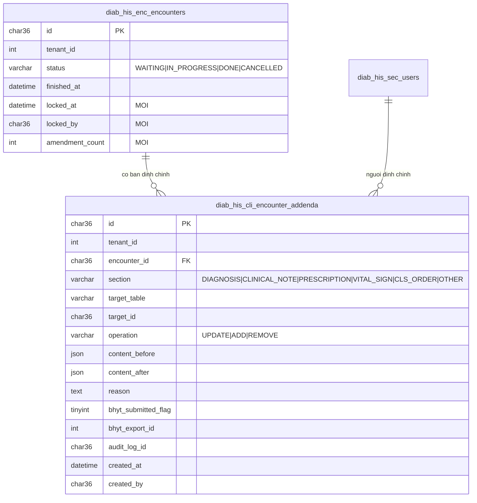
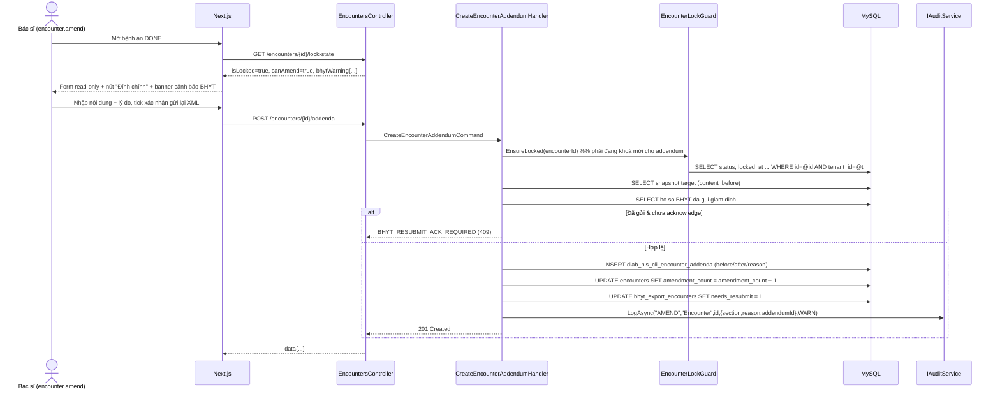
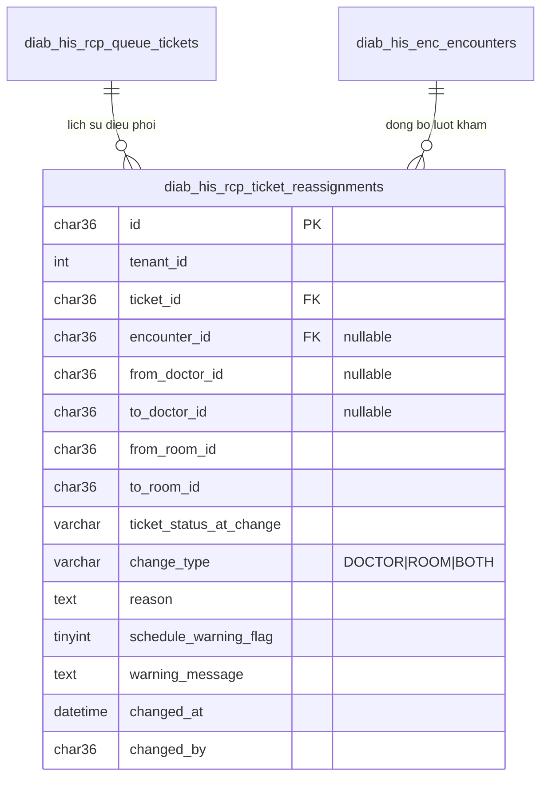
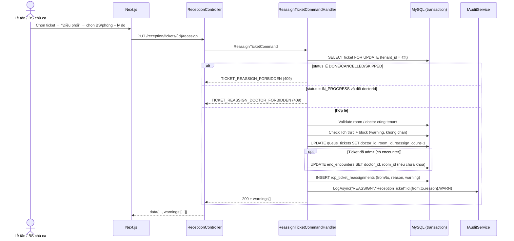

# Thiết kế kỹ thuật — G03 (Khoá bệnh án) & G05 (Điều phối khám)

> Tác giả: Lành (architect) · Ngày: 2026-08-18 · Branch: `develop`
> Trạng thái: **DESIGN — chưa implement**. Backend/Frontend đọc file này để triển khai song song.
> Căn cứ pháp lý: Luật Khám bệnh, chữa bệnh 2023 (Đ.69 hồ sơ bệnh án) · TT 32/2023/TT-BYT · TT 46/2018/TT-BYT (bệnh án điện tử bất biến, mọi sửa đổi phải lưu vết).

---

## 0. Hiện trạng codebase (đã khảo sát)

| Thành phần | Thực tế |
|---|---|
| Entity lượt khám | `Encounter` → bảng **`diab_his_enc_encounters`** (`id CHAR(36)`), status `WAITING/IN_PROGRESS/DONE/CANCELLED`, state machine `EncounterStatus.CanTransition` |
| Bảng con encounter | `diab_his_enc_diagnoses`, `diab_his_enc_vital_signs`, `diab_his_enc_emr_contents` (FK `encounter_id` CHAR(36), ON DELETE CASCADE) |
| Ticket tiếp đón | `ReceptionTicket` → **`diab_his_rcp_queue_tickets`** (`id CHAR(36)`, `room_id`, `doctor_id`, `ticket_no`, `ticket_date`, status `WAITING/CALLED/IN_PROGRESS/DONE/SKIPPED/CANCELLED`) |
| Audit | **ĐÃ CÓ** — `IAuditService.LogAsync(action, resourceType, resourceId, details, ct)` + overload có `AuditSeverity`, `crossTenantAttempt`, `requestId`. Entity `AuditLog` → `sec_audit_logs` (có `DetailsJson`). **TÁI DÙNG, KHÔNG dựng audit mới.** |
| Lịch trực BS | `diab_his_sch_doctor_schedules` (`doctor_ref`, `day_of_week` ISO 1=T2..7=CN, `start_time`, `end_time`, `enabled`, `effective_from/to`) + `diab_his_sch_schedule_blocks` |
| BHYT export | `diab_his_int_bhyt_exports` (`period_month CHAR(7)`, `status DRAFT/EXPORTED/SUBMITTED/APPROVED/REJECTED`) — **KHÔNG có link tới encounter_id** → phải bổ sung (mục 1.6) |
| Route reception thực tế | `/api/v1/reception/queue/{ticketId}/...` (không phải `/tickets/...`) |

> **Lưu ý naming:** prefix bảng encounter hiện tại là `enc_`, không phải `cli_`. Yêu cầu đặt tên `diab_his_cli_encounter_addenda` được **giữ nguyên** theo chỉ đạo (đã có tiền lệ `diab_his_cli_diabetes_assessments`, `diab_his_cli_allergies_v2` cùng dùng prefix `cli_` cho dữ liệu lâm sàng).

---

## 1. HẠNG MỤC C — [G03] Khoá bệnh án sau khi kết thúc khám

### 1.1 Nguyên tắc

1. `Encounter.Status = DONE` ⇒ **toàn bộ dữ liệu lâm sàng thuộc encounter đó READ-ONLY** (encounter header, chẩn đoán, sinh hiệu, EMR content, đơn thuốc, chỉ định CLS).
2. Sửa nội dung sau khi khoá **chỉ** qua **ADDENDUM** (bản đính chính): thêm bản ghi mới, **không ghi đè** bản gốc, bắt buộc `reason`, cần quyền `encounter.amend`.
3. Addendum ghi song song: (a) dòng trong `diab_his_cli_encounter_addenda` (content_before/content_after), (b) audit log qua `IAuditService` action `AMEND`.
4. Nếu encounter đã nằm trong hồ sơ BHYT **đã gửi giám định** ⇒ trả cảnh báo (không chặn), yêu cầu gửi lại XML.
5. `CANCELLED` cũng khoá (bệnh án đã huỷ không sửa). `WAITING/IN_PROGRESS` mở bình thường.

### 1.2 Ma trận khoá

| Trạng thái encounter | Đọc | Sửa dữ liệu lâm sàng | Tạo addendum | Đổi trạng thái |
|---|---|---|---|---|
| `WAITING` | ✅ | ✅ | ❌ `ADDENDUM_NOT_APPLICABLE` | → IN_PROGRESS / CANCELLED |
| `IN_PROGRESS` | ✅ | ✅ | ❌ `ADDENDUM_NOT_APPLICABLE` | → DONE / CANCELLED |
| `DONE` | ✅ | ❌ **`ENCOUNTER_LOCKED`** | ✅ (cần `encounter.amend`) | ❌ (terminal) |
| `CANCELLED` | ✅ | ❌ **`ENCOUNTER_LOCKED`** | ❌ `ADDENDUM_NOT_APPLICABLE` | ❌ (terminal) |

**Lỗi chuẩn:**

```json
{ "error": { "code": "ENCOUNTER_LOCKED", "message": "Bệnh án đã khoá — chỉ xem",
  "details": { "encounterId": "...", "status": "DONE", "finishedAt": "2026-08-18T03:20:00Z", "canAmend": true } } }
```
HTTP **409 Conflict**.

### 1.3 Danh sách endpoint bị chặn khi khoá

| Endpoint | Controller |
|---|---|
| `PUT /api/v1/encounters/{id}` | EncountersController |
| `PUT /api/v1/encounters/{id}/chief-complaint` | EncountersController |
| `POST /api/v1/encounters/{id}/diagnoses` · `DELETE .../diagnoses/{diagId}` | EncountersController |
| `POST/PUT/DELETE /api/v1/encounters/{id}/vital-signs...` | VitalSignsController |
| `POST/PUT /api/v1/emr...` (theo encounterId), `emr.sign`, `emr.unsign` | EmrController |
| `POST/PUT/DELETE /api/v1/prescriptions...` (prescription gắn encounterId) | PrescriptionsController |
| `POST/PUT/DELETE /api/v1/cls/orders...` (lab/rad order theo encounterId) | ClsOrdersController, LabResultsController, RadResultsController |
| `POST /api/v1/encounters/{id}/start` · `/close` | EncountersController (đã chặn qua state machine, giữ nguyên) |

> **Ngoại lệ KHÔNG chặn:** thu ngân (`billing/payments`), in ấn, kết quả CLS trả về từ máy/LIS sau khi đóng ca (ghi vào `lab_results` — dữ liệu nguồn ngoài, không phải sửa bệnh án). Nếu QC yêu cầu chặn cả CLS trả muộn → mở ADR riêng.

### 1.4 ERD — bảng mới `diab_his_cli_encounter_addenda`



### 1.5 Migration `9090_create_encounter_addenda.sql`

```sql
-- ============================================================
-- Migration: 9090_create_encounter_addenda
-- Engine: MySQL 8.0+, InnoDB, utf8mb4_0900_ai_ci
-- Story refs: G03 — Khoa benh an sau khi ket thuc kham (Luat KCB 2023 / TT 32-2023)
-- Mo ta: Bang ban dinh chinh (addendum) cho benh an da khoa + cot khoa tren encounter.
--        KHONG ghi de ban goc; moi sua doi sau khi DONE deu la 1 dong addendum.
-- Idempotent: YES (CREATE TABLE IF NOT EXISTS + add_col_if_missing/add_index_if_missing)
-- Phu thuoc: 0000_helpers.sql (add_col_if_missing, add_index_if_missing), 9003_create_encounter.sql
-- ============================================================
SET NAMES utf8mb4;

-- ---------- 1. Bang ban dinh chinh ----------
CREATE TABLE IF NOT EXISTS `diab_his_cli_encounter_addenda` (
    `id`                  CHAR(36)     NOT NULL DEFAULT (UUID())      COMMENT 'UUID khoa chinh',
    `tenant_id`           INT          NOT NULL                       COMMENT 'ID tenant (bat buoc filter moi query)',
    `encounter_id`        CHAR(36)     NOT NULL                       COMMENT 'FK -> diab_his_enc_encounters.id',
    `section`             VARCHAR(30)  NOT NULL                       COMMENT 'DIAGNOSIS|CLINICAL_NOTE|PRESCRIPTION|VITAL_SIGN|CLS_ORDER|OTHER',
    `target_table`        VARCHAR(64)  NULL                           COMMENT 'Bang bi dinh chinh (vd diab_his_enc_diagnoses)',
    `target_id`           CHAR(36)     NULL                           COMMENT 'ID ban ghi bi dinh chinh (NULL neu la them moi)',
    `operation`           VARCHAR(10)  NOT NULL DEFAULT 'UPDATE'      COMMENT 'UPDATE|ADD|REMOVE',
    `content_before`      JSON         NULL                           COMMENT 'Snapshot truoc khi dinh chinh (NULL khi operation=ADD)',
    `content_after`       JSON         NULL                           COMMENT 'Noi dung sau khi dinh chinh (NULL khi operation=REMOVE)',
    `reason`              TEXT         NOT NULL                       COMMENT 'Ly do dinh chinh — BAT BUOC theo TT 32/2023',
    `bhyt_submitted_flag` TINYINT(1)   NOT NULL DEFAULT 0             COMMENT '1 = benh an da nam trong ho so BHYT da gui giam dinh tai thoi diem dinh chinh',
    `bhyt_export_id`      INT          NULL                           COMMENT 'FK -> diab_his_int_bhyt_exports.id (ho so lien quan)',
    `bhyt_resubmit_at`    DATETIME(3)  NULL                           COMMENT 'Thoi diem da gui lai XML sau dinh chinh (NULL = chua gui lai)',
    `audit_log_id`        CHAR(36)     NULL                           COMMENT 'Doi chieu sang sec_audit_logs.id (action=AMEND)',
    `created_at`          DATETIME(3)  NOT NULL DEFAULT CURRENT_TIMESTAMP(3),
    `created_by`          CHAR(36)     NULL                           COMMENT 'FK -> diab_his_sec_users.id (nguoi dinh chinh)',
    `updated_at`          DATETIME(3)  NOT NULL DEFAULT CURRENT_TIMESTAMP(3) ON UPDATE CURRENT_TIMESTAMP(3),
    `updated_by`          CHAR(36)     NULL,
    `deleted_at`          DATETIME(3)  NULL                           COMMENT 'Soft delete — CHI dung cho du lieu rac ky thuat, KHONG dung de xoa vet dinh chinh',
    PRIMARY KEY (`id`),
    INDEX `idx_adden_tenant_enc`  (`tenant_id`, `encounter_id`, `created_at`),
    INDEX `idx_adden_tenant_sect` (`tenant_id`, `section`, `created_at`),
    INDEX `idx_adden_bhyt`        (`tenant_id`, `bhyt_submitted_flag`, `bhyt_resubmit_at`),
    CONSTRAINT `fk_adden_encounter` FOREIGN KEY (`encounter_id`)
        REFERENCES `diab_his_enc_encounters` (`id`) ON DELETE RESTRICT
) ENGINE=InnoDB DEFAULT CHARSET=utf8mb4 COLLATE=utf8mb4_0900_ai_ci
  COMMENT='Ban dinh chinh benh an da khoa (addendum) — bat bien, khong ghi de ban goc';

-- ---------- 2. Cot khoa tren bang encounter ----------
CALL add_col_if_missing('diab_his_enc_encounters', 'locked_at',
     'DATETIME(3) NULL COMMENT ''Thoi diem benh an bi khoa (= finished_at khi dong ca)''');
CALL add_col_if_missing('diab_his_enc_encounters', 'locked_by',
     'CHAR(36) NULL COMMENT ''Nguoi thao tac dong ca lam khoa benh an''');
CALL add_col_if_missing('diab_his_enc_encounters', 'amendment_count',
     'INT NOT NULL DEFAULT 0 COMMENT ''So lan da dinh chinh (denormalize de list nhanh)''');

CALL add_index_if_missing('diab_his_enc_encounters', 'idx_enc_locked',
     '(`tenant_id`, `locked_at`)');

-- ---------- 3. Backfill: encounter da DONE/CANCELLED coi nhu da khoa ----------
UPDATE `diab_his_enc_encounters`
   SET `locked_at` = COALESCE(`finished_at`, `updated_at`, `created_at`)
 WHERE `status` IN ('DONE','CANCELLED')
   AND `locked_at` IS NULL;
```

### 1.6 Migration `9091_bhyt_export_encounter_link.sql` (phục vụ cảnh báo BHYT)

Hiện `diab_his_int_bhyt_export_items` chỉ lưu `payload_json` theo bảng 1–5 QĐ 4750, **không tra ngược được encounter**. Cần bảng map để cảnh báo chính xác.

```sql
-- ============================================================
-- Migration: 9091_bhyt_export_encounter_link
-- Muc dich: map ho so BHYT da xuat <-> luot kham, phuc vu canh bao
--           "Ho so da gui giam dinh — dinh chinh can gui lai XML" (G03).
-- Idempotent: YES
-- ============================================================
SET NAMES utf8mb4;

CREATE TABLE IF NOT EXISTS `diab_his_int_bhyt_export_encounters` (
    `id`            INT       NOT NULL AUTO_INCREMENT PRIMARY KEY,
    `tenant_id`     INT       NOT NULL,
    `export_id`     INT       NOT NULL              COMMENT 'FK -> diab_his_int_bhyt_exports.id',
    `encounter_id`  CHAR(36)  NOT NULL              COMMENT 'FK -> diab_his_enc_encounters.id',
    `needs_resubmit` TINYINT(1) NOT NULL DEFAULT 0  COMMENT '1 = da co addendum sau khi gui -> phai xuat lai XML',
    `created_at`    DATETIME(3) NOT NULL DEFAULT CURRENT_TIMESTAMP(3),
    `updated_at`    DATETIME(3) NOT NULL DEFAULT CURRENT_TIMESTAMP(3) ON UPDATE CURRENT_TIMESTAMP(3),
    UNIQUE KEY `uq_bhyt_exp_enc` (`export_id`, `encounter_id`),
    INDEX `idx_bhyt_exp_enc_tenant` (`tenant_id`, `encounter_id`),
    INDEX `idx_bhyt_exp_resubmit`   (`tenant_id`, `needs_resubmit`)
) ENGINE=InnoDB DEFAULT CHARSET=utf8mb4 COLLATE=utf8mb4_0900_ai_ci
  COMMENT='Map ho so BHYT da xuat <-> luot kham (canh bao dinh chinh sau giam dinh)';
```

**Truy vấn cảnh báo** (BE dùng khi tạo addendum và khi GET lock-state):

```sql
SELECT e.id AS export_id, e.period_month, e.status, e.submitted_at
FROM diab_his_int_bhyt_export_encounters m
JOIN diab_his_int_bhyt_exports e
  ON e.id = m.export_id AND e.tenant_id = m.tenant_id AND e.deleted_at IS NULL
WHERE m.tenant_id = @tenantId
  AND m.encounter_id = @encounterId
  AND e.status IN ('SUBMITTED','APPROVED','REJECTED')
ORDER BY e.submitted_at DESC
LIMIT 1;
```

> **Fallback giai đoạn 1** (nếu `BhytExportService` chưa ghi bảng map): dùng heuristic theo kỳ — `period_month = DATE_FORMAT(enc.finished_at, '%Y-%m')` AND `status IN ('SUBMITTED','APPROVED','REJECTED')`. Heuristic có thể false-positive, chỉ dùng để **cảnh báo**, không dùng để chặn.

### 1.7 Migration `9092_seed_encounter_amend_permission.sql`

```sql
-- ============================================================
-- Migration: 9092_seed_encounter_amend_permission
-- Muc dich: quyen encounter.amend (G03) + reception.ticket.reassign (G05)
-- Schema: diab_his_sec_permissions(id,code,resource,action,description,created_at)
--         diab_his_sec_role_permissions(role_id,permission_id)
-- Role codes thuc te: admin, bac_si, duoc_si, ke_toan, ky_thuat_vien, le_tan (tenant_id NULL)
-- Idempotent: YES (INSERT IGNORE + NOT EXISTS)
-- ============================================================
SET NAMES utf8mb4;

INSERT IGNORE INTO diab_his_sec_permissions (id, code, resource, action, description, created_at)
SELECT UUID(), t.code, SUBSTRING_INDEX(t.code, '.', 1), SUBSTRING_INDEX(t.code, '.', -1), t.descr, NOW()
FROM (
    SELECT 'encounter.amend'            AS code, 'Tao ban dinh chinh benh an da khoa' AS descr UNION ALL
    SELECT 'encounter.amend.read',      'Xem lich su dinh chinh benh an'              UNION ALL
    SELECT 'reception.ticket.reassign', 'Dieu phoi luot kham (doi bac si / phong)'
) AS t;

DROP PROCEDURE IF EXISTS _grant_perm_g03;
DELIMITER $$
CREATE PROCEDURE _grant_perm_g03(IN p_role_code VARCHAR(50), IN p_perm_code VARCHAR(100))
BEGIN
    DECLARE v_role_id CHAR(36);
    DECLARE v_perm_id CHAR(36);
    SELECT id INTO v_role_id FROM diab_his_sec_roles       WHERE code = p_role_code AND tenant_id IS NULL LIMIT 1;
    SELECT id INTO v_perm_id FROM diab_his_sec_permissions WHERE code = p_perm_code LIMIT 1;
    IF v_role_id IS NOT NULL AND v_perm_id IS NOT NULL
       AND NOT EXISTS (SELECT 1 FROM diab_his_sec_role_permissions
                       WHERE role_id = v_role_id AND permission_id = v_perm_id) THEN
        INSERT INTO diab_his_sec_role_permissions (role_id, permission_id) VALUES (v_role_id, v_perm_id);
    END IF;
END$$
DELIMITER ;

-- G03: chi bac si + admin duoc dinh chinh; le_tan/ky_thuat_vien chi doc lich su
CALL _grant_perm_g03('bac_si',        'encounter.amend');
CALL _grant_perm_g03('bac_si',        'encounter.amend.read');
CALL _grant_perm_g03('admin',         'encounter.amend');
CALL _grant_perm_g03('admin',         'encounter.amend.read');
CALL _grant_perm_g03('le_tan',        'encounter.amend.read');
CALL _grant_perm_g03('ky_thuat_vien', 'encounter.amend.read');

-- G05: le_tan + bac si + admin dieu phoi (pham vi khac nhau enforce o service layer)
CALL _grant_perm_g03('le_tan', 'reception.ticket.reassign');
CALL _grant_perm_g03('bac_si', 'reception.ticket.reassign');
CALL _grant_perm_g03('admin',  'reception.ticket.reassign');

DROP PROCEDURE IF EXISTS _grant_perm_g03;
```

### 1.8 API contract — G03

#### 1.8.1 `GET /api/v1/encounters/{id}/lock-state`
Quyền: `encounter.read`. FE dùng để disable form + hiện banner.

```json
{ "data": {
  "encounterId": "8f2b...",
  "status": "DONE",
  "isLocked": true,
  "lockedAt": "2026-08-18T03:20:11Z",
  "lockedBy": { "userId": "1c3...", "fullName": "BS. Nguyễn Văn A" },
  "canAmend": true,
  "amendmentCount": 2,
  "bhytWarning": {
    "submitted": true,
    "exportId": 41,
    "periodMonth": "2026-08",
    "exportStatus": "SUBMITTED",
    "submittedAt": "2026-09-03T02:00:00Z",
    "message": "Hồ sơ đã gửi giám định — đính chính cần gửi lại XML"
  }
} }
```
`bhytWarning` = `null` khi chưa gửi giám định.

#### 1.8.2 `POST /api/v1/encounters/{id}/addenda`
Quyền: `encounter.amend`. HTTP 201.

Request:
```json
{
  "section": "DIAGNOSIS",
  "operation": "UPDATE",
  "targetTable": "diab_his_enc_diagnoses",
  "targetId": "d51c...",
  "contentAfter": { "icd10Code": "E11.9", "name": "ĐTĐ týp 2 không biến chứng", "type": "PRIMARY", "note": "Bổ sung sau hội chẩn" },
  "reason": "Chẩn đoán chính ghi nhầm E10.9, đính chính theo kết quả C-peptide ngày 18/08/2026",
  "acknowledgeBhytResubmit": true
}
```

| Trường | Bắt buộc | Ghi chú |
|---|---|---|
| `section` | ✅ | `DIAGNOSIS`/`CLINICAL_NOTE`/`PRESCRIPTION`/`VITAL_SIGN`/`CLS_ORDER`/`OTHER` |
| `operation` | ✅ | `UPDATE`/`ADD`/`REMOVE` (mặc định `UPDATE`) |
| `targetTable`,`targetId` | ⚠️ | Bắt buộc khi `operation ∈ {UPDATE, REMOVE}` |
| `contentAfter` | ⚠️ | Bắt buộc khi `operation ∈ {UPDATE, ADD}` |
| `reason` | ✅ | ≥ 10 ký tự, ≤ 2000 |
| `acknowledgeBhytResubmit` | ⚠️ | Bắt buộc `true` nếu `bhytWarning.submitted = true` |

> `contentBefore` **do server tự snapshot** từ bản ghi gốc — KHÔNG nhận từ client (chống giả mạo vết).

Response 201:
```json
{ "data": {
  "id": "a7d1...", "encounterId": "8f2b...", "section": "DIAGNOSIS", "operation": "UPDATE",
  "contentBefore": { "icd10Code": "E10.9", "...": "..." },
  "contentAfter":  { "icd10Code": "E11.9", "...": "..." },
  "reason": "...", "createdAt": "2026-08-18T09:12:00Z",
  "createdBy": { "userId": "1c3...", "fullName": "BS. Nguyễn Văn A" },
  "bhytResubmitRequired": true,
  "auditLogId": "b9e2..."
} }
```

#### 1.8.3 `GET /api/v1/encounters/{id}/addenda`
Quyền: `encounter.amend.read`. Trả list sắp xếp `createdAt ASC` + `meta.total`. Query optional: `section`, `page`, `pageSize`.

#### 1.8.4 Mã lỗi G03

| Code | HTTP | Message (VI) | Khi nào |
|---|---|---|---|
| `ENCOUNTER_LOCKED` | 409 | Bệnh án đã khoá — chỉ xem | Mọi API ghi lên encounter `DONE`/`CANCELLED` |
| `ENCOUNTER_NOT_FOUND` | 404 | Không tìm thấy lượt khám | — |
| `ADDENDUM_NOT_APPLICABLE` | 422 | Bệnh án chưa khoá — hãy sửa trực tiếp | Tạo addendum khi status `WAITING`/`IN_PROGRESS` |
| `ADDENDUM_REASON_REQUIRED` | 422 | Bắt buộc nhập lý do đính chính (tối thiểu 10 ký tự) | `reason` rỗng/ngắn |
| `ADDENDUM_TARGET_NOT_FOUND` | 404 | Không tìm thấy nội dung cần đính chính | `targetId` không thuộc encounter/tenant |
| `ADDENDUM_INVALID_SECTION` | 422 | Phần đính chính không hợp lệ | `section` ngoài enum |
| `BHYT_RESUBMIT_ACK_REQUIRED` | 409 | Hồ sơ đã gửi giám định — đính chính cần gửi lại XML | Chưa `acknowledgeBhytResubmit` |
| `FORBIDDEN` | 403 | Bạn không có quyền đính chính bệnh án | Thiếu `encounter.amend` |

### 1.9 Sequence — tạo addendum



### 1.10 Thiết kế lớp guard (BE hướng dẫn implement)

- Thêm `IEncounterLockGuard` trong `ProDiabHis.Application/Common/` với 2 hàm:
  - `Task<Result<Unit>> EnsureEditableAsync(Guid encounterId, CancellationToken ct)` → fail `ENCOUNTER_LOCKED`.
  - `Task<Result<EncounterLockInfo>> GetLockStateAsync(Guid encounterId, CancellationToken ct)`.
- Ưu tiên **MediatR pipeline behavior** `EncounterLockBehavior<TReq,TRes>`: mọi command implement marker interface `IEncounterScopedCommand { Guid EncounterId { get; } }` sẽ tự động bị guard — tránh sửa rải rác 8 handler và tránh sót khi thêm feature mới.
- `CloseEncounterCommandHandler` set thêm `locked_at = UtcNow`, `locked_by = _user.UserId`.
- Query filter tenant: guard đọc qua `_db.Encounters` (EF global query filter đã lọc tenant) hoặc Dapper kèm `AND tenant_id = @tenantId`.

### 1.11 FHIR R4 mapping

| Nội bộ | FHIR R4 |
|---|---|
| `Encounter` DONE | `Encounter.status = finished` |
| Khoá bệnh án | `Composition.status = final` (bản gốc bất biến) |
| Addendum | `Composition.status = amended` + `Provenance` (`activity = AMEND`, `agent.who`, `recorded`, `reason.text`) |
| `content_before/after` | `Provenance.entity[role=revision].what` trỏ bản ghi gốc |
| Audit log | `AuditEvent` (`action = U`, `outcome = 0`) |

### 1.12 Bảo mật

- `content_before` / `content_after` chứa dữ liệu lâm sàng → **mã hoá AES-256-GCM ở tầng ứng dụng** giống chính sách cột nhạy cảm hiện hành (số BHYT, CMND, ghi chú bệnh án). Đề xuất: dùng lại converter mã hoá của EF cho 2 cột JSON này. Lưu ý JSON đã mã hoá → khai kiểu `JSON` chỉ dùng khi để plaintext; nếu bật mã hoá, đổi sang `LONGTEXT` ở migration follow-up `9093` (ghi rõ trade-off trong ADR).
- `reason` không mã hoá (phục vụ tra soát/thanh tra).
- **Không cho phép** `DELETE`/`PUT` trên addendum — chỉ INSERT + SELECT. `deleted_at` giữ để đồng bộ chuẩn audit column, KHÔNG expose ra API.

---

## 2. HẠNG MỤC D — [G05] Điều phối khám (đổi bác sĩ / đổi phòng)

### 2.1 Nguyên tắc

- **Giữ nguyên `ticket_no`, `ticket_date`, `id` ticket** — không huỷ/tạo lại. Chỉ `UPDATE doctor_id/room_id` + INSERT 1 dòng lịch sử.
- Nếu ticket đã `admit` sang encounter (có `encounter_id`) và đổi phòng/BS ⇒ **đồng bộ luôn** `diab_his_enc_encounters.room_id/doctor_id` trong cùng transaction.
- Mọi lần điều phối ghi audit `REASSIGN` qua `IAuditService`.

### 2.2 Ma trận quyền điều phối

| Trạng thái ticket | Đổi bác sĩ | Đổi phòng | Ai được làm |
|---|---|---|---|
| `WAITING` | ✅ | ✅ | Lễ tân (`reception.ticket.reassign`), admin |
| `CALLED` | ✅ | ✅ | Lễ tân, admin |
| `IN_PROGRESS` | ❌ `TICKET_REASSIGN_DOCTOR_FORBIDDEN` | ✅ (chuyển phòng giữa ca) | **Chỉ BS chủ ca** (`ticket.doctor_id == currentUser.userId`) hoặc admin |
| `DONE` | ❌ | ❌ | — `TICKET_REASSIGN_FORBIDDEN` |
| `SKIPPED` | ❌ | ❌ | — `TICKET_REASSIGN_FORBIDDEN` |
| `CANCELLED` | ❌ | ❌ | — `TICKET_REASSIGN_FORBIDDEN` |

Quy tắc bổ sung:
1. Body phải có ít nhất 1 trong `doctorId` / `roomId` khác giá trị hiện tại → nếu không: `TICKET_REASSIGN_NO_CHANGE` (422).
2. `reason` bắt buộc, ≥ 5 ký tự.
3. Phòng đích phải tồn tại cùng tenant & chưa `deleted_at` → `ROOM_NOT_FOUND` (404). BS đích phải là user cùng tenant có role `bac_si` → `DOCTOR_NOT_FOUND` (404).
4. **Không kiểm tra sức chứa phòng** khi điều phối (bệnh nhân đã trong hàng đợi, chặn sẽ kẹt vận hành) — chỉ warning `ROOM_OVER_CAPACITY`.
5. Cảnh báo **không chặn** nếu BS đích không có lịch trực khung giờ hiện tại (mục 2.6).

### 2.3 ERD — bảng mới



### 2.4 Migration `9093_create_ticket_reassignments.sql`

```sql
-- ============================================================
-- Migration: 9093_create_ticket_reassignments
-- Engine: MySQL 8.0+, InnoDB, utf8mb4_0900_ai_ci
-- Story refs: G05 — Dieu phoi kham (doi BS / doi phong / chuyen phong giua ca)
-- Mo ta: Lich su dieu phoi luot kham. GIU NGUYEN ticket_no, khong huy-tao-lai ve.
--        Dung de tinh cong bac si theo thoi luong thuc te (xem docs/api/design-g03-g05.md muc 2.7).
-- Idempotent: YES
-- Phu thuoc: 0000_helpers.sql, 0022_create_reception_queue.sql, 9003_create_encounter.sql
-- ============================================================
SET NAMES utf8mb4;

CREATE TABLE IF NOT EXISTS `diab_his_rcp_ticket_reassignments` (
    `id`                      CHAR(36)     NOT NULL DEFAULT (UUID())  COMMENT 'UUID khoa chinh',
    `tenant_id`               INT          NOT NULL                   COMMENT 'ID tenant (bat buoc filter moi query)',
    `ticket_id`               CHAR(36)     NOT NULL                   COMMENT 'FK -> diab_his_rcp_queue_tickets.id',
    `encounter_id`            CHAR(36)     NULL                       COMMENT 'FK -> diab_his_enc_encounters.id (NULL neu chua admit)',
    `from_doctor_id`          CHAR(36)     NULL                       COMMENT 'Bac si truoc khi doi (NULL = chua phan cong)',
    `to_doctor_id`            CHAR(36)     NULL                       COMMENT 'Bac si sau khi doi',
    `from_room_id`            CHAR(36)     NULL                       COMMENT 'Phong truoc khi doi',
    `to_room_id`              CHAR(36)     NULL                       COMMENT 'Phong sau khi doi',
    `change_type`             VARCHAR(10)  NOT NULL                   COMMENT 'DOCTOR|ROOM|BOTH',
    `ticket_status_at_change` VARCHAR(20)  NOT NULL                   COMMENT 'Trang thai ve tai thoi diem doi (WAITING|CALLED|IN_PROGRESS)',
    `reason`                  TEXT         NOT NULL                   COMMENT 'Ly do dieu phoi — BAT BUOC',
    `schedule_warning_flag`   TINYINT(1)   NOT NULL DEFAULT 0         COMMENT '1 = BS dich khong co lich truc khung gio nay (canh bao, khong chan)',
    `warning_message`         TEXT         NULL                       COMMENT 'Noi dung canh bao hien thi cho nguoi dieu phoi',
    `changed_at`              DATETIME(3)  NOT NULL DEFAULT CURRENT_TIMESTAMP(3) COMMENT 'Thoi diem dieu phoi',
    `changed_by`              CHAR(36)     NULL                       COMMENT 'FK -> diab_his_sec_users.id',
    `created_at`              DATETIME(3)  NOT NULL DEFAULT CURRENT_TIMESTAMP(3),
    `created_by`              CHAR(36)     NULL,
    `updated_at`              DATETIME(3)  NOT NULL DEFAULT CURRENT_TIMESTAMP(3) ON UPDATE CURRENT_TIMESTAMP(3),
    `updated_by`              CHAR(36)     NULL,
    `deleted_at`              DATETIME(3)  NULL,
    PRIMARY KEY (`id`),
    INDEX `idx_reassign_tenant_ticket` (`tenant_id`, `ticket_id`, `changed_at`),
    INDEX `idx_reassign_tenant_enc`    (`tenant_id`, `encounter_id`),
    INDEX `idx_reassign_to_doctor`     (`tenant_id`, `to_doctor_id`, `changed_at`),
    INDEX `idx_reassign_from_doctor`   (`tenant_id`, `from_doctor_id`, `changed_at`)
) ENGINE=InnoDB DEFAULT CHARSET=utf8mb4 COLLATE=utf8mb4_0900_ai_ci
  COMMENT='Lich su dieu phoi luot kham (doi bac si / doi phong), giu nguyen ticket_no';

-- Cot bo tro tren ticket: dem so lan dieu phoi + BS ket thuc ca (chot cong)
CALL add_col_if_missing('diab_his_rcp_queue_tickets', 'reassign_count',
     'INT NOT NULL DEFAULT 0 COMMENT ''So lan da dieu phoi ve nay''');
CALL add_col_if_missing('diab_his_rcp_queue_tickets', 'finished_by_doctor_id',
     'CHAR(36) NULL COMMENT ''Bac si ket thuc ca (chot cong) — set khi ticket -> DONE''');

CALL add_index_if_missing('diab_his_rcp_queue_tickets', 'idx_rcp_finished_doctor',
     '(`tenant_id`, `finished_by_doctor_id`, `ticket_date`)');
```

### 2.5 API contract — G05

#### 2.5.1 `PUT /api/v1/reception/tickets/{id}/reassign`
Quyền: `reception.ticket.reassign`.

> **Ghi chú route:** controller hiện dùng prefix `/api/v1/reception/queue/{ticketId}/...`. Đăng ký **cả hai** route trên cùng action để đúng contract yêu cầu và đồng nhất với code hiện có:
> ```csharp
> [HttpPut("tickets/{ticketId:guid}/reassign")]
> [HttpPut("queue/{ticketId:guid}/reassign")]   // alias, dong bo voi cac endpoint queue hien co
> ```

Request:
```json
{
  "doctorId": "3f77b2e1-...",
  "roomId": "9ab04c55-...",
  "reason": "Bác sĩ Nam nghỉ đột xuất, chuyển sang phòng 203 - BS. Hoa",
  "acknowledgeScheduleWarning": false
}
```

| Trường | Kiểu | Bắt buộc | Ghi chú |
|---|---|---|---|
| `doctorId` | UUID? | — | Bỏ trống = giữ nguyên BS |
| `roomId` | UUID? | — | Bỏ trống = giữ nguyên phòng |
| `reason` | string | ✅ | 5–500 ký tự |
| `acknowledgeScheduleWarning` | bool | — | Không dùng để chặn; chỉ ghi vào lịch sử để biết người dùng đã đọc cảnh báo |

Response 200:
```json
{ "data": {
  "ticketId": "1a2b...",
  "ticketNo": "007",
  "ticketDate": "2026-08-18",
  "status": "IN_PROGRESS",
  "encounterId": "8f2b...",
  "doctor": { "id": "3f77...", "fullName": "BS. Trần Thị Hoa" },
  "room":   { "id": "9ab0...", "code": "P203", "name": "Phòng khám 203" },
  "reassignCount": 2,
  "changeType": "BOTH",
  "reassignmentId": "c0de...",
  "changedAt": "2026-08-18T09:40:12Z",
  "warnings": [
    { "code": "DOCTOR_NOT_ON_DUTY",
      "message": "Bác sĩ Trần Thị Hoa không có lịch trực trong khung giờ này (Thứ 3, 09:40)" }
  ]
} }
```
`warnings` = `[]` khi không có cảnh báo. **Warning không làm fail request** (HTTP vẫn 200).

#### 2.5.2 `GET /api/v1/reception/tickets/{id}/reassignments`
Quyền: `reception.queue.manage`. Trả lịch sử điều phối `changed_at ASC` (kèm tên BS/phòng đã resolve, `reason`, `changedBy.fullName`, `warningMessage`).

#### 2.5.3 Mã lỗi G05

| Code | HTTP | Message (VI) | Khi nào |
|---|---|---|---|
| `TICKET_NOT_FOUND` | 404 | Không tìm thấy phiếu tiếp đón | ticket khác tenant / đã xoá |
| `TICKET_REASSIGN_FORBIDDEN` | 409 | Lượt khám đã kết thúc — không thể điều phối | status `DONE`/`CANCELLED`/`SKIPPED` |
| `TICKET_REASSIGN_DOCTOR_FORBIDDEN` | 409 | Đang khám — chỉ được chuyển phòng, không đổi bác sĩ | `IN_PROGRESS` + body có `doctorId` khác |
| `TICKET_REASSIGN_NOT_OWNER` | 403 | Chỉ bác sĩ đang khám ca này được chuyển phòng | `IN_PROGRESS` + user ≠ `ticket.doctor_id` và không phải admin |
| `TICKET_REASSIGN_NO_CHANGE` | 422 | Không có thay đổi nào để điều phối | doctorId/roomId trùng giá trị hiện tại hoặc cùng null |
| `TICKET_REASSIGN_REASON_REQUIRED` | 422 | Bắt buộc nhập lý do điều phối | `reason` < 5 ký tự |
| `ROOM_NOT_FOUND` | 404 | Không tìm thấy phòng khám | roomId không thuộc tenant |
| `DOCTOR_NOT_FOUND` | 404 | Không tìm thấy bác sĩ | doctorId không thuộc tenant / không có role bác sĩ |
| `FORBIDDEN` | 403 | Bạn không có quyền điều phối lượt khám | thiếu permission |

Mã cảnh báo (trong `warnings[]`, HTTP 200): `DOCTOR_NOT_ON_DUTY`, `DOCTOR_ON_LEAVE_BLOCK`, `ROOM_OVER_CAPACITY`, `ENCOUNTER_SYNCED` (đã đồng bộ sang lượt khám).

### 2.6 Truy vấn cảnh báo lịch trực

```sql
-- 1) BS dich co lich truc khung gio hien tai?  (day_of_week ISO: 1=T2 ... 7=CN)
SELECT COUNT(*) AS on_duty
FROM diab_his_sch_doctor_schedules s
WHERE s.tenant_id   = @tenantId
  AND s.doctor_ref  = @toDoctorId
  AND s.enabled     = 1
  AND s.deleted_at IS NULL
  AND s.day_of_week = @isoDow
  AND @nowTime BETWEEN s.start_time AND s.end_time
  AND (s.effective_from IS NULL OR s.effective_from <= @today)
  AND (s.effective_to   IS NULL OR s.effective_to   >= @today);
-- on_duty = 0  -> warning DOCTOR_NOT_ON_DUTY

-- 2) BS dich dang bi block (nghi phep / hop / ngay le)?
SELECT COUNT(*) AS blocked
FROM diab_his_sch_schedule_blocks b
WHERE b.tenant_id  = @tenantId
  AND b.doctor_ref = @toDoctorId
  AND b.block_date = @today
  AND b.deleted_at IS NULL
  AND (b.start_time IS NULL OR @nowTime BETWEEN b.start_time AND b.end_time);
-- blocked > 0 -> warning DOCTOR_ON_LEAVE_BLOCK
```

> `@isoDow` = `WEEKDAY(CURDATE()) + 1` (MySQL `WEEKDAY`: 0=T2 → +1 khớp ISO 1=T2..7=CN). **Chú ý múi giờ:** DB lưu UTC, lịch trực là giờ VN → BE phải convert sang `Asia/Ho_Chi_Minh` trước khi so `@nowTime` / `@isoDow`.

### 2.7 Thống kê công bác sĩ — quy tắc chốt

**Vấn đề:** một lượt khám có thể qua tay nhiều BS ⇒ nếu chỉ đếm theo `ticket.doctor_id` hiện tại thì BS bàn giao mất công, còn nếu đếm cả hai thì tổng bị nhân đôi.

**Quy tắc chốt (bắt buộc implement đúng, mọi report dùng chung):**

1. **Chỉ tiêu chính "Số lượt khám / BS" (đếm đầu người, KHÔNG nhân đôi)**
   Tính theo **BS kết thúc ca** = `diab_his_rcp_queue_tickets.finished_by_doctor_id`, được set **một lần duy nhất** tại thời điểm ticket chuyển `IN_PROGRESS → DONE` (lấy `doctor_id` tại thời điểm đó). Mỗi ticket đóng góp đúng **1** vào đúng **1** bác sĩ.
   - Ticket chưa DONE ⇒ không tính vào chỉ tiêu này (đưa vào cột "đang khám").
   - Backfill dữ liệu cũ: `UPDATE ... SET finished_by_doctor_id = doctor_id WHERE status='DONE' AND finished_by_doctor_id IS NULL;`

2. **Chỉ tiêu phụ "Lượt có tham gia" (có thể trùng, dùng cho KPI đóng góp)**
   Tập BS = `{ticket.doctor_id hiện tại} ∪ {from_doctor_id, to_doctor_id trong diab_his_rcp_ticket_reassignments}`. Báo cáo phải ghi rõ nhãn *"lượt có tham gia — một lượt khám có thể tính cho nhiều bác sĩ"* để tránh cộng nhầm.

3. **Chỉ tiêu "Thời lượng phụ trách" (phút)**
   Chia timeline ticket (`started_at` → `finished_at`) theo mốc `changed_at` của các lần reassign; mỗi đoạn quy về BS phụ trách đoạn đó. Dùng cho dashboard tải công việc, KHÔNG dùng cho đếm lượt.

4. **Doanh thu / BHYT** luôn quy về `finished_by_doctor_id` (khớp chữ ký trên phiếu và XML 4750, tránh lệch đối soát).

SQL tham chiếu chỉ tiêu chính:
```sql
SELECT t.finished_by_doctor_id AS doctor_id, COUNT(*) AS visits
FROM diab_his_rcp_queue_tickets t
WHERE t.tenant_id = @tenantId
  AND t.status    = 'DONE'
  AND t.deleted_at IS NULL
  AND t.ticket_date BETWEEN @from AND @to
GROUP BY t.finished_by_doctor_id;
```

### 2.8 Sequence — điều phối



> **Tương tác với G03:** nếu encounter gắn ticket đã `DONE` (khoá), **không** update `enc_encounters` — nhưng lúc đó ticket cũng đã `DONE` nên đã bị chặn ở nhánh đầu. Trường hợp lệch dữ liệu (ticket `IN_PROGRESS` mà encounter `DONE`) ⇒ bỏ qua update encounter và thêm warning `ENCOUNTER_LOCKED_SKIPPED`.

### 2.9 FHIR R4 mapping

| Nội bộ | FHIR R4 |
|---|---|
| Đổi bác sĩ | `Encounter.participant[type=PPRF].individual` (Practitioner) |
| Đổi phòng | `Encounter.location.location` (Location) + `location.period` cho từng đoạn |
| Lịch sử reassign | `Provenance` (`activity = TRANSFER`) hoặc chuỗi `Encounter.location[]` có `period` |

---

## 3. Danh sách file backend cần sửa / tạo mới

### 3.1 G03 — Khoá bệnh án + Addendum

**Tạo mới**
| File | Nội dung |
|---|---|
| `backend/src/ProDiabHis.Domain/Entities/EncounterAddendum.cs` | Entity map `diab_his_cli_encounter_addenda` + `static class AddendumSection` / `AddendumOperation` |
| `backend/src/ProDiabHis.Infrastructure/Persistence/Configurations/EncounterAddendumConfiguration.cs` | Mapping + global query filter tenant |
| `backend/src/ProDiabHis.Application/Common/IEncounterLockGuard.cs` | Interface + record `EncounterLockInfo`, `BhytWarningDto` |
| `backend/src/ProDiabHis.Infrastructure/Clinical/EncounterLockGuard.cs` | Implement guard (đọc status/locked_at + query cảnh báo BHYT) |
| `backend/src/ProDiabHis.Application/Common/Behaviors/EncounterLockBehavior.cs` | MediatR pipeline behavior chặn `IEncounterScopedCommand` |
| `backend/src/ProDiabHis.Application/Encounters/Addenda/EncounterAddendumCommands.cs` | `CreateEncounterAddendumCommand`, `ListEncounterAddendaQuery`, `GetEncounterLockStateQuery`, DTO request/response |
| `backend/src/ProDiabHis.Application/Encounters/Addenda/EncounterAddendumHandlers.cs` | Handlers (snapshot `content_before`, check BHYT, ghi audit `AMEND`) |
| `backend/src/ProDiabHis.Application/Encounters/Addenda/CreateEncounterAddendumValidator.cs` | FluentValidation — message tiếng Việt có dấu |

**Sửa**
| File | Thay đổi |
|---|---|
| `backend/src/ProDiabHis.Application/Auth/IApplicationDbContext.cs` | `DbSet<EncounterAddendum> EncounterAddenda { get; }` |
| `backend/src/ProDiabHis.Infrastructure/Persistence/AppDbContext.cs` | Đăng ký DbSet + apply configuration |
| `backend/src/ProDiabHis.Infrastructure/DependencyInjection.cs` | Đăng ký `IEncounterLockGuard` (Scoped) |
| `backend/src/ProDiabHis.Api/Program.cs` | Đăng ký `EncounterLockBehavior` vào MediatR pipeline |
| `backend/src/ProDiabHis.Domain/Entities/Encounter.cs` | Thêm `LockedAt`, `LockedBy`, `AmendmentCount`; helper `IsLocked => Status is DONE or CANCELLED` |
| `backend/src/ProDiabHis.Application/Encounters/EncounterHandlers.cs` | `CloseEncounterCommandHandler` set `LockedAt/LockedBy`; `UpdateEncounterCommandHandler`, `UpdateChiefComplaintCommandHandler`, `AddDiagnosisCommandHandler`, `RemoveDiagnosisCommandHandler` gọi guard (hoặc implement `IEncounterScopedCommand`) |
| `backend/src/ProDiabHis.Application/VitalSigns/VitalSignsHandlers.cs` | Guard trên create/update/delete |
| `backend/src/ProDiabHis.Application/EMR/EmrHandlers.cs` | Guard trên save/sign/unsign |
| `backend/src/ProDiabHis.Application/Pharmacy/Prescriptions/PrescriptionHandlers.cs` | Guard theo `encounterId` của đơn |
| `backend/src/ProDiabHis.Application/CLS/ClsHandlers.cs` | Guard trên tạo/sửa/xoá chỉ định |
| `backend/src/ProDiabHis.Api/Controllers/EncountersController.cs` | 3 endpoint mới (`lock-state`, `POST/GET addenda`) + map `ENCOUNTER_LOCKED` → 409 |
| `backend/src/ProDiabHis.Api/Controllers/VitalSignsController.cs`, `EmrController.cs`, `PrescriptionsController.cs`, `ClsOrdersController.cs` | Map error code → HTTP 409 |
| `backend/src/ProDiabHis.Application/Common/Result.cs` | (Kiểm tra) hỗ trợ `details` object trong error envelope |

### 3.2 G05 — Điều phối khám

**Tạo mới**
| File | Nội dung |
|---|---|
| `backend/src/ProDiabHis.Domain/Entities/TicketReassignment.cs` | Entity + `static class ReassignChangeType` |
| `backend/src/ProDiabHis.Application/Reception/Reassign/ReassignTicketCommand.cs` | Command + `ReassignTicketRequest` + `ReassignTicketResponse` + `ListTicketReassignmentsQuery` |
| `backend/src/ProDiabHis.Application/Reception/Reassign/ReassignTicketHandler.cs` | Handler Dapper + transaction (`SELECT ... FOR UPDATE`), sync encounter, audit `REASSIGN` |
| `backend/src/ProDiabHis.Application/Reception/Reassign/ReassignTicketValidator.cs` | FluentValidation `reason` 5–500 ký tự |
| `backend/src/ProDiabHis.Application/Reception/Reassign/IDoctorDutyChecker.cs` + `Infrastructure/Scheduling/DoctorDutyChecker.cs` | Kiểm tra lịch trực/block, trả `warnings[]` |

**Sửa**
| File | Thay đổi |
|---|---|
| `backend/src/ProDiabHis.Api/Controllers/ReceptionController.cs` | 2 endpoint mới (`reassign`, `reassignments`) + `[RequirePermission("reception.ticket.reassign")]` + map mã lỗi |
| `backend/src/ProDiabHis.Domain/Entities/ReceptionTicket.cs` | Thêm `ReassignCount`, `FinishedByDoctorId` |
| `backend/src/ProDiabHis.Application/Reception/ReceptionHandlers.cs` | `TicketTransitionHelper.TransitionTicket` — khi `newStatus = DONE` set `finished_by_doctor_id = doctor_id` |
| `backend/src/ProDiabHis.Application/Encounters/EncounterHandlers.cs` | `QueueTicketSync.SyncStatusAsync` — khi sync `DONE` set `finished_by_doctor_id` từ encounter/ticket |
| `backend/src/ProDiabHis.Application/Reports/ReportHandlers.cs` | Báo cáo KPI bác sĩ đổi sang `finished_by_doctor_id` (mục 2.7) + thêm nhãn chỉ tiêu |
| `backend/src/ProDiabHis.Api/Controllers/DashboardController.cs` | Đồng bộ nguồn số liệu công BS |

### 3.3 Migration (theo thứ tự apply)

| File | Nội dung |
|---|---|
| `db/migrations/9090_create_encounter_addenda.sql` | Bảng addenda + cột `locked_at/locked_by/amendment_count` + backfill |
| `db/migrations/9091_bhyt_export_encounter_link.sql` | Map hồ sơ BHYT ↔ encounter |
| `db/migrations/9092_seed_encounter_amend_permission.sql` | Quyền `encounter.amend`, `encounter.amend.read`, `reception.ticket.reassign` |
| `db/migrations/9093_create_ticket_reassignments.sql` | Bảng lịch sử điều phối + cột `reassign_count`, `finished_by_doctor_id` + backfill |
| `db/migrations/APPLY_ORDER.md` | Bổ sung 4 dòng vào danh sách apply |

> **Dải số:** 9090–9093 (kiến trúc sư khác giữ 9080–9089).
> Tất cả file phụ thuộc `0000_helpers.sql` (`add_col_if_missing`, `add_index_if_missing`) — apply trước.

---

## 4. Ghi chú cho Frontend

- `GET /encounters/{id}/lock-state` gọi ngay khi mở màn khám → nếu `isLocked` thì render form ở chế độ đọc + banner vàng *"Bệnh án đã khoá — chỉ xem"*, nút **"Đính chính"** chỉ hiện khi `canAmend = true`.
- Banner đỏ khi `bhytWarning != null`: *"Hồ sơ đã gửi giám định — đính chính cần gửi lại XML"*, modal đính chính bắt buộc tick xác nhận trước khi submit.
- Tab **"Lịch sử đính chính"** trong hồ sơ: hiển thị diff `contentBefore` / `contentAfter`, lý do, người thực hiện, thời điểm.
- Màn Tiếp đón: nút **"Điều phối"** trên từng ticket; disable khi `status ∈ DONE/CANCELLED/SKIPPED`; khi `IN_PROGRESS` chỉ mở ô chọn phòng (khoá ô bác sĩ, tooltip *"Đang khám — chỉ được chuyển phòng"*).
- `warnings[]` hiển thị dạng toast cảnh báo (màu vàng) — thao tác vẫn thành công.

## 5. Việc cần po-analyst (Đăng) xác nhận

1. **CLS trả kết quả sau khi đóng ca** — có coi là vi phạm khoá bệnh án không? (đề xuất: KHÔNG chặn, vì là dữ liệu nguồn ngoài).
2. **Ai được đính chính** — chỉ BS chủ ca hay mọi BS có quyền `encounter.amend`? (đề xuất hiện tại: mọi BS có quyền, để xử lý trường hợp BS nghỉ việc; audit đã đủ vết).
3. **Thời hạn cho phép đính chính** — có giới hạn N ngày sau khi đóng ca không? (đề xuất: không giới hạn, phù hợp thực tế đối soát BHYT theo quý).
4. **Chỉ tiêu công BS trên báo cáo hiện hành** — xác nhận đổi sang `finished_by_doctor_id` có ảnh hưởng số liệu lịch sử đã bàn giao khách hàng không.
