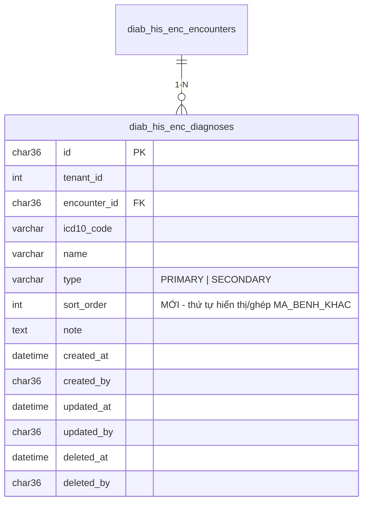
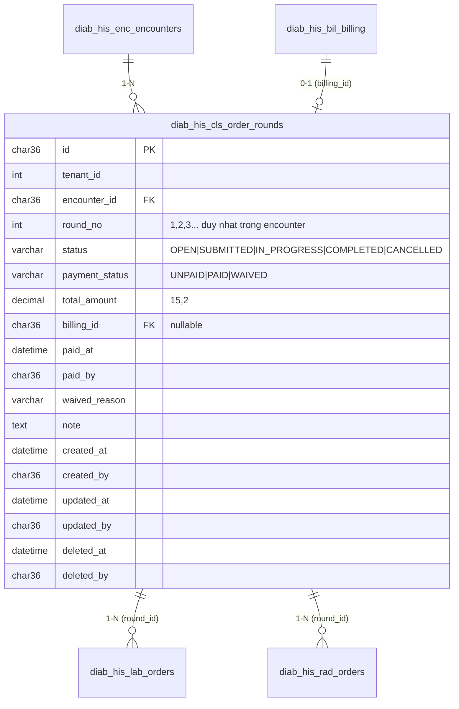
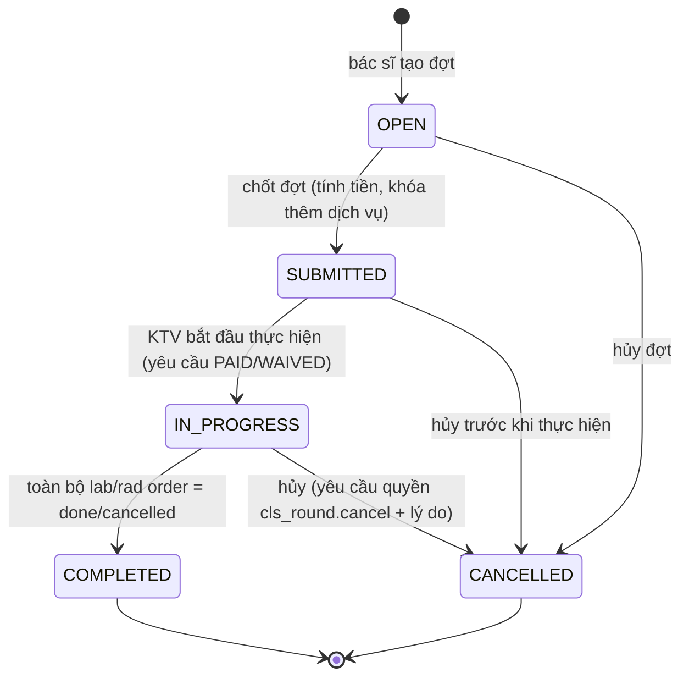
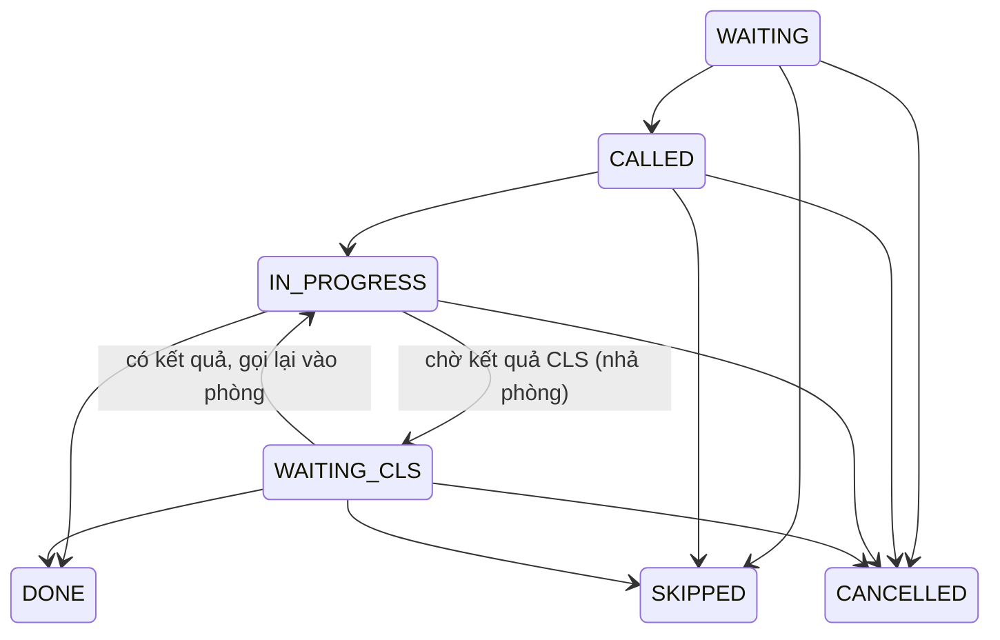
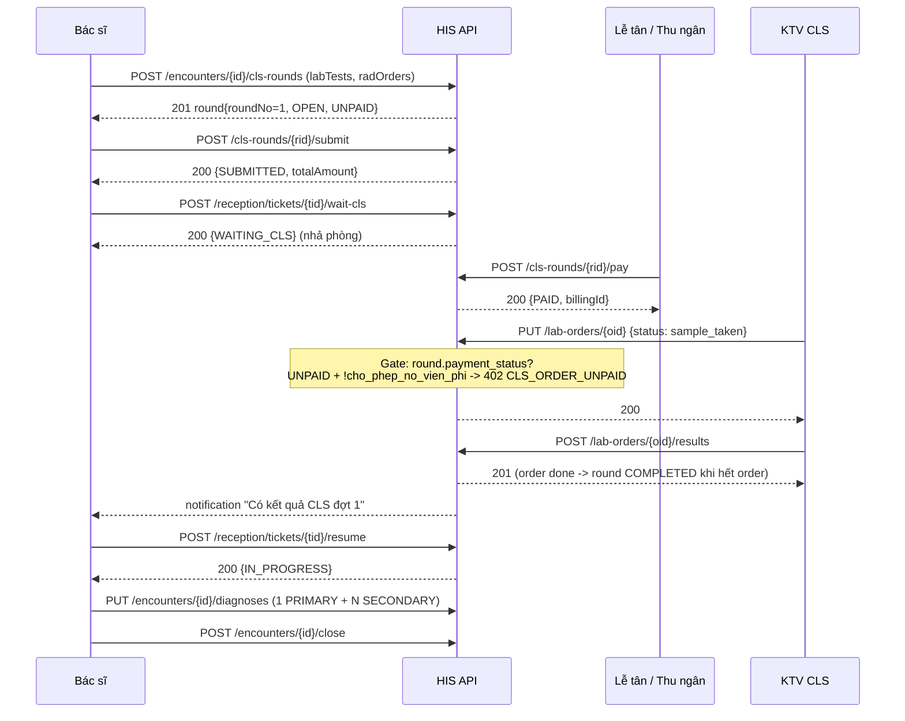

# Thiết kế G06 + G01/G02 — Chẩn đoán chính/kèm theo & Chuỗi CLS theo đợt

> Tác giả: Lành (architect) — 2026-08-18
> Phạm vi: thiết kế contract, ERD, migration. KHÔNG kèm business logic implement.
> Liên quan: `CLAUDE.md` mục 3 (DB), mục 6 (REST + i18n), mục 5 (BHYT QĐ 4750).

## 0. Ghi chú khảo sát (đính chính tên bảng thực tế)

Tên bảng trong brief khác với code hiện tại. Tên **đúng** theo `EntityTypeConfiguration`:

| Entity | Bảng thực tế | File cấu hình |
|---|---|---|
| `EncounterDiagnosis` | `diab_his_enc_diagnoses` | `Persistence/Configurations/EncounterConfiguration.cs:43` |
| `LabOrder` | `diab_his_lab_orders` | `Persistence/Configurations/LabRadConfiguration.cs:89` |
| `RadOrder` | `diab_his_rad_orders` | `Persistence/Configurations/LabRadConfiguration.cs:120` |
| `ReceptionTicket` | `diab_his_rcp_queue_tickets` | truy cập bằng Dapper (không có EF config) |
| Billing | `diab_his_bil_billing` (`id` CHAR(36)) | `BillingConfiguration.cs:77` |
| Tenant | `diab_his_sys_tenants` (`id` INT) | `TenantConfiguration.cs:11` |

**Bug đã phát hiện (phải sửa cùng G06):** `BhytXmlGeneratorImpl.cs:84` query bảng/cột KHÔNG tồn tại:

```sql
SELECT icd10_code FROM diab_his_encounter_diagnoses WHERE encounter_id=@eid AND is_primary=1 ...
```

- Bảng đúng: `diab_his_enc_diagnoses`; cột phân loại là `type` ('PRIMARY'/'SECONDARY'), **không có** cột `is_primary`.
- Query cũng **thiếu filter `tenant_id`** → vi phạm quy tắc multi-tenant CLAUDE.md mục 3.
- Hệ quả hiện tại: mọi `MA_BENH` fallback về hằng `"Z00"` (dòng 102, 199) → XML1/XML3 sai mã bệnh toàn bộ.
- Tương tự các dòng khác trong file dùng tên bảng legacy (`diab_his_clinic_encounters`, `diab_pat_patients`, `diab_his_billings`, `diab_his_pharma_prescriptions`, `diab_his_clinic_lab_orders`). Cần kiểm tra `db/migrations/9009_create_legacy_views.sql` xem view nào còn sống; phần nằm ngoài phạm vi G06 ghi vào backlog riêng.

---

# HẠNG MỤC A — [G06] Chẩn đoán chính vs kèm theo

## A1. Quy tắc nghiệp vụ

| # | Quy tắc | Nơi enforce |
|---|---|---|
| R1 | 1 encounter có N chẩn đoán (N ≥ 0 khi đang khám) | — |
| R2 | Khi lưu/sửa danh sách chẩn đoán: phải **đúng 1** bản ghi `type = PRIMARY` | Service (`SetDiagnosesCommand`, `AddDiagnosisCommand`) |
| R3 | Kết thúc khám (`CloseEncounter`) mà chưa có chẩn đoán nào → chặn | `CloseEncounterCommandHandler` |
| R4 | Không cho trùng `icd10_code` trong cùng encounter (chưa xóa mềm) | Service |
| R5 | Đổi PRIMARY sang mã khác = 1 transaction: hạ mã cũ xuống SECONDARY + nâng mã mới | Service |
| R6 | `MA_BENH` XML = mã PRIMARY; `MA_BENH_KHAC` = các SECONDARY nối `;` | `BhytXmlGeneratorImpl` |

MySQL **không có partial/filtered unique index** → không thể ràng buộc "đúng 1 PRIMARY" ở DB. Enforce ở
application layer + index thường phục vụ kiểm tra nhanh (xem A3). Kiểm tra chống race: dùng
`SELECT ... FOR UPDATE` trên tập chẩn đoán của encounter trong transaction ghi.

## A2. Mã lỗi

| Code | HTTP | Message (vi) |
|---|---|---|
| `DIAGNOSIS_PRIMARY_REQUIRED` | 400 | Phải chọn đúng 1 chẩn đoán chính |
| `DIAGNOSIS_REQUIRED` | 400 | Chưa có chẩn đoán |
| `DIAGNOSIS_DUPLICATE_ICD10` | 409 | Mã ICD-10 đã tồn tại trong lượt khám này |
| `DIAGNOSIS_NOT_FOUND` | 404 | Không tìm thấy chẩn đoán |
| `ENCOUNTER_NOT_FOUND` | 404 | Không tìm thấy lượt khám |

> Lưu ý migration nghiệp vụ: `CloseEncounterCommandHandler` hiện trả `ENCOUNTER_MISSING_DIAGNOSIS`.
> Thống nhất đổi sang `DIAGNOSIS_REQUIRED` (giữ `ENCOUNTER_MISSING_DIAGNOSIS` như alias deprecated
> trong 1 sprint để FE kịp cập nhật i18n).

## A3. ERD diff (G06)



Thay đổi:
- Cột mới `sort_order INT NOT NULL DEFAULT 0` — quyết định thứ tự nối `MA_BENH_KHAC` (ổn định giữa các lần export).
- Index mới `idx_encdiag_type (tenant_id, encounter_id, type)` — phục vụ validate "đúng 1 PRIMARY" và query XML.
- Không thêm bảng mới. Không có cột nhạy cảm cần AES-256-GCM (ICD-10 là mã danh mục công khai).
- FHIR R4 mapping: `Condition` với `Condition.category` = `encounter-diagnosis`, phân biệt chính/phụ bằng
  `Condition.extension[diagnosisRole]` (`billing`/`AD` cho PRIMARY, `CC` cho SECONDARY) hoặc
  `Encounter.diagnosis.rank` = 1 cho PRIMARY, 2..n cho SECONDARY.

## A4. Migration `db/migrations/9080_enc_diagnoses_primary_rules.sql`

```sql
-- ============================================================
-- Migration: 9080_enc_diagnoses_primary_rules
-- Engine: MySQL 8.0+, InnoDB, utf8mb4
-- Generated: 2026-08-18
-- Story refs: G06 — Chan doan chinh vs kem theo
-- Mo ta: them sort_order + index (tenant_id, encounter_id, type) cho bang
--   chan doan; chuan hoa du lieu cu (encounter co >1 PRIMARY hoac 0 PRIMARY).
-- Idempotent: YES (dung add_col_if_missing / add_index_if_missing tu 0000_helpers.sql)
-- Prereq: 0000_helpers.sql da chay
-- ============================================================
SET NAMES utf8mb4;

-- 1) Cot sort_order
CALL add_col_if_missing('diab_his_enc_diagnoses', 'sort_order',
    'INT NOT NULL DEFAULT 0 COMMENT ''Thu tu hien thi; dung de noi MA_BENH_KHAC on dinh''');

-- 2) Index phuc vu validate "dung 1 PRIMARY" + query XML 4210
CALL add_index_if_missing('diab_his_enc_diagnoses', 'idx_encdiag_enc_type',
    '(`tenant_id`, `encounter_id`, `type`)');

-- 3) Backfill sort_order theo created_at (chi ban ghi dang 0)
UPDATE `diab_his_enc_diagnoses` d
JOIN (
    SELECT id,
           ROW_NUMBER() OVER (PARTITION BY tenant_id, encounter_id ORDER BY created_at, id) AS rn
    FROM `diab_his_enc_diagnoses`
    WHERE deleted_at IS NULL
) x ON x.id = d.id
SET d.sort_order = x.rn
WHERE d.sort_order = 0 AND d.deleted_at IS NULL;

-- 4) Chuan hoa du lieu cu: encounter co NHIEU HON 1 PRIMARY
--    -> giu ban ghi PRIMARY som nhat, ha cac ban ghi con lai xuong SECONDARY.
UPDATE `diab_his_enc_diagnoses` d
JOIN (
    SELECT id,
           ROW_NUMBER() OVER (PARTITION BY tenant_id, encounter_id ORDER BY created_at, id) AS rn
    FROM `diab_his_enc_diagnoses`
    WHERE type = 'PRIMARY' AND deleted_at IS NULL
) p ON p.id = d.id AND p.rn > 1
SET d.type = 'SECONDARY',
    d.updated_at = CURRENT_TIMESTAMP;

-- 5) Chuan hoa du lieu cu: encounter co chan doan nhung KHONG co PRIMARY nao
--    -> nang ban ghi som nhat len PRIMARY.
UPDATE `diab_his_enc_diagnoses` d
JOIN (
    SELECT MIN(CONCAT(LPAD(UNIX_TIMESTAMP(created_at),12,'0'), '|', id)) AS marker,
           tenant_id, encounter_id
    FROM `diab_his_enc_diagnoses`
    WHERE deleted_at IS NULL
    GROUP BY tenant_id, encounter_id
    HAVING SUM(type = 'PRIMARY') = 0
) g ON g.tenant_id = d.tenant_id
   AND g.encounter_id = d.encounter_id
   AND SUBSTRING_INDEX(g.marker, '|', -1) = d.id
SET d.type = 'PRIMARY',
    d.updated_at = CURRENT_TIMESTAMP;
```

**Rollback:**
```sql
ALTER TABLE `diab_his_enc_diagnoses` DROP INDEX `idx_encdiag_enc_type`;
ALTER TABLE `diab_his_enc_diagnoses` DROP COLUMN `sort_order`;
-- Du lieu type da chuan hoa: KHONG rollback duoc (chap nhan).
```

## A5. API contract (G06)

### 5.1 `PUT /api/v1/encounters/{encounterId}/diagnoses` — thay toàn bộ danh sách (khuyến nghị dùng)

Permission: `encounter.update`

Request:
```json
{
  "diagnoses": [
    { "icd10Code": "E11.9", "name": "Đái tháo đường típ 2 không biến chứng", "type": "PRIMARY",   "note": null,        "sortOrder": 1 },
    { "icd10Code": "I10",   "name": "Tăng huyết áp vô căn",                   "type": "SECONDARY", "note": "kèm theo", "sortOrder": 2 }
  ]
}
```

Response `200`:
```json
{
  "data": {
    "encounterId": "9f1c...",
    "primary": { "id": "a1...", "icd10Code": "E11.9", "name": "Đái tháo đường típ 2 không biến chứng", "type": "PRIMARY", "sortOrder": 1 },
    "secondaries": [
      { "id": "b2...", "icd10Code": "I10", "name": "Tăng huyết áp vô căn", "type": "SECONDARY", "note": "kèm theo", "sortOrder": 2 }
    ],
    "maBenh": "E11.9",
    "maBenhKhac": "I10"
  }
}
```

Lỗi:
```json
{ "error": { "code": "DIAGNOSIS_PRIMARY_REQUIRED", "message": "Phải chọn đúng 1 chẩn đoán chính",
             "details": { "primaryCount": 2 } } }
```

### 5.2 `POST /api/v1/encounters/{encounterId}/diagnoses` — thêm 1 chẩn đoán (giữ tương thích)

Request: `{ "icd10Code": "I10", "name": "Tăng huyết áp vô căn", "type": "SECONDARY", "note": null }`
- Nếu `type = PRIMARY` và encounter đã có PRIMARY → **tự động hạ mã cũ xuống SECONDARY** (R5), trả 201 kèm cảnh báo `meta.demotedDiagnosisId`.
- Nếu là chẩn đoán đầu tiên và `type` không truyền → mặc định `PRIMARY`.

### 5.3 `PATCH /api/v1/encounters/{encounterId}/diagnoses/{id}/set-primary`

Permission: `encounter.update`. Body rỗng. Đặt bản ghi này thành PRIMARY, hạ PRIMARY cũ xuống SECONDARY.
Response `200` giống 5.1.

### 5.4 `DELETE /api/v1/encounters/{encounterId}/diagnoses/{id}`

- Xóa mềm. Nếu xóa PRIMARY mà còn ≥1 SECONDARY → trả `400 DIAGNOSIS_PRIMARY_REQUIRED`
  (bắt user chỉ định PRIMARY mới trước, tránh trạng thái không hợp lệ ngầm).
- Nếu xóa PRIMARY và đó là chẩn đoán **duy nhất** → cho phép (encounter về 0 chẩn đoán).

### 5.5 `GET /api/v1/encounters/{encounterId}/diagnoses`

Response: `{ "data": { "primary": {...}, "secondaries": [...], "maBenh": "E11.9", "maBenhKhac": "I10;E78.5" } }`

### 5.6 Ảnh hưởng `POST /api/v1/encounters/{id}/close`

Thêm/đổi kiểm tra:
```
1. Không có chẩn đoán nào           -> 400 DIAGNOSIS_REQUIRED          "Chưa có chẩn đoán"
2. Số PRIMARY != 1                  -> 400 DIAGNOSIS_PRIMARY_REQUIRED  "Phải chọn đúng 1 chẩn đoán chính"
3. (mới, G01/G02) còn đợt CLS UNPAID hoặc chưa có kết quả -> 409 CLS_ROUND_PENDING (cảnh báo, cho force)
```

## A6. Map XML 4210 (QĐ 4750)

Query chuẩn thay cho `BhytXmlGeneratorImpl.cs:83-85`:

```sql
SELECT icd10_code, type
FROM diab_his_enc_diagnoses
WHERE tenant_id    = @t
  AND encounter_id = @eid
  AND deleted_at IS NULL
ORDER BY (type <> 'PRIMARY'), sort_order, created_at;
```

Ghép trong C#:
```
MA_BENH       = rows.FirstOrDefault(r => r.type == "PRIMARY")?.icd10_code   // KHÔNG fallback "Z00"
MA_BENH_KHAC  = string.Join(";", rows.Where(r => r.type != "PRIMARY").Select(r => r.icd10_code))
                -> chuỗi rỗng thì để null
```

Ràng buộc QĐ 4750 cần validate trước khi build XML:
- `MA_BENH` bắt buộc, độ dài ≤ 100, đúng format ICD-10 (`^[A-Z]\d{2}(\.\d{1,2})?$`).
- `MA_BENH_KHAC` ≤ 1000 ký tự, phân tách bằng `;` **không có khoảng trắng**.
- `MA_BENH_KHAC` không được chứa lại mã của `MA_BENH`.
- Encounter thiếu PRIMARY → **không fallback Z00** mà đẩy vào `BhytValidationError`
  (`TableNo=1, Field="MA_BENH", Message="Lượt khám chưa có chẩn đoán chính"`) và loại encounter khỏi lô export.

DTO: `BhytTable1Row.MaBenhPhu` giữ nguyên tên field C# nhưng serialize ra XML tag `MA_BENH_KHAC`
(phần map tag nằm ở tầng ghi XML; nếu tag hiện tại là `MA_BENH_PHU` thì đổi sang `MA_BENH_KHAC` theo QĐ 4750).
`BhytTable3Row.MaBenh` cũng dùng mã PRIMARY (đang fallback "Z00" — sửa cùng lúc).

---

# HẠNG MỤC B — [G01+G02] Chuỗi CLS theo đợt chỉ định

## B1. Khái niệm

**Đợt chỉ định CLS (`ClsOrderRound`)** = 1 lần bác sĩ chỉ định 1 nhóm dịch vụ CLS trong 1 lượt khám.
1 encounter có thể có nhiều đợt (bác sĩ xem kết quả đợt 1 → chỉ định thêm đợt 2). Đợt là **đơn vị
thanh toán** và **đơn vị gate thực hiện**.

```
Encounter 1 ──< ClsOrderRound (round_no = 1,2,3...) ──< LabOrder
                                                   └──< RadOrder
ClsOrderRound.billing_id ──> diab_his_bil_billing (nullable, gán khi thu ngân lập phiếu)
```

## B2. ERD



- `round_id` trên `diab_his_lab_orders` / `diab_his_rad_orders`: **NULL được** → data cũ giữ nguyên,
  service coi order `round_id IS NULL` là "đợt legacy" và **không áp gate thanh toán** (backward compatible).
- Không có cột nhạy cảm cần AES-256-GCM.
- FHIR R4: `ClsOrderRound` ≈ `ServiceRequest` với `ServiceRequest.requisition` (Identifier nhóm) —
  các LabOrder/RadOrder là `ServiceRequest` con chia sẻ cùng `requisition` = round id.

## B3. Migration `db/migrations/9143_create_cls_order_rounds.sql`

```sql
-- ============================================================
-- Migration: 9143_create_cls_order_rounds
-- Engine: MySQL 8.0+, InnoDB, utf8mb4
-- Generated: 2026-08-18
-- Story refs: G01 + G02 — Chuoi CLS theo dot chi dinh + gate thanh toan
-- Mo ta: bang dot chi dinh CLS; lab/rad order gan round_id (nullable, backward
--   compatible); tenant flag cho phep no vien phi.
-- Idempotent: YES
-- Prereq: 0000_helpers.sql
-- ============================================================
SET NAMES utf8mb4;

-- 1) Bang dot chi dinh CLS
CREATE TABLE IF NOT EXISTS `diab_his_cls_order_rounds` (
    `id`             CHAR(36)     NOT NULL,
    `tenant_id`      INT          NOT NULL,
    `encounter_id`   CHAR(36)     NOT NULL      COMMENT 'FK -> diab_his_enc_encounters.id',
    `round_no`       INT          NOT NULL      COMMENT 'So thu tu dot trong luot kham, bat dau 1',
    `status`         VARCHAR(20)  NOT NULL DEFAULT 'OPEN'
                     COMMENT 'OPEN|SUBMITTED|IN_PROGRESS|COMPLETED|CANCELLED',
    `payment_status` VARCHAR(20)  NOT NULL DEFAULT 'UNPAID'
                     COMMENT 'UNPAID|PAID|WAIVED',
    `total_amount`   DECIMAL(15,2) NOT NULL DEFAULT 0.00,
    `billing_id`     CHAR(36)     NULL          COMMENT 'FK -> diab_his_bil_billing.id',
    `paid_at`        DATETIME     NULL,
    `paid_by`        CHAR(36)     NULL,
    `waived_reason`  VARCHAR(500) NULL          COMMENT 'Ly do mien/no vien phi (khi payment_status=WAIVED)',
    `note`           TEXT         NULL,
    `created_at`     DATETIME     NOT NULL DEFAULT CURRENT_TIMESTAMP,
    `created_by`     CHAR(36)     NULL,
    `updated_at`     DATETIME     NOT NULL DEFAULT CURRENT_TIMESTAMP ON UPDATE CURRENT_TIMESTAMP,
    `updated_by`     CHAR(36)     NULL,
    `deleted_at`     DATETIME     NULL,
    `deleted_by`     CHAR(36)     NULL,
    PRIMARY KEY (`id`),
    UNIQUE KEY `uq_clsround_enc_no`  (`tenant_id`, `encounter_id`, `round_no`),
    INDEX        `idx_clsround_enc`   (`tenant_id`, `encounter_id`),
    INDEX        `idx_clsround_pay`   (`tenant_id`, `payment_status`, `status`),
    INDEX        `idx_clsround_bill`  (`tenant_id`, `billing_id`)
) ENGINE=InnoDB DEFAULT CHARSET=utf8mb4 COLLATE=utf8mb4_0900_ai_ci
  COMMENT='Dot chi dinh CLS - don vi thanh toan va gate thuc hien';

-- 2) Gan round_id vao lab/rad orders (nullable de tuong thich data cu)
CALL add_col_if_missing('diab_his_lab_orders', 'round_id',
    'CHAR(36) NULL COMMENT ''FK -> diab_his_cls_order_rounds.id; NULL = don le legacy''');
CALL add_col_if_missing('diab_his_rad_orders', 'round_id',
    'CHAR(36) NULL COMMENT ''FK -> diab_his_cls_order_rounds.id; NULL = don le legacy''');

CALL add_index_if_missing('diab_his_lab_orders', 'idx_laborder_round', '(`tenant_id`, `round_id`)');
CALL add_index_if_missing('diab_his_rad_orders', 'idx_radorder_round', '(`tenant_id`, `round_id`)');

-- 3) Tenant flag: cho phep no vien phi (thuc hien CLS khi dot chua thanh toan)
CALL add_col_if_missing('diab_his_sys_tenants', 'cho_phep_no_vien_phi',
    'TINYINT(1) NOT NULL DEFAULT 0 COMMENT ''1 = cho phep KTV thuc hien CLS khi dot chua thanh toan (ghi audit log)''');

-- 4) Mo rong enum trang thai ve hang doi: them WAITING_CLS
--    Cot status hien la VARCHAR nen khong can ALTER; chi bo sung comment + index.
CALL add_index_if_missing('diab_his_rcp_queue_tickets', 'idx_ticket_status_date',
    '(`tenant_id`, `ticket_date`, `status`)');

-- 5) Cot ghi lai phong da nha khi ve chuyen sang WAITING_CLS (de tra ve phong cu)
CALL add_col_if_missing('diab_his_rcp_queue_tickets', 'released_room_id',
    'CHAR(36) NULL COMMENT ''Phong da nha khi chuyen WAITING_CLS; dung de quay lai IN_PROGRESS''');
CALL add_col_if_missing('diab_his_rcp_queue_tickets', 'waiting_cls_at',
    'DATETIME NULL COMMENT ''Thoi diem chuyen sang cho ket qua CLS''');
```

### Migration `db/migrations/9144_seed_cls_round_permissions.sql`

```sql
-- ============================================================
-- Migration: 9144_seed_cls_round_permissions
-- Story refs: G01 + G02 — quyen thao tac dot CLS
-- Idempotent: YES (INSERT IGNORE theo code)
-- ============================================================
SET NAMES utf8mb4;

INSERT IGNORE INTO `diab_his_sec_permissions` (`id`, `code`, `name`, `module`, `created_at`)
VALUES
 (UUID(), 'cls_round.create', 'Tao dot chi dinh CLS',        'CLS', CURRENT_TIMESTAMP),
 (UUID(), 'cls_round.read',   'Xem dot chi dinh CLS',        'CLS', CURRENT_TIMESTAMP),
 (UUID(), 'cls_round.submit', 'Chot dot chi dinh CLS',       'CLS', CURRENT_TIMESTAMP),
 (UUID(), 'cls_round.pay',    'Thanh toan dot chi dinh CLS', 'CLS', CURRENT_TIMESTAMP),
 (UUID(), 'cls_round.waive',  'Mien/no vien phi dot CLS',    'CLS', CURRENT_TIMESTAMP),
 (UUID(), 'cls_round.cancel', 'Huy dot chi dinh CLS',        'CLS', CURRENT_TIMESTAMP);

-- Gan quyen theo role (BACSI: create/read/submit/cancel; KETOAN: read/pay/waive; KYTHUATVIEN: read)
INSERT IGNORE INTO `diab_his_sec_role_permissions` (`role_id`, `permission_id`)
SELECT r.id, p.id
FROM `diab_his_sec_roles` r
JOIN `diab_his_sec_permissions` p
  ON (r.code = 'BACSI'       AND p.code IN ('cls_round.create','cls_round.read','cls_round.submit','cls_round.cancel'))
  OR (r.code = 'KETOAN'      AND p.code IN ('cls_round.read','cls_round.pay','cls_round.waive'))
  OR (r.code = 'KYTHUATVIEN' AND p.code IN ('cls_round.read'))
  OR (r.code = 'ADMIN'       AND p.code LIKE 'cls_round.%');
```

> **Cần xác nhận với backend**: tên bảng/cột thực tế của `diab_his_sec_permissions` /
> `diab_his_sec_role_permissions` (cột `code`, `module`, kiểu `id`). Xem mẫu ở
> `db/migrations/9066_seed_all_gated_permissions.sql` và chỉnh cho khớp trước khi chạy.

**Rollback (9081/9082):**
```sql
DROP TABLE IF EXISTS `diab_his_cls_order_rounds`;
ALTER TABLE `diab_his_lab_orders` DROP COLUMN `round_id`;
ALTER TABLE `diab_his_rad_orders` DROP COLUMN `round_id`;
ALTER TABLE `diab_his_sys_tenants` DROP COLUMN `cho_phep_no_vien_phi`;
ALTER TABLE `diab_his_rcp_queue_tickets` DROP COLUMN `released_room_id`, DROP COLUMN `waiting_cls_at`;
DELETE FROM `diab_his_sec_permissions` WHERE code LIKE 'cls_round.%';
```

## B4. State machine

### 4.1 `ClsOrderRound.status`



Quy tắc phái sinh:
- Thêm/xóa lab/rad order chỉ hợp lệ khi `status = OPEN`.
- `total_amount` tính lại mỗi lần thêm/xóa dịch vụ khi `OPEN`; đóng băng khi `SUBMITTED`.
- `COMPLETED` được set tự động bởi service khi order cuối cùng chuyển sang `done`/`cancelled`.
- Hủy đợt đã `PAID` → không tự hoàn tiền; tạo yêu cầu hoàn ở module Cashier (ngoài phạm vi).

### 4.2 `ClsOrderRound.payment_status`

```
UNPAID --> PAID    (thu ngân thu tiền; set billing_id, paid_at, paid_by)
UNPAID --> WAIVED  (miễn/nợ viện phí; bắt buộc waived_reason + quyền cls_round.waive + audit log)
PAID   --> (terminal, hoàn tiền xử lý ở module Cashier)
WAIVED --> PAID    (bệnh nhân trả sau)
```

### 4.3 `TicketStatus` — thêm `WAITING_CLS`



Bảng transition bổ sung cho `TicketStatus.CanTransition`:

| from | to | ghi chú |
|---|---|---|
| `IN_PROGRESS` | `WAITING_CLS` | nhả phòng: lưu `released_room_id = room_id`, set `waiting_cls_at`, `room_id` giữ nguyên để hiển thị lịch sử nhưng **không tính vào sức chứa phòng** |
| `WAITING_CLS` | `IN_PROGRESS` | chiếm lại phòng: kiểm tra sức chứa phòng `released_room_id`; nếu đầy → cho phép ưu tiên (bệnh nhân đang khám dở) và ghi audit |
| `WAITING_CLS` | `DONE` / `SKIPPED` / `CANCELLED` | kết thúc |

Nhả phòng — định nghĩa cụ thể: mọi truy vấn đếm sức chứa/hàng đợi phòng phải thêm
`AND status <> 'WAITING_CLS'` (các query hiện tại đang dùng `status NOT IN ('CANCELLED')` ở
`ReceptionHandlers.cs:49,56,64`).

Label tiếng Việt (thêm vào `frontend/messages/vi.json`): `WAITING_CLS` = "Chờ kết quả CLS".

## B5. Gate thanh toán CLS

Áp dụng khi KTV: nhập kết quả lab/rad, hoặc chuyển trạng thái order
(`ordered → sample_taken`, `scheduled → in_progress`).

```
1. Lấy order -> round_id
2. round_id IS NULL              -> BỎ QUA gate (đơn legacy)
3. round.payment_status IN (PAID, WAIVED)                  -> cho phép
4. round.payment_status = UNPAID
   4a. tenant.cho_phep_no_vien_phi = 0 -> 402 CLS_ORDER_UNPAID
   4b. tenant.cho_phep_no_vien_phi = 1 -> cho phép + ghi audit log
       diab_his_sec_audit_logs: action='CLS_UNPAID_BYPASS', entity='ClsOrderRound',
       entity_id=round.id, payload={ orderId, orderType, totalAmount, userId }
```

| Code | HTTP | Message (vi) |
|---|---|---|
| `CLS_ORDER_UNPAID` | 402 | Đợt chỉ định chưa thanh toán |
| `CLS_ROUND_NOT_FOUND` | 404 | Không tìm thấy đợt chỉ định |
| `CLS_ROUND_NOT_OPEN` | 409 | Đợt chỉ định đã chốt, không thể thay đổi dịch vụ |
| `CLS_ROUND_EMPTY` | 400 | Đợt chỉ định chưa có dịch vụ nào |
| `CLS_ROUND_ALREADY_PAID` | 409 | Đợt chỉ định đã thanh toán |
| `CLS_ROUND_INVALID_TRANSITION` | 409 | Không thể chuyển trạng thái đợt từ {from} sang {to} |
| `CLS_WAIVE_REASON_REQUIRED` | 400 | Cần nhập lý do miễn/nợ viện phí |
| `TICKET_INVALID_TRANSITION` | 409 | Không thể chuyển trạng thái vé từ {from} sang {to} |
| `TICKET_NOT_FOUND` | 404 | Không tìm thấy vé khám |

## B6. API contract (G01/G02)

### 6.1 `POST /api/v1/encounters/{encounterId}/cls-rounds` — tạo đợt

Permission `cls_round.create`. `roundNo` do server sinh (`MAX(round_no)+1` trong transaction).

Request:
```json
{
  "note": "Đợt 1 - sàng lọc ĐTĐ",
  "labTests": [
    { "testCode": "GLU",   "testName": "Glucose máu",  "sampleType": "BLOOD", "priority": "NORMAL" },
    { "testCode": "HBA1C", "testName": "HbA1c",        "sampleType": "BLOOD", "priority": "NORMAL" }
  ],
  "radOrders": [
    { "modality": "US", "bodyPart": "ABDOMEN", "contrast": false,
      "procedureCode": "SA-OB", "procedureName": "Siêu âm ổ bụng", "priority": "NORMAL" }
  ]
}
```

Response `201`:
```json
{
  "data": {
    "id": "3f2a...",
    "encounterId": "9f1c...",
    "roundNo": 1,
    "status": "OPEN",
    "paymentStatus": "UNPAID",
    "totalAmount": 350000,
    "billingId": null,
    "note": "Đợt 1 - sàng lọc ĐTĐ",
    "labOrders": [ { "id": "l1...", "testCode": "GLU", "testName": "Glucose máu", "status": "ordered", "unitPrice": 50000 } ],
    "radOrders": [ { "id": "r1...", "procedureCode": "SA-OB", "procedureName": "Siêu âm ổ bụng", "status": "ordered", "unitPrice": 200000 } ],
    "createdAt": "2026-08-18T09:12:00Z"
  }
}
```

### 6.2 `GET /api/v1/encounters/{encounterId}/cls-rounds` — list đợt theo lượt khám

Permission `cls_round.read`. Query: `?includeOrders=true` (default `true`), `?status=OPEN`.

Response `200`:
```json
{
  "data": [
    { "id": "3f2a...", "roundNo": 1, "status": "COMPLETED", "paymentStatus": "PAID",
      "totalAmount": 350000, "billingId": "b1...", "paidAt": "2026-08-18T09:30:00Z",
      "labOrders": [...], "radOrders": [...],
      "progress": { "total": 3, "done": 3, "pending": 0 } },
    { "id": "7c9d...", "roundNo": 2, "status": "SUBMITTED", "paymentStatus": "UNPAID",
      "totalAmount": 120000, "billingId": null,
      "labOrders": [...], "radOrders": [],
      "progress": { "total": 1, "done": 0, "pending": 1 } }
  ],
  "meta": { "total": 2, "unpaidRounds": 1, "unpaidAmount": 120000 }
}
```

### 6.3 `GET /api/v1/cls-rounds/{id}` — chi tiết 1 đợt

Permission `cls_round.read`. Response = object như 6.1.

### 6.4 `POST /api/v1/cls-rounds/{id}/submit` — chốt đợt

Permission `cls_round.submit`. Body: `{}`.
`OPEN → SUBMITTED`, tính lại `total_amount` từ bảng giá dịch vụ (`diab_his_bil_services`).
Lỗi: `CLS_ROUND_EMPTY`, `CLS_ROUND_INVALID_TRANSITION`.

Response `200`: `{ "data": { "id": "...", "status": "SUBMITTED", "totalAmount": 350000 } }`

### 6.5 `POST /api/v1/cls-rounds/{id}/pay` — thanh toán đợt

Permission `cls_round.pay`.

Request:
```json
{ "billingId": "b1...", "method": "CASH", "amount": 350000, "note": null }
```
- `billingId` optional: nếu null, service tự tạo `diab_his_bil_billing` scope = round.
- Idempotent theo `billingId` + `Idempotency-Key` header.

Response `200`:
```json
{ "data": { "id": "3f2a...", "paymentStatus": "PAID", "billingId": "b1...",
            "paidAt": "2026-08-18T09:30:00Z", "paidBy": "u1..." } }
```
Lỗi: `CLS_ROUND_ALREADY_PAID` (409), `CLS_ROUND_NOT_FOUND` (404), `BILLING_AMOUNT_MISMATCH` (400).

### 6.6 `POST /api/v1/cls-rounds/{id}/waive` — miễn/nợ viện phí

Permission `cls_round.waive`.

Request: `{ "reason": "Bệnh nhân nợ viện phí, cam kết trả trong ngày" }`
Response `200`: `{ "data": { "id": "...", "paymentStatus": "WAIVED", "waivedReason": "..." } }`
Lỗi: `CLS_WAIVE_REASON_REQUIRED` (400). Luôn ghi audit `CLS_ROUND_WAIVE`.

### 6.7 `POST /api/v1/cls-rounds/{id}/cancel` — hủy đợt

Permission `cls_round.cancel`. Request: `{ "reason": "Bác sĩ chỉ định nhầm" }`.
Hủy đợt → hủy mềm toàn bộ lab/rad order thuộc đợt còn ở trạng thái `ordered`/`scheduled`.

### 6.8 `POST /api/v1/reception/tickets/{id}/wait-cls` — chuyển vé sang chờ kết quả CLS

Permission `reception.update`.

Request:
```json
{ "clsRoundId": "3f2a...", "note": "Chờ kết quả siêu âm" }
```
- `clsRoundId` optional (chỉ để hiển thị/liên kết).
- Điều kiện: ticket đang `IN_PROGRESS`.
- Side-effect: `released_room_id = room_id`, `waiting_cls_at = now`, phòng được giải phóng cho ca kế tiếp.

Response `200`:
```json
{ "data": { "id": "t1...", "status": "WAITING_CLS", "statusLabel": "Chờ kết quả CLS",
            "releasedRoomId": "rm1...", "waitingClsAt": "2026-08-18T09:35:00Z" } }
```
Lỗi: `TICKET_INVALID_TRANSITION` (409), `TICKET_NOT_FOUND` (404).

### 6.9 `POST /api/v1/reception/tickets/{id}/resume` — quay lại phòng khám

Permission `reception.update`. Request: `{ "roomId": null }` (null = dùng `released_room_id`).
`WAITING_CLS → IN_PROGRESS`. Xóa `released_room_id`/`waiting_cls_at`, cập nhật `room_id` nếu đổi phòng.

Response `200`: `{ "data": { "id": "t1...", "status": "IN_PROGRESS", "roomId": "rm1..." } }`
Lỗi: `TICKET_INVALID_TRANSITION` (409), `ROOM_CAPACITY_EXCEEDED` (409 — chỉ cảnh báo, cho phép override bằng `?force=true`).

### 6.10 `GET /api/v1/reception/queue?status=WAITING_CLS` — danh sách chờ kết quả CLS

Bổ sung `WAITING_CLS` vào enum filter sẵn có; thêm cột `waitingClsAt`, `clsProgress` trong response.

### 6.11 Tương thích ngược với API cũ

`POST /api/v1/encounters/{id}/lab-orders` và `/rad-orders` (ClsOrdersController) **giữ nguyên**:
- Thêm field optional `roundId` trong body. Nếu có → gắn vào đợt (đợt phải `OPEN`).
- Nếu không có → service tự tìm đợt `OPEN` mới nhất của encounter; không có thì **tự tạo đợt mới**
  (tránh sinh thêm đơn legacy `round_id = NULL` sau khi migration chạy).

## B7. Sequence — luồng CLS trọn khối



---

# C. Danh sách file backend cần sửa / tạo mới

## C1. G06 — Chẩn đoán

| File | Thao tác |
|---|---|
| `db/migrations/9080_enc_diagnoses_primary_rules.sql` | **TẠO MỚI** |
| `backend/src/ProDiabHis.Domain/Entities/EncounterDiagnosis.cs` | SỬA — thêm `int SortOrder` |
| `backend/src/ProDiabHis.Infrastructure/Persistence/Configurations/EncounterConfiguration.cs` | SỬA — map `sort_order`, thêm `HasIndex(TenantId, EncounterId, Type)` |
| `backend/src/ProDiabHis.Application/Encounters/EncounterCommands.cs` | SỬA — thêm `SetDiagnosesCommand`, `SetPrimaryDiagnosisCommand`; `DiagnosisRequest` thêm `Name`, `SortOrder` |
| `backend/src/ProDiabHis.Application/Encounters/EncounterDto.cs` | SỬA — thêm `EncounterDiagnosesResponse(Primary, Secondaries, MaBenh, MaBenhKhac)`; `DiagnosisResponse` thêm `SortOrder` |
| `backend/src/ProDiabHis.Application/Encounters/EncounterHandlers.cs` | SỬA — validate R2/R4/R5 trong `AddDiagnosisCommandHandler` (dòng ~398), `RemoveDiagnosisCommandHandler` (~457); handler mới cho set-primary/set-all; đổi lỗi close encounter (~299-302) sang `DIAGNOSIS_REQUIRED` / `DIAGNOSIS_PRIMARY_REQUIRED` |
| `backend/src/ProDiabHis.Api/Controllers/EncountersController.cs` | SỬA — thêm `PUT /diagnoses`, `PATCH /diagnoses/{id}/set-primary`, `GET /diagnoses` |
| `backend/src/ProDiabHis.Infrastructure/Bhyt/BhytXmlGeneratorImpl.cs` | SỬA — dòng 83-85 (bảng/cột sai + thiếu tenant filter), 102 (`MaBenh`), 103 (`MaBenhPhu` → chuỗi `;`), 199 (`Table3 MaBenh`); bỏ fallback `"Z00"` |
| `backend/src/ProDiabHis.Application/Bhyt/BhytDtos.cs` | SỬA — `BhytTable1Row.MaBenhPhu` → đổi tên `MaBenhKhac` (map XML tag `MA_BENH_KHAC`) |
| `backend/src/ProDiabHis.Infrastructure/Bhyt/` (validator XML) | SỬA — thêm rule `MA_BENH` bắt buộc + regex ICD-10 + `MA_BENH_KHAC` ≤ 1000 ký tự |
| `backend/tests/**/EncounterDiagnosisTests.cs` | TẠO MỚI — unit test R2–R5 |

## C2. G01/G02 — Chuỗi CLS

| File | Thao tác |
|---|---|
| `db/migrations/9143_create_cls_order_rounds.sql` | **TẠO MỚI** |
| `db/migrations/9144_seed_cls_round_permissions.sql` | **TẠO MỚI** |
| `db/migrations/APPLY_ORDER.md` | SỬA — bổ sung 9080/9081/9082 |
| `backend/src/ProDiabHis.Domain/Entities/ClsOrderRound.cs` | **TẠO MỚI** — entity + `ClsRoundStatus` + `ClsRoundPaymentStatus` (kèm `CanTransition`) |
| `backend/src/ProDiabHis.Domain/Entities/ClsOrder.cs` | SỬA — `LabOrder.RoundId`, `RadOrder.RoundId` (`string?`) |
| `backend/src/ProDiabHis.Domain/Entities/ReceptionTicket.cs` | SỬA — thêm `TicketStatus.WaitingCls`, `ReleasedRoomId`, `WaitingClsAt`, mở rộng `CanTransition` |
| `backend/src/ProDiabHis.Domain/Entities/Tenant.cs` | SỬA — thêm `bool ChoPhepNoVienPhi` |
| `backend/src/ProDiabHis.Infrastructure/Persistence/Configurations/LabRadConfiguration.cs` | SỬA — map `round_id` + index; **TẠO** `ClsOrderRoundConfiguration` (có thể để cùng file hoặc file riêng) |
| `backend/src/ProDiabHis.Infrastructure/Persistence/Configurations/TenantConfiguration.cs` | SỬA — map `cho_phep_no_vien_phi` |
| `backend/src/ProDiabHis.Infrastructure/Persistence/ApplicationDbContext.cs` + `IApplicationDbContext` | SỬA — thêm `DbSet<ClsOrderRound> ClsOrderRounds` |
| `backend/src/ProDiabHis.Application/CLS/ClsRoundCommands.cs` | **TẠO MỚI** — Create/Submit/Pay/Waive/Cancel |
| `backend/src/ProDiabHis.Application/CLS/ClsRoundQueries.cs` | **TẠO MỚI** — List theo encounter, Get by id |
| `backend/src/ProDiabHis.Application/CLS/ClsRoundDtos.cs` | **TẠO MỚI** |
| `backend/src/ProDiabHis.Application/CLS/ClsRoundHandlers.cs` | **TẠO MỚI** |
| `backend/src/ProDiabHis.Application/CLS/IClsPaymentGate.cs` | **TẠO MỚI** — interface gate (`EnsureRoundPayableAsync(orderId, orderType, ct)`) |
| `backend/src/ProDiabHis.Infrastructure/CLS/ClsPaymentGateImpl.cs` | **TẠO MỚI** — logic B5 + ghi audit bypass |
| `backend/src/ProDiabHis.Application/CLS/ClsHandlers.cs` | SỬA — `UpdateLabOrderStatusCommandHandler`/`UpdateRadOrderStatusCommandHandler` gọi gate; Create*OrdersCommand nhận `roundId` |
| `backend/src/ProDiabHis.Application/LabRad/**` (handler nhập kết quả) | SỬA — gọi gate trước khi ghi kết quả; set round → `COMPLETED` khi order cuối done |
| `backend/src/ProDiabHis.Api/Controllers/ClsRoundsController.cs` | **TẠO MỚI** — endpoint 6.1–6.7 |
| `backend/src/ProDiabHis.Api/Controllers/ClsOrdersController.cs` | SỬA — body thêm `RoundId`; map 402 cho `CLS_ORDER_UNPAID` |
| `backend/src/ProDiabHis.Application/Reception/ReceptionCommands.cs` | SỬA — `WaitClsTicketCommand`, `ResumeTicketCommand` |
| `backend/src/ProDiabHis.Application/Reception/ReceptionHandlers.cs` | SỬA — handler mới; **quan trọng**: các query đếm sức chứa phòng dòng 49/56/64 thêm `AND status <> 'WAITING_CLS'` |
| `backend/src/ProDiabHis.Application/Reception/ReceptionDto.cs` | SỬA — thêm `WaitingClsAt`, `ReleasedRoomId`, `ClsProgress` |
| `backend/src/ProDiabHis.Api/Controllers/ReceptionController.cs` | SỬA — endpoint 6.8/6.9, filter `WAITING_CLS` cho 6.10 |
| `backend/src/ProDiabHis.Application/Encounters/EncounterHandlers.cs` | SỬA — `CloseEncounter` cảnh báo `CLS_ROUND_PENDING`; `QueueTicketSync` (dòng ~343) bổ sung `WAITING_CLS` vào `fromStatuses` khi set `DONE`/`IN_PROGRESS` |
| `backend/src/ProDiabHis.Infrastructure/Billing/BillingCalculatorImpl.cs` | SỬA — nhóm chi phí CLS theo `round_id` để lập phiếu thu theo đợt |
| `frontend/messages/vi.json` | SỬA — label `WAITING_CLS`, mã lỗi mới |
| `backend/tests/**/ClsRoundTests.cs`, `TicketStateMachineTests.cs` | TẠO MỚI |

## C3. Thứ tự triển khai đề xuất

1. `9080` + G06 backend (độc lập, giao được ngay) + fix `BhytXmlGeneratorImpl`.
2. `9081` + Domain/EF config CLS round (chưa ảnh hưởng API).
3. `ClsRoundsController` + handlers (API mới, chưa bật gate).
4. Bật `IClsPaymentGate` trong luồng cập nhật trạng thái/nhập kết quả.
5. `WAITING_CLS` (Domain + Reception + FE) — cuối vì đụng UI hàng đợi.
6. `9082` seed permission — chạy trước bước 3 để RBAC không chặn.

## C4. ADR cần viết

- `docs/adr/NNN-cls-order-round-vs-flat-order.md` — trade-off: thêm bảng đợt (đúng nghiệp vụ, gate
  thanh toán/nhóm hóa đơn rõ ràng, nhưng thêm 1 tầng ghi + phải xử lý data legacy `round_id NULL`)
  so với gắn `payment_status` thẳng lên từng lab/rad order (đơn giản hơn nhưng không nhóm được hóa
  đơn, không mô tả được "đợt 2 sau khi xem kết quả đợt 1").
- `docs/adr/NNN-enforce-single-primary-diagnosis.md` — trade-off: enforce ở app layer + transaction
  `FOR UPDATE` (MySQL không có partial unique index) so với thêm cột generated
  `primary_key_guard = IF(type='PRIMARY', encounter_id, NULL)` + UNIQUE trên cột đó (DB đảm bảo
  tuyệt đối nhưng lỗi trả về là lỗi DB khó i18n, và vướng soft-delete).
