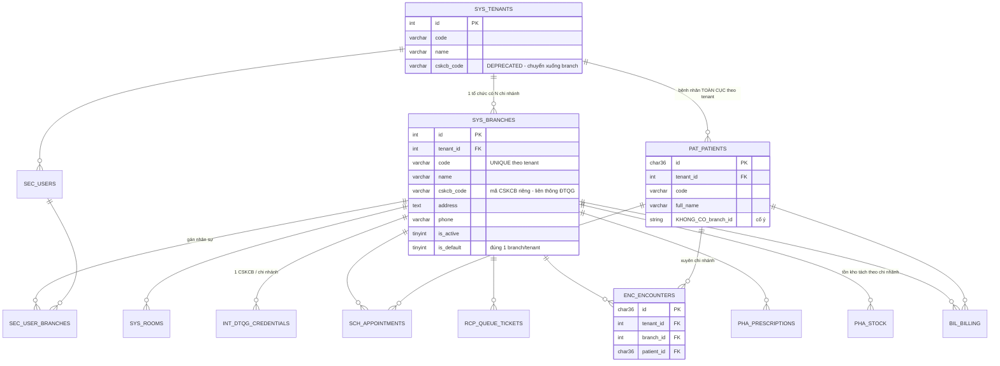

# ERD + Thiết kế — Multi-Chi Nhánh (Branch) cho Pro-Diab HIS

- **Phiên bản**: 1.0
- **Ngày**: 2026-08-25
- **Tác giả**: Lành (architect)
- **Nguồn yêu cầu**: `SRS-HIS-phong-kham-noi-noi-tiet_V2.docx`
- **Trạng thái**: Draft — chờ PO (Đăng) xác nhận mục 2.4 và 9.2 trước khi backend/frontend triển khai
- **Convention**: `CLAUDE.md` mục 3 + 6, ADR `docs/adr/0007-direction-b-schema-cleanup.md`

---

## 0. Tóm tắt điều hành

| Quyết định | Nội dung |
|---|---|
| **D1** | **TÁI SỬ DỤNG** bảng `diab_his_sys_branches` đã tồn tại (migration `9006_create_clinic.sql`) thay vì tạo bảng mới. Bảng này hiện **chưa được backend dùng** (0 tham chiếu trong `backend/src`), chỉ cần mở rộng cột. |
| **D2** | Quan hệ chuẩn hoá lại thành `Tenant (1) → (N) Branch`. Bảng trung gian `diab_his_sys_clinics` bị **deprecate** (giữ lại, `clinic_id` chuyển NULLABLE, gỡ FK). |
| **D3** | `Branch.id` = `INT AUTO_INCREMENT` (đồng bộ `tenant_id INT`, khớp bảng đã có, JWT claim gọn). Mọi cột FK là `branch_id INT NULL`. |
| **D4** | `diab_his_pat_patients` **KHÔNG có `branch_id`** — bệnh nhân là entity toàn cục theo tenant (tra cứu xuyên chi nhánh). |
| **D5** | User ↔ Branch là **N–N** qua bảng nối `diab_his_sec_user_branches`, kèm cột `branch_id` (chi nhánh mặc định) trên `diab_his_sec_users`. |
| **D6** | Permission mới: `branch.cross_view` (theo pattern `resource.action` hiện hữu, **không** dùng `cross_branch_view`). |
| **D7** | JWT thêm 3 claim: `branch_id` (chi nhánh đang làm việc), `branch_ids` (danh sách được gán), `branch_cross_view` (bool). Đổi chi nhánh qua header `X-Branch-Id`, luôn validate với `branch_ids`. |
| **D8** | Giai đoạn migrate: `branch_id` **NULLABLE**; query filter coi `branch_id IS NULL` là "dữ liệu chung, luôn thấy" để không vỡ dữ liệu cũ. `NOT NULL` chỉ đặt ở migration cuối sau khi backfill xong và chạy ổn định ≥ 1 sprint. |
| **D9** | Mã CSKCB + credential ĐTQG/BHYT chuyển xuống cấp Branch. `diab_his_int_dtqg_credentials` phải **gỡ UNIQUE(tenant_id)** → `UNIQUE(tenant_id, branch_id)`. |
| **D10** | FHIR R4: `Branch` → `Organization` (`partOf` = Organization của Tenant); `diab_his_sys_rooms` → `Location` (`managingOrganization` = Branch). |

---

## 1. Hiện trạng (as-is)

### 1.1 Convention đang dùng

| Thành phần | Hiện trạng |
|---|---|
| `BaseEntity` | `Id: Guid`, `CreatedAt/CreatedBy(Guid?)`, `UpdatedAt/UpdatedBy(Guid?)`, `DeletedAt/DeletedBy(Guid?)` |
| `ITenantScoped` | `int TenantId { get; set; }` |
| `Tenant` | Ngoại lệ: PK `int`, audit `int?`, implement `IAuditTimestamps` (không kế thừa `BaseEntity`) |
| `Patient`, `User`, `Encounter`, … | `BaseEntity, ITenantScoped` |
| Multi-tenant | `AppDbContext.OnModelCreating` — `HasQueryFilter(e => e.DeletedAt == null && e.TenantId == _tenantProvider.TenantId)` cho ~45 entity |
| Tenant context | `TenantScopeMiddleware` đọc claim `tenant_id` → `ITenantProvider.SetTenantId()` (scoped) |
| RBAC | `RequirePermissionAttribute` đọc claim `permissions`; `is_super_admin=true` bypass toàn bộ |
| Migration | `db/migrations/NNNN_*.sql`, helper `add_col_if_missing` / `add_index_if_missing` trong `0000_helpers.sql`. Số cao nhất hiện tại: **9075** |

### 1.2 Phát hiện quan trọng

`db/migrations/9006_create_clinic.sql` **đã tạo sẵn** 3 bảng: `diab_his_sys_clinics`, `diab_his_sys_branches`, `diab_his_sys_rooms`.

- `diab_his_sys_branches` đã có: `id INT AI`, `tenant_id INT`, `clinic_id INT NOT NULL` (FK → clinics), `code`, `name`, `address`, `phone`, `is_active`, 6 cột audit, `UNIQUE(tenant_id, code)`.
- **Thiếu**: `cskcb_code`, `is_default`, `email`, `working_hours`, `timezone`.
- `diab_his_sys_rooms` **đã có sẵn** `branch_id INT NULL` + index `idx_rooms_branch` → không cần đụng.
- Không có entity EF / repository / handler nào tham chiếu 3 bảng này ⇒ **an toàn để ALTER**, không breaking runtime.

> **Trade-off đã cân nhắc (ghi vào ADR `docs/adr/0008-branch-vs-clinic.md`)**
> - **PA-A (chọn)**: Bỏ tầng `clinics`, `Tenant → Branch` trực tiếp. Ưu: khớp SRS, ít 1 tầng join, seed đơn giản. Nhược: bảng `clinics` thành rác (giữ lại làm legacy, không dùng).
> - **PA-B**: Giữ `Tenant → Clinic → Branch`. Ưu: giữ nguyên schema 9006. Nhược: mọi tenant phải seed 1 clinic giả, thêm 1 tầng join vô nghĩa cho phòng khám 2–5 bác sĩ, SRS không có khái niệm "Clinic".

---

## 2. Thiết kế đích (to-be)

### 2.1 ERD tổng quan



### 2.2 Bảng `diab_his_sys_branches` (sau khi ALTER)

| Cột | Kiểu | Null | Mặc định | Mô tả |
|---|---|---|---|---|
| `id` | `INT AUTO_INCREMENT` | N | — | PK |
| `tenant_id` | `INT` | N | — | Tổ chức sở hữu |
| `clinic_id` | `INT` | **Y** | `NULL` | **DEPRECATED** — gỡ FK, giữ để không mất dữ liệu cũ |
| `code` | `VARCHAR(20)` | N | — | Mã chi nhánh, `UNIQUE(tenant_id, code)` |
| `name` | `VARCHAR(255)` | N | — | Tên chi nhánh |
| `cskcb_code` | `VARCHAR(20)` | Y | `NULL` | **MỚI** — mã CSKCB Bộ Y tế cấp riêng cho chi nhánh |
| `address` | `TEXT` | Y | `NULL` | Địa chỉ |
| `phone` | `VARCHAR(30)` | Y | `NULL` | Điện thoại |
| `email` | `VARCHAR(255)` | Y | `NULL` | **MỚI** |
| `working_hours` | `VARCHAR(255)` | Y | `NULL` | **MỚI** — vd `T2-T6: 7:30-17:00` |
| `timezone` | `VARCHAR(50)` | N | `'Asia/Ho_Chi_Minh'` | **MỚI** — phục vụ báo cáo/queue theo giờ địa phương |
| `is_active` | `TINYINT(1)` | N | `1` | Còn hoạt động |
| `is_default` | `TINYINT(1)` | N | `0` | **MỚI** — chi nhánh mặc định, **đúng 1 per tenant** |
| `sort_order` | `INT` | N | `0` | **MỚI** — thứ tự hiển thị dropdown |
| `created_at` / `created_by` | `DATETIME` / `CHAR(36)` | N / Y | `CURRENT_TIMESTAMP` / `NULL` | Audit |
| `updated_at` / `updated_by` | `DATETIME` / `CHAR(36)` | N / Y | `CURRENT_TIMESTAMP ON UPDATE` / `NULL` | Audit |
| `deleted_at` / `deleted_by` | `DATETIME` / `CHAR(36)` | Y / Y | `NULL` | Soft delete |

**Index**:
- `PRIMARY (id)`
- `UNIQUE uq_branches_code_tenant (tenant_id, code)`
- `UNIQUE uq_branches_cskcb (cskcb_code)` — chỉ khi `cskcb_code IS NOT NULL` (MySQL bỏ qua NULL trong UNIQUE ⇒ hoạt động đúng)
- `INDEX idx_branches_tenant_active (tenant_id, is_active, sort_order)`
- `INDEX idx_branches_default (tenant_id, is_default)`

**Ràng buộc nghiệp vụ (enforce ở application layer, MySQL không có partial unique index)**:
- `INV-1`: mỗi tenant có **đúng 1** branch `is_default = 1` và `deleted_at IS NULL`.
- `INV-2`: không được xoá mềm / vô hiệu hoá branch mặc định khi tenant còn > 0 branch active khác chưa được chỉ định làm default.
- `INV-3`: không được xoá branch còn dữ liệu vận hành (`encounters`, `billing`, `stock` > 0) → trả `BRANCH_HAS_DATA`.

**Cột nhạy cảm cần AES-256-GCM**: bảng branch **không** có. Nhưng token tích hợp theo chi nhánh (`diab_his_int_dtqg_credentials.token_encrypted`) đã mã hoá — giữ nguyên cơ chế, chỉ thêm `branch_id`.

**FHIR R4 mapping**: `Branch` → `Organization`
| FHIR path | Nguồn |
|---|---|
| `Organization.identifier[0]` | system `urn:vn:moh:cskcb`, value = `cskcb_code` |
| `Organization.identifier[1]` | system `urn:prodiab:branch-code`, value = `code` |
| `Organization.name` | `name` |
| `Organization.active` | `is_active` |
| `Organization.partOf` | `Organization/{tenant_id}` |
| `Organization.telecom` | `phone`, `email` |
| `Organization.address` | `address` |

### 2.3 Bảng mới `diab_his_sec_user_branches` (N–N User ↔ Branch)

| Cột | Kiểu | Null | Mô tả |
|---|---|---|---|
| `id` | `CHAR(36)` | N | PK (UUID) |
| `tenant_id` | `INT` | N | Denormalize để filter nhanh |
| `user_id` | `CHAR(36)` | N | FK → `diab_his_sec_users.id` |
| `branch_id` | `INT` | N | FK → `diab_his_sys_branches.id` |
| `is_primary` | `TINYINT(1)` | N | Chi nhánh chính của user (đúng 1) |
| `created_at` / `created_by` | | | Audit |
| `deleted_at` | `DATETIME` | Y | Soft delete |

`UNIQUE uq_user_branch (user_id, branch_id)`, `INDEX idx_ub_branch (tenant_id, branch_id)`.

> Vì sao N–N chứ không phải 1 cột `branch_id` trên `sec_users`: SRS cho phép bác sĩ trực luân phiên nhiều cơ sở. Vẫn giữ thêm `sec_users.branch_id` làm **chi nhánh mặc định khi đăng nhập** (denormalize, phải trùng với 1 dòng `is_primary = 1`).

---

## 3. Phân loại bảng: nơi nào thêm `branch_id`

### 3.1 Nhóm A — **BẮT BUỘC** thêm `branch_id INT NULL` (dữ liệu vận hành)

| # | Bảng | Ý nghĩa branch |
|---|---|---|
| 1 | `diab_his_sec_users` | Chi nhánh mặc định khi login |
| 2 | `diab_his_sec_audit_logs` | Chi nhánh phát sinh thao tác (truy vết) |
| 3 | `diab_his_sch_appointments` | Nơi đặt lịch hẹn |
| 4 | `diab_his_sch_doctor_schedules` | Lịch trực theo cơ sở |
| 5 | `diab_his_sch_schedule_blocks` | Khoá lịch theo cơ sở |
| 6 | `diab_his_rcp_queue_tickets` | Hàng chờ tách theo cơ sở (số thứ tự reset theo branch/ngày) |
| 7 | `diab_his_enc_encounters` | Lượt khám tại cơ sở nào |
| 8 | `diab_his_lab_orders` | Chỉ định XN |
| 9 | `diab_his_rad_orders` | Chỉ định CĐHA |
| 10 | `diab_his_lab_results` | Kết quả XN |
| 11 | `diab_his_rad_results` | Kết quả CĐHA |
| 12 | `diab_his_cls_uploads` | File CLS |
| 13 | `diab_his_fil_cls_uploads` | File CLS (bảng legacy song song) |
| 14 | `diab_his_pha_prescriptions` | Đơn thuốc → đẩy ĐTQG bằng CSKCB của branch |
| 15 | `diab_his_pha_dispenses` | Cấp phát |
| 16 | `diab_his_pha_dispense_records` | Cấp phát (legacy) |
| 17 | `diab_his_pha_stock` | **Tồn kho tách theo chi nhánh** — thay đổi lớn nhất |
| 18 | `diab_his_pha_stock_movements` | Nhập/xuất/điều chuyển |
| 19 | `diab_his_pha_purchase_orders` | Đơn mua |
| 20 | `diab_his_pha_grn` | Phiếu nhập |
| 21 | `diab_his_pha_stocktakes` | Kiểm kê |
| 22 | `pha_warehouses` | Kho thuộc chi nhánh nào |
| 23 | `diab_his_bil_billing` | Hoá đơn |
| 24 | `diab_his_bil_payments` | Thanh toán |
| 25 | `diab_his_bil_einvoices` | HĐĐT (ký hiệu hoá đơn có thể khác theo cơ sở) |
| 26 | `diab_his_bil_cashier_shifts` | Ca thu ngân |
| 27 | `diab_his_bil_counters` | **Bộ đếm số phiếu — phải reset/độc lập theo branch** |
| 28 | `diab_his_bil_cash_out` | Chi tiền mặt |
| 29 | `diab_his_int_bhyt_exports` | XML 4210 xuất theo mã CSKCB của branch |
| 30 | `diab_his_int_bhyt_reconcile_uploads` | Đối soát theo cơ sở |
| 31 | `diab_his_int_dtqg_credentials` | **1 credential / branch** (gỡ UNIQUE `tenant_id`) |
| 32 | `diab_his_int_dtqg_submissions` | Log đẩy đơn |
| 33 | `diab_his_cli_followup_recall` | Hẹn tái khám tại cơ sở |
| 34 | `diab_his_rep_daily_revenue_cache` | Cache báo cáo tách theo branch |
| 35 | `diab_his_rep_doctor_kpi_cache` | Cache KPI |
| 36 | `diab_his_rep_top_drugs_cache` | Cache top thuốc |
| 37 | `diab_his_rep_inventory_value_cache` | Cache giá trị tồn |
| 38 | `diab_his_rep_diabetes_cohort_cache` | Cache cohort |
| — | `diab_his_sys_rooms` | **ĐÃ CÓ** `branch_id` — chỉ backfill |

### 3.2 Nhóm B — **KHÔNG** thêm cột, kế thừa branch từ bảng cha (join khi cần)

`diab_his_enc_diagnoses`, `diab_his_enc_vital_signs`, `diab_his_enc_emr_contents`, `diab_his_cli_emr_versions`, `diab_his_cli_emr_signatures`, `diab_his_pha_prescription_items`, `diab_his_pha_dispense_items`, `diab_his_pha_purchase_order_items`, `diab_his_pha_stocktake_items`, `diab_his_bil_billing_items`, `diab_his_bil_service_package_items`, `diab_his_int_bhyt_export_items`, `diab_his_int_bhyt_reconcile_items`, `diab_his_bil_qr_codes`.

> Lý do: các bảng này luôn được truy vấn kèm bảng cha, denormalize thêm `branch_id` chỉ tăng rủi ro lệch dữ liệu. **Ngoại lệ có thể xem xét sau** nếu profiling cho thấy report cần quét trực tiếp bảng item.

### 3.3 Nhóm C — **TENANT-SCOPED ONLY**, tuyệt đối không thêm `branch_id`

| Bảng | Lý do |
|---|---|
| **`diab_his_pat_patients`** | **Yêu cầu cốt lõi SRS** — bệnh nhân toàn cục theo tenant, tra cứu/khám ở bất kỳ chi nhánh nào. Mã BN `code` unique theo tenant. |
| `diab_his_pat_allergies`, `pat_insurances`, `pat_emergency_contacts`, `pat_consents` | Hồ sơ thuộc bệnh nhân toàn cục |
| `diab_his_cli_allergies`, `cli_patient_risk_flag`, `cli_care_pathway_target` | Dữ liệu lâm sàng gắn bệnh nhân, xuyên cơ sở |
| `diab_his_pat_portal_accounts`, `portal_sessions`, `portal_otp_log` | Tài khoản bệnh nhân — 1 tài khoản, nhiều chi nhánh |
| `diab_his_ptl_med_reminders` | Nhắc thuốc theo bệnh nhân |
| `diab_his_pha_drugs`, `pha_drug_categories`, `pha_ddi_rules` | Danh mục thuốc dùng chung toàn tenant |
| `diab_his_pha_suppliers` | Nhà cung cấp dùng chung |
| `diab_his_bil_services`, `bil_service_packages` | Bảng giá dùng chung. *Nếu sau này cần giá khác nhau theo cơ sở → tạo bảng `diab_his_bil_service_branch_prices`, KHÔNG thêm `branch_id` vào bảng giá gốc.* |
| `diab_his_sec_roles`, `sec_permissions`, `sec_role_permissions`, `sec_user_roles`, `sec_sessions` | RBAC ở cấp tenant |
| `diab_his_cli_emr_templates`, `cli_diabetes_templates` | Mẫu bệnh án dùng chung |
| `diab_his_cdss_*` | Bộ luật CDSS toàn hệ thống |
| `diab_his_dict_*`, `diab_his_ref_*`, `diab_his_sys_code_master/detail` | Danh mục tham chiếu |
| `diab_his_sys_feature_flags`, `diab_his_sec_encryption_keys` | Cấu hình hệ thống |
| `diab_his_api_partners` | Đối tác API cấp tenant |
| `diab_his_nti_*` | Thông báo gắn `user_id` → suy ra branch từ user |
| `diab_his_rep_definitions`, `rep_dashboards`, `rep_schedules` | Định nghĩa báo cáo dùng chung; **filter branch là tham số runtime, không phải cột** |

> **Phương án bị từ chối**: thêm `pat_patients.primary_branch_id`. Lý do: tạo ảo giác "bệnh nhân thuộc chi nhánh", dễ bị lập trình viên đưa vào query filter → vỡ yêu cầu tra cứu xuyên chi nhánh. Nếu UI cần hiển thị "chi nhánh gần nhất", **derive** từ `MAX(encounters.started_at)`.

---

## 4. RBAC & Bảo mật

### 4.1 Permission mới (seed vào `diab_his_sec_permissions`)

| `code` | `resource` | `action` | Mô tả |
|---|---|---|---|
| `branch.read` | `branch` | `read` | Xem danh sách/chi tiết chi nhánh |
| `branch.create` | `branch` | `create` | Tạo chi nhánh mới |
| `branch.update` | `branch` | `update` | Sửa thông tin chi nhánh |
| `branch.delete` | `branch` | `delete` | Vô hiệu hoá / xoá mềm chi nhánh |
| `branch.assign_user` | `branch` | `assign_user` | Gán / gỡ nhân sự khỏi chi nhánh |
| **`branch.cross_view`** | `branch` | `cross_view` | **Xem dữ liệu vận hành của TẤT CẢ chi nhánh trong tenant** |

### 4.2 Grant mặc định

| Role code | Quyền |
|---|---|
| `admin` | Toàn bộ 6 quyền (kể cả `branch.cross_view`) |
| `bac_si` | `branch.read` |
| `le_tan` | `branch.read` |
| `duoc_si` | `branch.read` |
| `ke_toan` | `branch.read`, `branch.cross_view` *(kế toán chuỗi cần tổng hợp doanh thu — PO xác nhận)* |
| `ky_thuat_vien` | `branch.read` |
| Role mới đề xuất `quan_ly_chuoi` | `branch.read`, `branch.cross_view`, `branch.update` |

`is_super_admin = true` tiếp tục bypass toàn bộ, bao gồm cả branch filter.

### 4.3 Ma trận truy cập

| Người dùng | `branch_id` context | Thấy dữ liệu Nhóm A | Thấy Patient (Nhóm C) |
|---|---|---|---|
| Super Admin | bất kỳ | Toàn tenant | Toàn tenant |
| Có `branch.cross_view`, **không** truyền `branchId` | — | Toàn tenant | Toàn tenant |
| Có `branch.cross_view`, truyền `branchId=5` | 5 | Chỉ branch 5 | Toàn tenant |
| User thường (không có quyền), branch mặc định = 2 | 2 | **Chỉ branch 2** (+ dòng `branch_id IS NULL` giai đoạn migrate) | Toàn tenant |
| User thường truyền `branchId=7` không thuộc `branch_ids` | — | **403 `BRANCH_ACCESS_DENIED`** + ghi `sec_audit_logs` | — |

### 4.4 Audit
Mọi lần đổi chi nhánh (`POST /api/v1/branches/switch`) và mọi lần truy cập bị từ chối ghi vào `diab_his_sec_audit_logs` với `action = 'BRANCH_SWITCH'` / `'BRANCH_ACCESS_DENIED'`, kèm `branch_id` đích.

---

## 5. Chiến lược Query Filter

### 5.1 Nguồn của BranchId

```
Đăng nhập
   └─> JwtService.GenerateToken(user, roles, roleCodes)
         claims += branch_id        = user.BranchId ?? default branch của tenant
         claims += branch_ids       = "2,5,7"  (CSV từ diab_his_sec_user_branches)
         claims += branch_cross_view= "true"   (nếu permissions chứa branch.cross_view)
```

**Request pipeline** (`Program.cs`, đặt **ngay sau** `TenantScopeMiddleware`):

```
UseAuthentication()
  → TenantScopeMiddleware      (đã có)   set ITenantProvider.TenantId
  → BranchScopeMiddleware      (MỚI)     set IBranchProvider
  → UseAuthorization()
```

`BranchScopeMiddleware` logic (mô tả, **không phải code triển khai**):
1. Đọc claim `branch_id`, `branch_ids`, `branch_cross_view`, `is_super_admin`.
2. Nếu request có header `X-Branch-Id` **hoặc** query `?branchId=`:
   - Nếu `is_super_admin` hoặc `branch_cross_view` → chấp nhận mọi branch thuộc tenant hiện tại (vẫn phải verify `branch.tenant_id == TenantId`).
   - Ngược lại: giá trị phải nằm trong `branch_ids`, sai → `403 BRANCH_ACCESS_DENIED`.
3. Nếu **không** truyền branch nào và user có `branch_cross_view` → `IBranchProvider.IgnoreBranchFilter = true` (xem toàn tenant).
4. Nếu không truyền và user **không** có `cross_view` → dùng `branch_id` claim.
5. Ghi `HttpContext.Items["BranchId"]` để Dapper handler đọc.

### 5.2 Interface

```
IBranchProvider (scoped, đăng ký cạnh ITenantProvider)
    int  BranchId              // 0 = chưa xác định
    bool IgnoreBranchFilter    // true khi cross-view / super admin
    IReadOnlyList<int> AllowedBranchIds
    void SetContext(int branchId, bool ignoreFilter, IReadOnlyList<int> allowed)
```

`IBranchScoped` (Domain/Common) — `int? BranchId { get; set; }`. Dùng `int?` (nullable) để tương thích giai đoạn migrate.

### 5.3 EF Core Global Query Filter

Với mọi entity Nhóm A, filter đổi từ:

```
e => e.DeletedAt == null && e.TenantId == _tenantProvider.TenantId
```

thành:

```
e => e.DeletedAt == null
     && e.TenantId == _tenantProvider.TenantId
     && (_branchProvider.IgnoreBranchFilter
         || e.BranchId == null
         || e.BranchId == _branchProvider.BranchId)
```

**Lưu ý kỹ thuật bắt buộc**:
- `_branchProvider` phải là **field của `AppDbContext`** (giống `_tenantProvider`), **không** được capture biến local. EF Core chỉ re-evaluate per-query khi biểu thức tham chiếu member của DbContext instance; capture local sẽ bị bake cứng vào model cache.
- `e.BranchId == null` là điều khoản **tạm thời cho giai đoạn migrate**. Sau migration `NOT NULL` (bước 6.6) phải **gỡ bỏ** — nếu quên, dữ liệu `NULL` do bug sẽ rò rỉ sang mọi chi nhánh.
- Entity Nhóm C **giữ nguyên** filter cũ.

### 5.4 Dapper (read path)

Quy ước mới, PR review **reject** nếu vi phạm:
- Query trên bảng Nhóm A: `WHERE tenant_id = @tenantId AND (@ignoreBranch = 1 OR branch_id IS NULL OR branch_id = @branchId)`.
- `@branchId` / `@ignoreBranch` lấy từ `IBranchProvider`, **không** từ input client.
- Tạo helper mở rộng `DynamicParameters` (vd `AddTenantBranch(...)`) để tránh quên.

### 5.5 Write path
`branch_id` khi INSERT do service gán từ `IBranchProvider.BranchId`, **không trust body**. Nếu user có `cross_view` và không chỉ định branch → trả `400 BRANCH_REQUIRED` (không được đoán).

### 5.6 Index đi kèm
Mọi bảng Nhóm A thêm index `idx_<tbl>_tenant_branch (tenant_id, branch_id)`. Với bảng có index `(tenant_id, <ngày>)` sẵn (vd `sch_appointments`), thay bằng `(tenant_id, branch_id, <ngày>)` để tránh index thừa.

---

## 6. Migration plan

Đánh số tiếp từ **9080** (cao nhất hiện tại 9075). Tất cả idempotent theo pattern `CLAUDE.md` mục 3.

### 6.1 `db/migrations/9080_helpers_branch.sql` — helper bổ sung

```sql
-- ============================================================
-- Migration: 9080_helpers_branch
-- Engine: MySQL 8.0+, InnoDB, utf8mb4
-- Muc dich: bo sung helper drop index / drop FK idempotent
--   (0000_helpers.sql chi co add_col_if_missing + add_index_if_missing)
-- Idempotent: YES
-- ============================================================
SET NAMES utf8mb4;

DROP PROCEDURE IF EXISTS drop_index_if_exists;
DELIMITER $$
CREATE PROCEDURE drop_index_if_exists(IN p_tbl VARCHAR(64), IN p_idx VARCHAR(64))
BEGIN
    DECLARE v_count INT DEFAULT 0;
    SELECT COUNT(*) INTO v_count
      FROM information_schema.STATISTICS
     WHERE TABLE_SCHEMA = DATABASE() AND TABLE_NAME = p_tbl AND INDEX_NAME = p_idx;
    IF v_count > 0 THEN
        SET @__ddl = CONCAT('ALTER TABLE `', p_tbl, '` DROP INDEX `', p_idx, '`');
        PREPARE __stmt FROM @__ddl; EXECUTE __stmt; DEALLOCATE PREPARE __stmt;
    END IF;
END$$
DELIMITER ;

DROP PROCEDURE IF EXISTS drop_fk_if_exists;
DELIMITER $$
CREATE PROCEDURE drop_fk_if_exists(IN p_tbl VARCHAR(64), IN p_fk VARCHAR(64))
BEGIN
    DECLARE v_count INT DEFAULT 0;
    SELECT COUNT(*) INTO v_count
      FROM information_schema.TABLE_CONSTRAINTS
     WHERE CONSTRAINT_SCHEMA = DATABASE() AND TABLE_NAME = p_tbl
       AND CONSTRAINT_NAME = p_fk AND CONSTRAINT_TYPE = 'FOREIGN KEY';
    IF v_count > 0 THEN
        SET @__ddl = CONCAT('ALTER TABLE `', p_tbl, '` DROP FOREIGN KEY `', p_fk, '`');
        PREPARE __stmt FROM @__ddl; EXECUTE __stmt; DEALLOCATE PREPARE __stmt;
    END IF;
END$$
DELIMITER ;

-- add_col_if_missing chi chay khi BANG ton tai (tranh loi voi bang legacy khong co)
DROP PROCEDURE IF EXISTS add_branch_col;
DELIMITER $$
CREATE PROCEDURE add_branch_col(IN p_tbl VARCHAR(64))
BEGIN
    DECLARE v_tbl INT DEFAULT 0;
    SELECT COUNT(*) INTO v_tbl
      FROM information_schema.TABLES
     WHERE TABLE_SCHEMA = DATABASE() AND TABLE_NAME = p_tbl;
    IF v_tbl > 0 THEN
        CALL add_col_if_missing(p_tbl, 'branch_id',
             'INT NULL COMMENT ''FK -> diab_his_sys_branches.id (NULL = du lieu truoc khi tach chi nhanh)''');
        CALL add_index_if_missing(p_tbl, CONCAT('idx_', p_tbl, '_tenant_branch'), '(`tenant_id`, `branch_id`)');
    END IF;
END$$
DELIMITER ;
```

### 6.2 `db/migrations/9081_alter_sys_branches.sql` — mở rộng bảng branches

```sql
-- ============================================================
-- Migration: 9081_alter_sys_branches
-- Muc dich: mo rong diab_his_sys_branches (da tao o 9006) de phuc vu
--   mo hinh Tenant -> N Branch theo SRS V2. Bo tang trung gian clinics.
-- Idempotent: YES
-- ============================================================
SET NAMES utf8mb4;

-- Phong truong hop 9006 chua duoc chay (moi truong sach)
CREATE TABLE IF NOT EXISTS `diab_his_sys_branches` (
    `id`            INT             NOT NULL AUTO_INCREMENT,
    `tenant_id`     INT             NOT NULL,
    `clinic_id`     INT             NULL,
    `code`          VARCHAR(20)     NOT NULL,
    `name`          VARCHAR(255)    NOT NULL,
    `address`       TEXT            NULL,
    `phone`         VARCHAR(30)     NULL,
    `is_active`     TINYINT(1)      NOT NULL DEFAULT 1,
    `created_at`    DATETIME        NOT NULL DEFAULT CURRENT_TIMESTAMP,
    `created_by`    CHAR(36)        NULL,
    `updated_at`    DATETIME        NOT NULL DEFAULT CURRENT_TIMESTAMP ON UPDATE CURRENT_TIMESTAMP,
    `updated_by`    CHAR(36)        NULL,
    `deleted_at`    DATETIME        NULL,
    `deleted_by`    CHAR(36)        NULL,
    PRIMARY KEY (`id`),
    UNIQUE KEY `uq_branches_code_tenant` (`tenant_id`, `code`)
) ENGINE=InnoDB DEFAULT CHARSET=utf8mb4 COLLATE=utf8mb4_0900_ai_ci
  COMMENT='Chi nhanh / co so cua to chuc (tenant)';

-- 1. Go rang buoc clinic (deprecate tang trung gian)
CALL drop_fk_if_exists('diab_his_sys_branches', 'fk_branches_clinic');
ALTER TABLE `diab_his_sys_branches`
    MODIFY COLUMN `clinic_id` INT NULL COMMENT 'DEPRECATED - giu de tuong thich nguoc';

-- 2. Cot moi
CALL add_col_if_missing('diab_his_sys_branches', 'cskcb_code',
     'VARCHAR(20) NULL COMMENT ''Ma CSKCB Bo Y te cap rieng cho chi nhanh (lien thong DTQG/BHYT)''');
CALL add_col_if_missing('diab_his_sys_branches', 'email',
     'VARCHAR(255) NULL COMMENT ''Email lien he chi nhanh''');
CALL add_col_if_missing('diab_his_sys_branches', 'working_hours',
     'VARCHAR(255) NULL COMMENT ''Gio lam viec, vd T2-T6: 7:30-17:00''');
CALL add_col_if_missing('diab_his_sys_branches', 'timezone',
     'VARCHAR(50) NOT NULL DEFAULT ''Asia/Ho_Chi_Minh''');
CALL add_col_if_missing('diab_his_sys_branches', 'is_default',
     'TINYINT(1) NOT NULL DEFAULT 0 COMMENT ''Chi nhanh mac dinh - dung 1 per tenant''');
CALL add_col_if_missing('diab_his_sys_branches', 'sort_order',
     'INT NOT NULL DEFAULT 0');

-- 3. Index
CALL add_index_if_missing('diab_his_sys_branches', 'idx_branches_tenant_active',
     '(`tenant_id`, `is_active`, `sort_order`)');
CALL add_index_if_missing('diab_his_sys_branches', 'idx_branches_default',
     '(`tenant_id`, `is_default`)');
CALL add_index_if_missing('diab_his_sys_branches', 'idx_branches_cskcb', '(`cskcb_code`)');
```

> **Lưu ý**: `UNIQUE(cskcb_code)` **chưa** đặt ở migration này. Chỉ bật sau khi vận hành xác nhận không có tenant nào dùng trùng mã CSKCB — tạo migration riêng `9086_unique_branch_cskcb.sql`.

### 6.3 `db/migrations/9082_seed_default_branch.sql` — seed 1 branch mặc định / tenant

```sql
-- ============================================================
-- Migration: 9082_seed_default_branch
-- Muc dich: moi tenant hien co duoc 1 branch mac dinh (code = 'MAIN'),
--   copy cskcb_code / address / phone / email tu diab_his_sys_tenants.
-- Idempotent: YES (NOT EXISTS theo tenant_id + code)
-- ============================================================
SET NAMES utf8mb4;

INSERT INTO `diab_his_sys_branches`
    (`tenant_id`, `clinic_id`, `code`, `name`, `cskcb_code`, `address`, `phone`, `email`,
     `is_active`, `is_default`, `sort_order`, `created_at`, `updated_at`)
SELECT t.`id`,
       NULL,
       'MAIN',
       COALESCE(t.`name`, CONCAT('Chi nhanh chinh #', t.`id`)),
       t.`cskcb_code`,
       t.`address`,
       t.`phone`,
       t.`email`,
       1, 1, 0, NOW(), NOW()
  FROM `diab_his_sys_tenants` t
 WHERE t.`deleted_at` IS NULL
   AND NOT EXISTS (
        SELECT 1 FROM `diab_his_sys_branches` b
         WHERE b.`tenant_id` = t.`id` AND b.`code` = 'MAIN'
   );

-- Neu tenant da co branch tu 9006 nhung chua co branch nao is_default=1
-- -> nang branch cu nhat len lam mac dinh.
UPDATE `diab_his_sys_branches` b
  JOIN (
        SELECT `tenant_id`, MIN(`id`) AS min_id
          FROM `diab_his_sys_branches`
         WHERE `deleted_at` IS NULL
         GROUP BY `tenant_id`
        HAVING SUM(`is_default`) = 0
  ) x ON x.min_id = b.`id`
   SET b.`is_default` = 1;
```

### 6.4 `db/migrations/9083_create_user_branches.sql`

```sql
-- ============================================================
-- Migration: 9083_create_user_branches
-- Muc dich: bang noi N-N user <-> branch + cot branch_id mac dinh tren sec_users
-- Idempotent: YES
-- ============================================================
SET NAMES utf8mb4;

CREATE TABLE IF NOT EXISTS `diab_his_sec_user_branches` (
    `id`          CHAR(36)   NOT NULL,
    `tenant_id`   INT        NOT NULL,
    `user_id`     CHAR(36)   NOT NULL COMMENT 'FK -> diab_his_sec_users.id',
    `branch_id`   INT        NOT NULL COMMENT 'FK -> diab_his_sys_branches.id',
    `is_primary`  TINYINT(1) NOT NULL DEFAULT 0 COMMENT 'Chi nhanh chinh cua user',
    `created_at`  DATETIME   NOT NULL DEFAULT CURRENT_TIMESTAMP,
    `created_by`  CHAR(36)   NULL,
    `updated_at`  DATETIME   NOT NULL DEFAULT CURRENT_TIMESTAMP ON UPDATE CURRENT_TIMESTAMP,
    `updated_by`  CHAR(36)   NULL,
    `deleted_at`  DATETIME   NULL,
    PRIMARY KEY (`id`),
    UNIQUE KEY `uq_user_branch` (`user_id`, `branch_id`),
    INDEX `idx_ub_branch` (`tenant_id`, `branch_id`),
    INDEX `idx_ub_user`   (`tenant_id`, `user_id`, `is_primary`)
) ENGINE=InnoDB DEFAULT CHARSET=utf8mb4 COLLATE=utf8mb4_0900_ai_ci
  COMMENT='Phan cong nhan su vao chi nhanh (N-N)';

-- Cot branch mac dinh tren sec_users
CALL add_branch_col('diab_his_sec_users');

-- Gan toan bo user hien co vao branch mac dinh cua tenant
INSERT INTO `diab_his_sec_user_branches`
    (`id`, `tenant_id`, `user_id`, `branch_id`, `is_primary`, `created_at`, `updated_at`)
SELECT UUID(), u.`tenant_id`, u.`id`, b.`id`, 1, NOW(), NOW()
  FROM `diab_his_sec_users` u
  JOIN `diab_his_sys_branches` b
    ON b.`tenant_id` = u.`tenant_id` AND b.`is_default` = 1 AND b.`deleted_at` IS NULL
 WHERE u.`deleted_at` IS NULL
   AND NOT EXISTS (
        SELECT 1 FROM `diab_his_sec_user_branches` ub
         WHERE ub.`user_id` = u.`id` AND ub.`branch_id` = b.`id`
   );
```

### 6.5 `db/migrations/9084_add_branch_id_columns.sql` — thêm cột cho Nhóm A

```sql
-- ============================================================
-- Migration: 9084_add_branch_id_columns
-- Muc dich: them cot branch_id INT NULL + index (tenant_id, branch_id)
--   cho toan bo bang van hanh (Nhom A). Nullable trong giai doan migrate.
-- LUU Y: pat_patients va cac bang Nhom C KHONG duoc them cot nay.
-- Idempotent: YES (add_branch_col kiem tra bang + cot ton tai)
-- ============================================================
SET NAMES utf8mb4;

-- Security / audit
CALL add_branch_col('diab_his_sec_audit_logs');

-- Scheduling / reception
CALL add_branch_col('diab_his_sch_appointments');
CALL add_branch_col('diab_his_sch_doctor_schedules');
CALL add_branch_col('diab_his_sch_schedule_blocks');
CALL add_branch_col('diab_his_rcp_queue_tickets');

-- Encounter
CALL add_branch_col('diab_his_enc_encounters');

-- CLS
CALL add_branch_col('diab_his_lab_orders');
CALL add_branch_col('diab_his_rad_orders');
CALL add_branch_col('diab_his_lab_results');
CALL add_branch_col('diab_his_rad_results');
CALL add_branch_col('diab_his_cls_uploads');
CALL add_branch_col('diab_his_fil_cls_uploads');

-- Pharmacy
CALL add_branch_col('diab_his_pha_prescriptions');
CALL add_branch_col('diab_his_pha_dispenses');
CALL add_branch_col('diab_his_pha_dispense_records');
CALL add_branch_col('diab_his_pha_stock');
CALL add_branch_col('diab_his_pha_stock_movements');
CALL add_branch_col('diab_his_pha_purchase_orders');
CALL add_branch_col('diab_his_pha_grn');
CALL add_branch_col('diab_his_pha_stocktakes');
CALL add_branch_col('pha_warehouses');

-- Billing
CALL add_branch_col('diab_his_bil_billing');
CALL add_branch_col('diab_his_bil_payments');
CALL add_branch_col('diab_his_bil_einvoices');
CALL add_branch_col('diab_his_bil_cashier_shifts');
CALL add_branch_col('diab_his_bil_counters');
CALL add_branch_col('diab_his_bil_cash_out');

-- Integration
CALL add_branch_col('diab_his_int_bhyt_exports');
CALL add_branch_col('diab_his_int_bhyt_reconcile_uploads');
CALL add_branch_col('diab_his_int_dtqg_credentials');
CALL add_branch_col('diab_his_int_dtqg_submissions');

-- Clinical follow-up
CALL add_branch_col('diab_his_cli_followup_recall');

-- Report cache
CALL add_branch_col('diab_his_rep_daily_revenue_cache');
CALL add_branch_col('diab_his_rep_doctor_kpi_cache');
CALL add_branch_col('diab_his_rep_top_drugs_cache');
CALL add_branch_col('diab_his_rep_inventory_value_cache');
CALL add_branch_col('diab_his_rep_diabetes_cohort_cache');

-- DTQG credentials: 1 credential / branch thay vi 1 / tenant
CALL drop_index_if_exists('diab_his_int_dtqg_credentials', 'tenant_id');
CALL add_index_if_missing('diab_his_int_dtqg_credentials',
     'uq_dtqg_cred_tenant_branch', '(`tenant_id`, `branch_id`)');
```

> `diab_his_int_dtqg_credentials.tenant_id` được khai báo `UNIQUE` inline ở `9011` ⇒ MySQL đặt tên index là `tenant_id`. `drop_index_if_exists` xử lý idempotent. Sau khi drop, cần tạo lại UNIQUE `(tenant_id, branch_id)` — ở đây tạm để INDEX thường, migration `9086` sẽ nâng lên UNIQUE sau khi dọn trùng.

### 6.6 `db/migrations/9085_backfill_branch_id.sql` — backfill

```sql
-- ============================================================
-- Migration: 9085_backfill_branch_id
-- Muc dich: gan toan bo du lieu lich su ve branch mac dinh cua tenant.
-- Idempotent: YES (chi update dong branch_id IS NULL)
-- CANH BAO: chay ngoai gio cao diem. Bang lon (enc_encounters, bil_billing,
--   pha_stock_movements) nen chay theo lo qua script backfill rieng neu > 1 trieu dong.
-- ============================================================
SET NAMES utf8mb4;

DROP PROCEDURE IF EXISTS backfill_branch;
DELIMITER $$
CREATE PROCEDURE backfill_branch(IN p_tbl VARCHAR(64))
BEGIN
    DECLARE v_cnt INT DEFAULT 0;
    SELECT COUNT(*) INTO v_cnt
      FROM information_schema.COLUMNS
     WHERE TABLE_SCHEMA = DATABASE() AND TABLE_NAME = p_tbl AND COLUMN_NAME = 'branch_id';
    IF v_cnt > 0 THEN
        SET @__ddl = CONCAT(
            'UPDATE `', p_tbl, '` x ',
            'JOIN `diab_his_sys_branches` b ON b.`tenant_id` = x.`tenant_id` ',
            '  AND b.`is_default` = 1 AND b.`deleted_at` IS NULL ',
            'SET x.`branch_id` = b.`id` WHERE x.`branch_id` IS NULL');
        PREPARE __stmt FROM @__ddl; EXECUTE __stmt; DEALLOCATE PREPARE __stmt;
    END IF;
END$$
DELIMITER ;

CALL backfill_branch('diab_his_sec_users');
CALL backfill_branch('diab_his_sec_audit_logs');
CALL backfill_branch('diab_his_sys_rooms');          -- da co san cot tu 9006
CALL backfill_branch('diab_his_sch_appointments');
CALL backfill_branch('diab_his_sch_doctor_schedules');
CALL backfill_branch('diab_his_sch_schedule_blocks');
CALL backfill_branch('diab_his_rcp_queue_tickets');
CALL backfill_branch('diab_his_enc_encounters');
CALL backfill_branch('diab_his_lab_orders');
CALL backfill_branch('diab_his_rad_orders');
CALL backfill_branch('diab_his_lab_results');
CALL backfill_branch('diab_his_rad_results');
CALL backfill_branch('diab_his_cls_uploads');
CALL backfill_branch('diab_his_fil_cls_uploads');
CALL backfill_branch('diab_his_pha_prescriptions');
CALL backfill_branch('diab_his_pha_dispenses');
CALL backfill_branch('diab_his_pha_dispense_records');
CALL backfill_branch('diab_his_pha_stock');
CALL backfill_branch('diab_his_pha_stock_movements');
CALL backfill_branch('diab_his_pha_purchase_orders');
CALL backfill_branch('diab_his_pha_grn');
CALL backfill_branch('diab_his_pha_stocktakes');
CALL backfill_branch('pha_warehouses');
CALL backfill_branch('diab_his_bil_billing');
CALL backfill_branch('diab_his_bil_payments');
CALL backfill_branch('diab_his_bil_einvoices');
CALL backfill_branch('diab_his_bil_cashier_shifts');
CALL backfill_branch('diab_his_bil_counters');
CALL backfill_branch('diab_his_bil_cash_out');
CALL backfill_branch('diab_his_int_bhyt_exports');
CALL backfill_branch('diab_his_int_bhyt_reconcile_uploads');
CALL backfill_branch('diab_his_int_dtqg_credentials');
CALL backfill_branch('diab_his_int_dtqg_submissions');
CALL backfill_branch('diab_his_cli_followup_recall');
CALL backfill_branch('diab_his_rep_daily_revenue_cache');
CALL backfill_branch('diab_his_rep_doctor_kpi_cache');
CALL backfill_branch('diab_his_rep_top_drugs_cache');
CALL backfill_branch('diab_his_rep_inventory_value_cache');
CALL backfill_branch('diab_his_rep_diabetes_cohort_cache');

DROP PROCEDURE IF EXISTS backfill_branch;

-- Dong bo sec_users.branch_id voi user_branches.is_primary
UPDATE `diab_his_sec_users` u
  JOIN `diab_his_sec_user_branches` ub
    ON ub.`user_id` = u.`id` AND ub.`is_primary` = 1 AND ub.`deleted_at` IS NULL
   SET u.`branch_id` = ub.`branch_id`
 WHERE u.`branch_id` IS NULL;
```

**Query kiểm chứng sau backfill (chạy tay, phải trả về 0 dòng):**
```sql
SELECT 'enc_encounters' t, COUNT(*) c FROM diab_his_enc_encounters WHERE branch_id IS NULL
UNION ALL SELECT 'bil_billing', COUNT(*) FROM diab_his_bil_billing WHERE branch_id IS NULL
UNION ALL SELECT 'pha_prescriptions', COUNT(*) FROM diab_his_pha_prescriptions WHERE branch_id IS NULL
UNION ALL SELECT 'sec_users', COUNT(*) FROM diab_his_sec_users WHERE branch_id IS NULL AND deleted_at IS NULL;
```

### 6.7 `db/migrations/9086_seed_branch_permissions.sql`

```sql
-- ============================================================
-- Migration: 9086_seed_branch_permissions
-- Muc dich: seed quyen quan ly chi nhanh + cross_view, grant cho role he thong.
-- Schema: diab_his_sec_permissions(id,code,resource,action,description,created_at)
--         diab_his_sec_role_permissions(role_id,permission_id)
-- Role codes thuc te: admin, bac_si, duoc_si, ke_toan, ky_thuat_vien, le_tan
-- Idempotent: YES
-- ============================================================
SET NAMES utf8mb4;

INSERT IGNORE INTO diab_his_sec_permissions (id, code, resource, action, description, created_at)
SELECT UUID(), t.code, SUBSTRING_INDEX(t.code, '.', 1), SUBSTRING_INDEX(t.code, '.', -1), t.descr, NOW()
FROM (
    SELECT 'branch.read'        AS code, 'Xem danh sach chi nhanh'      AS descr UNION ALL
    SELECT 'branch.create',     'Tao chi nhanh moi'                     UNION ALL
    SELECT 'branch.update',     'Cap nhat thong tin chi nhanh'          UNION ALL
    SELECT 'branch.delete',     'Vo hieu hoa / xoa chi nhanh'           UNION ALL
    SELECT 'branch.assign_user','Gan nhan su vao chi nhanh'             UNION ALL
    SELECT 'branch.cross_view', 'Xem du lieu tat ca chi nhanh cua tenant'
) AS t;

DROP PROCEDURE IF EXISTS _grant_branch_perm;
DELIMITER $$
CREATE PROCEDURE _grant_branch_perm(IN p_role_code VARCHAR(50), IN p_perm_code VARCHAR(100))
BEGIN
    DECLARE v_role_id CHAR(36);
    DECLARE v_perm_id CHAR(36);
    SELECT id INTO v_role_id FROM diab_his_sec_roles WHERE code = p_role_code AND tenant_id IS NULL LIMIT 1;
    SELECT id INTO v_perm_id FROM diab_his_sec_permissions WHERE code = p_perm_code LIMIT 1;
    IF v_role_id IS NOT NULL AND v_perm_id IS NOT NULL
       AND NOT EXISTS (SELECT 1 FROM diab_his_sec_role_permissions
                        WHERE role_id = v_role_id AND permission_id = v_perm_id) THEN
        INSERT INTO diab_his_sec_role_permissions (role_id, permission_id) VALUES (v_role_id, v_perm_id);
    END IF;
END$$
DELIMITER ;

CALL _grant_branch_perm('admin', 'branch.read');
CALL _grant_branch_perm('admin', 'branch.create');
CALL _grant_branch_perm('admin', 'branch.update');
CALL _grant_branch_perm('admin', 'branch.delete');
CALL _grant_branch_perm('admin', 'branch.assign_user');
CALL _grant_branch_perm('admin', 'branch.cross_view');

CALL _grant_branch_perm('bac_si',        'branch.read');
CALL _grant_branch_perm('le_tan',        'branch.read');
CALL _grant_branch_perm('duoc_si',       'branch.read');
CALL _grant_branch_perm('ky_thuat_vien', 'branch.read');
CALL _grant_branch_perm('ke_toan',       'branch.read');
CALL _grant_branch_perm('ke_toan',       'branch.cross_view');

DROP PROCEDURE IF EXISTS _grant_branch_perm;
```

### 6.8 `db/migrations/9090_branch_id_not_null.sql` — **HOÃN, chạy ở sprint sau**

```sql
-- ============================================================
-- Migration: 9090_branch_id_not_null
-- DIEU KIEN CHAY: (1) 9085 backfill xong, query kiem chung tra 0 dong;
--                 (2) toan bo write-path da gan branch_id >= 1 sprint;
--                 (3) da go dieu khoan `e.BranchId == null` khoi query filter EF.
-- Idempotent: YES (MODIFY COLUMN lap lai vo hai)
-- ============================================================
SET NAMES utf8mb4;

ALTER TABLE `diab_his_enc_encounters`     MODIFY COLUMN `branch_id` INT NOT NULL;
ALTER TABLE `diab_his_bil_billing`        MODIFY COLUMN `branch_id` INT NOT NULL;
ALTER TABLE `diab_his_pha_prescriptions`  MODIFY COLUMN `branch_id` INT NOT NULL;
ALTER TABLE `diab_his_pha_stock`          MODIFY COLUMN `branch_id` INT NOT NULL;
ALTER TABLE `diab_his_rcp_queue_tickets`  MODIFY COLUMN `branch_id` INT NOT NULL;
ALTER TABLE `diab_his_sch_appointments`   MODIFY COLUMN `branch_id` INT NOT NULL;
-- ... cac bang Nhom A con lai
-- KHONG dat NOT NULL cho: sec_audit_logs (log he thong co the khong co branch),
--   rep_*_cache (dong tong hop toan tenant dung branch_id = NULL lam "TAT CA").
```

> Không tạo FK vật lý `branch_id → diab_his_sys_branches.id` cho các bảng nghiệp vụ: schema hiện tại gần như không dùng FK cross-module (xem `9006b`, `9011`), thêm FK vào bảng ghi nặng (`stock_movements`, `billing`) làm chậm INSERT và cản trở partition sau này. Tính toàn vẹn enforce ở application layer + job kiểm tra định kỳ.

### 6.9 Thứ tự chạy

```
9080_helpers_branch.sql
9081_alter_sys_branches.sql
9082_seed_default_branch.sql
9083_create_user_branches.sql
9084_add_branch_id_columns.sql
9085_backfill_branch_id.sql
9086_seed_branch_permissions.sql
--- deploy backend + frontend, chạy ≥ 1 sprint ---
9090_branch_id_not_null.sql
```

---

## 7. API Contract

Chi tiết OpenAPI 3.1 sẽ đặt tại `docs/api/branch.yaml`. Tóm tắt:

### 7.1 Quản lý chi nhánh

| Method | Path | Permission | Mô tả |
|---|---|---|---|
| `GET` | `/api/v1/branches` | `branch.read` | Danh sách chi nhánh của tenant. Query: `q`, `isActive`, `page`, `pageSize`. User thường chỉ nhận về các branch trong `branch_ids`; có `branch.cross_view` → nhận tất cả. |
| `GET` | `/api/v1/branches/{id}` | `branch.read` | Chi tiết |
| `POST` | `/api/v1/branches` | `branch.create` | Tạo chi nhánh |
| `PUT` | `/api/v1/branches/{id}` | `branch.update` | Cập nhật |
| `PATCH` | `/api/v1/branches/{id}/status` | `branch.update` | Bật/tắt `isActive` |
| `POST` | `/api/v1/branches/{id}/set-default` | `branch.update` | Đặt làm chi nhánh mặc định (tự gỡ default cũ trong 1 transaction) |
| `DELETE` | `/api/v1/branches/{id}` | `branch.delete` | Soft delete, chặn nếu còn dữ liệu vận hành |

### 7.2 Gán nhân sự

| Method | Path | Permission | Mô tả |
|---|---|---|---|
| `GET` | `/api/v1/branches/{id}/users` | `branch.read` | Nhân sự thuộc chi nhánh |
| `POST` | `/api/v1/branches/{id}/users` | `branch.assign_user` | Body `{ userIds: [...], isPrimary?: bool }` |
| `DELETE` | `/api/v1/branches/{id}/users/{userId}` | `branch.assign_user` | Gỡ nhân sự |
| `GET` | `/api/v1/users/{id}/branches` | `user.read` | Chi nhánh của 1 user |
| `PUT` | `/api/v1/users/{id}/branches` | `branch.assign_user` | Thay toàn bộ danh sách (`{ branchIds: [...], primaryBranchId: n }`) |

### 7.3 Context chi nhánh phiên làm việc

| Method | Path | Mô tả |
|---|---|---|
| `GET` | `/api/v1/me/branch-context` | Trả `{ currentBranchId, branches: [...], canCrossView: bool }` — FE dùng để render dropdown chuyển chi nhánh |
| `POST` | `/api/v1/me/switch-branch` | Body `{ branchId }`. Validate thuộc `branch_ids` → cấp **access token mới** với `branch_id` cập nhật. Ghi audit `BRANCH_SWITCH`. |

### 7.4 DTO

**`BranchDto` (response)**
```
id: int
tenantId: int
code: string          (<=20)
name: string          (<=255)
cskcbCode: string?    (<=20)
address: string?
phone: string?        (<=30)
email: string?
workingHours: string?
timezone: string      (default "Asia/Ho_Chi_Minh")
isActive: bool
isDefault: bool
sortOrder: int
userCount: int        (computed)
createdAt: datetime
updatedAt: datetime
```

**`CreateBranchRequest` / `UpdateBranchRequest`**
```
code: string          bắt buộc, ^[A-Z0-9_-]{2,20}$, unique theo tenant
name: string          bắt buộc, <=255
cskcbCode: string?    <=20, unique toàn hệ thống nếu có
address: string?
phone: string?        <=30, regex SĐT VN
email: string?
workingHours: string?
timezone: string?     default "Asia/Ho_Chi_Minh"
isActive: bool        default true
sortOrder: int        default 0
```
*(`tenantId` KHÔNG nhận từ client — gán từ `ITenantProvider`. `isDefault` KHÔNG nhận từ create/update — dùng endpoint `set-default` riêng.)*

### 7.5 Filter chi nhánh trên API hiện có

Bổ sung query param **optional** `branchId` (int) cho các endpoint đọc dữ liệu Nhóm A:
`/api/v1/appointments`, `/api/v1/queue-tickets`, `/api/v1/encounters`, `/api/v1/prescriptions`, `/api/v1/billing`, `/api/v1/payments`, `/api/v1/pharmacy/stock`, `/api/v1/pharmacy/dispenses`, `/api/v1/reports/*`, `/api/v1/bhyt/exports`.

Ngữ nghĩa:
- **Không truyền**: dùng branch context của phiên (hoặc toàn tenant nếu có `branch.cross_view`).
- **Truyền `branchId=n`**: lọc theo n, sau khi validate quyền.
- **Truyền `branchId=all`**: chỉ chấp nhận khi có `branch.cross_view`, ngược lại `403`.

Endpoint bệnh nhân (`/api/v1/patients*`) **không** nhận `branchId` — bệnh nhân toàn cục. Nếu FE gửi, backend **bỏ qua** (không lỗi) và ghi warning log.

### 7.6 Error code

| Code | HTTP | Message (vi) |
|---|---|---|
| `BRANCH_NOT_FOUND` | 404 | Không tìm thấy chi nhánh |
| `BRANCH_CODE_DUPLICATED` | 409 | Mã chi nhánh đã tồn tại trong tổ chức |
| `BRANCH_CSKCB_DUPLICATED` | 409 | Mã CSKCB đã được sử dụng bởi chi nhánh khác |
| `BRANCH_ACCESS_DENIED` | 403 | Bạn không có quyền truy cập chi nhánh này |
| `BRANCH_REQUIRED` | 400 | Vui lòng chọn chi nhánh trước khi thực hiện thao tác |
| `BRANCH_HAS_DATA` | 409 | Không thể xoá chi nhánh vì đang có dữ liệu nghiệp vụ |
| `BRANCH_IS_DEFAULT` | 409 | Không thể xoá/vô hiệu hoá chi nhánh mặc định |
| `BRANCH_INACTIVE` | 409 | Chi nhánh đã ngừng hoạt động |
| `USER_NOT_IN_BRANCH` | 403 | Người dùng chưa được phân công vào chi nhánh này |
| `BRANCH_CSKCB_MISSING` | 409 | Chi nhánh chưa cấu hình mã CSKCB, không thể liên thông Đơn thuốc Quốc gia |

---

## 8. Rủi ro & Breaking change

| # | Mức | Rủi ro | Giảm thiểu |
|---|---|---|---|
| R1 | **Cao** | **Tồn kho tách chi nhánh**: `diab_his_pha_stock` hiện gộp theo `(tenant_id, drug_id, lot)`. Sau khi thêm `branch_id`, mọi truy vấn tồn/trừ tồn/cảnh báo HSD phải thêm khoá branch. Nếu sót → trừ nhầm kho chi nhánh khác. | Rà toàn bộ handler pharmacy trước khi bật filter; thêm unique key `(tenant_id, branch_id, drug_id, lot_no)`; viết integration test 2 branch. Cần thêm nghiệp vụ **điều chuyển kho liên chi nhánh** (`stock transfer`) — **chưa có trong PRD, cần hỏi PO**. |
| R2 | **Cao** | **Bộ đếm số phiếu** `diab_his_bil_counters` / số thứ tự hàng chờ đang unique theo `(tenant_id, ngày)`. Hai chi nhánh cùng ngày sẽ tranh cùng dãy số. | Đưa `branch_id` vào khoá bộ đếm ngay ở migration `9084`, đồng thời sửa unique key. Đây là **breaking** với logic sinh số hiện tại. |
| R3 | **Cao** | **Query filter EF quên điều kiện `BranchId == null`** ở giai đoạn migrate → dữ liệu lịch sử biến mất khỏi UI ngay sau deploy. | Bắt buộc dùng helper chung khi khai báo filter; smoke test trên bản sao production trước khi deploy. |
| R4 | **Cao** | **`_branchProvider` bị capture sai scope** trong `HasQueryFilter` → BranchId bị "đóng băng" theo request đầu tiên (rò rỉ dữ liệu chéo chi nhánh). | Phải là field của `AppDbContext` như `_tenantProvider`. Viết unit test 2 request khác branch trên cùng process. |
| R5 | Trung bình | **JWT cũ không có claim `branch_id`** → sau deploy, user đang đăng nhập rơi vào `BranchId = 0` ⇒ query trả rỗng. | `BranchScopeMiddleware` fallback: thiếu claim → tra branch mặc định của tenant từ DB (cache Redis 5 phút). Kèm khuyến nghị force refresh token khi deploy. |
| R6 | Trung bình | **Kích thước JWT** tăng do claim `branch_ids`. Chuỗi mã đã có `permissions` khá dài. | Dùng CSV `"2,5,7"` thay vì nhiều claim lặp. Nếu user có > 20 branch → chỉ nhúng `branch_id` + cờ, danh sách lấy qua `/me/branch-context`. |
| R7 | Trung bình | **`diab_his_int_dtqg_credentials` có `UNIQUE(tenant_id)`** → không thể có 2 credential cho 2 chi nhánh. | Drop unique ở `9084`, nâng `UNIQUE(tenant_id, branch_id)` ở `9086`. Kiểm tra `DtqgService` đọc credential theo `branch_id` chứ không theo `tenant_id`. |
| R8 | Trung bình | **BHYT export theo mã CSKCB**: XML 4210 hiện lấy `tenants.cskcb_code`. Chuỗi nhiều cơ sở phải xuất riêng từng mã. | Đổi nguồn sang `branches.cskcb_code`; `BhytExport` bắt buộc có `branchId`. `tenants.cskcb_code` đánh dấu DEPRECATED (giữ làm fallback 1 sprint). |
| R9 | Trung bình | **Báo cáo/dashboard** hiện tổng hợp theo tenant. Sau khi filter branch mặc định, admin chi nhánh sẽ thấy số nhỏ hơn → nghi ngờ mất dữ liệu. | UI phải hiển thị rõ badge "Chi nhánh: X" / "Tất cả chi nhánh". Cache `rep_*` dùng `branch_id IS NULL` cho dòng tổng hợp toàn tenant. |
| R10 | Thấp | **`ReportsController` đang có param `clinic_id: Guid?`** — kiểu `Guid` không khớp `branch_id INT`, và `clinics` bị deprecate. | Thay bằng `branchId: int?`, giữ `clinic_id` như alias deprecated 1 sprint (trả `Warning` header). |
| R11 | Thấp | Backfill `UPDATE` trên bảng lớn khoá bảng lâu. | Chạy ngoài giờ; với bảng > 1 triệu dòng dùng script chia lô `LIMIT 5000` thay vì SQL trong migration. |
| R12 | Thấp | `UNIQUE(tenant_id, code)` của patient vẫn giữ toàn tenant → 2 chi nhánh không sinh trùng mã BN. | Không đổi. Nếu PO muốn mã BN có prefix chi nhánh → cần PRD bổ sung (mã BN vẫn unique tenant, prefix chỉ là format hiển thị). |

### 8.1 Câu hỏi gửi PO (Đăng) — chặn triển khai

1. **Điều chuyển kho giữa các chi nhánh** có nằm trong phạm vi V2 không? (ảnh hưởng bảng `pha_stock_transfers` mới)
2. **Bảng giá dịch vụ** có khác nhau theo chi nhánh không? (nếu có → bảng `bil_service_branch_prices`)
3. **Ký hiệu hoá đơn điện tử** có tách theo chi nhánh không? (ảnh hưởng `bil_einvoices` + cấu hình HĐĐT)
4. Role `ke_toan` mặc định có `branch.cross_view` — đúng ý không, hay cần role riêng `quan_ly_chuoi`?
5. Bệnh nhân đặt lịch qua **Portal** thì chọn chi nhánh như thế nào? (mặc định branch gần nhất / branch khám lần cuối / bắt buộc chọn)

---

## 9. Checklist bàn giao

**Backend**
- [ ] `Branch.cs` (`Domain/Entities`) — PK `int`, implement `IAuditTimestamps` (theo mẫu `Tenant.cs`, KHÔNG kế thừa `BaseEntity`)
- [ ] `UserBranch.cs` — kế thừa `BaseEntity, ITenantScoped`
- [ ] `IBranchScoped` (`Domain/Common`) — `int? BranchId`
- [ ] `IBranchProvider` + `BranchProvider` (scoped, đăng ký cạnh `TenantProvider`)
- [ ] `BranchScopeMiddleware` — đăng ký sau `TenantScopeMiddleware`
- [ ] `JwtService` — thêm claim `branch_id`, `branch_ids`, `branch_cross_view`
- [ ] `BranchConfiguration.cs`, `UserBranchConfiguration.cs`
- [ ] `AppDbContext` — `_branchProvider` field + cập nhật query filter 38 entity Nhóm A
- [ ] `BranchesController` + CQRS handler (Create/Update/Delete/SetDefault/AssignUsers)
- [ ] `MeController` — `branch-context`, `switch-branch`
- [ ] Rà soát toàn bộ Dapper query Nhóm A thêm điều kiện branch
- [ ] `DtqgService` / `BhytExportService` — lấy `cskcb_code` từ branch

**Frontend**
- [ ] Branch switcher ở header (`frontend/components/layout/BranchSwitcher.tsx`)
- [ ] Zustand store `useBranchStore` — persist `currentBranchId`, gửi header `X-Branch-Id` qua axios interceptor
- [ ] Màn quản lý chi nhánh `app/(dashboard)/settings/branches/page.tsx`
- [ ] Tab "Chi nhánh" trong form user
- [ ] i18n `frontend/messages/vi.json` — nhóm key `branch.*`
- [ ] Badge "Chi nhánh: X / Tất cả chi nhánh" trên mọi dashboard + báo cáo
- [ ] Invalidate toàn bộ TanStack Query cache khi đổi chi nhánh

**QC**
- [ ] Test 2 tenant × 2 branch: user branch A không thấy encounter/billing/stock của branch B
- [ ] Bệnh nhân tạo ở branch A tra cứu được ở branch B (không có branch filter)
- [ ] User có `branch.cross_view` thấy dữ liệu cả 2 branch
- [ ] `X-Branch-Id` giả mạo branch ngoài `branch_ids` → 403 + audit log
- [ ] Số thứ tự hàng chờ và số hoá đơn độc lập giữa 2 branch
- [ ] Đơn thuốc đẩy ĐTQG dùng đúng mã CSKCB của branch
