# ERD v2 — Pro-Diab HIS Full Schema (Direction B)

- **Phiên bản**: 2.0
- **Ngày**: 2026-05-29
- **Tác giả**: Lành (architect)
- **Trạng thái**: Approved — input cho Phase 1 migration (`9000–9008`)
- **Convention**: theo ADR 0007 (`docs/adr/0007-direction-b-schema-cleanup.md`)

> Mọi bảng dưới đây đều có:
> - PK `id CHAR(36)`
> - Audit 6 cột: `created_at`, `created_by`, `updated_at`, `updated_by`, `deleted_at`, `deleted_by`
> - Multi-tenant: `tenant_id INT NOT NULL` + index `idx_<table>_tenant`
> Phần "Cột chính" chỉ liệt kê các cột nghiệp vụ quan trọng (không lặp 7 cột chuẩn trên).

## Tổng quan 8 module — 53 bảng

| # | Group | Module | Số bảng | Trạng thái nguồn gốc |
|---|---|---|---|---|
| 1 | `sec` | Auth/User/Permission | 7 | Kế thừa EF entity hiện có (User, Role, Permission, …) |
| 2 | `sys` | Tenant/Clinic | 4 | Tenant kế thừa; Clinic/Branch/Room tạo mới |
| 3 | `pat` | Patient | 5 | Kế thừa entity, tạo EF Configuration mới |
| 4 | `enc` | Encounter | 4 | Kế thừa entity, tạo EF Configuration mới |
| 5 | `lab`/`rad` | CLS | 5 | Kế thừa ClsOrder/ClsUpload, tạo mới Lab/Rad orders + results tách bảng |
| 6 | `pha` | Pharmacy | 8 | Hỗn hợp: Prescription/Drug kế thừa; Stock/PO/GRN/Dispense tạo mới |
| 7 | `bil` | Billing/Cashier | 8 | Kế thừa toàn bộ (đã có EF config production-ready) |
| 8 | `nti`/`prl`/`dia`/`api`/`bhyt`/`rep` | Misc | 12 | Hỗn hợp, đa số tạo mới |
| | | **Tổng** | **53** | |

---

## 1. Module `sec` — Auth & RBAC (7 bảng)

> Nguồn gốc: KẾ THỪA entity hiện có. Chỉ đổi `ToTable("sec_*")` → `ToTable("diab_his_sec_*")` trong `UserConfiguration.cs`.

| Bảng | Cột chính | FK ra ngoài |
|---|---|---|
| `diab_his_sec_users` | `email`, `password_hash`, `full_name`, `phone`, `is_active`, `last_login_at`, `mfa_secret_enc` | `tenant_id` → `diab_his_sys_tenants.id` |
| `diab_his_sec_roles` | `code` (vd `admin`,`doctor`,`receptionist`), `name`, `description`, `is_system` | `tenant_id` |
| `diab_his_sec_permissions` | `code` (vd `patient.read`), `module`, `description` | — (global, `tenant_id` nullable) |
| `diab_his_sec_user_roles` | `user_id`, `role_id` | `user_id` → users, `role_id` → roles |
| `diab_his_sec_role_permissions` | `role_id`, `permission_id` | `role_id` → roles, `permission_id` → permissions |
| `diab_his_sec_sessions` | `user_id`, `refresh_token_hash`, `expires_at`, `ip`, `user_agent`, `revoked_at` | `user_id` → users |
| `diab_his_sec_audit_logs` | `user_id`, `action`, `entity_type`, `entity_id`, `before_json`, `after_json`, `ip` | `user_id` → users |

**Cột nhạy cảm (AES-256-GCM)**: `password_hash` (BCrypt ok, không AES), `mfa_secret_enc`, `refresh_token_hash` (SHA-256), `before_json/after_json` nếu chứa BHYT/CMND.

**FHIR mapping**: `Users` → `Practitioner` (khi role là doctor/nurse/pharmacist).

---

## 2. Module `sys` — Tenant & Clinic (4 bảng)

> `tenants` kế thừa; 3 bảng còn lại TẠO MỚI HOÀN TOÀN.

| Bảng | Cột chính | FK ra ngoài |
|---|---|---|
| `diab_his_sys_tenants` | `code`, `name`, `tax_code`, `address`, `phone`, `subscription_plan`, `expires_at`, `dtqg_token_enc`, `bhyt_token_enc` | — (root) |
| `diab_his_sys_clinics` | `tenant_id`, `code` (CSKCB), `name`, `address`, `phone`, `letterhead_json` | `tenant_id` |
| `diab_his_sys_branches` | `clinic_id`, `name`, `address`, `phone` | `clinic_id` → clinics |
| `diab_his_sys_rooms` | `branch_id`, `code`, `name`, `type` (`exam`/`lab`/`rad`/`pharmacy`/`cashier`) | `branch_id` → branches |

**Cột nhạy cảm**: `dtqg_token_enc`, `bhyt_token_enc` (token tích hợp ngoài).

**FHIR mapping**: `Clinics`/`Branches` → `Organization`; `Rooms` → `Location`.

---

## 3. Module `pat` — Patient (5 bảng)

> KẾ THỪA entity, tạo EF Configuration mới (Phase 2).

| Bảng | Cột chính | FK ra ngoài |
|---|---|---|
| `diab_his_pat_patients` | `code`, `full_name`, `dob`, `gender`, `id_card_enc`, `phone`, `address`, `ethnicity`, `occupation`, `blood_type` | `tenant_id` |
| `diab_his_pat_allergies` | `patient_id`, `substance`, `reaction`, `severity`, `noted_at` | `patient_id` → patients |
| `diab_his_pat_insurances` | `patient_id`, `card_number_enc`, `issue_date`, `expiry_date`, `registered_clinic_code`, `coverage_rate` | `patient_id` |
| `diab_his_pat_emergency_contacts` | `patient_id`, `name`, `relationship`, `phone` | `patient_id` |
| `diab_his_pat_consents` | `patient_id`, `consent_type`, `signed_at`, `document_url`, `revoked_at` | `patient_id` |

**Cột nhạy cảm**: `id_card_enc`, `card_number_enc`.

**FHIR mapping**: `Patients` → `Patient`; `Allergies` → `AllergyIntolerance`; `Insurances` → `Coverage`; `Consents` → `Consent`.

---

## 4. Module `enc` — Encounter (4 bảng)

> KẾ THỪA entity.

| Bảng | Cột chính | FK |
|---|---|---|
| `diab_his_enc_encounters` | `code`, `patient_id`, `clinic_id`, `doctor_id`, `room_id`, `start_at`, `end_at`, `status`, `chief_complaint`, `is_bhyt` | `patient_id`, `clinic_id`, `doctor_id` → users, `room_id` |
| `diab_his_enc_diagnoses` | `encounter_id`, `icd10_code`, `description`, `is_primary` | `encounter_id` |
| `diab_his_enc_vital_signs` | `encounter_id`, `bp_systolic`, `bp_diastolic`, `pulse`, `temp`, `spo2`, `weight`, `height`, `bmi`, `glucose` | `encounter_id` |
| `diab_his_enc_emr_contents` | `encounter_id`, `section` (`history`/`exam`/`plan`/`note`), `content_enc`, `version` | `encounter_id` |

**Cột nhạy cảm**: `content_enc` (ghi chú bệnh án).

**FHIR mapping**: `Encounters` → `Encounter`; `Diagnoses` → `Condition`; `VitalSigns` → `Observation` (LOINC `85354-9`, `8867-4`, `8310-5`, `2708-6`, `29463-7`, `8302-2`, `39156-5`, `2339-0`); `EmrContents` → `DocumentReference`.

---

## 5. Module `lab` + `rad` — CLS (5 bảng)

> Tách bảng order/result để hỗ trợ HL7 OBR/OBX về sau. ClsOrder + ClsUpload entity hiện tại sẽ refactor.

| Bảng | Cột chính | FK |
|---|---|---|
| `diab_his_lab_orders` | `code`, `encounter_id`, `test_code`, `test_name`, `priority`, `status`, `ordered_at`, `collected_at` | `encounter_id` |
| `diab_his_lab_results` | `order_id`, `parameter`, `value`, `unit`, `ref_range`, `flag` (`H`/`L`/`N`), `result_at`, `validator_id` | `order_id` → lab_orders, `validator_id` → users |
| `diab_his_rad_orders` | `code`, `encounter_id`, `modality` (`X-ray`,`CT`,`MRI`,`US`), `body_part`, `priority`, `status` | `encounter_id` |
| `diab_his_rad_results` | `order_id`, `findings`, `impression`, `radiologist_id`, `read_at` | `order_id` → rad_orders, `radiologist_id` → users |
| `diab_his_cls_uploads` | `order_id_lab` (nullable), `order_id_rad` (nullable), `file_url`, `mime_type`, `size_bytes`, `uploaded_by` | nullable FK đến lab/rad orders |

**FHIR mapping**: Lab orders → `ServiceRequest`, results → `Observation` (LOINC); Rad orders → `ServiceRequest`, results → `DiagnosticReport`; Uploads → `Media` / `DocumentReference`.

---

## 6. Module `pha` — Pharmacy (8 bảng)

| Bảng | Cột chính | FK |
|---|---|---|
| `diab_his_pha_drugs` | `code`, `name`, `atc_code`, `active_ingredient`, `strength`, `unit`, `form`, `registration_no`, `manufacturer`, `is_bhyt`, `bhyt_price` | `tenant_id` |
| `diab_his_pha_stock` | `drug_id`, `lot_no`, `expiry_date`, `qty_on_hand`, `qty_reserved`, `unit_cost`, `location` | `drug_id` → drugs |
| `diab_his_pha_prescriptions` | `code`, `encounter_id`, `doctor_id`, `issued_at`, `dtqg_code` (mã ĐTQG), `status`, `notes` | `encounter_id`, `doctor_id` |
| `diab_his_pha_prescription_items` | `prescription_id`, `drug_id`, `dose`, `frequency`, `duration_days`, `qty`, `instructions` | `prescription_id`, `drug_id` |
| `diab_his_pha_dispenses` | `prescription_id`, `dispensed_by`, `dispensed_at`, `total_qty`, `billing_id` | `prescription_id`, `dispensed_by` → users, `billing_id` → billings |
| `diab_his_pha_suppliers` | `code`, `name`, `tax_code`, `phone`, `address`, `contact_person` | `tenant_id` |
| `diab_his_pha_purchase_orders` | `code`, `supplier_id`, `ordered_at`, `expected_at`, `status`, `total_amount` | `supplier_id` |
| `diab_his_pha_grn` | `po_id`, `received_at`, `invoice_no`, `total_amount`, `received_by` | `po_id` → purchase_orders, `received_by` → users |

**Cột nhạy cảm**: `dtqg_code` không nhạy cảm; token push lưu ở `sys_tenants.dtqg_token_enc`.

**FHIR mapping**: `Drugs` → `Medication`; `Prescriptions` + items → `MedicationRequest`; `Dispenses` → `MedicationDispense`.

---

## 7. Module `bil` — Billing/Cashier (8 bảng)

> ĐÃ CÓ EF configuration hoàn chỉnh (`BillingConfiguration.cs`). Chỉ verify column mapping khớp ADR 0007.

| Bảng | Cột chính | FK |
|---|---|---|
| `diab_his_bil_billings` | `code`, `patient_id`, `encounter_id`, `total_amount`, `paid_amount`, `bhyt_amount`, `status`, `issued_at` | `patient_id`, `encounter_id` |
| `diab_his_bil_billing_items` | `billing_id`, `service_id`/`drug_id`, `description`, `qty`, `unit_price`, `discount`, `bhyt_rate`, `subtotal` | `billing_id`, `service_id`, `drug_id` |
| `diab_his_bil_services` | `code`, `name`, `category`, `unit_price`, `bhyt_price`, `is_active` | `tenant_id` |
| `diab_his_bil_payments` | `billing_id`, `method` (`cash`/`card`/`transfer`/`qr`), `amount`, `paid_at`, `cashier_id`, `shift_id` | `billing_id`, `cashier_id`, `shift_id` |
| `diab_his_bil_qr_codes` | `billing_id`, `provider`, `qr_content`, `expires_at`, `paid_at` | `billing_id` |
| `diab_his_bil_einvoices` | `billing_id`, `invoice_no`, `template_code`, `issued_at`, `xml_url`, `pdf_url`, `status` | `billing_id` |
| `diab_his_bil_cashier_shifts` | `cashier_id`, `opened_at`, `closed_at`, `opening_cash`, `closing_cash`, `total_collected` | `cashier_id` → users |
| `diab_his_bil_service_packages` | `code`, `name`, `total_price`, `items_json` | `tenant_id` |

**FHIR mapping**: `Billings` → `Invoice` / `ChargeItem`; `Services` → `ChargeItemDefinition`.

---

## 8. Module Misc — `nti`/`prl`/`dia`/`api`/`bhyt`/`rep` (12 bảng)

| Bảng | Group | Cột chính | FK | Nguồn gốc |
|---|---|---|---|---|
| `diab_his_nti_notifications` | nti | `user_id`, `type`, `title`, `body`, `data_json`, `read_at` | `user_id` | Kế thừa entity |
| `diab_his_nti_web_push_subs` | nti | `user_id`, `endpoint`, `p256dh`, `auth` | `user_id` | Kế thừa |
| `diab_his_nti_preferences` | nti | `user_id`, `channel`, `category`, `enabled` | `user_id` | Kế thừa |
| `diab_his_nti_vapid_keys` | nti | `public_key`, `private_key_enc` | — | Kế thừa |
| `diab_his_prl_portal_accounts` | prl | `patient_id`, `email`, `password_hash`, `is_verified` | `patient_id` | Kế thừa |
| `diab_his_prl_otp_logs` | prl | `account_id`, `code_hash`, `purpose`, `expires_at`, `used_at` | `account_id` | Kế thừa |
| `diab_his_prl_portal_sessions` | prl | `account_id`, `token_hash`, `expires_at` | `account_id` | Kế thừa |
| `diab_his_dia_assessments` | dia | `patient_id`, `hba1c`, `fasting_glucose`, `risk_score`, `template_id`, `assessed_at` | `patient_id`, `template_id` | TẠO MỚI |
| `diab_his_dia_templates` | dia | `code`, `name`, `version`, `content_json` | `tenant_id` | TẠO MỚI |
| `diab_his_api_partners` | api | `code`, `name`, `api_key_enc`, `webhook_url`, `is_active` | `tenant_id` | Kế thừa |
| `diab_his_bhyt_exports` | bhyt | `code`, `period_from`, `period_to`, `xml_url`, `status`, `submitted_at`, `response_json` | `tenant_id` | Kế thừa |
| `diab_his_bhyt_reconciles` | bhyt | `export_id`, `received_at`, `total_approved`, `total_rejected`, `response_json` | `export_id` → bhyt_exports | Kế thừa |

**Cột nhạy cảm**: `private_key_enc`, `api_key_enc`, `password_hash`, `code_hash`, `token_hash`.

**FHIR mapping**: `Assessments` → `Observation` panel (HbA1c LOINC `4548-4`, Fasting glucose `1558-6`); `Notifications` → `Communication`.

---

## ER Diagram tổng quan (Mermaid — chỉ vẽ FK chính)

```mermaid
erDiagram
    diab_his_sys_tenants ||--o{ diab_his_sys_clinics : has
    diab_his_sys_clinics ||--o{ diab_his_sys_branches : has
    diab_his_sys_branches ||--o{ diab_his_sys_rooms : has
    diab_his_sys_tenants ||--o{ diab_his_sec_users : has

    diab_his_sec_users }o--o{ diab_his_sec_roles : "user_roles"
    diab_his_sec_roles }o--o{ diab_his_sec_permissions : "role_permissions"

    diab_his_sys_tenants ||--o{ diab_his_pat_patients : "tenant scope"
    diab_his_pat_patients ||--o{ diab_his_pat_insurances : has
    diab_his_pat_patients ||--o{ diab_his_pat_allergies : has
    diab_his_pat_patients ||--o{ diab_his_pat_emergency_contacts : has
    diab_his_pat_patients ||--o{ diab_his_pat_consents : signs

    diab_his_pat_patients ||--o{ diab_his_enc_encounters : visits
    diab_his_sys_clinics ||--o{ diab_his_enc_encounters : "at clinic"
    diab_his_sec_users ||--o{ diab_his_enc_encounters : "as doctor"
    diab_his_enc_encounters ||--o{ diab_his_enc_diagnoses : has
    diab_his_enc_encounters ||--o{ diab_his_enc_vital_signs : measured
    diab_his_enc_encounters ||--o{ diab_his_enc_emr_contents : documented

    diab_his_enc_encounters ||--o{ diab_his_lab_orders : orders
    diab_his_lab_orders ||--o{ diab_his_lab_results : produces
    diab_his_enc_encounters ||--o{ diab_his_rad_orders : orders
    diab_his_rad_orders ||--o{ diab_his_rad_results : produces
    diab_his_lab_orders ||--o{ diab_his_cls_uploads : files
    diab_his_rad_orders ||--o{ diab_his_cls_uploads : files

    diab_his_enc_encounters ||--o{ diab_his_pha_prescriptions : issues
    diab_his_pha_prescriptions ||--o{ diab_his_pha_prescription_items : contains
    diab_his_pha_drugs ||--o{ diab_his_pha_prescription_items : "drug"
    diab_his_pha_drugs ||--o{ diab_his_pha_stock : "in stock"
    diab_his_pha_prescriptions ||--o{ diab_his_pha_dispenses : dispensed
    diab_his_pha_suppliers ||--o{ diab_his_pha_purchase_orders : supplies
    diab_his_pha_purchase_orders ||--o{ diab_his_pha_grn : receives

    diab_his_pat_patients ||--o{ diab_his_bil_billings : billed
    diab_his_enc_encounters ||--o{ diab_his_bil_billings : "for visit"
    diab_his_bil_billings ||--o{ diab_his_bil_billing_items : contains
    diab_his_bil_billings ||--o{ diab_his_bil_payments : paid
    diab_his_bil_billings ||--o{ diab_his_bil_qr_codes : "qr code"
    diab_his_bil_billings ||--o{ diab_his_bil_einvoices : invoiced
    diab_his_pha_dispenses ||--o{ diab_his_bil_billings : "links billing"

    diab_his_pat_patients ||--o{ diab_his_dia_assessments : assessed
    diab_his_pat_patients ||--o{ diab_his_prl_portal_accounts : "portal"
    diab_his_sys_tenants ||--o{ diab_his_bhyt_exports : exports
    diab_his_bhyt_exports ||--o{ diab_his_bhyt_reconciles : reconciled
```

## Ghi chú nguồn gốc bảng

- **Kế thừa entity hiện có** (đã có class trong `ProDiabHis.Domain` hoặc `ProDiabHis.Infrastructure`): 7 sec, 1 sys (tenants), 5 pat, 4 enc, 2 cls, 5 pha (drugs/prescriptions/items/dispenses), 8 bil, 4 nti, 3 prl, 1 api, 2 bhyt = **42 bảng**.
- **Tạo mới hoàn toàn** (chưa có entity, Phase 2 sẽ tạo entity + EF config song song với migration): 3 sys (clinics/branches/rooms), 3 lab/rad (tách results), 3 pha (stock/suppliers/PO/GRN — tách từ entity ClsOrder/Drug hiện có), 2 dia (assessments/templates) = **11 bảng**.
