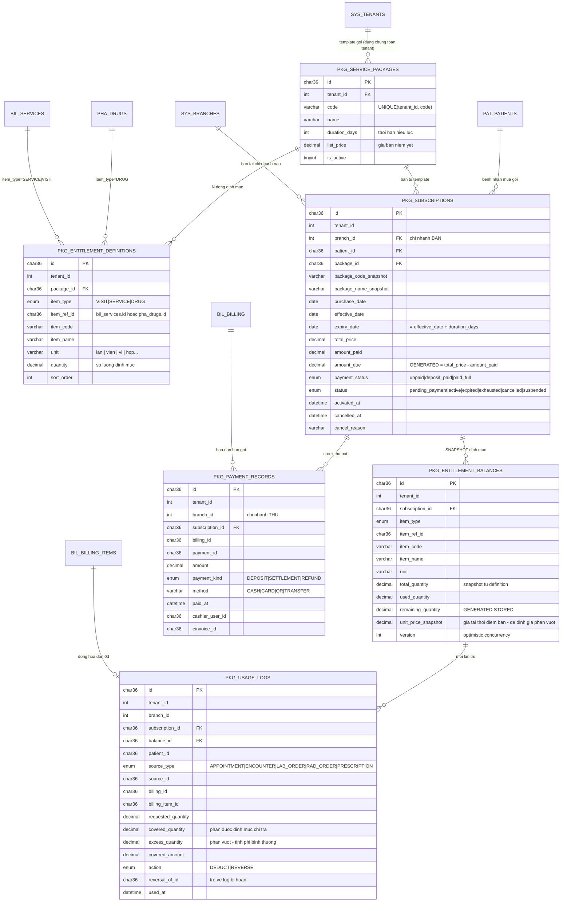
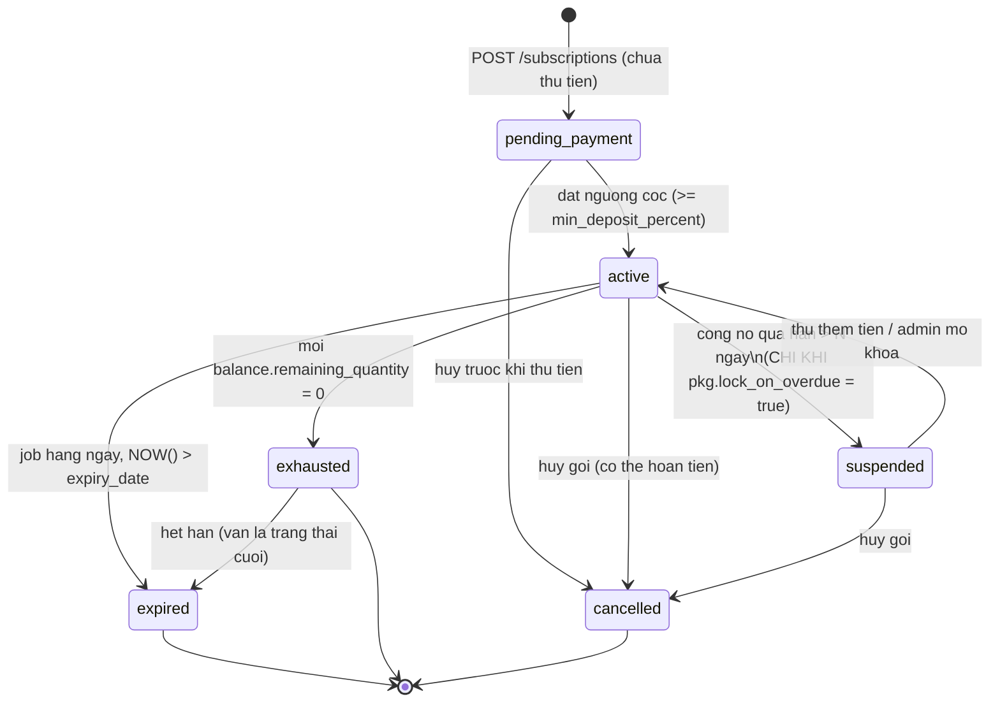
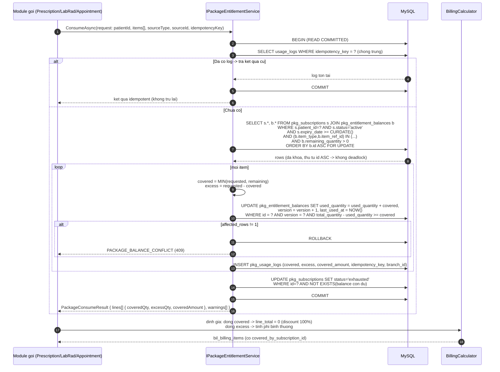

# ERD + Thiết kế — Gói dịch vụ & Theo dõi định mức (FR-1201 … FR-1206)

- **Phiên bản**: 1.0
- **Ngày**: 2026-08-26
- **Tác giả**: Lành (architect)
- **Nguồn yêu cầu**: SRS mục 4.11 — Nhóm FR-12xx
- **Trạng thái**: Draft — chờ PO (Đăng) xác nhận mục 11 (Câu hỏi nghiệp vụ) trước khi backend/frontend triển khai
- **Convention**: `CLAUDE.md` mục 3 + 6; tương thích thiết kế `docs/erd/branch-multi-chi-nhanh.md`

---

## 0. Tóm tắt điều hành

| # | Quyết định | Nội dung |
|---|---|---|
| **D1** | **KHÔNG tái sử dụng** `diab_his_bil_service_packages` | Bảng hiện có là **"gói giá / bundle giảm giá"** (`discount_percent`, `valid_from/to`, items = danh sách service để tính giá 1 lần). Bản chất FR-12xx là **gói trả trước có định mức tiêu dùng theo thời gian** → tạo **nhóm bảng mới `diab_his_pkg_*`**. Hai khái niệm cùng tồn tại, không đụng nhau. |
| **D2** | Prefix bảng mới = `diab_his_pkg_*` | Không dùng `bil_*` để tránh nhầm với `bil_service_packages`. Nghiệp vụ đủ lớn (6 entity) để tách nhóm riêng. |
| **D3** | Entitlement định danh **cụ thể** (Option B của SRS) | 3 loại: `VISIT` (lượt khám) / `SERVICE` (XN-CĐHA cụ thể) / `DRUG` (thuốc cụ thể). Cột `item_type` + `item_ref_id` + snapshot `item_code`/`item_name`. **Cấm** loại "giá trị VNĐ" — enforce bằng `CHECK` + validation. **Cấm dùng chéo định mức**. |
| **D4** | `branch_id` chỉ đặt ở 3 bảng | `pkg_subscriptions` (bán ở chi nhánh nào), `pkg_payment_records` (thu ở chi nhánh nào), `pkg_usage_logs` (tiêu dùng ở chi nhánh nào). `pkg_service_packages` + `pkg_entitlement_definitions` + `pkg_entitlement_balances` **KHÔNG** có `branch_id` — theo quyết định "bảng giá dùng chung toàn tenant" và "balance thuộc subscription, dùng được ở mọi chi nhánh". |
| **D5** | **Snapshot bắt buộc** khi bán | `pkg_entitlement_balances` copy toàn bộ `item_type/item_ref_id/item_code/item_name/unit/quantity/unit_price_snapshot` từ definition. Sửa gói template về sau **không** ảnh hưởng subscription đã bán. |
| **D6** | Chống race-condition bằng **pessimistic lock** | `SELECT ... FOR UPDATE` trên dòng `pkg_entitlement_balances` + **cột `version` optimistic làm lưới an toàn thứ hai** + `CHECK (used_quantity <= total_quantity)` ở tầng DB làm chốt chặn cuối. Chi tiết mục 6. |
| **D7** | Trừ định mức qua interface `IPackageEntitlementService` | Đặt ở `Application/Common/Interfaces` (không đặt trong module Packages) để Appointment / LabRad / Prescription **phụ thuộc vào abstraction**, không phụ thuộc ngược vào module Packages. |
| **D8** | Cọc tối thiểu 50% là **policy configurable**, không hardcode | Lưu ở `diab_his_sys_settings` (hoặc feature-flag `pkg.min_deposit_percent`, mặc định `50`). Tương tự `pkg.lock_on_overdue` (mặc định `false`), `pkg.expiry_remind_days` (`7`), `pkg.overdue_alert_days` (`30`). |
| **D9** | Còn nợ **KHÔNG chặn** dùng định mức | FR-1203. Service trả `warnings[]` chứa `PACKAGE_HAS_OUTSTANDING_DEBT` để FE hiển thị cảnh báo, **không** trả lỗi. |
| **D10** | FHIR R4 mapping | `ServicePackage` → `HealthcareService`; `PatientPackageSubscription` → `Coverage` (`type = pkg`, `beneficiary = Patient`); `PackageEntitlementBalance` → `Coverage.costToBeneficiary` / `InsurancePlan.coverage.benefit.limit`; `PackageUsageLog` → `ChargeItem` (`ChargeItem.priceOverride = 0`). |
| **D11** | Ghi định mức đã dùng vào hoá đơn | Hạng mục dùng định mức vẫn tạo `bil_billing_items` với `unit_price = giá gốc`, `discount_percent = 100`, `line_total = 0`, `item_type` giữ nguyên + cột mới `covered_by_subscription_id`. Không "ẩn dòng" → đảm bảo đối soát doanh thu và không xuất hoá đơn khống. |

---

## 1. Hiện trạng (as-is)

### 1.1 Convention đang dùng (đã kiểm chứng trong codebase)

| Thành phần | Hiện trạng |
|---|---|
| Write path | EF Core (`IApplicationDbContext`, `_db.ServicePackages.Add(...)`, `SaveChangesAsync`) — xem `ServiceCatalogHandlers.cs` |
| Read path | Dapper raw SQL trong cùng handler file (`ListServicePackagesHandler`) |
| Pattern | MediatR CQRS: `record XxxQuery/XxxCommand : IRequest<Result<T>>` + `class XxxHandler : IRequestHandler<...>` |
| Kết quả | `Result<T>.Success/Failure(code, message)`; controller map `ErrorCode` → HTTP status (xem `CashierController.cs`) |
| Entity | `BaseEntity` (Id `Guid`), `ITenantScoped` (`int TenantId`), `IBranchScoped` (`int? BranchId`) |
| PK bảng nghiệp vụ mới | `CHAR(36) NOT NULL DEFAULT (UUID())` |
| Audit | `created_at/created_by(CHAR36)/updated_at/updated_by/deleted_at` |
| Migration | `db/migrations/NNNN_*.sql`, helper `add_col_if_missing` / `add_index_if_missing` (`0000_helpers.sql`), `drop_index_if_exists` / `drop_fk_if_exists` (`9080_helpers_branch.sql`) |
| Số migration cao nhất | **9089** (`9089_create_sec_digital_signatures.sql`) → thiết kế này dùng **9090 → 9094** |

### 1.2 Bảng dễ nhầm — làm rõ ranh giới

`diab_his_bil_service_packages` (migration `0040`):

```
code, name, discount_percent, valid_from, valid_to, is_active
  └─ diab_his_bil_service_package_items (package_id, service_id, quantity)
```

→ Đây là **combo giảm giá tại quầy**: chọn gói → hệ thống bung ra N dịch vụ và giảm `discount_percent` **ngay trên hoá đơn đó**. Không có: bệnh nhân sở hữu, hạn dùng, số dư còn lại, công nợ, lịch sử tiêu dùng.

→ FR-12xx cần **tài sản trả trước của bệnh nhân**. Bản chất khác hoàn toàn ⇒ **D1**.

> **Trade-off đã cân nhắc** (ghi vào `docs/adr/0009-goi-dinh-muc-vs-goi-gia.md`)
> - **PA-A (chọn)**: Nhóm bảng mới `diab_his_pkg_*`. Ưu: mô hình sạch, không phá module Service Catalog đang chạy, không rủi ro regression thu ngân. Nhược: tồn tại 2 khái niệm "gói" trong UI → **bắt buộc** đặt nhãn tiếng Việt khác biệt: "Gói giá dịch vụ" vs **"Gói định mức trả trước"**.
> - **PA-B**: Mở rộng `bil_service_packages` thêm `package_kind = DISCOUNT|PREPAID`. Ưu: 1 bảng. Nhược: nửa số cột luôn NULL tuỳ kind, mọi handler hiện có phải thêm filter `kind`, dễ sót → bug ở luồng thu ngân đang production.

---

## 2. ERD tổng quan



---

## 3. Đặc tả bảng chi tiết

### 3.1 `diab_his_pkg_service_packages` — Template gói (FR-1201)

| Cột | Kiểu | Null | Mặc định | Mô tả |
|---|---|---|---|---|
| `id` | `CHAR(36)` | N | `(UUID())` | PK |
| `tenant_id` | `INT` | N | — | Tổ chức sở hữu |
| `code` | `VARCHAR(50)` | N | — | Mã gói, `UNIQUE(tenant_id, code)` |
| `name` | `VARCHAR(255)` | N | — | Tên gói, vd "Gói theo dõi ĐTĐ 6 tháng" |
| `description` | `TEXT` | Y | `NULL` | Mô tả bán hàng |
| `duration_days` | `INT` | N | `365` | Thời hạn hiệu lực (ngày). `CHECK > 0` |
| `list_price` | `DECIMAL(15,2)` | N | `0.00` | Giá bán niêm yết |
| `vat_rate` | `TINYINT` | N | `0` | 0/5/8/10 — đồng bộ `bil_services` |
| `min_deposit_percent` | `DECIMAL(5,2)` | Y | `NULL` | Override chính sách cọc riêng gói này. `NULL` → dùng setting toàn tenant. `CHECK BETWEEN 0 AND 100` |
| `is_active` | `TINYINT(1)` | N | `1` | Còn bán |
| `valid_from` / `valid_to` | `DATE` | Y | `NULL` | Cửa sổ **thời gian được phép bán** (khác `duration_days` là hạn dùng sau khi mua) |
| audit 6 cột | | | | `created_at/by`, `updated_at/by`, `deleted_at`, `deleted_by` |

**Index**: `PRIMARY(id)`, `UNIQUE uq_pkg_tenant_code (tenant_id, code)`, `idx_pkg_tenant_active (tenant_id, is_active, deleted_at)`.

**Business rules**
- `BR-1201-1`: Gói phải có **≥ 1** dòng entitlement mới cho `is_active = 1`.
- `BR-1201-2`: **Không** cho tạo entitlement kiểu "giá trị VNĐ" — `item_type` là `ENUM('VISIT','SERVICE','DRUG')`, không có giá trị nào khác. Nếu request gửi kiểu khác → `PACKAGE_ENTITLEMENT_TYPE_INVALID`.
- `BR-1201-3`: Gói **đã có subscription** thì không được sửa `duration_days` / entitlement definitions → chỉ cho `is_active = 0` và tạo phiên bản mới (`code` mới hoặc `-V2`). Trả `PACKAGE_IN_USE` nếu cố sửa. *(Snapshot ở D5 đã bảo vệ dữ liệu cũ, rule này để tránh nhầm lẫn vận hành.)*

**FHIR**: `HealthcareService` — `.identifier` = `code`, `.name` = `name`, `.active` = `is_active`, `.providedBy` = `Organization/{tenant}`.

---

### 3.2 `diab_his_pkg_entitlement_definitions` — Dòng định mức của template (FR-1201)

| Cột | Kiểu | Null | Mặc định | Mô tả |
|---|---|---|---|---|
| `id` | `CHAR(36)` | N | `(UUID())` | PK |
| `tenant_id` | `INT` | N | — | Denormalize để filter |
| `package_id` | `CHAR(36)` | N | — | FK → `pkg_service_packages.id` `ON DELETE CASCADE` |
| `item_type` | `ENUM('VISIT','SERVICE','DRUG')` | N | — | **Bắt buộc 1 trong 3** |
| `item_ref_id` | `CHAR(36)` | N | — | `VISIT`/`SERVICE` → `bil_services.id`; `DRUG` → `pha_drugs.id` |
| `item_code` | `VARCHAR(50)` | N | — | Snapshot mã (hiển thị nhanh, không cần join) |
| `item_name` | `VARCHAR(255)` | N | — | Snapshot tên |
| `unit` | `VARCHAR(30)` | N | `'lần'` | `VISIT`/`SERVICE` → `lần`; `DRUG` → đơn vị tính của thuốc (`viên`, `vỉ`, `hộp`) |
| `quantity` | `DECIMAL(12,3)` | N | `1.000` | Số lượng định mức. `CHECK > 0` |
| `sort_order` | `INT` | N | `0` | Thứ tự hiển thị |
| audit | | | | như trên |

**Index**: `PRIMARY(id)`, `idx_ped_package (package_id, sort_order)`, `UNIQUE uq_ped_pkg_item (package_id, item_type, item_ref_id)`, `idx_ped_tenant_ref (tenant_id, item_type, item_ref_id)`.

> `UNIQUE uq_ped_pkg_item` ngăn 1 gói có 2 dòng cùng thuốc → tránh mơ hồ khi trừ định mức (biết trừ dòng nào?). Nếu nghiệp vụ muốn "2 gói con khác nhau cùng 1 thuốc" → phải gộp thành 1 dòng với `quantity` cộng dồn. **→ Câu hỏi Q3.**

**Không** dùng FK cứng tới `pha_drugs` / `bil_services` (`item_ref_id` đa hình). Kiểm tra tồn tại ở tầng service; ghi snapshot code/name để dữ liệu không "mồ côi" khi danh mục bị xoá mềm.

---

### 3.3 `diab_his_pkg_subscriptions` — Bệnh nhân sở hữu gói (FR-1202)

| Cột | Kiểu | Null | Mặc định | Mô tả |
|---|---|---|---|---|
| `id` | `CHAR(36)` | N | `(UUID())` | PK |
| `tenant_id` | `INT` | N | — | |
| `branch_id` | `INT` | Y | `NULL` | **Chi nhánh BÁN** — phục vụ báo cáo doanh thu theo chi nhánh. Nullable giai đoạn migrate (theo D8 thiết kế branch) |
| `patient_id` | `CHAR(36)` | N | — | FK → `diab_his_pat_patients.id` |
| `package_id` | `CHAR(36)` | N | — | FK → `pkg_service_packages.id` (`ON DELETE RESTRICT`) |
| `subscription_no` | `VARCHAR(30)` | N | — | Mã hợp đồng gói, `UNIQUE(tenant_id, subscription_no)`. Sinh qua `diab_his_bil_counters` theo `(tenant, branch)` |
| `package_code_snapshot` | `VARCHAR(50)` | N | — | Snapshot |
| `package_name_snapshot` | `VARCHAR(255)` | N | — | Snapshot |
| `purchase_date` | `DATE` | N | — | Ngày mua |
| `effective_date` | `DATE` | N | — | = `purchase_date` (mặc định). Tách cột để hỗ trợ bán trước — kích hoạt sau |
| `expiry_date` | `DATE` | N | — | = `effective_date + duration_days` (tính ở service, **không** dùng GENERATED vì `duration_days` nằm bảng khác) |
| `duration_days_snapshot` | `INT` | N | — | Snapshot để audit lại công thức |
| `total_price` | `DECIMAL(15,2)` | N | — | Giá chốt (có thể thương lượng ≠ `list_price`) |
| `amount_paid` | `DECIMAL(15,2)` | N | `0.00` | Cộng dồn từ `pkg_payment_records` |
| `amount_due` | `DECIMAL(15,2)` | — | **GENERATED STORED** `total_price - amount_paid` | Số tiền còn nợ |
| `payment_status` | `ENUM('unpaid','deposit_paid','paid_full','refunded')` | N | `'unpaid'` | |
| `status` | `ENUM('pending_payment','active','suspended','expired','exhausted','cancelled')` | N | `'pending_payment'` | State machine mục 5 |
| `activated_at` | `DATETIME(3)` | Y | `NULL` | Thời điểm đạt ngưỡng cọc |
| `suspended_at` / `suspend_reason` | `DATETIME(3)` / `VARCHAR(255)` | Y | `NULL` | Khoá do quá hạn công nợ (nếu bật policy) |
| `cancelled_at` / `cancel_reason` | `DATETIME(3)` / `VARCHAR(255)` | Y | `NULL` | Huỷ gói |
| `refunded_amount` | `DECIMAL(15,2)` | N | `0.00` | Hoàn tiền khi huỷ |
| `expiry_reminded_at` | `DATETIME(3)` | Y | `NULL` | Chống gửi nhắc trùng (FR-1206) |
| `overdue_alerted_at` | `DATETIME(3)` | Y | `NULL` | Chống gửi cảnh báo công nợ trùng |
| `note` | `TEXT` | Y | `NULL` | Ghi chú thương lượng — **cột nhạy cảm cấp thấp, KHÔNG mã hoá** (không chứa thông tin y tế) |
| audit | | | | như trên |

**Index**
- `PRIMARY(id)`
- `UNIQUE uq_sub_tenant_no (tenant_id, subscription_no)`
- `idx_sub_patient_active (tenant_id, patient_id, status, expiry_date)` — **index nóng nhất**: FR-1204/1205 tra "gói active của bệnh nhân X"
- `idx_sub_tenant_branch (tenant_id, branch_id)` — báo cáo doanh thu theo chi nhánh
- `idx_sub_expiry (tenant_id, status, expiry_date)` — job nhắc hết hạn
- `idx_sub_debt (tenant_id, payment_status, amount_due)` — job cảnh báo công nợ
- `idx_sub_package (tenant_id, package_id)` — kiểm tra `PACKAGE_IN_USE`

**FHIR**: `Coverage` — `.beneficiary` = `Patient/{patient_id}`, `.type.coding` = `{system: urn:prodiab:coverage-type, code: PREPAID_PACKAGE}`, `.period.start/end` = `effective_date`/`expiry_date`, `.status` = `active|cancelled`.

---

### 3.4 `diab_his_pkg_entitlement_balances` — Số dư định mức (FR-1202, FR-1204, FR-1205)

| Cột | Kiểu | Null | Mặc định | Mô tả |
|---|---|---|---|---|
| `id` | `CHAR(36)` | N | `(UUID())` | PK |
| `tenant_id` | `INT` | N | — | |
| `subscription_id` | `CHAR(36)` | N | — | FK → `pkg_subscriptions.id` `ON DELETE CASCADE` |
| `definition_id` | `CHAR(36)` | Y | `NULL` | Truy vết về definition gốc (nullable — definition có thể bị xoá) |
| `item_type` | `ENUM('VISIT','SERVICE','DRUG')` | N | — | Snapshot |
| `item_ref_id` | `CHAR(36)` | N | — | Snapshot |
| `item_code` | `VARCHAR(50)` | N | — | Snapshot |
| `item_name` | `VARCHAR(255)` | N | — | Snapshot |
| `unit` | `VARCHAR(30)` | N | `'lần'` | Snapshot |
| `total_quantity` | `DECIMAL(12,3)` | N | — | Snapshot từ `definition.quantity` |
| `used_quantity` | `DECIMAL(12,3)` | N | `0.000` | Đã dùng |
| `remaining_quantity` | `DECIMAL(12,3)` | — | **GENERATED STORED** `total_quantity - used_quantity` | Số dư |
| `unit_price_snapshot` | `DECIMAL(15,2)` | N | `0.00` | Đơn giá tại thời điểm bán — dùng tính `covered_amount` và định giá phần vượt |
| `version` | `INT` | N | `0` | **Optimistic concurrency token** |
| `last_used_at` | `DATETIME(3)` | Y | `NULL` | Hiển thị nhanh |
| `low_alerted_at` | `DATETIME(3)` | Y | `NULL` | Chống cảnh báo "sắp hết định mức" trùng |
| audit | | | | như trên |

**Constraint & Index**
- `CHECK chk_balance_nonneg (used_quantity >= 0 AND used_quantity <= total_quantity)` — **chốt chặn cuối chống âm định mức**. MySQL 8.0.16+ enforce `CHECK` thật sự.
- `UNIQUE uq_bal_sub_item (subscription_id, item_type, item_ref_id)` — 1 subscription chỉ 1 dòng cho mỗi hạng mục ⇒ luồng trừ định mức xác định, không mơ hồ.
- `idx_bal_lookup (tenant_id, item_type, item_ref_id, remaining_quantity)` — truy vấn "bệnh nhân có định mức cho thuốc X không".
- `idx_bal_sub (subscription_id)`.

> `remaining_quantity` là **GENERATED STORED** để index được và để mọi report không tự tính sai. Không được UPDATE trực tiếp cột này.

**FHIR**: `Coverage.costToBeneficiary` với `type = copaypct`, hoặc chi tiết hơn `InsurancePlan.coverage.benefit.limit[].value` = `total_quantity`.

---

### 3.5 `diab_his_pkg_usage_logs` — Nhật ký trừ định mức (FR-1204)

| Cột | Kiểu | Null | Mặc định | Mô tả |
|---|---|---|---|---|
| `id` | `CHAR(36)` | N | `(UUID())` | PK |
| `tenant_id` | `INT` | N | — | |
| `branch_id` | `INT` | Y | `NULL` | Chi nhánh **tiêu dùng** (có thể khác chi nhánh bán) |
| `subscription_id` | `CHAR(36)` | N | — | FK `ON DELETE RESTRICT` — **không được xoá lịch sử** |
| `balance_id` | `CHAR(36)` | N | — | FK → `pkg_entitlement_balances.id` |
| `patient_id` | `CHAR(36)` | N | — | Denormalize để report nhanh |
| `source_type` | `ENUM('APPOINTMENT','ENCOUNTER','LAB_ORDER','RAD_ORDER','PRESCRIPTION')` | N | — | 1 trong 3 điểm trừ (5 giá trị vì CLS tách LAB/RAD, check-in tách APPOINTMENT/ENCOUNTER) |
| `source_id` | `CHAR(36)` | N | — | ID bản ghi nguồn |
| `source_item_id` | `CHAR(36)` | Y | `NULL` | ID dòng chi tiết (vd `pha_prescription_items.id`) |
| `billing_id` | `CHAR(36)` | Y | `NULL` | Hoá đơn liên quan |
| `billing_item_id` | `CHAR(36)` | Y | `NULL` | Dòng hoá đơn 0đ tương ứng |
| `requested_quantity` | `DECIMAL(12,3)` | N | — | Số lượng yêu cầu |
| `covered_quantity` | `DECIMAL(12,3)` | N | — | Phần định mức chi trả |
| `excess_quantity` | `DECIMAL(12,3)` | N | `0.000` | Phần vượt → tính phí bình thường |
| `covered_amount` | `DECIMAL(15,2)` | N | `0.00` | `covered_quantity * unit_price_snapshot` — giá trị định mức đã tiêu |
| `action` | `ENUM('DEDUCT','REVERSE')` | N | `'DEDUCT'` | |
| `reversal_of_id` | `CHAR(36)` | Y | `NULL` | Nếu `action='REVERSE'` → trỏ về log gốc |
| `idempotency_key` | `VARCHAR(120)` | N | — | `{source_type}:{source_item_id ?? source_id}:{balance_id}` — **chống trừ 2 lần** |
| `used_at` | `DATETIME(3)` | N | `CURRENT_TIMESTAMP(3)` | |
| `performed_by` | `CHAR(36)` | Y | `NULL` | User thực hiện |
| audit (rút gọn) | | | | `created_at`, `created_by` — **KHÔNG soft delete**: log tài chính bất biến |

**Index**
- `PRIMARY(id)`
- `UNIQUE uq_usage_idem (tenant_id, idempotency_key, action)` — **quan trọng nhất**: retry của Appointment/Prescription không trừ trùng.
- `idx_usage_balance (balance_id, used_at)`
- `idx_usage_source (tenant_id, source_type, source_id)` — hoàn định mức khi huỷ chỉ định/đơn.
- `idx_usage_patient (tenant_id, patient_id, used_at)`
- `idx_usage_branch (tenant_id, branch_id, used_at)` — báo cáo tiêu dùng theo chi nhánh.

**FHIR**: `ChargeItem` — `.subject` = Patient, `.context` = Encounter, `.quantity` = `covered_quantity`, `.priceOverride` = 0, `.reason` = subscription.

---

### 3.6 `diab_his_pkg_payment_records` — Lịch sử thu tiền gói (FR-1202, FR-1203)

| Cột | Kiểu | Null | Mặc định | Mô tả |
|---|---|---|---|---|
| `id` | `CHAR(36)` | N | `(UUID())` | PK |
| `tenant_id` | `INT` | N | — | |
| `branch_id` | `INT` | Y | `NULL` | Chi nhánh **THU** |
| `subscription_id` | `CHAR(36)` | N | — | FK `ON DELETE RESTRICT` |
| `billing_id` | `CHAR(36)` | Y | `NULL` | FK → `diab_his_bil_billing.id` (hoá đơn phát hành cho lần thu này) |
| `payment_id` | `CHAR(36)` | Y | `NULL` | FK → `diab_his_bil_payments.id` (bản ghi thanh toán gốc) |
| `payment_kind` | `ENUM('DEPOSIT','SETTLEMENT','REFUND')` | N | — | Cọc / thu nốt / hoàn |
| `amount` | `DECIMAL(15,2)` | N | — | **Dương** với DEPOSIT/SETTLEMENT, **âm** với REFUND |
| `method` | `VARCHAR(20)` | N | `'CASH'` | `CASH\|CARD\|QR\|TRANSFER` — đồng bộ `bil_payments` |
| `paid_at` | `DATETIME(3)` | N | `CURRENT_TIMESTAMP(3)` | |
| `cashier_user_id` | `CHAR(36)` | Y | `NULL` | Thu ngân |
| `cashier_shift_id` | `CHAR(36)` | Y | `NULL` | FK → `bil_cashier_shifts.id` — vào báo cáo chốt ca |
| `einvoice_id` | `CHAR(36)` | Y | `NULL` | HĐĐT — **xuất đúng số tiền đã thu** (FR-1202) |
| `note` | `VARCHAR(500)` | Y | `NULL` | |
| audit (rút gọn) | | | | `created_at`, `created_by` — **KHÔNG soft delete**; sai thì tạo dòng `REFUND` đối ứng |

**Index**: `PRIMARY(id)`, `idx_pay_sub (subscription_id, paid_at)`, `idx_pay_tenant_branch_date (tenant_id, branch_id, paid_at)`, `idx_pay_shift (cashier_shift_id)`, `idx_pay_billing (billing_id)`.

---

## 4. Sửa đổi bảng hiện có

| Bảng | Thay đổi | Lý do |
|---|---|---|
| `diab_his_bil_billing_items` | **+ `covered_by_subscription_id CHAR(36) NULL`** <br> **+ `covered_by_usage_log_id CHAR(36) NULL`** <br> + index `idx_bi_covered (covered_by_subscription_id)` | D11 — đánh dấu dòng hoá đơn được gói chi trả, phục vụ đối soát doanh thu "doanh thu thực thu" vs "doanh thu tiêu định mức". |
| `diab_his_bil_billing` | **+ `package_subscription_id CHAR(36) NULL`** | Đánh dấu hoá đơn **bán gói** (khác hoá đơn khám thường) để báo cáo doanh thu trả trước tách bạch. |
| `diab_his_sys_settings` *(hoặc `sys_feature_flags` nếu chưa có bảng settings)* | Seed 4 khoá cấu hình: `pkg.min_deposit_percent=50`, `pkg.lock_on_overdue=false`, `pkg.expiry_remind_days=7`, `pkg.overdue_alert_days=30` | D8 — SRS yêu cầu **configurable, không hardcode**. |
| `diab_his_sec_permissions` | Seed 8 quyền (mục 8.1) | RBAC |

> **Không** đụng `diab_his_bil_service_packages` / `bil_service_package_items` — giữ nguyên 100%.

---

## 5. State machine

### 5.1 `PatientPackageSubscription.status`



| Trạng thái | Dùng được định mức? | Ghi chú |
|---|---|---|
| `pending_payment` | **KHÔNG** | Chưa đạt cọc |
| `active` | **CÓ** | Trạng thái vận hành chính |
| `suspended` | **KHÔNG** | Chỉ xảy ra khi bật policy `pkg.lock_on_overdue`. Mặc định `false` ⇒ **FR-1203: còn nợ vẫn dùng được**. |
| `expired` | KHÔNG | Hết hạn ngày |
| `exhausted` | KHÔNG | Hết định mức nhưng chưa hết hạn — **tách riêng khỏi `expired`** để UI báo đúng lý do và gợi ý mua thêm |
| `cancelled` | KHÔNG | Trạng thái cuối |

**Quy tắc chuyển trạng thái**
- `RULE-S1`: `pending_payment → active` chỉ khi `amount_paid >= total_price * min_deposit_percent / 100`. Set `activated_at = NOW()`. **Entitlement kích hoạt ngay** (FR-1202).
- `RULE-S2`: Lần thu thứ 2 trở đi **không** áp lại điều kiện 50% (FR-1203). Chỉ validate `amount > 0 AND amount <= amount_due` (trừ `REFUND`).
- `RULE-S3`: `exhausted` **tự động** set trong cùng transaction trừ định mức, khi `SUM(remaining_quantity) = 0`.
- `RULE-S4`: `expired` do **background job hằng ngày** (`PackageExpiryJob`, 00:15 giờ VN) set, **và** kiểm tra lại lazy tại thời điểm trừ định mức (`expiry_date < today` → coi như expired, trả `PACKAGE_SUBSCRIPTION_EXPIRED`). Không tin cậy hoàn toàn vào job.
- `RULE-S5`: `cancelled` yêu cầu quyền `package.cancel` + lý do bắt buộc. Nếu đã tiêu định mức → chính sách hoàn tiền = `amount_paid - SUM(usage_logs.covered_amount)`, tối thiểu 0. **→ Câu hỏi Q5.**

### 5.2 `payment_status` (độc lập với `status`)

```
unpaid  ──(thu lan 1, chua du 100%)──> deposit_paid ──(amount_due = 0)──> paid_full
unpaid  ──(thu du 100% ngay)────────────────────────────────────────────> paid_full
paid_full / deposit_paid ──(REFUND toan bo)──> refunded
```

- `payment_status` được **tính lại** sau mỗi `pkg_payment_records` insert, trong cùng transaction.
- Bất biến: `amount_paid = SUM(pkg_payment_records.amount)` (REFUND âm). Có job đối soát hằng đêm phát hiện lệch → alert.

---

## 6. Luồng nghiệp vụ FR-1204 — Trừ định mức & chống race condition

### 6.1 Vấn đề

Hai giao dịch đồng thời cùng trừ 1 dòng `pkg_entitlement_balances` (vd: lễ tân check-in trong khi bác sĩ kê đơn; hoặc user double-click). Nếu đọc-rồi-ghi (read-modify-write) không khoá → **lost update** → `used_quantity` sai, gói bị dùng vượt định mức, thất thoát doanh thu.

### 6.2 Giải pháp — 4 lớp phòng thủ

| Lớp | Cơ chế | Chống được gì |
|---|---|---|
| **L1** | `SELECT ... FOR UPDATE` (pessimistic row lock) trong transaction `READ COMMITTED` | Lost update giữa 2 transaction song song — **lớp chính** |
| **L2** | UPDATE có điều kiện: `UPDATE ... SET used_quantity = used_quantity + @q, version = version + 1 WHERE id = @id AND version = @v AND total_quantity - used_quantity >= @q` — kiểm tra `affected_rows = 1` | Lưới an toàn nếu ai đó quên `FOR UPDATE`; phát hiện xung đột → `PACKAGE_BALANCE_CONFLICT` (client retry) |
| **L3** | `CHECK chk_balance_nonneg (used_quantity <= total_quantity)` | Chốt chặn cuối ở tầng DB — mọi đường đi sai đều bị DB từ chối |
| **L4** | `UNIQUE uq_usage_idem (tenant_id, idempotency_key, action)` | Retry / double-click / message replay trừ 2 lần |

> **Vì sao pessimistic (L1) chứ không thuần optimistic**: trừ định mức nằm **trong** transaction lớn hơn (tạo hoá đơn + tạo chỉ định). Nếu để optimistic-retry, phải rollback và làm lại toàn bộ transaction lớn → phức tạp và tốn kém. Row lock trên `pkg_entitlement_balances` có phạm vi rất hẹp (1 bệnh nhân, 1 hạng mục), thời gian giữ lock ~ vài ms, thực tế gần như không tranh chấp. `version` giữ lại **chỉ để phát hiện lỗi lập trình**, không để retry.

### 6.3 Thứ tự khoá — chống deadlock

Khi 1 request trừ **nhiều** dòng balance (vd đơn thuốc 5 loại), **bắt buộc** khoá theo thứ tự **`ORDER BY balance.id ASC`** (khoá cả lô trong 1 câu `SELECT ... FOR UPDATE` với `IN (...) ORDER BY id`). Nếu mỗi dòng khoá theo thứ tự tuỳ ý → 2 request khác thứ tự sẽ deadlock.

### 6.4 Chọn subscription khi bệnh nhân có nhiều gói

Quy tắc **FIFO theo hạn dùng**: trong các subscription `status='active'` của bệnh nhân có balance khớp `(item_type, item_ref_id)` và `remaining_quantity > 0`, chọn theo `ORDER BY expiry_date ASC, purchase_date ASC` → **tiêu gói sắp hết hạn trước**. Nếu 1 gói không đủ → tràn sang gói kế tiếp (tạo nhiều `usage_log`). **→ Câu hỏi Q4.**

### 6.5 Sequence diagram



### 6.6 Hoàn định mức (reverse)

Khi huỷ chỉ định CLS / huỷ đơn thuốc / huỷ check-in / void hoá đơn:
- Gọi `ReverseAsync(sourceType, sourceId, reason)`.
- Tìm mọi `usage_logs` `action='DEDUCT'` của source đó **chưa** có bản ghi REVERSE.
- Cùng transaction: `FOR UPDATE` balance → `used_quantity -= covered_quantity` → INSERT log `action='REVERSE'`, `reversal_of_id`.
- Nếu subscription đang `exhausted` → chuyển lại `active` (nếu `expiry_date` còn hạn).
- **Chỉ hoàn khi hoá đơn liên quan chưa `PAID`/đã VOID** — nếu đã thanh toán và đã cấp phát thuốc thì **không** hoàn (thuốc đã ra khỏi kho). **→ Câu hỏi Q6.**

### 6.7 Điểm gọi cụ thể

| # | Điểm | Module gọi | `source_type` | Trừ gì |
|---|---|---|---|---|
| 1 | Check-in / xác nhận lịch hẹn | `Appointments` (`CheckInAppointmentHandler`) | `APPOINTMENT` | 1 `VISIT` — `item_ref_id` = service khám tương ứng |
| 2 | Tạo chỉ định CLS | `LabRad` (`CreateLabOrderHandler`, `CreateRadOrderHandler`) | `LAB_ORDER` / `RAD_ORDER` | `SERVICE` đúng loại XN/CĐHA, mỗi loại 1 lần |
| 3 | Lưu đơn thuốc | `Prescriptions` (`CreatePrescriptionHandler`) | `PRESCRIPTION` | `DRUG` đúng thuốc, theo `quantity` |

> **Thời điểm trừ với đơn thuốc**: trừ tại lúc **lưu đơn** hay lúc **cấp phát**? Thiết kế chọn **lưu đơn** (theo nguyên văn FR-1204 "kê đơn thuốc"), kèm `ReverseAsync` khi huỷ đơn. **→ Câu hỏi Q2.**

---

## 7. API Contract

Spec đầy đủ: `docs/api/package-entitlement.yaml` (OpenAPI 3.1) — dưới đây là bản tóm tắt.

### 7.1 Quản trị template gói — `PackagesController` (`/api/v1/packages`)

| Method | Path | Permission | Mô tả |
|---|---|---|---|
| GET | `/api/v1/packages` | `package.read` | Danh sách gói. Query: `q`, `is_active`, `page`, `page_size` |
| GET | `/api/v1/packages/{id}` | `package.read` | Chi tiết + danh sách entitlement definitions |
| POST | `/api/v1/packages` | `package.create` | Tạo gói + definitions (transaction) |
| PUT | `/api/v1/packages/{id}` | `package.update` | Sửa. `409 PACKAGE_IN_USE` nếu đã có subscription và sửa `duration_days`/definitions |
| DELETE | `/api/v1/packages/{id}` | `package.delete` | Soft delete. `409 PACKAGE_IN_USE` nếu còn subscription active |

**`POST /api/v1/packages` — Request**
```jsonc
{
  "code": "GOI-DTD-6M",
  "name": "Gói theo dõi Đái tháo đường 6 tháng",
  "description": "...",
  "duration_days": 180,
  "list_price": 4500000,
  "vat_rate": 0,
  "min_deposit_percent": 50,          // null => dùng setting tenant
  "valid_from": "2026-09-01",
  "valid_to": null,
  "is_active": true,
  "entitlements": [
    { "item_type": "VISIT",   "item_ref_id": "…uuid bil_services…", "quantity": 6,   "unit": "lần" },
    { "item_type": "SERVICE", "item_ref_id": "…uuid bil_services…", "quantity": 3,   "unit": "lần" },
    { "item_type": "DRUG",    "item_ref_id": "…uuid pha_drugs…",    "quantity": 180, "unit": "viên" }
  ]
}
```
**Response `201`**: `{ "data": { …package…, "entitlements": [ … ], "estimated_value": 5100000 } }`

**Lỗi**
| Code | HTTP | Điều kiện |
|---|---|---|
| `PACKAGE_CODE_DUPLICATE` | 409 | Trùng `(tenant_id, code)` |
| `PACKAGE_ENTITLEMENT_REQUIRED` | 400 | `entitlements` rỗng khi `is_active = true` |
| `PACKAGE_ENTITLEMENT_TYPE_INVALID` | 400 | `item_type` ngoài 3 giá trị (chặn kiểu "giá trị VNĐ") |
| `PACKAGE_ENTITLEMENT_DUPLICATE_ITEM` | 400 | 2 dòng trùng `(item_type, item_ref_id)` |
| `PACKAGE_ITEM_NOT_FOUND` | 400 | `item_ref_id` không tồn tại / đã xoá |
| `PACKAGE_DURATION_INVALID` | 400 | `duration_days <= 0` |
| `PACKAGE_IN_USE` | 409 | Sửa/xoá gói đã bán |

---

### 7.2 Bán gói & thanh toán — `PackageSubscriptionsController` (`/api/v1/package-subscriptions`)

| Method | Path | Permission | Mô tả |
|---|---|---|---|
| GET | `/api/v1/package-subscriptions` | `package_subscription.read` | Query: `patient_id`, `status`, `payment_status`, `has_debt`, `expiring_within_days`, `branch_id`, `page` |
| GET | `/api/v1/package-subscriptions/{id}` | `package_subscription.read` | Chi tiết + balances + payments + usage gần đây |
| GET | `/api/v1/patients/{patientId}/package-summary` | `package_subscription.read` | **FR-1205** — panel hiển thị ở hồ sơ BN + tiếp đón |
| POST | `/api/v1/package-subscriptions` | `package_subscription.sell` | **FR-1202** — bán gói + thu tiền lần đầu |
| POST | `/api/v1/package-subscriptions/{id}/payments` | `package_subscription.collect` | **FR-1203** — thu nốt |
| POST | `/api/v1/package-subscriptions/{id}/cancel` | `package_subscription.cancel` | Huỷ gói |
| POST | `/api/v1/package-subscriptions/{id}/extend` | `package_subscription.update` | Gia hạn `expiry_date` (ghi audit, lý do bắt buộc) |
| GET | `/api/v1/package-subscriptions/{id}/usage-logs` | `package_subscription.read` | Nhật ký tiêu dùng, phân trang |

**`POST /api/v1/package-subscriptions` — Request**
```jsonc
{
  "patient_id": "…uuid…",
  "package_id": "…uuid…",
  "total_price": 4500000,          // cho phép thương lượng khác list_price
  "effective_date": "2026-08-26",  // null => hôm nay
  "note": "KH giới thiệu",
  "initial_payment": {
    "amount": 2250000,
    "method": "QR",
    "issue_einvoice": true         // xuất HĐĐT đúng 2.250.000, KHÔNG xuất khống 4.500.000
  }
}
```
> `branch_id` **không** nhận từ body — lấy từ `IBranchProvider` (nguyên tắc mục 5.5 thiết kế branch).

**Response `201`**
```jsonc
{
  "data": {
    "id": "…", "subscription_no": "GOI-2026-000123",
    "patient": { "id": "…", "code": "BN000123", "full_name": "Nguyễn Văn A" },
    "package_name_snapshot": "Gói theo dõi ĐTĐ 6 tháng",
    "purchase_date": "2026-08-26", "effective_date": "2026-08-26", "expiry_date": "2027-02-22",
    "total_price": 4500000, "amount_paid": 2250000, "amount_due": 2250000,
    "deposit_percent_paid": 50.00,
    "payment_status": "deposit_paid", "status": "active", "activated_at": "2026-08-26T09:12:03.221Z",
    "balances": [
      { "id": "…", "item_type": "VISIT", "item_code": "KHAM01", "item_name": "Khám nội tiết",
        "unit": "lần", "total_quantity": 6, "used_quantity": 0, "remaining_quantity": 6 }
    ],
    "billing_id": "…", "einvoice_id": "…"
  }
}
```

**Lỗi**
| Code | HTTP | Điều kiện |
|---|---|---|
| `PACKAGE_DEPOSIT_BELOW_MINIMUM` | 422 | `amount < total_price * min_deposit_percent / 100`. `details: { required_min: 2250000, provided: 1000000, min_percent: 50 }` |
| `PACKAGE_PAYMENT_EXCEEDS_TOTAL` | 422 | `amount > total_price` |
| `PACKAGE_NOT_SELLABLE` | 422 | `is_active = 0` hoặc ngoài `valid_from/valid_to` |
| `PACKAGE_NOT_FOUND` / `PATIENT_NOT_FOUND` | 404 | |
| `CASHIER_SHIFT_NOT_OPEN` | 409 | Chưa mở ca thu ngân (đồng bộ luồng thu ngân hiện hữu) |

**`POST /{id}/payments` — Request**
```jsonc
{ "amount": 2250000, "method": "CASH", "issue_einvoice": true, "note": "Thu nốt" }
```
- **KHÔNG** kiểm tra ngưỡng 50% (FR-1203). Chỉ chặn `amount <= 0` (`PACKAGE_PAYMENT_INVALID_AMOUNT`) và `amount > amount_due` (`PACKAGE_PAYMENT_EXCEEDS_DUE`).
- Response trả `amount_paid`, `amount_due` mới và `payment_status` cập nhật.

**`GET /api/v1/patients/{patientId}/package-summary` — Response (FR-1205)**
```jsonc
{
  "data": {
    "total_outstanding_debt": 2250000,          // hiển thị NỔI BẬT
    "has_expiring_soon": true,
    "subscriptions": [{
      "id": "…", "subscription_no": "GOI-2026-000123",
      "package_name": "Gói theo dõi ĐTĐ 6 tháng",
      "status": "active", "payment_status": "deposit_paid",
      "expiry_date": "2027-02-22", "days_to_expiry": 180,
      "amount_due": 2250000,
      "balances": [
        { "item_type": "VISIT", "item_name": "Khám nội tiết", "unit": "lần",
          "remaining_quantity": 4, "total_quantity": 6, "display": "còn 4/6", "is_low": false },
        { "item_type": "DRUG",  "item_name": "Metformin 500mg", "unit": "viên",
          "remaining_quantity": 20, "total_quantity": 180, "display": "còn 20/180", "is_low": true }
      ]
    }]
  }
}
```

---

### 7.3 Interface nội bộ `IPackageEntitlementService` (FR-1204)

**Vị trí**: `ProDiabHis.Application/Common/Interfaces/IPackageEntitlementService.cs`
**Triển khai**: `ProDiabHis.Application/Packages/Services/PackageEntitlementService.cs` (hoặc Infrastructure nếu cần `IDbConnection` trực tiếp cho `FOR UPDATE`).

> **Nguyên tắc chống phụ thuộc ngược**: interface + DTO nằm ở `Common/Interfaces`. Module `Appointments`, `LabRad`, `Prescriptions` **chỉ** biết interface. Module `Packages` không được reference ngược 3 module kia.

```
IPackageEntitlementService
    // Chi kiem tra, KHONG tru - dung cho preview gia truoc khi luu
    Task<PackageCoverageQuote> QuoteAsync(PackageCoverageRequest req, CancellationToken ct)

    // Tru dinh muc - PHAI goi trong transaction cua caller
    Task<Result<PackageConsumeResult>> ConsumeAsync(PackageConsumeRequest req, CancellationToken ct)

    // Hoan dinh muc khi huy chi dinh / huy don / void hoa don
    Task<Result<PackageReverseResult>> ReverseAsync(string sourceType, Guid sourceId, string reason, CancellationToken ct)

    // Panel FR-1205
    Task<Result<PatientPackageSummary>> GetPatientSummaryAsync(Guid patientId, CancellationToken ct)
```

**DTO**
```
PackageConsumeRequest
    Guid   PatientId
    string SourceType          // APPOINTMENT | ENCOUNTER | LAB_ORDER | RAD_ORDER | PRESCRIPTION
    Guid   SourceId
    Guid?  BillingId
    string IdempotencyKeyPrefix
    IReadOnlyList<PackageConsumeLine> Lines

PackageConsumeLine
    string  ItemType           // VISIT | SERVICE | DRUG
    Guid    ItemRefId
    decimal Quantity
    Guid?   SourceItemId       // vd pha_prescription_items.id

PackageConsumeResult
    IReadOnlyList<PackageConsumeLineResult> Lines
    IReadOnlyList<PackageWarning> Warnings     // vd PACKAGE_HAS_OUTSTANDING_DEBT, PACKAGE_BALANCE_LOW

PackageConsumeLineResult
    Guid    ItemRefId
    decimal RequestedQuantity
    decimal CoveredQuantity     // -> dong hoa don 0d
    decimal ExcessQuantity      // -> tinh phi binh thuong
    decimal CoveredAmount
    Guid?   SubscriptionId
    Guid?   UsageLogId
```

**Hợp đồng hành vi (bắt buộc tuân thủ)**
1. Không có gói phù hợp → **KHÔNG** phải lỗi. Trả `CoveredQuantity = 0`, `ExcessQuantity = Quantity` → caller tính phí bình thường.
2. Định mức không đủ → trừ đúng phần còn (`CoveredQuantity = remaining`), phần dư vào `ExcessQuantity` (FR-1204). **Không** dùng chéo sang hạng mục khác.
3. Còn nợ (`amount_due > 0`) → vẫn trừ, chỉ thêm `Warnings` (FR-1203, D9).
4. Idempotent theo `uq_usage_idem` — gọi lại cùng key trả kết quả cũ, không trừ thêm.
5. Ném/trả `PACKAGE_BALANCE_CONFLICT` (409) khi `affected_rows != 1` — caller rollback và cho user thử lại.

---

### 7.4 Background job (FR-1206)

| Job | Lịch | Nhiệm vụ |
|---|---|---|
| `PackageExpiryJob` | 00:15 hằng ngày | `active` + `expiry_date < CURDATE()` → `expired` |
| `PackageExpiryReminderJob` | 08:00 hằng ngày | `expiry_date` trong `pkg.expiry_remind_days` ngày tới và `expiry_reminded_at IS NULL` → tạo `nti_notifications` cho bệnh nhân (portal/SMS) + lễ tân; set `expiry_reminded_at` |
| `PackageLowBalanceJob` | 08:05 hằng ngày | Balance có `remaining_quantity <= MAX(1, total_quantity * 0.2)` và `low_alerted_at IS NULL` → thông báo; set `low_alerted_at` |
| `PackageOverdueDebtJob` | 08:10 hằng ngày | `amount_due > 0` và `DATEDIFF(NOW(), purchase_date) > pkg.overdue_alert_days` → cảnh báo **quản lý chi nhánh** (dựa `subscriptions.branch_id`); nếu `pkg.lock_on_overdue = true` → chuyển `suspended` |
| `PackageBalanceReconcileJob` | 02:00 hằng ngày | Đối soát `amount_paid` vs `SUM(payment_records.amount)` và `used_quantity` vs `SUM(usage_logs)` → alert nếu lệch |

Ngưỡng "sắp hết định mức" (20% / tối thiểu 1) đề xuất thành setting `pkg.low_balance_percent`. **→ Câu hỏi Q7.**

---

## 8. RBAC & Bảo mật

### 8.1 Permission mới

| `code` | `resource` | `action` | Mô tả |
|---|---|---|---|
| `package.read` | `package` | `read` | Xem danh mục gói định mức |
| `package.create` | `package` | `create` | Tạo gói |
| `package.update` | `package` | `update` | Sửa gói |
| `package.delete` | `package` | `delete` | Xoá mềm gói |
| `package_subscription.read` | `package_subscription` | `read` | Xem gói của bệnh nhân, số dư, công nợ |
| `package_subscription.sell` | `package_subscription` | `sell` | Bán gói cho bệnh nhân |
| `package_subscription.collect` | `package_subscription` | `collect` | Thu nốt tiền |
| `package_subscription.cancel` | `package_subscription` | `cancel` | Huỷ gói / hoàn tiền |

### 8.2 Grant mặc định

| Role | Quyền |
|---|---|
| `admin` | Toàn bộ 8 |
| `ke_toan` | `package.read`, `package_subscription.*` (kể cả `cancel`) |
| `le_tan` | `package.read`, `package_subscription.read`, `package_subscription.sell`, `package_subscription.collect` |
| `bac_si` | `package.read`, `package_subscription.read` |
| `duoc_si` | `package.read`, `package_subscription.read` |
| `ky_thuat_vien` | `package_subscription.read` |

> `IPackageEntitlementService.ConsumeAsync` là **internal service**, **không** gắn permission — quyền đã được kiểm ở action gốc (check-in / tạo chỉ định / kê đơn).

### 8.3 Mã hoá & audit

- **Không** có cột nào trong 6 bảng mới cần AES-256-GCM: không chứa CMND/số BHYT/ghi chú bệnh án. `subscriptions.note` là ghi chú thương mại — nếu vận hành phát hiện nhân viên nhập thông tin y tế vào đây thì phải chuyển sang mã hoá. **→ Câu hỏi Q8.**
- **Audit bắt buộc** (`diab_his_sec_audit_logs`) cho: `PACKAGE_SUBSCRIPTION_SELL`, `PACKAGE_PAYMENT_COLLECT`, `PACKAGE_SUBSCRIPTION_CANCEL`, `PACKAGE_SUBSCRIPTION_EXTEND`, `PACKAGE_ENTITLEMENT_REVERSE`, `PACKAGE_UPDATE`. Đây là các hành động **có giá trị tiền**.
- `pkg_usage_logs` và `pkg_payment_records` **không soft delete** — bất biến. Sửa sai bằng bản ghi đối ứng (`REVERSE` / `REFUND`).

### 8.4 Tương thích multi-branch

| Bảng | Query filter |
|---|---|
| `pkg_service_packages`, `pkg_entitlement_definitions` | **Tenant-scoped only** (Nhóm C) — bảng giá dùng chung toàn tenant |
| `pkg_entitlement_balances` | **Tenant-scoped only** — thuộc subscription; **cố ý** cho dùng ở mọi chi nhánh |
| `pkg_subscriptions`, `pkg_payment_records`, `pkg_usage_logs` | **Nhóm A** — có `branch_id`, áp `IBranchProvider` filter chuẩn |

> ⚠ **Cảnh báo quan trọng cho backend**: `pkg_subscriptions` có `branch_id` (Nhóm A) nhưng **luồng trừ định mức (FR-1204) PHẢI bỏ qua branch filter** — bệnh nhân mua gói ở CN1 vẫn dùng được ở CN2. Truy vấn trong `PackageEntitlementService` phải dùng `IgnoreBranchFilter` / raw Dapper chỉ với `tenant_id`. Nếu để filter branch mặc định chạy vào đây → **bug nghiêm trọng**: gói "biến mất" khi bệnh nhân sang chi nhánh khác. Branch filter **chỉ** áp cho màn hình **báo cáo/danh sách bán gói**.

---

## 9. Migration plan

Đánh số tiếp từ **9090** (cao nhất hiện tại 9089). Tất cả idempotent theo `CLAUDE.md` mục 3.

### 9.1 `db/migrations/9090_create_pkg_packages.sql`

```sql
-- ============================================================
-- Migration: 9090_create_pkg_packages
-- Engine: MySQL 8.0+, InnoDB, utf8mb4
-- Story refs: FR-1201
-- Muc dich: template goi dinh muc tra truoc + dong dinh muc cu the.
--   KHONG dung chung voi diab_his_bil_service_packages (goi gia giam gia).
-- Idempotent: YES
-- ============================================================
SET NAMES utf8mb4;

CREATE TABLE IF NOT EXISTS `diab_his_pkg_service_packages` (
    `id`                  CHAR(36)      NOT NULL DEFAULT (UUID())       COMMENT 'UUID khoa chinh',
    `tenant_id`           INT           NOT NULL                        COMMENT 'ID tenant',
    `code`                VARCHAR(50)   NOT NULL                        COMMENT 'Ma goi',
    `name`                VARCHAR(255)  NOT NULL                        COMMENT 'Ten goi',
    `description`         TEXT          NULL                            COMMENT 'Mo ta',
    `duration_days`       INT           NOT NULL DEFAULT 365            COMMENT 'Thoi han hieu luc (ngay)',
    `list_price`          DECIMAL(15,2) NOT NULL DEFAULT 0.00           COMMENT 'Gia ban niem yet',
    `vat_rate`            TINYINT       NOT NULL DEFAULT 0              COMMENT '0|5|8|10',
    `min_deposit_percent` DECIMAL(5,2)  NULL                            COMMENT 'Override % coc toi thieu; NULL = theo setting tenant',
    `is_active`           TINYINT(1)    NOT NULL DEFAULT 1,
    `valid_from`          DATE          NULL                            COMMENT 'Cua so duoc phep BAN',
    `valid_to`            DATE          NULL,
    `created_at`          DATETIME(3)   NOT NULL DEFAULT CURRENT_TIMESTAMP(3),
    `created_by`          CHAR(36)      NULL,
    `updated_at`          DATETIME(3)   NOT NULL DEFAULT CURRENT_TIMESTAMP(3) ON UPDATE CURRENT_TIMESTAMP(3),
    `updated_by`          CHAR(36)      NULL,
    `deleted_at`          DATETIME(3)   NULL,
    `deleted_by`          CHAR(36)      NULL,
    PRIMARY KEY (`id`),
    UNIQUE KEY `uq_pkgsp_tenant_code` (`tenant_id`, `code`),
    KEY `idx_pkgsp_tenant_active` (`tenant_id`, `is_active`, `deleted_at`),
    CONSTRAINT `chk_pkgsp_duration` CHECK (`duration_days` > 0),
    CONSTRAINT `chk_pkgsp_deposit`  CHECK (`min_deposit_percent` IS NULL
                                           OR (`min_deposit_percent` >= 0 AND `min_deposit_percent` <= 100))
) ENGINE=InnoDB DEFAULT CHARSET=utf8mb4 COLLATE=utf8mb4_0900_ai_ci
  COMMENT='FR-1201 Template goi dich vu tra truoc co dinh muc';

CREATE TABLE IF NOT EXISTS `diab_his_pkg_entitlement_definitions` (
    `id`          CHAR(36)      NOT NULL DEFAULT (UUID()),
    `tenant_id`   INT           NOT NULL,
    `package_id`  CHAR(36)      NOT NULL                                 COMMENT 'FK -> diab_his_pkg_service_packages.id',
    `item_type`   ENUM('VISIT','SERVICE','DRUG') NOT NULL                COMMENT 'BAT BUOC 1 trong 3 - KHONG co loai gia tri VND',
    `item_ref_id` CHAR(36)      NOT NULL                                 COMMENT 'VISIT/SERVICE -> bil_services.id; DRUG -> pha_drugs.id',
    `item_code`   VARCHAR(50)   NOT NULL                                 COMMENT 'Snapshot ma hang muc',
    `item_name`   VARCHAR(255)  NOT NULL                                 COMMENT 'Snapshot ten hang muc',
    `unit`        VARCHAR(30)   NOT NULL DEFAULT 'lần'                   COMMENT 'Don vi tinh',
    `quantity`    DECIMAL(12,3) NOT NULL DEFAULT 1.000                   COMMENT 'So luong dinh muc',
    `sort_order`  INT           NOT NULL DEFAULT 0,
    `created_at`  DATETIME(3)   NOT NULL DEFAULT CURRENT_TIMESTAMP(3),
    `created_by`  CHAR(36)      NULL,
    `updated_at`  DATETIME(3)   NOT NULL DEFAULT CURRENT_TIMESTAMP(3) ON UPDATE CURRENT_TIMESTAMP(3),
    `updated_by`  CHAR(36)      NULL,
    `deleted_at`  DATETIME(3)   NULL,
    `deleted_by`  CHAR(36)      NULL,
    PRIMARY KEY (`id`),
    UNIQUE KEY `uq_pkged_pkg_item` (`package_id`, `item_type`, `item_ref_id`),
    KEY `idx_pkged_package` (`package_id`, `sort_order`),
    KEY `idx_pkged_tenant_ref` (`tenant_id`, `item_type`, `item_ref_id`),
    CONSTRAINT `fk_pkged_package` FOREIGN KEY (`package_id`)
        REFERENCES `diab_his_pkg_service_packages` (`id`) ON DELETE CASCADE,
    CONSTRAINT `chk_pkged_qty` CHECK (`quantity` > 0)
) ENGINE=InnoDB DEFAULT CHARSET=utf8mb4 COLLATE=utf8mb4_0900_ai_ci
  COMMENT='FR-1201 Dong dinh muc cu the cua template goi';
```

### 9.2 `db/migrations/9091_create_pkg_subscriptions.sql`

```sql
-- ============================================================
-- Migration: 9091_create_pkg_subscriptions
-- Story refs: FR-1202, FR-1203, FR-1205
-- Muc dich: benh nhan so huu goi + so du dinh muc (snapshot).
-- Idempotent: YES
-- ============================================================
SET NAMES utf8mb4;

CREATE TABLE IF NOT EXISTS `diab_his_pkg_subscriptions` (
    `id`                     CHAR(36)      NOT NULL DEFAULT (UUID()),
    `tenant_id`              INT           NOT NULL,
    `branch_id`              INT           NULL                          COMMENT 'Chi nhanh BAN goi (bao cao doanh thu)',
    `patient_id`             CHAR(36)      NOT NULL,
    `package_id`             CHAR(36)      NOT NULL,
    `subscription_no`        VARCHAR(30)   NOT NULL                      COMMENT 'Ma hop dong goi',
    `package_code_snapshot`  VARCHAR(50)   NOT NULL,
    `package_name_snapshot`  VARCHAR(255)  NOT NULL,
    `duration_days_snapshot` INT           NOT NULL,
    `purchase_date`          DATE          NOT NULL,
    `effective_date`         DATE          NOT NULL,
    `expiry_date`            DATE          NOT NULL                      COMMENT '= effective_date + duration_days',
    `total_price`            DECIMAL(15,2) NOT NULL DEFAULT 0.00,
    `amount_paid`            DECIMAL(15,2) NOT NULL DEFAULT 0.00,
    `amount_due`             DECIMAL(15,2) AS (`total_price` - `amount_paid`) STORED,
    `refunded_amount`        DECIMAL(15,2) NOT NULL DEFAULT 0.00,
    `payment_status`         ENUM('unpaid','deposit_paid','paid_full','refunded') NOT NULL DEFAULT 'unpaid',
    `status`                 ENUM('pending_payment','active','suspended','expired','exhausted','cancelled')
                                           NOT NULL DEFAULT 'pending_payment',
    `activated_at`           DATETIME(3)   NULL,
    `suspended_at`           DATETIME(3)   NULL,
    `suspend_reason`         VARCHAR(255)  NULL,
    `cancelled_at`           DATETIME(3)   NULL,
    `cancel_reason`          VARCHAR(255)  NULL,
    `expiry_reminded_at`     DATETIME(3)   NULL,
    `overdue_alerted_at`     DATETIME(3)   NULL,
    `note`                   TEXT          NULL,
    `created_at`             DATETIME(3)   NOT NULL DEFAULT CURRENT_TIMESTAMP(3),
    `created_by`             CHAR(36)      NULL,
    `updated_at`             DATETIME(3)   NOT NULL DEFAULT CURRENT_TIMESTAMP(3) ON UPDATE CURRENT_TIMESTAMP(3),
    `updated_by`             CHAR(36)      NULL,
    `deleted_at`             DATETIME(3)   NULL,
    `deleted_by`             CHAR(36)      NULL,
    PRIMARY KEY (`id`),
    UNIQUE KEY `uq_pkgsub_tenant_no` (`tenant_id`, `subscription_no`),
    KEY `idx_pkgsub_patient_active` (`tenant_id`, `patient_id`, `status`, `expiry_date`),
    KEY `idx_pkgsub_tenant_branch`  (`tenant_id`, `branch_id`),
    KEY `idx_pkgsub_expiry`         (`tenant_id`, `status`, `expiry_date`),
    KEY `idx_pkgsub_debt`           (`tenant_id`, `payment_status`, `amount_due`),
    KEY `idx_pkgsub_package`        (`tenant_id`, `package_id`),
    CONSTRAINT `fk_pkgsub_package` FOREIGN KEY (`package_id`)
        REFERENCES `diab_his_pkg_service_packages` (`id`),
    CONSTRAINT `chk_pkgsub_price` CHECK (`total_price` >= 0 AND `amount_paid` >= 0)
) ENGINE=InnoDB DEFAULT CHARSET=utf8mb4 COLLATE=utf8mb4_0900_ai_ci
  COMMENT='FR-1202 Goi tra truoc benh nhan da mua';

CREATE TABLE IF NOT EXISTS `diab_his_pkg_entitlement_balances` (
    `id`                  CHAR(36)      NOT NULL DEFAULT (UUID()),
    `tenant_id`           INT           NOT NULL,
    `subscription_id`     CHAR(36)      NOT NULL,
    `definition_id`       CHAR(36)      NULL                             COMMENT 'Truy vet ve definition goc',
    `item_type`           ENUM('VISIT','SERVICE','DRUG') NOT NULL,
    `item_ref_id`         CHAR(36)      NOT NULL,
    `item_code`           VARCHAR(50)   NOT NULL,
    `item_name`           VARCHAR(255)  NOT NULL,
    `unit`                VARCHAR(30)   NOT NULL DEFAULT 'lần',
    `total_quantity`      DECIMAL(12,3) NOT NULL,
    `used_quantity`       DECIMAL(12,3) NOT NULL DEFAULT 0.000,
    `remaining_quantity`  DECIMAL(12,3) AS (`total_quantity` - `used_quantity`) STORED,
    `unit_price_snapshot` DECIMAL(15,2) NOT NULL DEFAULT 0.00            COMMENT 'Gia tai thoi diem ban',
    `version`             INT           NOT NULL DEFAULT 0               COMMENT 'Optimistic concurrency token',
    `last_used_at`        DATETIME(3)   NULL,
    `low_alerted_at`      DATETIME(3)   NULL,
    `created_at`          DATETIME(3)   NOT NULL DEFAULT CURRENT_TIMESTAMP(3),
    `created_by`          CHAR(36)      NULL,
    `updated_at`          DATETIME(3)   NOT NULL DEFAULT CURRENT_TIMESTAMP(3) ON UPDATE CURRENT_TIMESTAMP(3),
    `updated_by`          CHAR(36)      NULL,
    `deleted_at`          DATETIME(3)   NULL,
    `deleted_by`          CHAR(36)      NULL,
    PRIMARY KEY (`id`),
    UNIQUE KEY `uq_pkgbal_sub_item` (`subscription_id`, `item_type`, `item_ref_id`),
    KEY `idx_pkgbal_lookup` (`tenant_id`, `item_type`, `item_ref_id`, `remaining_quantity`),
    KEY `idx_pkgbal_sub`    (`subscription_id`),
    CONSTRAINT `fk_pkgbal_sub` FOREIGN KEY (`subscription_id`)
        REFERENCES `diab_his_pkg_subscriptions` (`id`) ON DELETE CASCADE,
    CONSTRAINT `chk_pkgbal_nonneg` CHECK (`used_quantity` >= 0 AND `used_quantity` <= `total_quantity`)
) ENGINE=InnoDB DEFAULT CHARSET=utf8mb4 COLLATE=utf8mb4_0900_ai_ci
  COMMENT='FR-1202/1204 So du dinh muc (SNAPSHOT tu definition)';
```

### 9.3 `db/migrations/9092_create_pkg_usage_payment.sql`

```sql
-- ============================================================
-- Migration: 9092_create_pkg_usage_payment
-- Story refs: FR-1203, FR-1204
-- Muc dich: nhat ky tru dinh muc (bat bien) + lich su thu tien goi.
-- Idempotent: YES
-- ============================================================
SET NAMES utf8mb4;

CREATE TABLE IF NOT EXISTS `diab_his_pkg_usage_logs` (
    `id`                 CHAR(36)      NOT NULL DEFAULT (UUID()),
    `tenant_id`          INT           NOT NULL,
    `branch_id`          INT           NULL                              COMMENT 'Chi nhanh TIEU DUNG (co the khac chi nhanh ban)',
    `subscription_id`    CHAR(36)      NOT NULL,
    `balance_id`         CHAR(36)      NOT NULL,
    `patient_id`         CHAR(36)      NOT NULL,
    `source_type`        ENUM('APPOINTMENT','ENCOUNTER','LAB_ORDER','RAD_ORDER','PRESCRIPTION') NOT NULL,
    `source_id`          CHAR(36)      NOT NULL,
    `source_item_id`     CHAR(36)      NULL,
    `billing_id`         CHAR(36)      NULL,
    `billing_item_id`    CHAR(36)      NULL,
    `requested_quantity` DECIMAL(12,3) NOT NULL,
    `covered_quantity`   DECIMAL(12,3) NOT NULL,
    `excess_quantity`    DECIMAL(12,3) NOT NULL DEFAULT 0.000,
    `covered_amount`     DECIMAL(15,2) NOT NULL DEFAULT 0.00,
    `action`             ENUM('DEDUCT','REVERSE') NOT NULL DEFAULT 'DEDUCT',
    `reversal_of_id`     CHAR(36)      NULL,
    `reverse_reason`     VARCHAR(255)  NULL,
    `idempotency_key`    VARCHAR(120)  NOT NULL                          COMMENT '{source_type}:{source_item_id|source_id}:{balance_id}',
    `used_at`            DATETIME(3)   NOT NULL DEFAULT CURRENT_TIMESTAMP(3),
    `performed_by`       CHAR(36)      NULL,
    `created_at`         DATETIME(3)   NOT NULL DEFAULT CURRENT_TIMESTAMP(3),
    `created_by`         CHAR(36)      NULL,
    PRIMARY KEY (`id`),
    UNIQUE KEY `uq_pkgusage_idem`  (`tenant_id`, `idempotency_key`, `action`),
    KEY `idx_pkgusage_balance` (`balance_id`, `used_at`),
    KEY `idx_pkgusage_source`  (`tenant_id`, `source_type`, `source_id`),
    KEY `idx_pkgusage_patient` (`tenant_id`, `patient_id`, `used_at`),
    KEY `idx_pkgusage_branch`  (`tenant_id`, `branch_id`, `used_at`),
    CONSTRAINT `fk_pkgusage_sub` FOREIGN KEY (`subscription_id`)
        REFERENCES `diab_his_pkg_subscriptions` (`id`),
    CONSTRAINT `fk_pkgusage_bal` FOREIGN KEY (`balance_id`)
        REFERENCES `diab_his_pkg_entitlement_balances` (`id`),
    CONSTRAINT `chk_pkgusage_qty` CHECK (`covered_quantity` >= 0 AND `excess_quantity` >= 0)
) ENGINE=InnoDB DEFAULT CHARSET=utf8mb4 COLLATE=utf8mb4_0900_ai_ci
  COMMENT='FR-1204 Nhat ky tru dinh muc - BAT BIEN, khong soft delete';

CREATE TABLE IF NOT EXISTS `diab_his_pkg_payment_records` (
    `id`               CHAR(36)      NOT NULL DEFAULT (UUID()),
    `tenant_id`        INT           NOT NULL,
    `branch_id`        INT           NULL                                COMMENT 'Chi nhanh THU tien',
    `subscription_id`  CHAR(36)      NOT NULL,
    `billing_id`       CHAR(36)      NULL,
    `payment_id`       CHAR(36)      NULL,
    `payment_kind`     ENUM('DEPOSIT','SETTLEMENT','REFUND') NOT NULL,
    `amount`           DECIMAL(15,2) NOT NULL                            COMMENT 'Duong voi DEPOSIT/SETTLEMENT, AM voi REFUND',
    `method`           VARCHAR(20)   NOT NULL DEFAULT 'CASH'             COMMENT 'CASH|CARD|QR|TRANSFER',
    `paid_at`          DATETIME(3)   NOT NULL DEFAULT CURRENT_TIMESTAMP(3),
    `cashier_user_id`  CHAR(36)      NULL,
    `cashier_shift_id` CHAR(36)      NULL,
    `einvoice_id`      CHAR(36)      NULL,
    `note`             VARCHAR(500)  NULL,
    `created_at`       DATETIME(3)   NOT NULL DEFAULT CURRENT_TIMESTAMP(3),
    `created_by`       CHAR(36)      NULL,
    PRIMARY KEY (`id`),
    KEY `idx_pkgpay_sub`          (`subscription_id`, `paid_at`),
    KEY `idx_pkgpay_tenant_br_dt` (`tenant_id`, `branch_id`, `paid_at`),
    KEY `idx_pkgpay_shift`        (`cashier_shift_id`),
    KEY `idx_pkgpay_billing`      (`billing_id`),
    CONSTRAINT `fk_pkgpay_sub` FOREIGN KEY (`subscription_id`)
        REFERENCES `diab_his_pkg_subscriptions` (`id`)
) ENGINE=InnoDB DEFAULT CHARSET=utf8mb4 COLLATE=utf8mb4_0900_ai_ci
  COMMENT='FR-1202/1203 Lich su thu tien goi - BAT BIEN';
```

### 9.4 `db/migrations/9093_alter_billing_package_links.sql`

```sql
-- ============================================================
-- Migration: 9093_alter_billing_package_links
-- Story refs: FR-1204 (D11)
-- Muc dich: danh dau dong hoa don duoc goi chi tra + hoa don ban goi.
-- Idempotent: YES (dung add_col_if_missing / add_index_if_missing)
-- ============================================================
SET NAMES utf8mb4;

CALL add_col_if_missing('diab_his_bil_billing_items', 'covered_by_subscription_id',
     'CHAR(36) NULL COMMENT ''Goi tra truoc chi tra dong nay (line_total = 0)''');
CALL add_col_if_missing('diab_his_bil_billing_items', 'covered_by_usage_log_id',
     'CHAR(36) NULL COMMENT ''FK -> diab_his_pkg_usage_logs.id''');
CALL add_index_if_missing('diab_his_bil_billing_items', 'idx_bi_covered_sub',
     '(`covered_by_subscription_id`)');

CALL add_col_if_missing('diab_his_bil_billing', 'package_subscription_id',
     'CHAR(36) NULL COMMENT ''Hoa don BAN goi tra truoc (khac hoa don kham)''');
CALL add_index_if_missing('diab_his_bil_billing', 'idx_bil_pkg_sub',
     '(`tenant_id`, `package_subscription_id`)');
```

> Không đặt FK cứng từ `bil_*` sang `pkg_*` để tránh phụ thuộc vòng khi rollback module.

### 9.5 `db/migrations/9094_seed_pkg_permissions_settings.sql`

```sql
-- ============================================================
-- Migration: 9094_seed_pkg_permissions_settings
-- Story refs: FR-1201..FR-1206
-- Muc dich: seed 8 permission + 5 setting cau hinh (khong hardcode).
-- Idempotent: YES (INSERT ... WHERE NOT EXISTS)
-- LUU Y: kiem tra lai ten bang setting thuc te truoc khi chay
--   (diab_his_sys_settings hoac diab_his_sys_feature_flags).
-- ============================================================
SET NAMES utf8mb4;

-- 1. Permission
INSERT INTO `diab_his_sec_permissions` (`id`, `code`, `resource`, `action`, `description`, `created_at`)
SELECT UUID(), x.code, x.resource, x.action, x.description, NOW()
FROM (
    SELECT 'package.read'                  AS code, 'package' AS resource, 'read'   AS action, 'Xem danh muc goi dinh muc' AS description
    UNION ALL SELECT 'package.create',              'package',              'create',           'Tao goi dinh muc'
    UNION ALL SELECT 'package.update',              'package',              'update',           'Sua goi dinh muc'
    UNION ALL SELECT 'package.delete',              'package',              'delete',           'Xoa mem goi dinh muc'
    UNION ALL SELECT 'package_subscription.read',   'package_subscription', 'read',             'Xem goi cua benh nhan va so du dinh muc'
    UNION ALL SELECT 'package_subscription.sell',   'package_subscription', 'sell',             'Ban goi cho benh nhan'
    UNION ALL SELECT 'package_subscription.collect','package_subscription', 'collect',          'Thu not tien goi'
    UNION ALL SELECT 'package_subscription.cancel', 'package_subscription', 'cancel',           'Huy goi / hoan tien'
) x
WHERE NOT EXISTS (
    SELECT 1 FROM `diab_his_sec_permissions` p WHERE p.`code` = x.code
);

-- 2. Grant cho role he thong
INSERT INTO `diab_his_sec_role_permissions` (`role_id`, `permission_id`)
SELECT r.`id`, p.`id`
FROM `diab_his_sec_roles` r
JOIN `diab_his_sec_permissions` p
  ON (
       (r.`code` = 'admin'         AND p.`code` LIKE 'package%')
    OR (r.`code` = 'ke_toan'       AND p.`code` IN ('package.read','package_subscription.read',
                                                    'package_subscription.sell','package_subscription.collect',
                                                    'package_subscription.cancel'))
    OR (r.`code` = 'le_tan'        AND p.`code` IN ('package.read','package_subscription.read',
                                                    'package_subscription.sell','package_subscription.collect'))
    OR (r.`code` = 'bac_si'        AND p.`code` IN ('package.read','package_subscription.read'))
    OR (r.`code` = 'duoc_si'       AND p.`code` IN ('package.read','package_subscription.read'))
    OR (r.`code` = 'ky_thuat_vien' AND p.`code` IN ('package_subscription.read'))
  )
WHERE NOT EXISTS (
    SELECT 1 FROM `diab_his_sec_role_permissions` rp
     WHERE rp.`role_id` = r.`id` AND rp.`permission_id` = p.`id`
);

-- 3. Setting cau hinh (SRS yeu cau configurable, KHONG hardcode)
--    Neu bang khac ten -> backend doi sang bang setting thuc te.
INSERT INTO `diab_his_sys_settings` (`id`, `tenant_id`, `key_name`, `value`, `description`, `created_at`, `updated_at`)
SELECT UUID(), t.`id`, x.k, x.v, x.d, NOW(), NOW()
FROM `diab_his_sys_tenants` t
CROSS JOIN (
    SELECT 'pkg.min_deposit_percent' AS k, '50'    AS v, 'Ty le coc toi thieu khi ban goi (%)'                   AS d
    UNION ALL SELECT 'pkg.lock_on_overdue',      'false', 'Khoa goi khi cong no qua han (mac dinh KHONG khoa)'
    UNION ALL SELECT 'pkg.expiry_remind_days',   '7',     'Nhac gia han truoc X ngay het han'
    UNION ALL SELECT 'pkg.overdue_alert_days',   '30',    'Canh bao quan ly chi nhanh khi cong no ton dong > N ngay'
    UNION ALL SELECT 'pkg.low_balance_percent',  '20',    'Nguong canh bao sap het dinh muc (%)'
) x
WHERE t.`deleted_at` IS NULL
  AND NOT EXISTS (
      SELECT 1 FROM `diab_his_sys_settings` s
       WHERE s.`tenant_id` = t.`id` AND s.`key_name` = x.k
  );
```

> ⚠ Trước khi triển khai, backend **phải xác nhận** tên/hình dạng bảng setting (`diab_his_sys_settings` có tồn tại và có cột `key_name`/`value` không). Nếu không, dùng `diab_his_sys_feature_flags` và điều chỉnh phần 3 tương ứng.

### 9.6 Rollback

Các bảng đều mới ⇒ rollback = `DROP TABLE` theo thứ tự ngược FK: `pkg_payment_records` → `pkg_usage_logs` → `pkg_entitlement_balances` → `pkg_subscriptions` → `pkg_entitlement_definitions` → `pkg_service_packages`. Với `9093`, cột thêm là nullable ⇒ để lại vô hại, không cần rollback.

---

## 10. Rủi ro

| # | Rủi ro | Mức độ | Giảm thiểu |
|---|---|---|---|
| R1 | **Branch filter vô tình áp vào luồng trừ định mức** → gói "biến mất" khi bệnh nhân sang chi nhánh khác | **Cao** | Mục 8.4. Bắt buộc integration test: bán ở CN1 → tiêu ở CN2 phải thành công. Code review checklist. |
| R2 | Race condition trừ định mức → âm/vượt định mức | **Cao** | 4 lớp phòng thủ mục 6.2. Load test 50 request đồng thời trên cùng 1 balance. |
| R3 | Deadlock khi trừ nhiều balance cùng lúc | Trung bình | Bắt buộc `ORDER BY id ASC` khi `FOR UPDATE` (mục 6.3). |
| R4 | Nhầm lẫn 2 khái niệm "gói" trên UI | Trung bình | Nhãn tiếng Việt khác biệt rõ: **"Gói giá dịch vụ"** vs **"Gói định mức trả trước"**. Menu tách riêng. |
| R5 | Xuất hoá đơn khống (xuất đủ 100% khi mới thu 50%) | **Cao** (pháp lý) | HĐĐT phát hành theo **từng** `pkg_payment_records.amount`, không theo `total_price`. Test acceptance bắt buộc. |
| R6 | Sửa template gói làm hỏng subscription đã bán | Trung bình | Snapshot (D5) + rule `PACKAGE_IN_USE` (BR-1201-3). |
| R7 | Lệch `amount_paid` vs tổng payment records do bug | Trung bình | `PackageBalanceReconcileJob` đối soát hằng đêm + alert. |
| R8 | Trừ định mức thành công nhưng transaction hoá đơn rollback → định mức mất oan | **Cao** | `ConsumeAsync` **phải** chạy trong **cùng** transaction/`DbTransaction` với caller. Không được dùng connection riêng. Ghi rõ trong hợp đồng interface. |
| R9 | Bệnh nhân có nhiều gói cùng phủ 1 hạng mục → chọn sai gói | Trung bình | Quy tắc FIFO theo `expiry_date` (mục 6.4) + hiển thị rõ trên UI gói nào bị trừ. Chờ Q4. |
| R10 | `DECIMAL(12,3)` cho `quantity` thuốc — làm tròn khi chia liều | Thấp | 3 chữ số thập phân đủ cho đơn vị viên/ml. Không cho phép định mức lẻ hơn. |

---

## 11. Câu hỏi cần PO (Đăng) xác nhận

| # | Câu hỏi | Ảnh hưởng nếu chọn sai |
|---|---|---|
| **Q1** | Bệnh nhân mua gói ở chi nhánh A có được dùng định mức ở chi nhánh B không? *(Thiết kế đang giả định **CÓ** — mục 8.4)* | Nếu KHÔNG → `pkg_entitlement_balances` phải thêm ràng buộc branch, thay đổi lớn ở query filter. |
| **Q2** | Định mức **thuốc** trừ tại thời điểm **kê đơn** hay **cấp phát tại quầy dược**? *(Đang chọn: kê đơn, theo nguyên văn FR-1204)* | Ảnh hưởng `source_type` và luồng hoàn định mức. Nếu bệnh nhân không lấy thuốc thì kê-đơn-trừ-ngay sẽ mất định mức oan. |
| **Q3** | 1 gói có được có **2 dòng định mức cho cùng 1 thuốc** (vd 2 đợt 90 viên)? *(Đang chặn bằng `UNIQUE`)* | Nếu CÓ → phải bỏ UNIQUE và định nghĩa lại quy tắc chọn dòng khi trừ. |
| **Q4** | Bệnh nhân có **nhiều gói active** cùng phủ 1 hạng mục → thứ tự tiêu? *(Đang chọn: FIFO theo `expiry_date` gần nhất trước)* | Ảnh hưởng doanh thu ghi nhận và trải nghiệm khách hàng. |
| **Q5** | Chính sách **hoàn tiền khi huỷ gói**: hoàn `amount_paid − giá trị định mức đã tiêu`, hay theo tỷ lệ thời gian còn lại, hay không hoàn? | Ảnh hưởng cột `refunded_amount` và luồng `REFUND`. |
| **Q6** | Khi **void hoá đơn đã thanh toán và đã cấp phát thuốc**, có hoàn định mức không? *(Đang chọn: KHÔNG hoàn nếu thuốc đã xuất kho)* | Rủi ro lạm dụng nếu hoàn sai. |
| **Q7** | Ngưỡng "sắp hết định mức" là **20% hay số tuyệt đối** (vd còn ≤ 2 lần)? | Ảnh hưởng chất lượng cảnh báo FR-1206. |
| **Q8** | Trường `subscriptions.note` có khả năng chứa thông tin y tế không? *(Đang giả định KHÔNG → không mã hoá)* | Nếu CÓ → phải AES-256-GCM theo `CLAUDE.md` mục 6. |
| **Q9** | Bán gói có phát sinh **hoá đơn BHYT** không, hay luôn là dịch vụ tự nguyện 100%? *(Đang giả định: tự nguyện, `payer = SELF`)* | Ảnh hưởng export XML 4210. |
| **Q10** | `min_deposit_percent` 50% là **toàn hệ thống** hay từng tenant tự cấu hình? *(Đang thiết kế: setting theo tenant + override theo gói)* | Ảnh hưởng seed và màn hình cấu hình. |

---

## 12. Phụ lục — Checklist cho backend/frontend

**Backend**
- [ ] `ConsumeAsync` chạy trong cùng transaction với caller (R8)
- [ ] `SELECT ... FOR UPDATE` + `ORDER BY id ASC`
- [ ] `UPDATE` kiểm tra `affected_rows = 1`, không dùng EF `SaveChanges` cho bước trừ balance
- [ ] Truy vấn tìm gói **bỏ qua** branch filter (R1)
- [ ] `branch_id` lấy từ `IBranchProvider`, không từ body
- [ ] HĐĐT xuất đúng số tiền từng lần thu (R5)
- [ ] Audit log 6 hành động mục 8.3

**Frontend**
- [ ] Nhãn phân biệt "Gói giá dịch vụ" vs "Gói định mức trả trước" (R4)
- [ ] Panel số dư "còn X/Y" ở hồ sơ BN + màn tiếp đón (FR-1205)
- [ ] Hiển thị **nổi bật** `amount_due` khi tra cứu bệnh nhân (FR-1203)
- [ ] Hoá đơn: dòng được gói chi trả hiển thị "0đ (Gói: …)"; dòng vượt định mức hiển thị rõ số lượng vượt
- [ ] Xử lý `409 PACKAGE_BALANCE_CONFLICT` → toast "Vui lòng thử lại"
