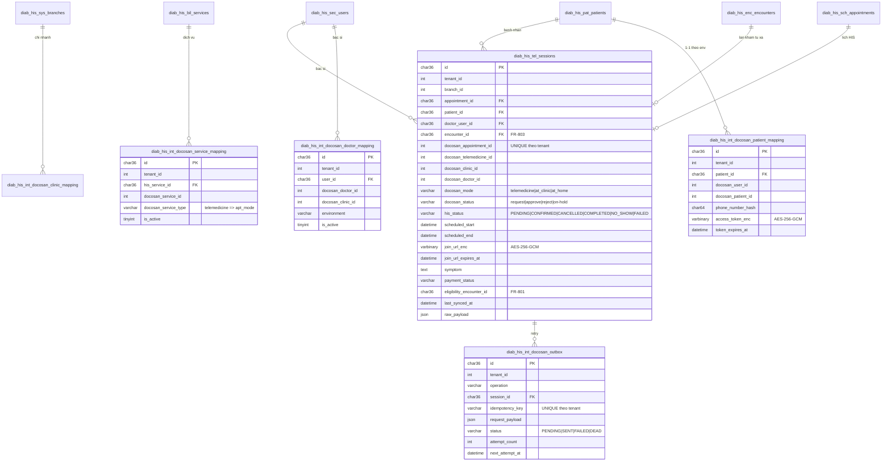
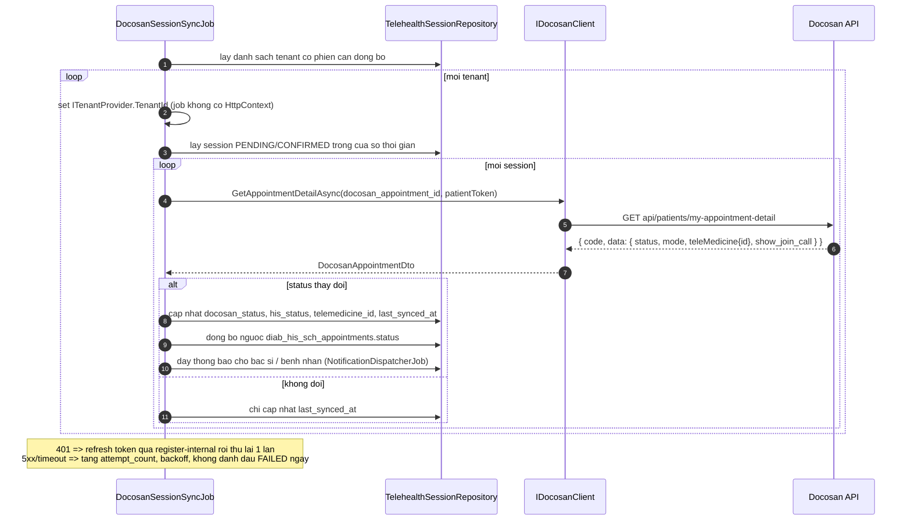
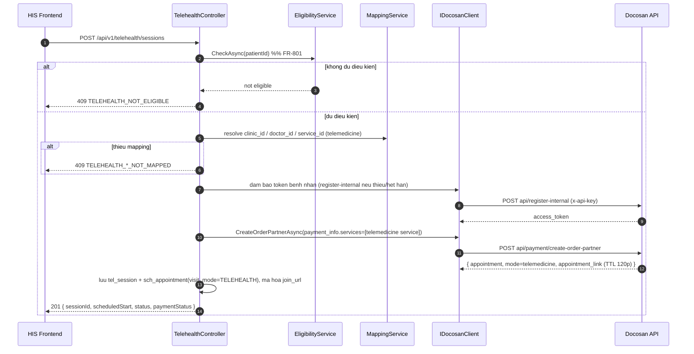

# Thiết kế tích hợp Telehealth qua Docosan (FR-801 / FR-802 / FR-803)

- Tác giả: Lành (architect)
- Ngày: 2026-08-27
- Trạng thái: Draft — chờ PO xác nhận các câu hỏi ở mục 12
- Phạm vi: HIS **KHÔNG** tự xây booking/payment/video cho telehealth. Toàn bộ luồng đặt lịch tư vấn từ xa + thanh toán + phòng video do **Docosan** đảm nhiệm. HIS chỉ giữ **tham chiếu**, thực hiện **kiểm tra điều kiện nghiệp vụ (FR-801)** trước khi đặt, và **kê đơn theo luồng Prescription sẵn có (FR-803)**.

> Mọi kết luận dưới đây được rút ra từ đọc trực tiếp source: `E:\git\diab\docosan\Docosan-API` (Laravel), `E:\git\diab\internal\diab-flutter-mobile\lib\src\model\*`, `E:\git\diab\public\pro-diab-sdk\src\dsmes\api\dsmesApi.ts`. Phần nào chưa xác minh được đều ghi rõ ở mục 12 (câu hỏi).

---

## 1. Kết luận khảo sát: Docosan phân biệt telehealth thế nào?

### 1.1. Không có endpoint booking riêng cho telehealth — phân biệt bằng `mode` của Appointment

`app/Models/Appointment.php` (dòng 34-36, 151):

```php
const MODE_TELEMEDICINE = 'telemedicine';
const MODE_AT_CLINIC    = 'at_clinic';
const MODE_HOME_VISIT   = 'at_home';
```

DTO mobile phản chiếu đúng 3 giá trị này (`dsmes_appointment_model.dart`, enum `DsmesAppointmentMode`).

### 1.2. `mode` được suy ra từ `service_type` của dịch vụ trong `payment_info`

Đây là điểm quan trọng nhất và dễ làm sai. Trong `app/Repositories/Eloquents/PaymentRepositoryEloquent.php` (dòng 234-247 và 444-457):

```php
if (!isset($invoice_data['apt_mode']) && isset($service['service_type']))
{
    $invoice_data['apt_mode'] = $service['service_type'];
}
// tương tự cho $sale_service['service_type']
```

Sau đó `AppointmentRepositoryEloquent::patientCreate` (dòng 3337, và 3883):

```php
$apt_mode = (isset($attributes['apt_mode']) && !empty($attributes['apt_mode']))
    ? $attributes['apt_mode'] : Appointment::MODE_AT_CLINIC;
```

**Hệ quả thiết kế:**
- Request `CreateDsmesBookingRequest` **không có field `mode`/`apt_mode`** do client gửi.
- Muốn tạo lịch **telehealth**, HIS phải gọi `POST api/payment/create-order-partner` với `payment_info.services[].id` trỏ tới một **service của phòng khám trên Docosan có `service_type = 'telemedicine'`**.
- Gọi `POST api/doctors/patient-appointments-partner-diab` (không đi qua payment) sẽ rơi vào mặc định `at_clinic` → **không** tạo phiên telemedicine.
- ⇒ HIS bắt buộc phải có bảng mapping service (mục 4.3) và admin phải cấu hình đúng `docosan_service_id` của gói tư vấn từ xa.

### 1.3. Docosan tự tạo record `TeleMedicine` và tự sinh link phòng chờ

`PaymentRepositoryEloquent.php` dòng 262-275 (và 521-534 cho nhánh partner):

```php
if ($result['mode'] == Appointment::MODE_TELEMEDICINE) {
    $telemed = TeleMedicine::where('appointment_id', $result['id'])->first();
    $appointment_link = ShortenService::generateShortURLWithAuth(
        sprintf('%s/vi/telemedicine/patient/%s', env('CLIENT_APP_URL', ...), $telemed->id),
        optional($patient->user)->id ?? $patient->user_id,
        120 // TTL 2 giờ
    );
}
```

- Link trả về là **short URL có nhúng JWT bệnh nhân, TTL 120 phút** → **không được cache dài hạn**, coi như credential.
- `teleMedicine.id` xuất hiện trong response chi tiết lịch hẹn (`dsmes_appointment_model.dart` dòng 197-199) và là khóa để join call.
- Cờ `show_join_call` (dòng 183) là tín hiệu Docosan cho biết đã đến giờ được vào phòng.

### 1.4. Hạ tầng video là của Docosan (Agora + AWS Chime), HIS không chạm vào

`routes/sub_routes/telemedicine.php` — toàn bộ nằm sau middleware `auth:api` (token người dùng Docosan), không phải API partner:

```
POST telemedicine/join-call        POST telemedicine/join-call-chime
POST telemedicine/end-call         POST telemedicine/get-share
POST telemedicine/recording/init | chunk/{id} | finalize/{id} | cancel/{id}
GET  telemedicine/recording/status/{id}
```

`TeleMedicineValidator.php` yêu cầu `user_type in: doctor, patient, docosan, clinic` + `telemedicine_id`. `TeleMedicineRepositoryEloquent` dùng `AGORA_ID` (dòng 119-124) và `ChimeService` (dòng 349+).

**Quyết định:** HIS **không gọi** nhóm `telemedicine/*`. HIS chỉ mở `appointment_link` (webview / tab mới). Việc tự dựng client Agora/Chime trong HIS nằm ngoài phạm vi FR-801..803.

### 1.5. Không có webhook partner

Grep toàn bộ `app/` chỉ tìm thấy webhook của ZaloPay và Stripe (`ZaloPayGateway.php`, `StripeWebhookController.php`) — **không có cơ chế callback về hệ thống đối tác**.

⇒ **Đồng bộ trạng thái Docosan → HIS bắt buộc dùng polling.** Endpoint `POST /api/v1/webhooks/docosan` **không thiết kế ở giai đoạn này** (xem mục 7 và câu hỏi Q5).

### 1.6. Xác thực

Hai lớp, phải có đủ cả hai cho các API thao tác trên bệnh nhân:

| Header | Ý nghĩa | Nguồn |
|---|---|---|
| `x-api-key` | Organization API Key theo môi trường | **Lấy từ secret store** (`Docosan:ApiKey`, user-secrets/Vault). Tuyệt đối không hard-code, không commit. |
| `Authorization: Bearer <token>` | Access token của **bệnh nhân** trên Docosan | Trả về từ `POST api/register-internal` (`app_repository.dart` dòng 1153-1174) |

`POST api/register-internal` (content-type `x-www-form-urlencoded`, chỉ cần `x-api-key`) nhận: `email`, `type`, `display_name`, `gender`, `language`, `is_get_cares_order_info`, `phone_number` → trả `data.access_token`. Có endpoint kiểm tra tồn tại người dùng trước (`isExistDocosanUser`).

---

## 2. Quyết định kiến trúc chính

| # | Quyết định | Lý do |
|---|---|---|
| D1 | **Có** bảng `diab_his_tel_sessions` nhưng là **bảng tham chiếu**, không phải bảng nghiệp vụ đầy đủ | Cần lưu `docosan_appointment_id`, `docosan_telemedicine_id`, trạng thái đồng bộ, và **liên kết FR-801 ↔ FR-803**. Không thể nhét hết vào `diab_his_sch_appointments` vì lịch HIS chỉ có `appointment_date`/`time`/`status`. |
| D2 | `diab_his_sch_appointments` chỉ thêm 2 cột: `visit_mode`, `telehealth_session_id` | Giữ lịch HIS là "một hàng lịch" thống nhất cho UI, chi tiết telehealth tách bảng. |
| D3 | Tạo lịch telehealth **luôn** qua `POST api/payment/create-order-partner` | Xem 1.2 — đây là đường duy nhất để `mode = telemedicine`. |
| D4 | Đồng bộ trạng thái bằng **background job polling**, không webhook | Xem 1.5. |
| D5 | Lỗi/timeout Docosan xử lý bằng **outbox + retry job** giống DTQG | Đã có tiền lệ `DtqgSubmitRetryJob`, `EInvoiceRetryJob`. |
| D6 | `join_url` và `access_token` Docosan **mã hóa AES-256-GCM** | Đều là credential (JWT nhúng URL, TTL 2h). |
| D7 | Mapping bác sĩ/phòng khám **do admin cấu hình thủ công** ở MVP | Docosan không có API partner để tạo doctor/clinic. Xem Q1. |
| D8 | FR-803 **không phát sinh code mới** ở tầng kê đơn | Xem mục 9. |

---

## 3. ERD



### 3.1. Trường nhạy cảm — bắt buộc mã hóa AES-256-GCM

| Bảng | Cột | Ghi chú |
|---|---|---|
| `diab_his_int_docosan_patient_mapping` | `access_token_enc` | Bearer token bệnh nhân |
| `diab_his_tel_sessions` | `join_url_enc` | Short URL có JWT nhúng, TTL 120 phút |
| (config, không nằm trong DB) | `Docosan:ApiKey` | Lưu Vault / user-secrets / biến môi trường |

`phone_number_hash` dùng SHA-256 (không cần giải mã, chỉ để đối chiếu). `raw_payload` **phải lược bỏ** `appointment_link`, `token`, `access_token` trước khi lưu.

### 3.2. Multi-tenant

MySQL không có RLS. Áp dụng đúng CLAUDE.md mục 3:
- Mọi bảng mới đều có `tenant_id INT NOT NULL` + index dẫn đầu bằng `tenant_id`.
- EF Core: `HasQueryFilter(e => e.TenantId == _tenantProvider.TenantId)` cho cả 6 entity mới.
- Dapper: mọi SELECT có `WHERE tenant_id = @tenantId`.
- **Background job không có HttpContext** ⇒ job phải lặp theo từng tenant và set `ITenantProvider` thủ công cho mỗi vòng lặp (xem mục 7.3).
- Unique key `uk_tel_tenant_docosan_apt (tenant_id, docosan_appointment_id)` chặn 2 tenant nhận nhầm một lịch Docosan.

---

## 4. Mapping dữ liệu HIS ↔ Docosan

### 4.1. Clinic / Branch
`diab_his_sys_branches.id (INT)` → `docosan_clinic_id (INT)` + `docosan_branch_id (INT, nullable)`.
Nguồn xác minh: `GET api/clinics/profile-clinic-diab?type=...` — dùng để hiển thị danh sách cho admin chọn và cache tên (`docosan_clinic_name`, `synced_at`).

### 4.2. Doctor
`diab_his_sec_users.id (CHAR36)` → `docosan_doctor_id (INT)`.
Nguồn danh sách: `GET api/clinics/profile-clinic-diab-schedule` (trả bác sĩ + lịch trống) và `GET api/partner-doctor?id=`.
Unique `(tenant_id, user_id, environment)` — một bác sĩ HIS chỉ map 1 doctor Docosan/môi trường.

### 4.3. Service (quan trọng — quyết định `mode`)
`docosan_service_id` + `docosan_service_type='telemedicine'`. Khi tạo lịch telehealth, service chọn phải có `is_active=1` và `docosan_service_type='telemedicine'`; nếu không → trả lỗi `TELEHEALTH_SERVICE_NOT_CONFIGURED`.

### 4.4. Patient
`diab_his_pat_patients.id` → `docosan_user_id` / `docosan_patient_id` + token.
Luồng lazy: khi cần token mà chưa có/hết hạn → `POST api/register-internal` (idempotent phía Docosan theo số điện thoại) → lưu token mã hóa.

### 4.5. Trạng thái
| Docosan `status` | `his_status` |
|---|---|
| `request` | `PENDING` |
| `on-hold` | `PENDING` (chờ thanh toán) |
| `approve` | `CONFIRMED` |
| `reject` | `CANCELLED` |
| (quá `scheduled_end`, chưa có encounter) | `NO_SHOW` (job đánh dấu) |
| (đã tạo encounter + kết thúc) | `COMPLETED` |

Hằng số Docosan xác minh tại `dsmes_appointment_model.dart` dòng 486-489.

---

## 5. `IDocosanClient` — contract tầng Application

Đặt tại `backend/src/ProDiabHis.Application/Telehealth/Integration/IDocosanClient.cs`; hiện thực `DocosanClient` tại `backend/src/ProDiabHis.Infrastructure/Integrations/Docosan/`, đăng ký qua `IHttpClientFactory` + Polly (retry 3 lần, exponential backoff, circuit breaker) — đồng bộ với cấu hình đã dùng cho DTQG.

```csharp
namespace ProDiabHis.Application.Telehealth.Integration;

/// <summary>Bọc REST API của Docosan. Không chứa business logic.</summary>
public interface IDocosanClient
{
    // --- Danh mục (chỉ cần x-api-key) ---
    Task<DocosanClinicListDto>    GetClinicProfileAsync(string? type, CancellationToken ct);
    Task<DocosanScheduleDto>      GetClinicScheduleAsync(CancellationToken ct);
    Task<DocosanDiseaseListDto>   GetDiseaseConfigAsync(string language, CancellationToken ct);

    // --- Tài khoản bệnh nhân ---
    Task<bool>                    IsUserExistAsync(string phoneNumber, CancellationToken ct);
    Task<DocosanRegisterResultDto> RegisterInternalUserAsync(DocosanRegisterUserRequest req, CancellationToken ct);

    // --- Đặt lịch (cần x-api-key + Bearer token bệnh nhân) ---
    /// <summary>Telehealth: bắt buộc dùng hàm này. services[].service_type='telemedicine' => mode=telemedicine.</summary>
    Task<DocosanAppointmentDto>   CreateOrderPartnerAsync(DocosanCreateBookingRequest req, string patientToken, CancellationToken ct);
    /// <summary>Lịch offline không thanh toán. KHÔNG dùng cho telehealth.</summary>
    Task<DocosanAppointmentDto>   CreatePartnerDiabBookingAsync(DocosanCreateBookingRequest req, string patientToken, CancellationToken ct);

    // --- Tra cứu / thay đổi ---
    Task<DocosanAppointmentListDto> GetMyAppointmentsAsync(int page, string patientToken, CancellationToken ct);
    Task<DocosanAppointmentDto>     GetAppointmentDetailAsync(int appointmentId, string patientToken, CancellationToken ct);
    Task<DocosanCommonResultDto>    CancelAppointmentAsync(DocosanCancelRequest req, string patientToken, CancellationToken ct);
    Task<DocosanAppointmentDto>     RescheduleAppointmentAsync(DocosanRescheduleRequest req, string patientToken, CancellationToken ct);
}
```

### 5.1. Cấu hình

```jsonc
// appsettings.{Environment}.json — KHÔNG chứa giá trị thật của ApiKey
"Docosan": {
  "BaseUrl": "https://api.staging.docosan.com/",   // prod: https://api.docosan.com/
  "ApiKey": "",                                     // nạp từ secret store / env DOCOSAN__APIKEY
  "Environment": "staging",                         // ghi vào cột environment
  "ClientAppUrl": "https://staging.docosan.com",
  "TimeoutSeconds": 20,
  "SyncJob": { "IntervalMinutes": 5, "LookAheadHours": 48, "LookBackHours": 24 }
}
```

Hằng số `environment` trong DB phải khớp `Docosan:Environment` để tránh dùng nhầm mapping staging trên prod.

### 5.2. Điểm bắt buộc khi hiện thực
- `POST api/register-internal` dùng `application/x-www-form-urlencoded`; các endpoint còn lại dùng JSON.
- Response Docosan bọc `{ "code": ..., "data": {...} }` — parse theo `code` chứ không chỉ HTTP status.
- `extra_info` trả về **khác shape giữa list và detail** (list = JSON string, detail = object) — đã ghi rõ trong `dsmes_appointment_model.dart` dòng 218-221. DTO .NET phải xử lý cả hai.
- `teleMedicine` có thể là `[]` (mảng rỗng) khi không có → không được deserialize cứng thành object.
- Log Serilog **không dấu**, và **không log** `Authorization`, `x-api-key`, `appointment_link`.

---

## 6. API HIS (contract tóm tắt)

Đặc tả OpenAPI đầy đủ sẽ nằm ở `docs/api/telehealth.yaml` (viết sau khi PO chốt mục 12). Contract dự kiến:

| Method | Path | Mô tả |
|---|---|---|
| `GET` | `/api/v1/telehealth/eligibility?patientId=` | FR-801: kiểm tra bệnh nhân đủ điều kiện đặt tư vấn từ xa |
| `GET` | `/api/v1/telehealth/slots?doctorId=&date=` | Lịch trống, proxy `profile-clinic-diab-schedule` |
| `POST` | `/api/v1/telehealth/sessions` | FR-802: tạo phiên (validate → gọi `create-order-partner` → lưu session) |
| `GET` | `/api/v1/telehealth/sessions` | Danh sách phiên theo tenant/bác sĩ/ngày |
| `GET` | `/api/v1/telehealth/sessions/{id}` | Chi tiết (đồng bộ on-demand) |
| `GET` | `/api/v1/telehealth/sessions/{id}/join-link` | Cấp link vào phòng (giải mã, kiểm TTL, tự refresh nếu hết hạn, ghi audit) |
| `POST` | `/api/v1/telehealth/sessions/{id}/cancel` | Hủy → gọi `cancel-appointment` |
| `POST` | `/api/v1/telehealth/sessions/{id}/reschedule` | Đổi lịch → gọi `reschedule-apt` |
| `POST` | `/api/v1/telehealth/sessions/{id}/start-encounter` | FR-803: tạo/lấy Encounter gắn với phiên |
| `GET` | `/api/v1/admin/telehealth/mappings/{kind}` · `PUT` | Quản trị mapping clinic/doctor/service |

Mã lỗi (SCREAMING_SNAKE, message tiếng Việt có dấu):

| Code | Message |
|---|---|
| `TELEHEALTH_NOT_ELIGIBLE` | Bệnh nhân chưa từng khám trực tiếp trong thời hạn quy định |
| `TELEHEALTH_DOCTOR_NOT_MAPPED` | Bác sĩ chưa được liên kết với hệ thống Docosan |
| `TELEHEALTH_CLINIC_NOT_MAPPED` | Phòng khám chưa được liên kết với hệ thống Docosan |
| `TELEHEALTH_SERVICE_NOT_CONFIGURED` | Chưa cấu hình dịch vụ tư vấn từ xa trên Docosan |
| `TELEHEALTH_SLOT_UNAVAILABLE` | Khung giờ đã được đặt |
| `TELEHEALTH_PROVIDER_UNAVAILABLE` | Không kết nối được hệ thống Docosan, vui lòng thử lại |
| `TELEHEALTH_SESSION_NOT_FOUND` | Không tìm thấy phiên tư vấn từ xa |
| `TELEHEALTH_JOIN_LINK_EXPIRED` | Liên kết vào phòng đã hết hạn |
| `TELEHEALTH_PAYMENT_PENDING` | Phiên tư vấn chưa được thanh toán |

Tất cả POST/PUT có DTO request + response riêng, bọc trong envelope `{ "data": ..., "meta": ... }` / `{ "error": {...} }`.

---

## 7. Đồng bộ trạng thái Docosan → HIS

### 7.1. Không dùng webhook (giai đoạn 1)
Docosan không cung cấp callback partner (mục 1.5). Endpoint `POST /api/v1/webhooks/docosan` **để dành**, chưa hiện thực. Nếu sau này Docosan bổ sung, thiết kế dự phòng: header `X-Docosan-Signature` = HMAC-SHA256(body, shared_secret), so sánh constant-time, chống replay bằng timestamp ±5 phút + lưu `event_id` đã xử lý.

### 7.2. Polling job
`backend/src/ProDiabHis.Infrastructure/Jobs/DocosanSessionSyncJob.cs` — theo đúng pattern các job hiện có (`DtqgSubmitRetryJob`, `RecallNotifyJob`), đăng ký Hangfire recurring **mỗi 5 phút**.

Phạm vi quét mỗi lần chạy (tránh gọi thừa):
- `his_status IN ('PENDING','CONFIRMED')`
- `AND scheduled_start BETWEEN NOW() - 24h AND NOW() + 48h`
- `AND (last_synced_at IS NULL OR last_synced_at < NOW() - 5 phút)`
- Ưu tiên phiên sắp diễn ra trong 60 phút → poll dày hơn (mỗi 1 phút) bằng một recurring job thứ hai giới hạn cửa sổ hẹp.

### 7.3. Sequence



### 7.4. Retry / chịu lỗi
`diab_his_int_docosan_outbox` + `DocosanOutboxRetryJob` (chạy mỗi 2 phút):
- Backoff: 1p → 5p → 15p → 60p → 6h; `attempt_count >= 6` → `DEAD` + cảnh báo admin.
- `idempotency_key` = `{tenant_id}:{session_id}:{operation}` để retry `CREATE_ORDER` không tạo 2 lịch.
- Lưu ý: Docosan có cache chặn spam `BLOCK_APT_REQUEST` TTL 5 giây/user (`AppointmentController@patientCreatePartnerDiab` dòng 416-426) — retry ngay lập tức sẽ bị chặn, backoff tối thiểu phải > 5 giây.

---

## 8. FR-801 — Validate bệnh nhân đã khám trực tiếp

Đây là **logic thuần HIS**, chạy **trước** khi gọi Docosan. Không phụ thuộc Docosan.

`TelehealthEligibilityService.CheckAsync(patientId)` trả `{ eligible, reason, lastInPersonEncounterId, lastInPersonEncounterDate, expiresAt }`.

Quy tắc (tham số hóa qua `diab_his_sys_settings`, key `telehealth.eligibility.*`):
1. Tồn tại ít nhất 1 `diab_his_enc_encounters` cùng `tenant_id`, cùng `patient_id`, trạng thái hoàn tất, `telehealth_session_id IS NULL` (tức khám trực tiếp), `deleted_at IS NULL`.
2. Lần khám trực tiếp gần nhất cách hiện tại **≤ N ngày** (mặc định đề xuất 180 ngày — **cần PO chốt, xem Q3**).
3. Bệnh nhân `deleted_at IS NULL`, không bị khóa hồ sơ.
4. (Tùy chọn, Q4) Không có phiên telehealth `PENDING/CONFIRMED` trùng khung giờ.

Nếu không đạt → `409 TELEHEALTH_NOT_ELIGIBLE`, `details` trả `lastInPersonEncounterDate` để UI hiển thị. `POST /telehealth/sessions` **gọi lại** hàm này (không tin kết quả từ client) và ghi `eligibility_encounter_id` vào session để phục vụ hậu kiểm/thanh tra.



---

## 9. FR-803 — Kê đơn trong phiên tư vấn

**Không phát sinh module mới. Backend không cần viết lại gì ở tầng kê đơn.**

- Khi bác sĩ vào phòng, HIS gọi `POST /telehealth/sessions/{id}/start-encounter` → tạo `diab_his_enc_encounters` như một lượt khám bình thường, chỉ khác `telehealth_session_id` được set (cột thêm ở migration 9096) và `encounter_id` được ghi ngược vào session.
- Từ điểm đó trở đi: chẩn đoán ICD-10, kê đơn, đẩy ĐTQG, in QR — **dùng nguyên luồng Prescription hiện có**, không sửa contract, không sửa service.
- Docosan **không** cung cấp và **không cần** API kê đơn. Không đẩy đơn thuốc sang Docosan.
- Tác dụng phụ tích cực: `telehealth_session_id IS NOT NULL` là cờ để báo cáo tách doanh thu/lượt khám từ xa, và là điều kiện loại trừ trong FR-801 (khám từ xa không tính là "đã khám trực tiếp").
- Lưu ý pháp lý: đơn thuốc kê từ xa vẫn phải ký số theo luồng `diab_his_sec_digital_signatures` hiện có.

---

## 10. FHIR R4 mapping

| Thực thể | FHIR R4 | Ghi chú |
|---|---|---|
| `diab_his_tel_sessions` | `Appointment` | `Appointment.appointmentType` = `vc` (virtual consult); `Appointment.identifier` = `{system: "https://docosan.com/appointment", value: docosan_appointment_id}` |
| Encounter của phiên | `Encounter` | `Encounter.class` = `VR` (virtual) theo `v3-ActCode`, thay vì `AMB` |
| Link vào phòng | `Encounter.virtualService` (R5) hoặc extension `http://hl7.org/fhir/StructureDefinition/encounter-virtualService` ở R4 | **Không xuất ra ngoài** vì chứa token |
| Mapping bác sĩ | `Practitioner.identifier` | system `https://docosan.com/doctor` |
| Mapping phòng khám | `Organization.identifier` | system `https://docosan.com/clinic` |
| Kê đơn trong phiên | `MedicationRequest` | Không đổi so với luồng hiện tại |
| Trạng thái | `Appointment.status` | `PENDING→pending`, `CONFIRMED→booked`, `CANCELLED→cancelled`, `COMPLETED→fulfilled`, `NO_SHOW→noshow` |

---

## 11. Migration

- File: `db/migrations/9096_create_telehealth_docosan.sql` (số cao nhất hiện tại là `9095_create_sys_settings.sql`).
- Idempotent: `CREATE TABLE IF NOT EXISTS` + `CALL add_col_if_missing` / `add_index_if_missing` (helper từ `0000_helpers.sql`).
- Nội dung: 6 bảng mới + 2 cột trên `diab_his_sch_appointments` (`visit_mode`, `telehealth_session_id`) + 1 cột trên `diab_his_enc_encounters` (`telehealth_session_id`) + các index kèm theo.
- Cần thêm `9097_seed_telehealth_permissions.sql` sau khi PO chốt danh sách quyền (`telehealth.read`, `telehealth.book`, `telehealth.join`, `telehealth.admin_mapping`).
- Nhớ cập nhật `db/migrations/APPLY_ORDER.md`.
- **Không tạo FK vật lý** sang `diab_his_sch_appointments` / `diab_his_enc_encounters` để đồng nhất với các bảng hiện có (dự án đang dùng ràng buộc mềm + index); ràng buộc kiểm ở tầng service.

---

## 12. Rủi ro & câu hỏi cần xác nhận

### Câu hỏi cho PO/BA (Đăng) — chặn việc chốt spec
- **Q1 — Đồng bộ bác sĩ:** MVP để admin map thủ công bác sĩ HIS ↔ `docosan_doctor_id` (Docosan không có API partner tạo doctor). PO xác nhận chấp nhận thao tác thủ công ban đầu chứ?
- **Q2 — Danh sách `docosan_service_id`:** Ai cung cấp ID dịch vụ "tư vấn từ xa" của từng phòng khám trên Docosan? Có API partner nào liệt kê service kèm `service_type` không, hay phải phía Docosan gửi bằng tay? *(Chưa tìm thấy endpoint liệt kê service trong `docosan_api.dart` — cần Docosan xác nhận.)*
- **Q3 — Ngưỡng FR-801:** Bao nhiêu ngày kể từ lần khám trực tiếp gần nhất thì còn được đặt telehealth? (đề xuất 180 ngày, cấu hình được theo tenant). Có ngoại lệ theo nhóm bệnh (đái tháo đường tái khám định kỳ) không?
- **Q4 — Thanh toán:** Docosan thu tiền, vậy khoản này có cần đối soát vào `diab_his_bil_*` của HIS không, hay chỉ hiển thị tham chiếu? Nếu cần đối soát thì theo chu kỳ nào?
- **Q5 — Ai đặt lịch:** Bệnh nhân tự đặt trên app diab, hay lễ tân HIS đặt hộ? Ảnh hưởng trực tiếp tới việc lấy Bearer token bệnh nhân (nếu lễ tân đặt hộ thì HIS phải giữ token của bệnh nhân — tăng bề mặt rủi ro bảo mật).
- **Q6 — Hủy/đổi lịch:** Bệnh nhân hủy trên Docosan thì HIS chỉ biết sau tối đa 5 phút (polling). Độ trễ này có chấp nhận được với SLA nghiệp vụ không?

### Câu hỏi cho Docosan
- **Q7:** Có kế hoạch cung cấp **webhook cho partner** (appointment status changed) không? Có thì HIS sẽ bỏ polling.
- **Q8:** Có API partner để lấy **danh sách service kèm `service_type`** của một clinic không?
- **Q9:** `access_token` từ `api/register-internal` có **thời hạn** bao lâu, có refresh token không? Hiện `token_expires_at` được thiết kế nhưng chưa biết giá trị thực.
- **Q10:** Có cách nào để **bác sĩ phía HIS** join call bằng danh tính partner không (`user_type = 'clinic'` trong `TeleMedicineValidator` gợi ý là có), hay bác sĩ bắt buộc phải có tài khoản Docosan riêng?

### Rủi ro kỹ thuật
| # | Rủi ro | Giảm thiểu |
|---|---|---|
| R1 | Chọn nhầm service → lịch tạo ra là `at_clinic`, không có phòng video | Validate `docosan_service_type='telemedicine'` trước khi gọi; sau khi tạo, **kiểm lại `data.mode`** trong response, nếu ≠ `telemedicine` thì hủy lịch ngay + trả `TELEHEALTH_SERVICE_NOT_CONFIGURED` |
| R2 | `appointment_link` TTL 120 phút — cache sai gây lỗi cho bệnh nhân | Không hiển thị link cũ; endpoint `join-link` luôn kiểm `join_url_expires_at`, hết hạn thì gọi lại detail để lấy link mới |
| R3 | Retry `create-order-partner` gây trùng lịch (Docosan không nhận idempotency key) | `idempotency_key` phía HIS + trước khi retry phải gọi `my-appointment-partner` kiểm tra đã tồn tại lịch cùng doctor/khung giờ chưa |
| R4 | Cache chặn spam 5 giây của Docosan làm retry nhanh thất bại | Backoff tối thiểu 60 giây |
| R5 | Job đồng bộ chạy N tenant × M session → bùng nổ số lời gọi API | Giới hạn cửa sổ thời gian, batch, rate-limit phía client, sau này chuyển sang webhook |
| R6 | Rò rỉ `x-api-key` khi log/exception | Middleware scrub header; Serilog destructuring policy loại bỏ `Authorization`, `x-api-key`, `appointment_link`, `access_token` |
| R7 | Docosan sập → không đặt được lịch từ xa | Circuit breaker + thông báo tiếng Việt `TELEHEALTH_PROVIDER_UNAVAILABLE`; **không** ghi session `PENDING` giả nếu chưa có `docosan_appointment_id` |
| R8 | Dữ liệu staging/production lẫn nhau | Cột `environment` trong mọi bảng mapping + unique key có `environment`; service kiểm khớp `Docosan:Environment` |

---

## 13. Việc tiếp theo (sau khi PO trả lời mục 12)
1. Viết `docs/api/telehealth.yaml` (OpenAPI 3.1) — đầy đủ DTO request/response.
2. `docs/adr/0xx-telehealth-polling-vs-webhook.md` — ghi trade-off đã chọn ở D4.
3. `db/migrations/9097_seed_telehealth_permissions.sql`.
4. Bàn giao backend: `IDocosanClient` + `TelehealthEligibilityService` + `DocosanSessionSyncJob` + `DocosanOutboxRetryJob`.
