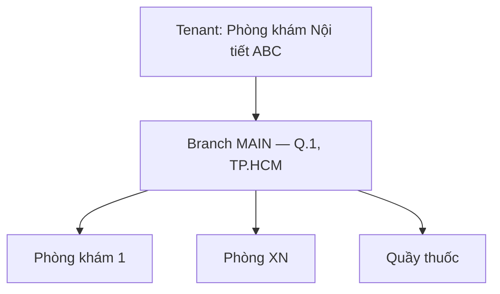
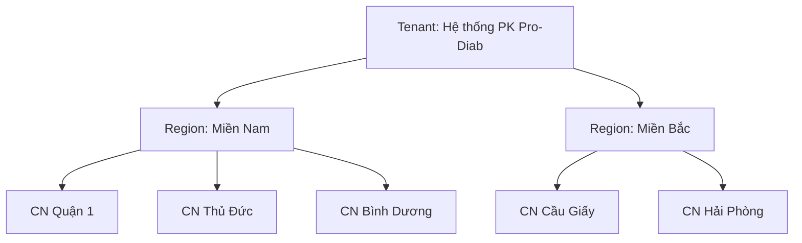
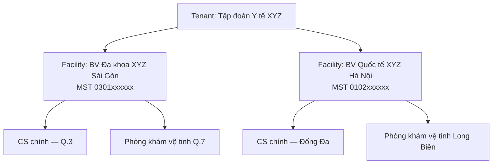
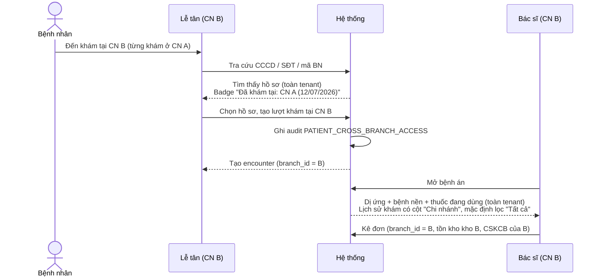
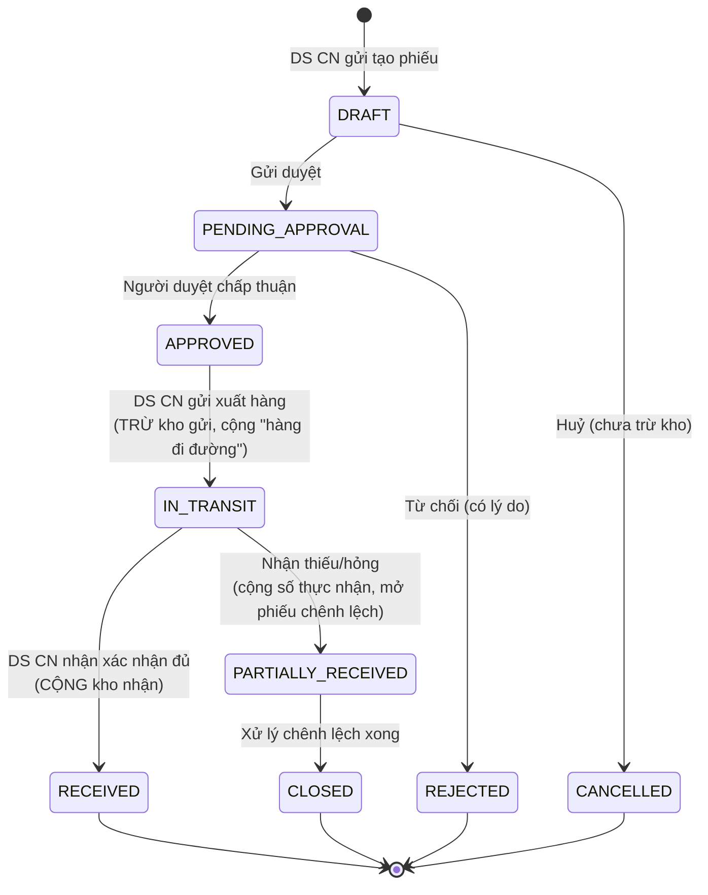
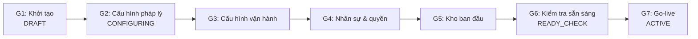

# BRD — Định nghĩa nghiệp vụ: Phòng khám / Bệnh viện ĐA CHI NHÁNH

- **Mã tài liệu**: BRD-MULTIBRANCH-001
- **Phiên bản**: 1.0
- **Ngày**: 2026-08-29
- **Tác giả**: Đăng (PO/BA)
- **Loại**: Business Requirement Document — **tài liệu ĐỊNH NGHĨA**, dev bám theo để triển khai
- **Trạng thái**: Chốt nghiệp vụ (các điểm chưa chốt được liệt kê rõ ở mục 10)
- **Kế thừa**:
  - `docs/prd/phan-tich-da-chi-nhanh-mo-rong-20260829.md` (rapid assessment — gap F-01→F-09, KHÔNG lặp lại)
  - `docs/erd/branch-multi-chi-nhanh.md` (thiết kế kỹ thuật D1–D10)
  - `docs/SESSION-SUMMARY-phong-kham-noi-noi-tiet.md` (10 quyết định nghiệp vụ đã chốt)
- **Quan hệ với tài liệu cũ**: rapid assessment trả lời *"hiện thiếu gì"*. Tài liệu này trả lời *"phải vận hành như thế nào"*. Khi mâu thuẫn với quyết định cũ, **tài liệu này thắng** và nêu rõ lý do thay đổi ở mục 11.

---

## Quy ước đọc tài liệu

| Ký hiệu | Nghĩa |
|---|---|
| **BR-xx** | Business Rule — quy tắc bắt buộc, dev PHẢI implement đúng. Không được diễn giải lại. |
| **US-xx** | User Story |
| **AC-xx** | Acceptance Criteria (Given/When/Then) |
| **[MỚI]** | Chưa có trong hệ thống, cần làm mới |
| **[SỬA]** | Đã có nhưng phải sửa lại theo định nghĩa này |
| **[GIỮ]** | Đã đúng, giữ nguyên |

Actor chuẩn dùng xuyên suốt (khớp role code trong DB):

| Actor | role_code | Phạm vi mặc định |
|---|---|---|
| Quản trị hệ thống SaaS | `super_admin` | Toàn hệ thống (mọi tenant) |
| Quản trị tổ chức | `admin` | Toàn bộ 1 tenant |
| Giám đốc cơ sở / vùng | `quan_ly_vung` **[MỚI]** | 1 nhóm chi nhánh (Facility hoặc Region) |
| Quản lý chi nhánh | `quan_ly_chi_nhanh` **[MỚI]** | 1 chi nhánh |
| Bác sĩ | `bac_si` | Chi nhánh đang trực |
| Lễ tân | `le_tan` | Chi nhánh đang trực |
| Dược sĩ | `duoc_si` | Kho của chi nhánh đang trực |
| Kế toán | `ke_toan` | Toàn tenant (đọc) |
| KTV CLS | `ky_thuat_vien` | Chi nhánh đang trực |

---

## 1. Mô hình tổ chức (Organization Model)

### 1.1 Định nghĩa các cấp

| Cấp | Tên nghiệp vụ | Bản chất | Bắt buộc? |
|---|---|---|---|
| L0 | **Tenant** (Tổ chức / Khách hàng SaaS) | Ranh giới **cách ly dữ liệu tuyệt đối**. Một hợp đồng SaaS. Bệnh nhân, danh mục thuốc, RBAC dùng chung trong tenant. | Bắt buộc |
| L1 | **Facility / Cơ sở pháp nhân** (bảng `branch_groups`, `type='HOSPITAL'`) | Đơn vị có **mã số thuế riêng**, phát hành hoá đơn riêng, có báo cáo tài chính độc lập. Ứng với "một bệnh viện" trong chuỗi. | **Tuỳ chọn** |
| L1' | **Region / Khu vực** (bảng `branch_groups`, `type='REGION'`) | Đơn vị **quản trị**, không có pháp nhân. Dùng để gom chi nhánh theo địa lý (Miền Bắc, Miền Nam, Cụm TP.HCM). | **Tuỳ chọn** |
| L2 | **Branch / Chi nhánh** | Đơn vị **vận hành vật lý**: có địa chỉ, có phòng khám, có kho thuốc, có quầy thu ngân, có mã CSKCB. **Mọi giao dịch y tế đều phát sinh tại đúng 1 chi nhánh.** | Bắt buộc |
| L3 | **Room / Phòng** | Phòng khám, phòng XN, phòng CĐHA, quầy thuốc trong 1 chi nhánh. | Bắt buộc (≥1) |

> **BR-01 (nguyên tắc nền)**: Chi nhánh (L2) là **đơn vị nghiệp vụ nguyên tử**. Mọi bản ghi vận hành (lượt khám, đơn thuốc, hoá đơn, phiếu nhập/xuất kho, ca thu ngân) PHẢI có đúng **một** `branch_id` không NULL. Không tồn tại khái niệm "giao dịch của cả tập đoàn".

> **BR-02**: `branch_groups` là cây **tối đa 2 cấp** (`REGION` chứa `HOSPITAL`, hoặc `HOSPITAL` chứa trực tiếp branch). Cấm cây sâu hơn 2 cấp để tránh phức tạp phân quyền và báo cáo đệ quy.

> **BR-03**: `branch_groups` là **tuỳ chọn**. `branches.group_id` NULLABLE. Chi nhánh không thuộc group nào thì trực thuộc thẳng tenant. Hệ thống phải chạy đúng khi toàn bộ `group_id = NULL`.

### 1.2 Ba kịch bản triển khai — chọn theo khách hàng

#### Kịch bản A — Phòng khám đơn (1 cơ sở)

- Áp dụng: khách hàng 2–5 bác sĩ, 1 địa điểm (phạm vi gốc CLAUDE.md).
- `branch_groups` = rỗng. Branch switcher **ẩn hoàn toàn** khỏi UI.

#### Kịch bản B — Chuỗi phòng khám 1 pháp nhân, nhiều cơ sở

- Áp dụng: 5–50 chi nhánh, **cùng 1 MST**, cùng bảng giá gốc (có thể override theo vùng).
- `branch_groups.type = 'REGION'`. Có role `quan_ly_vung`.
- Hoá đơn: **1 ký hiệu chung**, hoặc tách ký hiệu theo chi nhánh để dễ đối soát (xem BR-42).

#### Kịch bản C — Tập đoàn y tế, nhiều bệnh viện, mỗi bệnh viện nhiều cơ sở

- Áp dụng: nhiều pháp nhân trong 1 tập đoàn, **muốn dùng chung hồ sơ bệnh nhân và báo cáo hợp nhất**.
- `branch_groups.type = 'HOSPITAL'`, mỗi group có `tax_code`, `legal_name`, `invoice_serial`.
- Role `quan_ly_vung` đóng vai "Giám đốc bệnh viện", chỉ thấy các branch thuộc facility của mình.

> **BR-04 (tiêu chí chọn kịch bản — dev dùng để validate lúc onboarding)**:
> | Điều kiện | Kịch bản |
> |---|---|
> | Chỉ 1 địa điểm | **A** |
> | ≥2 địa điểm, **cùng 1 MST** | **B** |
> | ≥2 địa điểm, **≥2 MST khác nhau**, dùng chung bệnh nhân | **C** |
> | ≥2 MST, **KHÔNG được dùng chung bệnh nhân** (yêu cầu pháp lý/hợp đồng riêng) | **Tách tenant riêng** — KHÔNG dùng branch_group |

> **BR-05**: Chuyển đổi kịch bản A→B→C phải **không mất dữ liệu, không cần migrate lại**. Cụ thể: thêm branch mới, thêm group rồi gán `group_id` cho branch hiện có. Cấm mọi thiết kế yêu cầu tạo lại tenant khi khách hàng mở rộng.

### 1.3 Business rule về vòng đời chi nhánh

| Mã | Quy tắc |
|---|---|
| **BR-06** | Mỗi tenant có **đúng 1** chi nhánh `is_default = 1`, đang active. (đã có INV-1 — **[GIỮ]**) |
| **BR-07** | `branches.code` unique trong tenant; `branches.cskcb_code` unique **toàn hệ thống** (mã Bộ Y tế cấp). |
| **BR-08** | Chi nhánh chỉ có 3 trạng thái: `ACTIVE` (hoạt động) / `SUSPENDED` (tạm dừng — không tiếp nhận mới, vẫn tra cứu & hoàn tất hồ sơ dở dang) / `CLOSED` (đóng — chỉ đọc). **[SỬA]**: hiện chỉ có `is_active` boolean, thiếu trạng thái `SUSPENDED`. |
| **BR-09** | Cấm xoá cứng chi nhánh đã phát sinh dữ liệu vận hành → trả `BRANCH_HAS_DATA`, chỉ cho chuyển sang `CLOSED`. (đã có INV-3 — **[GIỮ]**) |
| **BR-10** | Khi chi nhánh chuyển `CLOSED`: (a) tồn kho phải = 0 hoặc đã điều chuyển hết; (b) công nợ bệnh nhân = 0 hoặc đã chuyển sang chi nhánh tiếp nhận; (c) mọi lượt khám ở trạng thái mở phải được đóng. Không thoả → chặn, liệt kê lý do cụ thể. |
| **BR-11** | Đổi `group_id` của chi nhánh **không** hồi tố dữ liệu lịch sử. Báo cáo theo group tính theo cây tổ chức **tại thời điểm truy vấn** (dev: join realtime, không snapshot). |

---

## 2. Vòng đời bệnh nhân xuyên chi nhánh

### 2.1 Nguyên tắc dữ liệu

> **BR-20 (cốt lõi — [GIỮ], khớp D4)**: Bệnh nhân là entity **toàn cục theo tenant**. `pat_patients` KHÔNG có `branch_id`. Một người bệnh = **một hồ sơ duy nhất** trong tenant, dù khám ở bao nhiêu chi nhánh.

Phân loại dữ liệu bệnh nhân:

| Nhóm dữ liệu | Phạm vi | Ví dụ |
|---|---|---|
| **Hồ sơ định danh** | Toàn tenant | Họ tên, ngày sinh, CCCD, SĐT, địa chỉ, mã BN |
| **Dữ liệu lâm sàng dọc** | Toàn tenant | Dị ứng, bệnh nền, cảnh báo nguy cơ, thẻ BHYT, người giám hộ, consent |
| **Dữ liệu giao dịch** | Theo chi nhánh | Lượt khám, chỉ định CLS, đơn thuốc, hoá đơn, cấp phát, ca thu ngân |
| **Gói dịch vụ đã mua** | Toàn tenant | Mua ở A dùng được ở B (**[GIỮ]** — quyết định #6 SESSION-SUMMARY) |
| **Công nợ** | Ghi nhận theo chi nhánh, **hiển thị tổng hợp** toàn tenant | Xem BR-45 |

> **BR-21**: Mã bệnh nhân (`code`) sinh **duy nhất theo tenant**, KHÔNG chứa mã chi nhánh. Lý do: nếu nhúng mã chi nhánh, bệnh nhân đăng ký ở A khám ở B sẽ gây hiểu nhầm "thuộc về A". Nếu cần biết nơi đăng ký ban đầu → derive từ lượt khám đầu tiên.

> **BR-22**: Chống trùng hồ sơ khi bệnh nhân tự đến chi nhánh khác: khi lễ tân tạo mới, hệ thống **bắt buộc** tra trùng trên **toàn tenant** (không giới hạn chi nhánh) theo thứ tự: (1) CCCD hash, (2) số thẻ BHYT, (3) SĐT + họ tên + ngày sinh. Có nghi ngờ trùng → hiển thị danh sách ứng viên **kèm tên chi nhánh đã từng khám**, buộc lễ tân chọn "Dùng hồ sơ này" hoặc "Xác nhận là người khác". **[SỬA]** — hiện đã có dedup (9088) nhưng chưa hiển thị chi nhánh.

### 2.2 Luồng nghiệp vụ: bệnh nhân khám tại chi nhánh khác



| Mã | Quy tắc |
|---|---|
| **BR-23** | Lễ tân/bác sĩ **được phép** tra cứu và mở hồ sơ bệnh nhân toàn tenant, kể cả bệnh nhân chưa từng khám tại chi nhánh mình. Lý do: an toàn người bệnh (dị ứng, tương tác thuốc) quan trọng hơn phân vùng dữ liệu. |
| **BR-24** | Mọi lần truy cập hồ sơ bệnh nhân **chưa từng có lượt khám tại chi nhánh hiện tại** phải ghi audit log `PATIENT_CROSS_BRANCH_VIEW` gồm: user, chi nhánh, patient_id, thời điểm, endpoint. **[MỚI]** |
| **BR-25** | Tra cứu bệnh nhân bằng **danh sách/tìm kiếm mở** (không nhập định danh) chỉ trả về bệnh nhân **đã từng khám tại chi nhánh hiện tại**, trừ khi user có `patient.cross_branch_search`. Muốn thấy bệnh nhân chi nhánh khác thì phải nhập **định danh chính xác** (CCCD / SĐT đủ 10 số / mã BN). Mục đích: chặn "duyệt dạo" danh sách toàn hệ thống — tuân thủ NĐ 13/2023. **[MỚI]** |
| **BR-26** | Lịch sử khám trong hồ sơ hiển thị **toàn bộ lượt khám mọi chi nhánh**, có cột "Chi nhánh" + bộ lọc. Mặc định: hiện tất cả, lượt khám của chi nhánh khác có nhãn xám phân biệt. **[MỚI]** |
| **BR-27** | Dữ liệu lâm sàng dọc (dị ứng, bệnh nền, cảnh báo) **luôn hiển thị đầy đủ** không phụ thuộc chi nhánh — không được lọc. Vi phạm quy tắc này là **lỗi an toàn người bệnh mức Blocker**. |
| **BR-28** | Bác sĩ **không được sửa/xoá** kết quả CLS, đơn thuốc, bệnh án do chi nhánh khác tạo. Chỉ đọc. Muốn điều chỉnh → tạo bản ghi mới tại chi nhánh mình, ghi tham chiếu bản gốc. |
| **BR-29** | Chuyển cơ sở nội bộ (giới thiệu từ CN A sang CN B): tạo bản ghi `internal_referral` gồm chi nhánh nguồn, chi nhánh đích, lý do, bác sĩ giới thiệu, trạng thái (`SENT`/`ACCEPTED`/`COMPLETED`). Lễ tân CN B thấy hàng chờ "Bệnh nhân được giới thiệu đến". **[MỚI]** |

### 2.3 User Stories

- **US-2.1**: Là **Lễ tân**, tôi muốn tra CCCD ra ngay hồ sơ cũ dù bệnh nhân từng khám ở chi nhánh khác, để không tạo hồ sơ trùng.
  - **AC-2.1.1**: *Given* bệnh nhân có hồ sơ tạo tại CN A, *When* lễ tân CN B nhập đúng CCCD, *Then* hệ thống trả về hồ sơ đó kèm nhãn "Đã khám tại CN A — lần gần nhất dd/MM/yyyy".
  - **AC-2.1.2**: *Given* lễ tân CN B nhập họ tên "Nguyễn" (tìm kiếm mở) và **không** có quyền `patient.cross_branch_search`, *Then* kết quả chỉ gồm bệnh nhân đã khám tại CN B.
  - **AC-2.1.3**: *Given* lễ tân mở hồ sơ bệnh nhân chưa từng khám tại CN B, *Then* tồn tại đúng 1 bản ghi `sec_audit_logs` với `action='PATIENT_CROSS_BRANCH_VIEW'`, `branch_id = B`.
- **US-2.2**: Là **Bác sĩ**, tôi muốn thấy dị ứng và thuốc đang dùng của bệnh nhân bất kể ghi nhận ở chi nhánh nào, để tránh kê thuốc gây hại.
  - **AC-2.2.1**: *Given* dị ứng Penicillin ghi tại CN A, *When* bác sĩ CN B kê Amoxicillin, *Then* hệ thống cảnh báo chặn (mức `CONTRAINDICATED`), yêu cầu nhập lý do ghi đè.

---

## 3. Nhân sự đa chi nhánh

### 3.1 Mô hình phân công

> **BR-30 [GIỮ, khớp D5]**: Quan hệ User ↔ Branch là **N–N** qua `sec_user_branches`. Một bác sĩ có thể được phân công nhiều chi nhánh.

> **BR-31**: Mỗi user có đúng **1 chi nhánh chính** (`is_primary = 1`) — là chi nhánh mặc định khi đăng nhập. Bắt buộc, không được để rỗng.

> **BR-32 (nguyên tắc "một context tại một thời điểm")**: Tại mỗi thời điểm, phiên làm việc của user gắn với **đúng 1 chi nhánh đang hoạt động**. Mọi thao tác **ghi** (tạo lượt khám, kê đơn, thu tiền, xuất kho) đều gán `branch_id` = chi nhánh đang hoạt động. Cấm thao tác ghi khi context = "Tất cả chi nhánh" → trả `BRANCH_REQUIRED`. **[GIỮ]**

### 3.2 Ba tầng phạm vi quyền

| Tầng | Tên | Phạm vi thấy dữ liệu vận hành | Permission | Ví dụ vai trò |
|---|---|---|---|---|
| **S1 — Single** | Theo chi nhánh | Đúng 1 chi nhánh đang chọn (phải thuộc `branch_ids` được gán) | (mặc định) | Bác sĩ, lễ tân, dược sĩ, KTV |
| **S2 — Group** | Theo nhóm | Toàn bộ chi nhánh thuộc các group được gán | `branch.group_view` **[MỚI]** | Giám đốc bệnh viện, GĐ khu vực |
| **S3 — All** | Toàn tenant | Mọi chi nhánh trong tenant | `branch.cross_view` **[GIỮ]** | Admin, Kế toán trưởng, CEO chuỗi |

> **BR-33**: Query filter theo tầng: S1 → `branch_id = @current`; S2 → `branch_id IN (@allowedIds)`; S3 → bỏ điều kiện branch. **Cấm** implement S2 bằng cách cấp S3 rồi lọc ở tầng UI — đó là lỗ hổng bảo mật. **[SỬA — hiện chỉ có S1 và S3]**

> **BR-34**: Người dùng S2/S3 vẫn phải **chọn 1 chi nhánh cụ thể** để thao tác ghi (BR-32). Chế độ "Tất cả chi nhánh" chỉ dùng cho màn hình **chỉ đọc**: báo cáo, tra cứu, dashboard.

> **BR-35**: Gán user vào chi nhánh không tự động cấp quyền vượt cấp. Quyền = `role permissions` ∩ `phạm vi chi nhánh`. Một bác sĩ được gán 5 chi nhánh vẫn chỉ là bác sĩ ở cả 5 nơi.

> **BR-36**: Gỡ user khỏi chi nhánh **không** ảnh hưởng dữ liệu lịch sử user đó đã tạo tại chi nhánh đó (lượt khám vẫn ghi đúng bác sĩ). Nếu chi nhánh bị gỡ đang là `is_primary` → bắt buộc chỉ định chi nhánh chính mới trước khi lưu.

> **BR-37**: Nếu user chỉ được gán **1 chi nhánh**, ẩn hoàn toàn branch switcher trên UI (giảm nhiễu và giảm rủi ro chọn nhầm).

> **BR-38 (an toàn người bệnh)**: Chi nhánh đang hoạt động phải hiển thị **thường trực** trên header ở mọi màn hình, có màu badge phân biệt. Khi đổi chi nhánh: hiện dialog xác nhận, xoá toàn bộ cache dữ liệu phía client, và nếu đang có form dở dang thì cảnh báo mất dữ liệu. **[MỚI]**

### 3.3 Lịch làm việc theo chi nhánh

| Mã | Quy tắc |
|---|---|
| **BR-39** | Lịch trực (`sch_doctor_schedules`) gắn `(bác sĩ, chi nhánh, ngày, ca)`. Một bác sĩ có thể trực CN A buổi sáng, CN B buổi chiều **cùng ngày**. |
| **BR-40** | **Cấm chồng lịch**: hệ thống chặn khi tạo 2 ca trực của cùng bác sĩ **giao nhau về thời gian** ở 2 chi nhánh khác nhau → `SCHEDULE_CONFLICT_CROSS_BRANCH`. Kiểm tra trên **toàn tenant**, không chỉ trong chi nhánh đang chọn. |
| **BR-41** | Cấu hình `min_travel_minutes` theo cặp chi nhánh (mặc định 30 phút). Đặt lịch 2 ca liền kề ở 2 chi nhánh cách nhau < ngưỡng → cảnh báo (không chặn), quản lý được ghi đè kèm lý do. |
| **BR-42** | Đặt lịch hẹn qua Portal: bệnh nhân **bắt buộc chọn chi nhánh trước**, sau đó chỉ hiện bác sĩ có lịch trực tại chi nhánh đó. **[GIỮ]** — quyết định #5 SESSION-SUMMARY. |

### 3.4 User Stories

- **US-3.1**: Là **Bác sĩ trực luân phiên**, tôi muốn đổi chi nhánh làm việc trong 2 thao tác, để buổi chiều khám ở cơ sở khác mà không phải đăng xuất.
  - **AC-3.1.1**: *Given* bác sĩ được gán CN A và CN B, *When* chọn CN B trên switcher, *Then* toàn bộ hàng chờ, lịch hẹn, danh sách phòng hiển thị đúng của CN B trong ≤ 2 giây; không còn bản ghi nào của CN A.
  - **AC-3.1.2**: *Given* bác sĩ chỉ được gán CN A, *When* gửi request kèm `X-Branch-Id` = CN B, *Then* trả `403 BRANCH_ACCESS_DENIED` và ghi audit.
- **US-3.2**: Là **Giám đốc bệnh viện XYZ Sài Gòn**, tôi muốn xem báo cáo của **các cơ sở thuộc bệnh viện mình**, không thấy dữ liệu bệnh viện khác.
  - **AC-3.2.1**: *Given* GĐ có `branch.group_view` với group = "BV XYZ Sài Gòn" (gồm CN 1, 2), *When* mở báo cáo doanh thu chế độ "Tất cả", *Then* kết quả chỉ gồm CN 1 và CN 2; CN của BV Hà Nội không xuất hiện kể cả khi truyền tay `branchId` của nó (→ `403`).

---

## 4. Kho dược & tồn kho đa chi nhánh

### 4.1 Mô hình kho

> **BR-50 [GIỮ]**: Mỗi chi nhánh có **kho riêng, tồn kho hạch toán độc lập**. `pha_stock` khoá theo `(tenant_id, branch_id, warehouse_id, drug_id, lot_no)`. Không có khái niệm "tồn kho chung toàn hệ thống" ở mức hạch toán — chỉ có **báo cáo tổng hợp**.

> **BR-51**: Một chi nhánh có ≥1 kho (`pha_warehouses`), phân loại: `MAIN` (kho chính), `DISPENSARY` (quầy cấp phát), `COLD` (kho lạnh — insulin, vắc-xin). Chi nhánh mới mặc định tạo sẵn `MAIN` + `DISPENSARY`.

> **BR-52**: Danh mục thuốc (`pha_drugs`) **dùng chung toàn tenant** [GIỮ], nhưng khi kê đơn/cấp phát, hệ thống **mặc định chỉ hiện thuốc có tồn > 0 tại chi nhánh hiện tại**. Có toggle "Hiện tất cả danh mục" — nếu bác sĩ chọn thuốc không có tồn tại chi nhánh, hiển thị cảnh báo *"Thuốc này hiện không có tại {tên CN}. Bệnh nhân sẽ phải mua ngoài hoặc chờ điều chuyển."* và vẫn cho kê. **[MỚI]**

> **BR-53**: Nhà cung cấp dùng chung toàn tenant; **đơn mua (PO) và phiếu nhập (GRN) thuộc về chi nhánh**. Cho phép PO tập trung: 1 PO có thể chỉ định nhiều chi nhánh nhận hàng → sinh nhiều GRN, mỗi GRN thuộc 1 chi nhánh. **[MỚI]**

### 4.2 Điều chuyển kho liên chi nhánh (Stock Transfer) — ĐỊNH NGHĨA CHÍNH THỨC

Trước đây hoãn có chủ đích (quyết định #2 SESSION-SUMMARY). Nay **định nghĩa đầy đủ** để triển khai.

**Actor**: Dược sĩ CN gửi (`duoc_si` @ from_branch), Dược sĩ CN nhận (`duoc_si` @ to_branch), Quản lý chi nhánh / Quản lý vùng (duyệt).

**Luồng chuẩn:**



| Mã | Quy tắc |
|---|---|
| **BR-54** | Điều chuyển **chỉ được** thực hiện giữa 2 chi nhánh **cùng tenant**. Cấm cross-tenant tuyệt đối. |
| **BR-55** | **Kịch bản C (đa pháp nhân)**: điều chuyển giữa 2 chi nhánh thuộc **2 Facility khác MST** là **giao dịch mua bán nội bộ**, bắt buộc: (a) có giá chuyển giao (`transfer_price`), (b) sinh chứng từ bán hàng nội bộ ở bên gửi. Nếu cùng MST → chỉ là luân chuyển nội bộ, giá vốn giữ nguyên, không sinh hoá đơn. |
| **BR-56** | Đơn vị điều chuyển là **lô (lot)**, không phải mã thuốc. Mỗi dòng phiếu bắt buộc có `lot_no`, `expiry_date`, `quantity`. Cấm điều chuyển lô có HSD còn < 90 ngày trừ khi người duyệt ghi đè kèm lý do. |
| **BR-57** | **Hai bước bắt buộc, không được gộp**: kho gửi trừ tại `IN_TRANSIT`, kho nhận cộng tại `RECEIVED`. Giai đoạn giữa, hàng nằm ở tài khoản kỹ thuật **"Hàng đang đi đường"** thuộc chi nhánh gửi. Tổng tồn toàn hệ thống luôn cân bằng ở mọi thời điểm. |
| **BR-58** | Ngưỡng duyệt: giá trị phiếu (theo giá vốn) ≤ 5.000.000đ → Quản lý chi nhánh gửi duyệt. > 5.000.000đ hoặc điều chuyển **liên Facility** → Quản lý vùng/Admin duyệt. Ngưỡng cấu hình được theo tenant. |
| **BR-59** | Người tạo phiếu **không được** tự duyệt phiếu của mình (segregation of duties), kể cả khi có đủ quyền. |
| **BR-60** | Phiếu điều chuyển là **ngoại lệ hợp lệ duy nhất** của branch filter: user tại `from_branch` **hoặc** `to_branch` đều xem được. Implement bằng điều kiện tường minh `(from_branch_id IN @scope OR to_branch_id IN @scope)`, **không** được bỏ filter. |
| **BR-61** | Quá 7 ngày ở trạng thái `IN_TRANSIT` chưa nhận → cảnh báo cho cả 2 chi nhánh + quản lý vùng, đưa vào báo cáo "Hàng đi đường quá hạn". |
| **BR-62** | Cấm mọi nghiệp vụ "xuất huỷ ở A + nhập tay ở B" để thay thế điều chuyển. Sau khi tính năng này go-live, lý do xuất kho `ADJUSTMENT` phải **bắt buộc nhập lý do văn bản** và vào báo cáo giám sát. |
| **BR-63** | Báo cáo mới bắt buộc: **"Cân đối tồn kho toàn hệ thống"** — theo thuốc, hiển thị tồn từng chi nhánh, chi nhánh thiếu (dưới tồn tối thiểu) và chi nhánh dư (cận date), đề xuất điều chuyển. |

### 4.3 User Stories

- **US-4.1**: Là **Dược sĩ CN Thủ Đức**, khi sắp hết Insulin, tôi muốn tạo phiếu xin điều chuyển từ CN Quận 1 để không phải xuất huỷ/nhập tay.
  - **AC-4.1.1**: *Given* CN Q1 còn 50 hộp lô L001 HSD 12/2027, *When* DS Thủ Đức tạo phiếu 20 hộp và được duyệt, sau đó DS Q1 bấm "Xuất hàng", *Then* tồn Q1 giảm 20, tồn Thủ Đức **chưa** tăng, báo cáo hiển thị 20 hộp ở "Hàng đang đi đường (CN Q1)".
  - **AC-4.1.2**: *Given* phiếu `IN_TRANSIT` 20 hộp, *When* DS Thủ Đức xác nhận nhận 18 hộp (2 hộp vỡ), *Then* tồn Thủ Đức +18, phiếu chuyển `PARTIALLY_RECEIVED`, sinh bản ghi chênh lệch 2 hộp chờ xử lý, và tồn hệ thống ghi nhận hao hụt 2 hộp có truy vết.
  - **AC-4.1.3**: *Given* DS tạo phiếu, *When* chính DS đó bấm Duyệt, *Then* trả `403 SELF_APPROVAL_NOT_ALLOWED`.
  - **AC-4.1.4**: *Given* lô có HSD còn 45 ngày, *When* thêm vào phiếu điều chuyển, *Then* hiển thị cảnh báo chặn, chỉ người duyệt cấp vùng mới ghi đè được kèm lý do.

---

## 5. Tài chính & giá dịch vụ đa chi nhánh

### 5.1 Bảng giá

**[SỬA]** — Quyết định cũ (#3 SESSION-SUMMARY: giá dùng chung toàn tenant) **không còn đủ** cho kịch bản B và C. Định nghĩa mới:

> **BR-70 (mô hình giá 3 tầng — override, không thay thế)**:
> ```
> Giá áp dụng = COALESCE(
>     giá override theo CHI NHÁNH (còn hiệu lực),
>     giá override theo GROUP/FACILITY (còn hiệu lực),
>     giá gốc TENANT
> )
> ```
> Bảng giá gốc `bil_services` **giữ nguyên, không thêm `branch_id`**. Tạo bảng phụ `bil_service_price_overrides(tenant_id, scope_type ENUM('BRANCH','GROUP'), scope_id, service_id, price, effective_from, effective_to)`.

| Mã | Quy tắc |
|---|---|
| **BR-71** | Giá gốc tenant là **bắt buộc** cho mọi dịch vụ. Override là tuỳ chọn. Không tồn tại dịch vụ chỉ có giá override mà không có giá gốc. |
| **BR-72** | Override có **hiệu lực theo thời gian** (`effective_from`/`effective_to`). Cấm 2 override cùng scope + cùng dịch vụ có khoảng thời gian giao nhau → `PRICE_OVERLAP`. |
| **BR-73** | **Giá phải được đóng băng (snapshot) vào `bil_billing_items` tại thời điểm phát sinh** (`unit_price`, `price_source` = `TENANT`/`GROUP`/`BRANCH`, `price_rule_id`). Cấm join sang bảng giá khi in lại hoá đơn cũ. Đây là yêu cầu **bắt buộc về kế toán**, vi phạm = lỗi Blocker. |
| **BR-74** | Chỉ `admin` (tenant) và `quan_ly_vung` (trong phạm vi group của mình) được tạo/sửa override, qua quyền `service.price_override`. Quản lý chi nhánh **không** được tự đặt giá. |
| **BR-75** | Giá thuốc bán lẻ: cùng mô hình override. Nhưng nếu là thuốc BHYT thanh toán → giá **bắt buộc** theo giá trúng thầu áp dụng cho mã CSKCB của chi nhánh đó, **không cho override thủ công**. |
| **BR-76** | Gói dịch vụ bán xuyên chi nhánh (BR-20 nhóm gói): giá gói **cố định tại thời điểm bán** theo chi nhánh bán. Khi sử dụng ở chi nhánh khác, ghi nhận doanh thu nội bộ theo BR-46. |

### 5.2 Hoá đơn điện tử

| Mã | Quy tắc |
|---|---|
| **BR-80** | Cấu hình HĐĐT (MST, tên pháp nhân, mẫu số, ký hiệu, chứng thư số, nhà cung cấp HĐĐT) gắn ở cấp **Facility** nếu tenant có `branch_groups.type='HOSPITAL'`; ngược lại gắn ở cấp **Tenant**. **Không bao giờ** gắn ở cấp branch (vì ký hiệu hoá đơn gắn với pháp nhân, không gắn địa điểm). **[SỬA]** |
| **BR-81** | Trong 1 pháp nhân, **được phép** tách ký hiệu hoá đơn theo chi nhánh để dễ đối soát (ví dụ `1C26TQ1`, `1C26TTD`). Cấu hình tuỳ chọn `invoice_serial_by_branch`. Nếu bật, mỗi chi nhánh có 1 ký hiệu riêng đã đăng ký với cơ quan thuế. |
| **BR-82** | Bộ đếm số phiếu/số hoá đơn (`bil_counters`) **độc lập theo chi nhánh** [GIỮ]. Số thứ tự hàng chờ, số phiếu thu reset theo `(chi nhánh, ngày)`. |
| **BR-83** | Ca thu ngân (`bil_cashier_shifts`) thuộc **đúng 1 chi nhánh**. Cấm mở đồng thời 2 ca của cùng thu ngân ở 2 chi nhánh. Chốt ca phải cân quỹ tiền mặt theo từng chi nhánh riêng. |

### 5.3 Công nợ & doanh thu

| Mã | Quy tắc |
|---|---|
| **BR-84** | Công nợ bệnh nhân **ghi nhận theo chi nhánh phát sinh** (nợ hoá đơn nào thì thuộc chi nhánh đó), nhưng khi bệnh nhân đến bất kỳ chi nhánh nào, hệ thống **hiển thị tổng công nợ toàn tenant** kèm breakdown theo chi nhánh. |
| **BR-85** | Bệnh nhân **được phép trả nợ của chi nhánh A tại chi nhánh B**. Khi đó: tiền vào quỹ chi nhánh B, khoản phải thu chi nhánh A được giảm, sinh bút toán **công nợ nội bộ B→A**. Báo cáo "Công nợ nội bộ giữa các chi nhánh" bắt buộc có để đối soát cuối kỳ. **[MỚI]** |
| **BR-86** | Ghi nhận doanh thu theo nguyên tắc **nơi cung cấp dịch vụ**, không phải nơi thu tiền. Ví dụ: khám ở CN A, thu tiền ở CN B → doanh thu thuộc CN A, dòng tiền thuộc CN B. Hai báo cáo tách bạch: "Doanh thu theo chi nhánh" và "Dòng tiền theo chi nhánh". |
| **BR-87** | Trong kịch bản C, mọi giao dịch **liên Facility** (điều chuyển kho, thu hộ, dùng gói chéo) phải sinh cặp bút toán công nợ nội bộ và xuất được báo cáo "Đối chiếu công nợ liên đơn vị" — phục vụ loại trừ khi hợp nhất báo cáo tập đoàn. |

### 5.4 User Stories

- **US-5.1**: Là **Kế toán trưởng chuỗi**, tôi muốn đặt giá khám CN Quận 1 = 300.000đ và các CN tỉnh = 200.000đ, mà không phải khai lại toàn bộ danh mục.
  - **AC-5.1.1**: *Given* giá gốc "Khám Nội tiết" = 200.000đ, *When* tạo override BRANCH=CN Q1 giá 300.000đ hiệu lực từ 01/09/2026, *Then* hoá đơn tại CN Q1 từ ngày đó tính 300.000đ, các CN khác vẫn 200.000đ.
  - **AC-5.1.2**: *Given* hoá đơn ngày 15/09 đã tính 300.000đ, *When* ngày 20/09 sửa override thành 350.000đ, *Then* in lại hoá đơn ngày 15/09 vẫn hiện **300.000đ**.
  - **AC-5.1.3**: *Given* đã có override CN Q1 hiệu lực 01/09–31/12, *When* tạo override CN Q1 hiệu lực 01/10–31/10, *Then* trả lỗi `PRICE_OVERLAP` kèm mã bản ghi xung đột.
- **US-5.2**: Là **Bệnh nhân**, tôi muốn trả nốt khoản nợ phát sinh ở CN Quận 1 khi đang tái khám tại CN Thủ Đức.
  - **AC-5.2.1**: *Given* nợ 500.000đ tại CN Q1, *When* thu ngân CN Thủ Đức thu 500.000đ, *Then* công nợ bệnh nhân = 0, quỹ CN Thủ Đức +500.000đ, phát sinh công nợ nội bộ "Thủ Đức phải trả Q1: 500.000đ", doanh thu CN Q1 **không đổi**.

---

## 6. Báo cáo / BI đa chi nhánh

### 6.1 Nguyên tắc

> **BR-90**: Mọi báo cáo trong hệ thống PHẢI hỗ trợ 3 thứ: (a) tham số lọc `branchIds[]` (nhiều giá trị), (b) chiều group-by `branch` và `branch_group`, (c) tự động giới hạn theo phạm vi quyền của user (S1/S2/S3). Báo cáo không lọc branch = **lỗ hổng rò rỉ dữ liệu**, không phải thiếu tính năng.

> **BR-91 (drill-down chuẩn 4 cấp)**: `Tenant → Group (Facility/Region) → Branch → Đối tượng chi tiết (bác sĩ / dịch vụ / thuốc / ngày)`. Mọi dashboard tổng hợp phải bấm được xuống cấp dưới. Nếu tenant không dùng group thì bỏ qua cấp 2.

### 6.2 Danh mục báo cáo bắt buộc

| Nhóm | Báo cáo | Chiều | Cấp xem tối thiểu |
|---|---|---|---|
| Tổng quan | Dashboard chuỗi: doanh thu, lượt khám, BN mới, tỷ lệ tái khám — toàn hệ thống + breakdown theo chi nhánh | branch, ngày | S2 |
| So sánh | **Bảng xếp hạng chi nhánh**: doanh thu, lượt khám, doanh thu/lượt, tỷ lệ huỷ hẹn, thời gian chờ TB | branch | S2 |
| So sánh | So sánh cùng kỳ giữa các chi nhánh (MoM, YoY) | branch, kỳ | S2 |
| Vận hành | Lượt khám theo chi nhánh × bác sĩ × ngày | branch, doctor | S1 |
| Dược | Tồn kho theo chi nhánh + **Cân đối tồn toàn hệ thống** (BR-63) | branch, drug, lot | S1 / S2 |
| Dược | Hàng cận date toàn hệ thống (gợi ý điều chuyển) | branch, drug, expiry | S2 |
| Dược | Nhật ký điều chuyển liên chi nhánh + hàng đi đường quá hạn | from/to branch | S2 |
| Tài chính | Doanh thu theo chi nhánh (nơi cung cấp dịch vụ) | branch | S1 |
| Tài chính | Dòng tiền / quỹ theo chi nhánh (nơi thu tiền) | branch | S1 |
| Tài chính | Công nợ bệnh nhân theo chi nhánh + tổng hợp | branch | S1 |
| Tài chính | **Công nợ nội bộ giữa các chi nhánh** (BR-85) | from/to branch | S2 |
| Tài chính | Báo cáo hợp nhất theo Facility (loại trừ giao dịch nội bộ) | group | S3 |
| BHYT | Thống kê KCB BHYT theo mã CSKCB / chi nhánh | branch | S1 |
| Quản trị | Nhật ký truy cập hồ sơ xuyên chi nhánh (BR-24) | user, branch | S3 |

| Mã | Quy tắc |
|---|---|
| **BR-92** | Báo cáo hiển thị **rõ phạm vi dữ liệu** ở đầu trang: "Dữ liệu: 3/12 chi nhánh — CN Q1, CN Thủ Đức, CN Bình Dương". Cấm hiển thị con số tổng mà không nói rõ gồm những chi nhánh nào. |
| **BR-93** | Khi user S1 mở báo cáo, hệ thống **không** hiện dropdown chọn chi nhánh khác (tránh gợi ý tồn tại dữ liệu họ không được xem). |
| **BR-94** | Số liệu tổng hợp toàn hệ thống phải khớp **chính xác** tổng các chi nhánh. Nếu có giao dịch nội bộ (BR-85, BR-55) thì phải loại trừ và hiển thị dòng "Loại trừ giao dịch nội bộ" tường minh. |
| **BR-95** | Báo cáo theo ngày dùng **múi giờ của chi nhánh** (`branches.timezone`). Với chuỗi trong VN đều là `Asia/Ho_Chi_Minh` nên không lệch, nhưng logic phải đúng để mở rộng. |
| **BR-96** | Xuất Excel/PDF của mọi báo cáo phải nhúng: tên chi nhánh/phạm vi, người xuất, thời điểm xuất — phục vụ truy vết. |

### 6.3 User Story

- **US-6.1**: Là **CEO chuỗi**, tôi muốn thấy chi nhánh nào đang kém để can thiệp.
  - **AC-6.1.1**: *Given* tenant có 12 chi nhánh, *When* mở "Bảng xếp hạng chi nhánh" tháng 8/2026, *Then* hiển thị 12 dòng sắp xếp theo doanh thu giảm dần, mỗi dòng có doanh thu, lượt khám, doanh thu/lượt và % thay đổi so với tháng 7.
  - **AC-6.1.2**: *When* bấm vào 1 chi nhánh, *Then* drill-down xuống danh sách bác sĩ của chi nhánh đó với cùng bộ chỉ số.
  - **AC-6.1.3**: *Given* user chỉ có `branch.group_view` trên Region Miền Nam (5 CN), *When* mở cùng báo cáo, *Then* chỉ hiện 5 dòng và ghi rõ "Dữ liệu: 5/12 chi nhánh".

---

## 7. BHYT & tuân thủ theo chi nhánh

> **Căn cứ**: Luật Khám bệnh, chữa bệnh 2023; TT 27/2021/TT-BYT (đơn thuốc điện tử); QĐ 4750/QĐ-BYT (XML giám định); Nghị định 13/2023/NĐ-CP (bảo vệ dữ liệu cá nhân).

| Mã | Quy tắc |
|---|---|
| **BR-100** | **Mỗi chi nhánh là một cơ sở khám chữa bệnh độc lập trước pháp luật**: có giấy phép hoạt động riêng và **mã CSKCB riêng** do Sở Y tế/BHXH cấp. Không có chuyện nhiều địa điểm dùng chung 1 mã CSKCB. → `branches.cskcb_code` là **bắt buộc, unique toàn hệ thống** khi chi nhánh có ký hợp đồng BHYT. **[SỬA — hiện đang NULLABLE và chưa unique]** |
| **BR-101** | Hồ sơ giám định XML 4210 **lập và gửi riêng theo từng mã CSKCB**, tức **theo từng chi nhánh**. Cấm gộp nhiều chi nhánh vào 1 file XML. Trường `MA_CSKCB` lấy từ `branches.cskcb_code` của chi nhánh phát sinh lượt khám, **không** lấy từ tenant. |
| **BR-102** | Hợp đồng KCB BHYT ký theo cơ sở → mỗi chi nhánh có: mã CSKCB, hạng bệnh viện, tuyến, mã hợp đồng, thời hạn hợp đồng, danh mục kỹ thuật được phê duyệt, danh mục thuốc trúng thầu. Lưu ở cấp branch. **[MỚI — hiện chỉ có `cskcb_code`]** |
| **BR-103** | **Danh mục kỹ thuật (DVKT) và thuốc trúng thầu có thể khác nhau giữa các chi nhánh.** Khi bác sĩ chỉ định DVKT/thuốc không nằm trong danh mục được duyệt của chi nhánh đó cho bệnh nhân BHYT → cảnh báo "dịch vụ này không được BHYT thanh toán tại {CN}", cho phép tiếp tục dưới hình thức **thu phí dịch vụ**. |
| **BR-104** | Số phiếu/số hồ sơ trong XML sinh **độc lập theo chi nhánh** (BR-82) để không trùng khi gửi song song. |
| **BR-105** | Giấy chuyển tuyến giữa 2 chi nhánh **cùng tenant** vẫn phải lập theo đúng thủ tục BHYT (2 mã CSKCB khác nhau = 2 cơ sở khác nhau trước BHXH). Hệ thống phải hỗ trợ in giấy chuyển tuyến nội bộ. Việc dùng chung hồ sơ trên HIS **không** thay thế nghĩa vụ chuyển tuyến. |
| **BR-106** | Đơn thuốc quốc gia (TT 27/2021): mỗi chi nhánh có **credential ĐTQG riêng** gắn với mã CSKCB của mình [GIỮ, khớp D9]. Đơn kê tại chi nhánh nào đẩy bằng credential chi nhánh đó. Cấm fallback sang credential chi nhánh khác khi lỗi — sẽ sai mã cơ sở kê đơn. |
| **BR-107** | Màn hình quản trị bắt buộc: **"Trạng thái tuân thủ theo chi nhánh"** — mỗi chi nhánh hiển thị: đã có mã CSKCB chưa, ĐTQG đã kết nối/token còn hạn không, hợp đồng BHYT còn hiệu lực không, kỳ giám định gần nhất đã gửi chưa. **[MỚI]** |
| **BR-108** | Chi nhánh **chưa có** `cskcb_code` → **chặn** các nghiệp vụ: tiếp nhận bệnh nhân BHYT, đẩy đơn ĐTQG, export XML 4210. Vẫn cho khám dịch vụ bình thường. |

### 7.1 User Story

- **US-7.1**: Là **Kế toán BHYT**, tôi muốn xuất XML giám định đúng theo từng cơ sở để nộp cho BHXH.
  - **AC-7.1.1**: *Given* tenant có 3 chi nhánh có hợp đồng BHYT, *When* xuất XML kỳ tháng 8/2026, *Then* sinh **3 file riêng**, mỗi file chỉ chứa lượt khám của chi nhánh tương ứng và `MA_CSKCB` đúng của chi nhánh đó.
  - **AC-7.1.2**: *Given* chi nhánh D chưa khai `cskcb_code`, *When* lễ tân tiếp nhận bệnh nhân có thẻ BHYT tại CN D, *Then* hệ thống chặn với thông báo "Chi nhánh chưa được cấu hình mã CSKCB, không thể tiếp nhận khám BHYT".

---

## 8. Quy trình mở chi nhánh mới (Branch Onboarding)

**Actor chính**: Quản trị tổ chức (`admin`). Phối hợp: Dược sĩ trưởng, Kế toán trưởng, IT.

### 8.1 Các giai đoạn



| GĐ | Nội dung | Bắt buộc trước go-live? |
|---|---|---|
| **G1** | Tạo chi nhánh: mã, tên, địa chỉ, SĐT, email, giờ làm việc, múi giờ, gán `group_id`, thứ tự hiển thị | Có |
| **G2** | Mã CSKCB, giấy phép hoạt động, hợp đồng BHYT, credential ĐTQG, cấu hình HĐĐT (kế thừa từ Facility) | Có nếu khám BHYT / kê đơn điện tử |
| **G3** | Phòng/quầy (`sys_rooms`), kho (`MAIN` + `DISPENSARY`), quầy thu ngân, cấu hình số thứ tự hàng chờ, danh mục dịch vụ áp dụng + override giá | Có |
| **G4** | Gán nhân sự (`sec_user_branches`), đặt chi nhánh chính cho nhân sự mới, tạo lịch trực tuần đầu | Có (tối thiểu 1 bác sĩ + 1 lễ tân) |
| **G5** | Nhập kho ban đầu: qua **phiếu nhập từ NCC** hoặc **điều chuyển từ chi nhánh khác** (mục 4.2). Đặt tồn tối thiểu/tối đa theo thuốc | Có nếu có cấp phát thuốc |
| **G6** | Checklist tự động (BR-112) | Có |
| **G7** | Kích hoạt: `status = ACTIVE`, hiện trên branch switcher, mở đặt lịch Portal | — |

| Mã | Quy tắc |
|---|---|
| **BR-110** | Chi nhánh mới tạo ở trạng thái `DRAFT`, **không** xuất hiện trên branch switcher của người dùng thường, **không** nhận đặt lịch Portal, **không** cho tiếp nhận bệnh nhân. Chỉ `admin` thấy để cấu hình. |
| **BR-111** | **Tạo từ mẫu (clone)**: cho chọn 1 chi nhánh nguồn để sao chép: cấu trúc phòng, cấu hình kho, mẫu lịch trực, override giá, danh mục dịch vụ áp dụng, cấu hình số thứ tự. **Không** sao chép: dữ liệu bệnh nhân, tồn kho, mã CSKCB, credential tích hợp, nhân sự. **[MỚI]** |
| **BR-112** | **Checklist sẵn sàng go-live** — hệ thống tự kiểm, phải xanh hết mới cho `ACTIVE`: ① có ≥1 phòng khám; ② có ≥1 kho; ③ có ≥1 user role `bac_si` và ≥1 `le_tan`; ④ có ≥1 ca trực trong 7 ngày tới; ⑤ đã cấu hình bộ đếm số phiếu; ⑥ đã liên kết cấu hình HĐĐT; ⑦ **nếu bật khám BHYT**: có `cskcb_code` + hợp đồng còn hiệu lực; ⑧ **nếu bật ĐTQG**: credential đã test kết nối thành công. |
| **BR-113** | Bước G6 sinh **báo cáo sẵn sàng** (PDF) lưu lại làm bằng chứng, ghi ai kích hoạt, thời điểm nào. |
| **BR-114** | Sau go-live 30 ngày, hệ thống tự sinh cảnh báo cho admin nếu chi nhánh vẫn có ≤ 5 lượt khám (nghi cấu hình sai hoặc chưa vận hành thật). |
| **BR-115** | SLA mục tiêu: mở chi nhánh mới (từ G1 đến G7) hoàn tất trong **≤ 1 ngày làm việc** khi dùng chức năng clone và đã có sẵn mã CSKCB. Đây là chỉ tiêu để đo thiết kế UX. |

### 8.2 User Story

- **US-8.1**: Là **Quản trị tổ chức**, tôi muốn mở chi nhánh thứ 6 trong nửa ngày bằng cách nhân bản cấu hình chi nhánh mẫu.
  - **AC-8.1.1**: *Given* CN Q1 đã vận hành ổn định, *When* admin tạo CN mới chọn "Sao chép cấu hình từ CN Q1", *Then* chi nhánh mới có đủ phòng, kho, mẫu lịch trực, cấu hình số thứ tự giống CN Q1, và **tồn kho = 0**, **danh sách nhân sự = rỗng**, **cskcb_code = rỗng**.
  - **AC-8.1.2**: *Given* chi nhánh mới chưa gán nhân sự nào, *When* admin bấm "Kích hoạt", *Then* bị chặn kèm danh sách mục checklist chưa đạt (thiếu bác sĩ, thiếu lễ tân, thiếu lịch trực).
  - **AC-8.1.3**: *Given* chi nhánh đang `DRAFT`, *When* bệnh nhân mở Portal đặt lịch, *Then* chi nhánh đó không xuất hiện trong danh sách chọn.

---

## 9. Ma trận tổng hợp: dữ liệu nào ở cấp nào

Bảng chốt để dev tra nhanh khi thêm bảng/tính năng mới:

| Loại dữ liệu | Tenant | Group/Facility | Branch | Ghi chú |
|---|:---:|:---:|:---:|---|
| Hồ sơ bệnh nhân, dị ứng, BHYT, consent | ✅ | — | — | BR-20 |
| Gói dịch vụ đã mua | ✅ | — | — | Dùng xuyên chi nhánh |
| Danh mục thuốc, NCC, ICD-10, mẫu bệnh án, CDSS | ✅ | — | — | Dùng chung |
| Người dùng, vai trò, quyền | ✅ | — | — | Phạm vi qua `user_branches` |
| Giá dịch vụ | ✅ gốc | ⬜ override | ⬜ override | BR-70 |
| MST, ký hiệu HĐĐT, chứng thư số | ⬜ | ✅ | — | BR-80 |
| Mã CSKCB, hợp đồng BHYT, credential ĐTQG | — | — | ✅ | BR-100, BR-106 |
| Phòng, kho, quầy thu ngân, bộ đếm số phiếu | — | — | ✅ | |
| Lịch trực, lịch hẹn, hàng chờ | — | — | ✅ | |
| Lượt khám, CLS, đơn thuốc, cấp phát | — | — | ✅ | BR-01 |
| Tồn kho, phiếu nhập/xuất/kiểm kê | — | — | ✅ | BR-50 |
| Hoá đơn, thanh toán, ca thu ngân | — | — | ✅ | |
| Phiếu điều chuyển kho | — | — | ✅✅ | 2 branch: from + to |
| Định nghĩa báo cáo | ✅ | — | — | Branch là **tham số**, không phải cột |

✅ = nơi lưu chuẩn; ⬜ = tuỳ chọn override; — = tuyệt đối không đặt ở cấp này.

---

## 10. Cần Business Owner xác nhận

Đã tự đề xuất phương án mặc định cho mọi mục (dev **cứ theo phương án đề xuất mà làm**), chỉ cần BO xác nhận hoặc bác bỏ.

**Đã chốt với BO (2026-08-29):**

| # | Câu hỏi | Quyết định BO | Ghi chú |
|---|---|---|---|
| **Q3** | Có bán cho khách hàng nhiều pháp nhân (nhiều MST) không? | ❌ **KHÔNG** | Sản phẩm chỉ phục vụ khách hàng 1 pháp nhân/MST duy nhất (có thể nhiều địa điểm). **Kịch bản C loại khỏi phạm vi.** |
| **Q4** | Hai bệnh viện khác pháp nhân trong 1 tenant có được dùng chung hồ sơ bệnh nhân không? | ❌ **KHÔNG** | Moot theo Q3 — không tồn tại kịch bản 2 pháp nhân trong 1 tenant. Không cần cơ chế consent chia sẻ dữ liệu liên pháp nhân. |
| **Q8** | Điều chuyển kho liên Facility (khác MST) có phải xuất hoá đơn không? | ❌ **KHÔNG** | Moot theo Q3 — mọi điều chuyển kho đều trong cùng 1 pháp nhân (giữa các Branch), **không** phải nghiệp vụ mua bán, không xuất hoá đơn nội bộ. |

**⚠️ Tác động của Q3=Không tới các mục đã định nghĩa ở trên (cập nhật, ghi đè phần tương ứng ở mục 4–8):**
- **Kịch bản C (đa pháp nhân) chính thức LOẠI KHỎI PHẠM VI.** Chỉ triển khai Kịch bản A và B (1 hoặc nhiều địa điểm, cùng 1 MST). `branch_groups` (BR-03) vẫn giữ nhưng chỉ dùng type `REGION` (nhóm theo khu vực địa lý để phân quyền/báo cáo) — bỏ nhánh dùng type `HOSPITAL`-như-pháp-nhân-riêng.
- **BR-80 (hoá đơn điện tử tách theo Facility) — KHÔNG CẦN LÀM.** Chỉ còn BR-81 (ký hiệu hoá đơn tuỳ chọn tách theo Branch trong cùng 1 pháp nhân) — giữ nguyên vì vẫn hữu ích cho đối soát, không liên quan thuế.
- **BR-55 (điều chuyển kho liên Facility phải xuất hoá đơn) — KHÔNG ÁP DỤNG.** Mọi phiếu điều chuyển kho (BR-56→BR-59, mục 4.2) đều là **điều chuyển nội bộ giữa các Branch cùng pháp nhân**, dùng phiếu xuất/nhập kho nội bộ, không qua module hoá đơn.
- **Giá dịch vụ override theo chi nhánh (BR-70, mục 5.1) — GIỮ NGUYÊN, đã xác nhận đúng.** Đây là override giữa các Branch **cùng 1 pháp nhân** (khác mặt bằng giá theo khu vực), không phải khác MST — không đụng vấn đề thuế, chỉ là chiến lược giá.
- Đơn giản hoá đáng kể: bỏ toàn bộ phần "pháp nhân/MST khác nhau" trong ERD/migration liên quan tới hoá đơn — giảm phạm vi Đợt triển khai (xem mục 12).

**Còn lại — vẫn đề xuất mặc định như cũ, chờ xác nhận thêm:**

| # | Câu hỏi | Phương án ĐỀ XUẤT (mặc định nếu BO không phản hồi) | Ảnh hưởng nếu sai |
|---|---|---|---|
| **Q1** | Sản phẩm nhắm kịch bản nào? | **Hỗ trợ A và B** bằng `branch_groups` type `REGION` (BR-03). *(Đã thu hẹp từ "A/B/C" — xem ghi chú Q3 ở trên, bỏ C.)* | Trung bình |
| **Q2** | Quy mô tối đa/tenant? | Thiết kế cho **≤ 50 chi nhánh/tenant**. > 50 cần bàn lại chiến lược sharding và pre-aggregate báo cáo. | Cao về hiệu năng báo cáo |
| **Q5** | Ngưỡng duyệt điều chuyển kho | **5.000.000đ** (BR-58), cấu hình được theo tenant | Thấp |
| **Q6** | Có cho trả nợ chéo chi nhánh không? | **Có** (BR-85) — thực tế chuỗi đều cần. Kèm báo cáo công nợ nội bộ. | Trung bình — nếu không cần thì đơn giản hoá được kế toán |
| **Q7** | Bác sĩ có được xem bệnh án chi nhánh khác **không giới hạn** không? | **Có, nhưng ghi audit** (BR-23, BR-24) và chặn tìm kiếm mở (BR-25). Ưu tiên an toàn người bệnh. | Cao — nếu BO muốn siết hơn thì cần cơ chế break-glass có phê duyệt |
| **Q9** | Có vai trò "Giám đốc khu vực/bệnh viện" trong tổ chức khách hàng thật không? | **Có** → làm `branch.group_view` (BR-33). Nếu không có, vẫn nên làm vì rẻ và chặn rò rỉ. | Trung bình |
| **Q10** | Đổi chi nhánh có cần đăng nhập lại không? | **Không** — đổi trong phiên qua `X-Branch-Id` (BR-38), có xác nhận + xoá cache. | Thấp (UX) |

---

## 11. Thay đổi so với quyết định trước đây

**Đã xác nhận với BO (2026-08-29):**

| Quyết định cũ | Trạng thái | Lý do |
|---|---|---|
| #2 SESSION-SUMMARY: "Điều chuyển kho — chưa làm" | ✅ **Đảo ngược — BO xác nhận cần làm** | Với >3 chi nhánh, đây là nghiệp vụ hàng ngày. Không có → dược sĩ lách bằng xuất huỷ/nhập tay, mất truy vết lô/HSD, vi phạm quản lý dược. Định nghĩa đầy đủ ở mục 4.2. Vì Q3=Không (không đa pháp nhân), điều chuyển kho **luôn là nội bộ 1 pháp nhân** — không cần xuất hoá đơn (BR-55 phần "liên Facility" không áp dụng, xem mục 10). |
| #3 SESSION-SUMMARY: "Bảng giá + ký hiệu HĐĐT dùng chung toàn tenant" | ✅ **Sửa — BO xác nhận override theo chi nhánh** | Đúng cho kịch bản A, **sai** cho B (khác mặt bằng giá theo khu vực). Thay bằng mô hình override 3 tầng (BR-70). Giá gốc vẫn dùng chung nên **không breaking**. Vì Q3=Không, **không cần** BR-80 (HĐĐT tách theo Facility/pháp nhân) — chỉ giữ BR-81 (ký hiệu HĐĐT tuỳ chọn tách theo Branch, cùng 1 pháp nhân, phục vụ đối soát nội bộ). |
| ERD D2: deprecate `sys_clinics`, chỉ Tenant→Branch phẳng | **Giữ, nhưng bổ sung** | Không hồi sinh `sys_clinics`. Thêm bảng mới `branch_groups` linh hoạt (`REGION`/`HOSPITAL`), nullable → tương thích ngược hoàn toàn. Tương ứng PA-1 của F-08. |
| ERD D8: query filter coi `branch_id IS NULL` = "luôn thấy" | **Giữ tạm, phải gỡ** | Chỉ hợp lệ trong giai đoạn migrate. Sau backfill + `NOT NULL`, **bắt buộc gỡ** điều khoản này (rủi ro F-09c). Đặt deadline cụ thể. |
| ERD 4.2: `ke_toan` mặc định có `branch.cross_view` | **Giữ** | Kế toán chuỗi cần tổng hợp. Nhưng chỉ **đọc**, mọi thao tác ghi vẫn theo BR-32. |

---

## 12. Phụ thuộc & thứ tự triển khai

Đây là **thứ tự nghiệp vụ**, phần kỹ thuật do architect quyết.

| Đợt | Nội dung | Phụ thuộc |
|---|---|---|
| **Đợt 0** (chặn mọi thứ) | Vá rò rỉ dữ liệu chéo chi nhánh (F-09a/b/d/f trong rapid assessment): đánh số lại migration trùng, lọc branch cho ~10 Dapper handler + report descriptor, bộ test đa chi nhánh | — |
| **Đợt 1** | Branch switcher + màn quản lý chi nhánh (BR-37, BR-38); cột "Chi nhánh" trong lịch sử khám (BR-26); audit cross-branch (BR-24) | Đợt 0 |
| **Đợt 2** | `branch_groups` + `branch.group_view` (BR-02, BR-33); tìm kiếm bệnh nhân theo phạm vi (BR-25); trạng thái chi nhánh (BR-08) | Đợt 1 |
| **Đợt 3** | Điều chuyển kho (mục 4.2); giá override 3 tầng (BR-70) + snapshot giá (BR-73) | Đợt 2 |
| **Đợt 4** | Dashboard chuỗi + xếp hạng + drill-down (mục 6); công nợ nội bộ (BR-85, BR-87) | Đợt 3 |
| **Đợt 5** | HĐĐT theo Facility (BR-80); màn tuân thủ BHYT theo chi nhánh (BR-107); clone chi nhánh + checklist go-live (BR-111, BR-112); chuyển cơ sở nội bộ (BR-29) | Đợt 4 |

---

## 13. Rủi ro

| # | Rủi ro | Mức | Giảm thiểu |
|---|---|---|---|
| R1 | Báo cáo/handler chưa lọc branch → rò rỉ dữ liệu giữa các chi nhánh | **Cao** | Đợt 0; test tự động chặn regression: user CN A gọi mọi endpoint list → 0 dòng của CN B |
| R2 | Sai mã CSKCB khi export XML/đẩy ĐTQG → BHXH từ chối, đơn thuốc sai cơ sở | **Cao** | BR-101, BR-106, BR-108; test theo từng chi nhánh |
| R3 | Dùng chung ký hiệu hoá đơn giữa các pháp nhân → sai quy định thuế, bị phạt | **Cao** | BR-80 làm trước khi bán cho khách đa pháp nhân |
| R4 | Sửa giá làm sai lệch hoá đơn lịch sử | **Cao** | BR-73 snapshot giá — verify ngay ở Đợt 0 xem `bil_billing_items` đã lưu `unit_price` chưa |
| R5 | Người dùng thao tác nhầm chi nhánh (kê đơn/cấp phát sai cơ sở) | **Cao** | BR-38 hiển thị thường trực + badge màu + xác nhận khi đổi |
| R6 | JWT phình >4KB khi user gán nhiều chi nhánh (đã từng xảy ra với permissions) | Trung bình | Không nhồi `branch_ids` vào JWT khi user có cross_view; tra Redis/DB |
| R7 | Hiệu năng báo cáo khi >20 chi nhánh × nhiều ngày | Trung bình | Pre-aggregate cache theo `(tenant, branch, ngày)` |
| R8 | Lộ dữ liệu bệnh nhân do tìm kiếm mở toàn tenant | Trung bình | BR-25 + audit BR-24 |
| R9 | Chi nhánh mới cấu hình thiếu → vận hành lỗi ngày đầu | Thấp | BR-112 checklist bắt buộc |

---

## 14. Ngoài phạm vi tài liệu này

- Chia sẻ dữ liệu **giữa các tenant khác nhau** (liên thông liên viện ngoài tập đoàn) — cần tài liệu riêng, liên quan HL7 FHIR + consent.
- Mô hình nhượng quyền (franchise) với chia doanh thu theo % — chưa có yêu cầu.
- Đa quốc gia / đa múi giờ thực sự (hiện chỉ chuẩn bị cột `timezone`).
- Thiết kế bảng/API/migration cụ thể — thuộc architect (`docs/erd/`).
- Đồng bộ offline khi chi nhánh mất mạng — cần tài liệu riêng.

---

*Tài liệu định nghĩa nghiệp vụ. Mọi BR-xx là ràng buộc bắt buộc. Dev gặp tình huống không có BR nào phủ → hỏi PO, KHÔNG tự suy diễn.*
