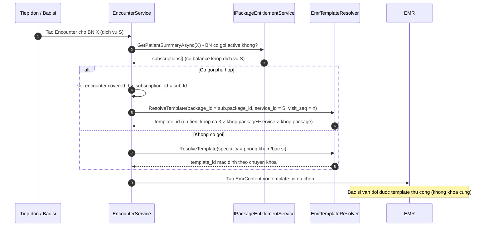

# Thiết kế kiến trúc — Master data Thuốc/Dịch vụ, Tham chiếu lộ trình diaB, EMR đa khoa template hoá

- **Phiên bản**: 1.1 — **BO đã chốt 3 quyết định**, 3 mục đỏ đã đóng
- **Ngày**: 2026-08-30 (v1.0 sáng, v1.1 chiều cùng ngày)
- **Tác giả**: Lành (architect)
- **Phạm vi**: Mục 3 (master data chuẩn BYT), Mục 4 (tham chiếu lộ trình diaB), Mục 5 (EMR template hoá)
- **KHÔNG thuộc phạm vi**: Master Organization xuyên tenant, phân biệt Subsidiary pháp nhân riêng (tạm gác theo yêu cầu BO)
- **Trạng thái code**: tài liệu thiết kế thuần — **không code, không chạy migration**. SQL trong tài liệu là *skeleton mẫu* để dev review.

---

## 0. Giả định & giới hạn khảo sát (BO cần biết trước khi đọc)

| # | Giả định / giới hạn | Ảnh hưởng |
|---|---|---|
| A1 | **Không truy cập được nguồn công khai BYT qua WebFetch** trong phiên này: `drugbank.vn` → `ENOTFOUND` (DNS chặn/không có mạng ra ngoài), `thuvienphapluat.vn` → **HTTP 403**. | Danh sách trường thuốc/dịch vụ ở Mục 3 dựng theo **kiến thức chuẩn về danh mục thuốc VN + cấu trúc XML 4210/QĐ 4750 đã hiện thực trong repo** (`BhytDtos.BhytTable2Row/Table4Row`), **chưa đối chiếu trực tiếp văn bản gốc**. → **Q3.1**: cần 1 người tải bản Excel danh mục thuốc của Cục QLD + phụ lục TT giá DVKT để chốt lần cuối. |
| A2 | Không cắm được MySQL docker local trong phiên này (không có shell). Dữ liệu mẫu đối chiếu lấy từ **migration + seed script** trong `db/migrations/` (`9005`, `9010`, `9110`, `9133_seed_drug_prices.sql`, `0040_service_catalog.sql`, `9008_seed_demo.sql`, `9020_seed_rich_demo.sql`). | Kết luận backward-compatible dựa trên DDL, không dựa trên dữ liệu thực tế production. Rủi ro thấp vì mọi cột đề xuất đều là **thêm mới, NULL-able**. |
| A3 | Repo diaB khảo sát được tại `D:\diab\dev\git_diab_internal\diab-dotnet-api` (GitLab `diab-group/diab-api`). Đã đọc entity + service thật. | Mục 4 dựa trên code thật, độ tin cậy cao. |
| A4 | Số migration cao nhất hiện tại trong repo = **9176** (`9176_internal_referrals.sql`). Mọi migration mẫu trong tài liệu này đánh số **9180 → 9184** để tránh va chạm. | |

---

## 0.1 Nhật ký quyết định (v1.1 — 2026-08-30)

| Mục đỏ cũ | Trạng thái | Quyết định chốt |
|---|---|---|
| **Q3.2** — bộ cột Drug trùng nghĩa | ✅ **ĐÓNG** | Chọn bộ **`9005`** (`name`/`drug_form`/`sell_price`/`requires_rx`) làm nguồn sự thật. Bộ `9010` → **deprecated, không drop**. Thêm cột **`route`** (bắt buộc) + **`bhyt_code`**. Chi tiết **§3.7**, migration `db/migrations/9180_drug_route_bhyt_code.sql.draft` |
| **Q4.x** — tích hợp diaB | ✅ **ĐÓNG (đổi phương án)** | **Bỏ Phương án A (tham chiếu tĩnh, cập nhật tay)**. Chốt **Phương án C: HIS gọi API diaB REAL-TIME** tại thời điểm mở màn khám, qua `IExternalPathwayProvider`. Chi tiết **§4.7** |
| **Q5.1** — hợp nhất EMR template | ✅ **ĐÓNG** | **Xoá bỏ luồng `diab_his_cli_diabetes_templates` riêng**; convert thành các dòng `EmrTemplate` (`speciality='DIABETES'`). Bác sĩ chọn từ dropdown. Làm **mức đơn giản** theo cách diaB. Chi tiết **§5.7**, migration `9181_emr_template_merge_diabetes.sql.draft` |

> ⚠️ **Điểm chặn duy nhất còn lại (blocked, phụ thuộc bên ngoài):**
> **diaB CHƯA CÓ endpoint REST nào trả dữ liệu lộ trình của 1 bệnh nhân cho hệ thống thứ 3 gọi server-to-server.** Đã khảo sát lại toàn bộ Controller — xem bằng chứng ở **§4.7.1**. HIS **không thể** code phần gọi API thật cho tới khi team diaB bổ sung endpoint. Contract đề xuất ở **§4.7.2**.

> 📌 **Sửa lỗi tài liệu v1.0**: tên bảng encounter thật là **`diab_his_enc_encounters`** (theo `docs/architecture/canonical-table-names.md:310`), **không phải** `diab_his_cli_encounters` như v1.0 phỏng đoán ở migration mẫu 9184. Đã sửa trong `9181_...draft`.

---

# MỤC 3 — Master data Thuốc / Dịch vụ theo chuẩn Bộ Y tế

## 3.1 Hiện trạng (trích code thật)

### 3.1.1 Thuốc — `diab_his_pha_drugs`

Entity: `backend/src/ProDiabHis.Domain/Entities/Pharmacy/Drug.cs`

```csharp
public class Drug : BaseEntity, ITenantScoped
{
    public int TenantId; public string Code; public string Name;
    public string? GenericName; public string? BrandName;
    public string? DrugForm; public string? Strength; public string Unit;
    public string? AtcCode; public string? DrugCategory;
    public bool IsControlled; public bool IsAntibiotic; public bool RequiresRx;
    public decimal SellPrice; public decimal? BhytPrice;
    public int ReorderLevel; public bool IsActive; public string? Note;
    // Migration 9110 - CHUA co nghiep vu nhap lieu, luon NULL
    public string? SoDangKy; public string? MaNhaThau;
}
```

DDL gốc `db/migrations/9005_create_pharmacy.sql` (dòng 17-52) + bổ sung:

- `9010_alter_pha_drugs_add_cols.sql` đã thêm (nhưng **KHÔNG map vào entity `Drug`**, chỉ Dapper dùng): `name_vi`, `name_en`, `form`, `manufacturer`, `country`, `price`, `category_id`, `requires_prescription`, `is_psychotropic`, `is_narcotic`, `dtqg_drug_code`, `status`.
- `9110_bhyt_xml_bang2_missing_fields.sql` thêm `so_dang_ky`, `ma_nha_thau` — comment trong file ghi rõ *"CHUA co nguon du lieu nhap lieu"*.

> **Phát hiện 1 — nợ kỹ thuật trùng lặp cột.** Bảng hiện có **2 bộ cột song song cùng ý nghĩa**:
> `drug_form` ↔ `form`; `sell_price` ↔ `price`; `requires_rx` ↔ `requires_prescription`; `is_controlled` ↔ (`is_narcotic` + `is_psychotropic`); `name` ↔ `name_vi`.
> Đây là hệ quả của migration 9010 sinh ra để "vá" cho Dapper handler. **Phải chốt nguồn sự thật trước khi bổ sung tiếp**, nếu không sẽ đẻ thêm bộ thứ 3. → **Q3.2**.

> **Phát hiện 2 — thiếu `route` (đường dùng) ở master.** XML BHYT Bảng 2 bắt buộc `DUONG_DUNG` (`BhytDtos.cs:161`). Hiện lấy từ `pha_prescription_items.route` (`BhytXmlSql.cs:84`) và **fallback hardcode `"uong"`** khi rỗng (`BhytXmlGeneratorImpl.cs:192`). Tức là bác sĩ gõ tay mỗi lần kê đơn; sai/thiếu → XML giám định sai. **Đường dùng là thuộc tính của thuốc, phải ở master data.**

### 3.1.2 Dịch vụ — `diab_his_bil_services`

`db/migrations/0040_service_catalog.sql` (dòng 4-22) + entity `BillingService.cs`:

```
id, tenant_id, code, name,
category VARCHAR(20)  -- 'CONSULTATION|PROCEDURE|LAB|RAD|PHARMACY|OTHER'
price, vat_rate, bhyt_code, bhyt_max_amount, is_active, audit
```

Bổ sung sau: `9152_service_branch_price_override.sql` (`ServiceBranchPrice` — giá theo chi nhánh), `9165_...` (permission override giá).

> **Phát hiện 3.** Danh mục dịch vụ hiện chỉ có **1 cấp phân loại** (`category` 6 giá trị) và **1 mã BHYT** (`bhyt_code`). Chuẩn thực tế cần tối thiểu:
> (a) **mã DVKT theo danh mục Bộ** (mã tương đương / mã dùng chung) tách khỏi mã nội bộ,
> (b) **nhóm chi phí BHYT** (nhóm 1..8 dùng khi quyết toán / Bảng 4),
> (c) **phân loại phẫu thuật – thủ thuật** (loại đặc biệt / I / II / III) vì ảnh hưởng giá và định mức,
> (d) **đơn vị/phòng thực hiện** (khoa/phòng nào làm) — hiện phải suy từ `category`.

## 3.2 Đề xuất thiết kế

### 3.2.1 Nguyên tắc chốt trước

| Q.ID | Nguyên tắc | Lý do |
|---|---|---|
| N1 ✅ **ĐÃ CHỐT** | **Bộ cột "nghiệp vụ" là `9005` (`drug_form`, `sell_price`, `requires_rx`, `name`)**; bộ cột từ `9010` (`form`, `price`, `requires_prescription`, `name_vi`) coi là **legacy alias, deprecate** | Entity `Drug.cs` (write path EF Core) chỉ map bộ `9005` ⇒ bộ này là source of truth. Migration deprecate: giữ cột, thêm COMMENT `DEPRECATED`, sửa Dapper handler đọc bộ chuẩn. |
| N2 | **Không tách bảng con `drug_ingredients`** ở MVP | Đa số thuốc phòng khám tuyến này là đơn hoạt chất hoặc phối hợp cố định 2-3 chất; lưu chuỗi `generic_name` + `composition` là đủ. Tách bảng khi có nhu cầu tra tương tác theo hoạt chất chuẩn hoá (CDSS đã có `cdss_ddi_pairs` riêng). → **Q3.3** |
| N3 | **`route` (đường dùng) chuẩn hoá bằng code list** chứ không free-text | Để XML BHYT hợp lệ. Code list: `uong, tiem_bap, tiem_tinh_mach, tiem_duoi_da, truyen_tinh_mach, ngam, dat, boi_ngoai, nho_mat, nho_mui, xit, hit, khac`. Lưu vào `diab_his_sys_code_master` (đã có bảng — `9034_create_code_master.sql`). |
| N4 | **Quy chế quản lý thuốc dùng 1 cột enum**, không dùng nhiều cột boolean rời | Hiện có `is_controlled`, `is_narcotic`, `is_psychotropic` chồng chéo. Thêm `control_schedule` ENUM là chuẩn duy nhất, 3 cột cũ giữ để backward-compat và **backfill 1 chiều** từ enum. |

### 3.2.2 Bảng field đầy đủ — THUỐC (`diab_his_pha_drugs`)

Cột **[có]** = đã tồn tại, **[MỚI]** = đề xuất thêm.

| Field (DB) | Kiểu | Bắt buộc | Trạng thái | Nguồn chuẩn tham chiếu | Ghi chú |
|---|---|---|---|---|---|
| `code` | VARCHAR(50) | ✅ | [có] | Nội bộ | Mã thuốc phòng khám, `UNIQUE(tenant_id, code)` |
| `name` | VARCHAR(255) | ✅ | [có] | Nhãn thuốc | Tên thuốc thương mại đầy đủ như trên giấy ĐKLH |
| `generic_name` | VARCHAR(255) | ⬜ *(→ ✅ nếu bán BHYT)* | [có] | INN / hoạt chất | Tên hoạt chất |
| `composition` | VARCHAR(500) | ⬜ | **[MỚI]** | Giấy ĐKLH mục "Thành phần" | Chuỗi đầy đủ cho thuốc phối hợp, vd `Metformin 500mg + Glimepirid 2mg` |
| `brand_name` | VARCHAR(255) | ⬜ | [có] | — | |
| `so_dang_ky` | VARCHAR(50) | ⬜ *(→ ✅ nếu bán BHYT)* | [có, chưa dùng] | **Cục QLD — SĐK lưu hành** | Format: `VD-xxxxx-yy` (SX trong nước), `VN-xxxxx-yy` / `VN-B/H-xxxxx-yy` (nhập khẩu), `QLĐB-xxx-yy` (đặc biệt), `QLSP-xxx-yy`, `GC-xxx-yy` (gia công). **Cần validation regex — Q3.4** |
| `sdk_expiry_date` | DATE | ⬜ | **[MỚI]** | Cục QLD | Ngày hết hiệu lực SĐK — cảnh báo khi kê thuốc SĐK hết hạn |
| `atc_code` | VARCHAR(20) | ⬜ | [có] | **WHO ATC** | 7 ký tự, vd `A10BA02` (metformin). Validation regex `^[A-V]\d{2}[A-Z]{2}\d{2}$` |
| `drug_form` | VARCHAR(50) | ✅ | [có] | Giấy ĐKLH — "Dạng bào chế" | Viên nén / viên nang / dung dịch tiêm / hỗn dịch / gói bột / thuốc mỡ... → **chuẩn hoá code list** |
| `strength` | VARCHAR(100) | ✅ | [có] | Giấy ĐKLH — "Hàm lượng/Nồng độ" | `500mg`, `250mg/5ml`, `100 IU/ml` |
| `route` | VARCHAR(30) | ✅ | **[MỚI]** | **XML 4210 Bảng 2 `DUONG_DUNG`** | Code list N3. **Chặn hardcode `"uong"` hiện tại** |
| `unit` | VARCHAR(20) | ✅ | [có] | — | Đơn vị tính nhỏ nhất (viên/ống/lọ) |
| `pack_size` | VARCHAR(100) | ⬜ | **[MỚI]** | Giấy ĐKLH — "Quy cách đóng gói" | `Hộp 3 vỉ x 10 viên` |
| `pack_unit` | VARCHAR(20) | ⬜ | **[MỚI]** | — | Đơn vị đóng gói (hộp/thùng) |
| `pack_factor` | DECIMAL(12,3) | ⬜ | **[MỚI]** | — | Hệ số quy đổi `pack_unit` → `unit` (nhập theo hộp, xuất theo viên) |
| `rx_class` | ENUM('RX','OTC') | ✅ | **[MỚI]** | **TT 07/2017/TT-BYT (danh mục thuốc không kê đơn)** | Thay `requires_rx` bool bằng enum tường minh; giữ `requires_rx` sync |
| `control_schedule` | ENUM('NONE','NARCOTIC','PSYCHOTROPIC','PRECURSOR','COMBINED') | ✅ | **[MỚI]** | **TT 20/2017/TT-BYT (gây nghiện/hướng thần/tiền chất)** | N4. `COMBINED` = thuốc dạng phối hợp có chứa dược chất gây nghiện/hướng thần |
| `is_antibiotic` | TINYINT(1) | ✅ | [có] | Chương trình quản lý kháng sinh | |
| `is_biological` | TINYINT(1) | ⬜ | **[MỚI]** | — | Sinh phẩm/vaccine — khác quy chế bảo quản |
| `storage_condition` | VARCHAR(100) | ⬜ | **[MỚI]** | Giấy ĐKLH | `Bảo quản 2-8°C` — cần cho quản lý kho lạnh |
| `shelf_life_months` | INT | ⬜ | **[MỚI]** | Giấy ĐKLH — "Tuổi thọ" | |
| `manufacturer` | VARCHAR(255) | ⬜ | [có — cột `9010`] | Giấy ĐKLH | **Cần map vào entity `Drug`** (hiện chưa) |
| `manufacturer_country` | VARCHAR(100) | ⬜ | [có — cột `country`] | Giấy ĐKLH | đổi tên logic, giữ cột vật lý |
| `registrant` | VARCHAR(255) | ⬜ | **[MỚI]** | Giấy ĐKLH — "Cơ sở đăng ký" | Khác nhà sản xuất; cần cho truy xuất |
| `bhyt_code` | VARCHAR(50) | ⬜ *(→ ✅ nếu bán BHYT)* | **[MỚI]** | **Danh mục thuốc BHYT (TT 20/2022/TT-BYT + sửa đổi)** | **Hiện thuốc KHÔNG có mã BHYT riêng** — XML Bảng 2 đang dùng `code` nội bộ ⇒ rủi ro giám định. **Rủi ro cao, xem 3.5** |
| `bhyt_group` | VARCHAR(20) | ⬜ | **[MỚI]** | Danh mục thuốc BHYT | Nhóm/phân nhóm trong danh mục (vd nhóm điều trị) |
| `bhyt_payment_rate` | DECIMAL(5,2) | ⬜ | **[MỚI]** | Danh mục thuốc BHYT | Tỷ lệ thanh toán (100/50/30%) — có thuốc chỉ được TT một phần |
| `bhyt_condition` | VARCHAR(500) | ⬜ | **[MỚI]** | Danh mục thuốc BHYT | Điều kiện thanh toán (hạng BV, chỉ định giới hạn) |
| `ma_nha_thau` | VARCHAR(50) | ⬜ | [có, chưa dùng] | Kết quả đấu thầu | Nên chuyển sang bảng `pha_tender_items` khi có module thầu — **Q3.5** |
| `dtqg_drug_code` | VARCHAR(50) | ⬜ | [có — cột `9010`] | **ĐTQG donthuocquocgia.vn / TT 27/2021** | Mã thuốc trong hệ ĐTQG. Cần map vào entity |
| `sell_price`, `bhyt_price`, `reorder_level`, `is_active`, `note`, `drug_category` | | | [có] | | Giữ nguyên |
| `default_dosage_hint` | VARCHAR(200) | ⬜ | **[MỚI]** | — | Gợi ý liều mặc định khi kê đơn (UX, giảm gõ tay) — *tuỳ chọn, có thể bỏ nếu BO thấy dư* |

**Deprecate (giữ cột, gắn COMMENT `DEPRECATED`, không dùng ở code mới)**: `form`, `price`, `requires_prescription`, `name_vi`, `name_en`, `is_narcotic`, `is_psychotropic`, `category_id`, `status`.

### 3.2.3 Bảng field đầy đủ — DỊCH VỤ / XN / CĐHA (`diab_his_bil_services`)

| Field (DB) | Kiểu | Bắt buộc | Trạng thái | Nguồn chuẩn tham chiếu | Ghi chú |
|---|---|---|---|---|---|
| `code` | VARCHAR(50) | ✅ | [có] | Nội bộ | |
| `name` | VARCHAR(255) | ✅ | [có] | | Nên khớp **tên DVKT trong danh mục Bộ** để giám định không bắt lỗi |
| `category` | VARCHAR(20) | ✅ | [có] | Nội bộ | `CONSULTATION\|PROCEDURE\|LAB\|RAD\|PHARMACY\|OTHER` — giữ, dùng cho routing UI |
| `service_group` | ENUM('KHAM','XET_NGHIEM','CDHA','TDCN','THU_THUAT','PHAU_THUAT','VAN_CHUYEN','GIUONG','KHAC') | ✅ | **[MỚI]** | **Phân nhóm DVKT theo danh mục Bộ Y tế** | Chi tiết hơn `category`; `category` là nhóm kỹ thuật UI, `service_group` là nhóm **nghiệp vụ/quyết toán** |
| `dvkt_code` | VARCHAR(50) | ⬜ *(→ ✅ nếu bán BHYT)* | **[MỚI]** | **Mã DVKT danh mục dùng chung Bộ Y tế** | **Tách khỏi `code` nội bộ.** Hiện `bhyt_code` đang gánh cả 2 vai trò |
| `dvkt_equivalent_code` | VARCHAR(50) | ⬜ | **[MỚI]** | Phụ lục "mã tương đương" của TT giá DVKT | DV của phòng khám ánh xạ về DV tương đương trong danh mục Bộ để áp giá |
| `dvkt_name_standard` | VARCHAR(255) | ⬜ | **[MỚI]** | Danh mục Bộ | Tên chuẩn (khác tên hiển thị nội bộ) |
| `bhyt_group_no` | TINYINT | ⬜ | **[MỚI]** | Nhóm chi phí trong quyết toán BHYT | Dùng khi tổng hợp Bảng 4 / báo cáo quyết toán theo nhóm |
| `procedure_class` | ENUM('NONE','DAC_BIET','LOAI_1','LOAI_2','LOAI_3') | ⬜ | **[MỚI]** | Phân loại PT-TT của Bộ Y tế | Chỉ áp dụng khi `service_group IN ('THU_THUAT','PHAU_THUAT')` |
| `price` / `vat_rate` | | ✅ | [có] | | Giá dịch vụ **không BHYT** |
| `bhyt_price` | DECIMAL(15,2) | ⬜ | **[MỚI]** | **TT giá DVKT BHYT (TT 21/2023/TT-BYT hoặc VB thay thế)** | Hiện chỉ có `bhyt_max_amount`. Cần tách rõ **giá BHYT** vs **trần thanh toán** |
| `bhyt_max_amount` | DECIMAL(15,2) | ⬜ | [có] | | Giữ nguyên nghĩa "trần" |
| `price_effective_from` / `price_effective_to` | DATE | ⬜ | **[MỚI]** | | Giá DVKT thay đổi theo thông tư; cần lịch sử để xuất XML đúng giá **tại thời điểm khám**. **Rủi ro cao, xem 3.5** |
| `performing_dept_code` | VARCHAR(30) | ⬜ | **[MỚI]** | Nội bộ + `diab_his_clinic_rooms` | Khoa/phòng thực hiện — routing chỉ định CLS tự động |
| `default_room_id` | CHAR(36) | ⬜ | **[MỚI]** | — | Phòng mặc định thực hiện |
| `specimen_type` | VARCHAR(50) | ⬜ | **[MỚI]** | LOINC/nội bộ | Chỉ với `XET_NGHIEM`: máu/nước tiểu/dịch... |
| `loinc_code` | VARCHAR(20) | ⬜ | **[MỚI]** | **LOINC** | Cho FHIR `Observation.code` — hiện FHIR mapping XN chưa có mã chuẩn |
| `turnaround_minutes` | INT | ⬜ | **[MỚI]** | — | SLA trả kết quả, phục vụ cảnh báo trễ (đã có `lab_partner_sla` — nên đồng bộ) |
| `requires_consent` | TINYINT(1) | ⬜ | **[MỚI]** | Quy định thủ thuật/PT | Bắt buộc phiếu cam kết trước khi thực hiện |
| `gender_restriction` | ENUM('ANY','MALE','FEMALE') | ⬜ | **[MỚI]** | Danh mục Bộ | Chặn chỉ định sai (vd siêu âm thai cho BN nam) |
| `is_active` | | ✅ | [có] | | |

### 3.2.4 FHIR R4 mapping

| Entity | FHIR Resource | Ghi chú |
|---|---|---|
| `Drug` | `Medication` | `.code` = ATC (`system: http://www.whocc.no/atc`), `.form` = `drug_form`, `.ingredient.strength` = `strength`, `.identifier` = `so_dang_ky` (`system: urn:vn:qld:sdk`) |
| `BillingService` (XN) | `ActivityDefinition` (định nghĩa) + kết quả → `Observation` | `.code` = `loinc_code` khi có, fallback `dvkt_code` (`system: urn:vn:byt:dvkt`) |
| `BillingService` (thủ thuật/PT) | `ActivityDefinition` → thực hiện = `Procedure` | `procedure_class` → `Procedure.category` extension |
| `BillingService` (khám) | `HealthcareService` | |

### 3.2.5 Mã hoá AES-256-GCM

**Không có trường nào trong Mục 3 cần mã hoá** — toàn bộ là danh mục, không phải PII/PHI. (Khác với `pat_patients` đã xử lý ở `9100_pii_encryption_blind_index.sql`.)

## 3.3 Migration mẫu (KHÔNG chạy — chỉ để dev review)

> Dùng helper `add_col_if_missing` từ `db/migrations/0000_helpers.sql` và `add_index_if_missing`. Đánh số **9180/9181** (cao nhất hiện tại 9176).

`db/migrations/9180_master_drug_standard_fields.sql` *(mẫu)*

```sql
-- ============================================================
-- Migration: 9180_master_drug_standard_fields  [DE XUAT - CHUA CHAY]
-- Muc dich: Bo sung truong danh muc thuoc theo chuan VN (SDK, duong dung,
--   quy che quan ly, dong goi, ma BHYT thuoc).
-- Idempotent: YES (add_col_if_missing)
-- Phu thuoc: 0000_helpers.sql, 9005_create_pharmacy.sql, 9110
-- LUU Y: moi cot deu NULL-able => backward compatible 100%, khong backfill bat buoc.
-- ============================================================
SET NAMES utf8mb4;

-- --- Nhan dang & dang ky luu hanh ---
CALL add_col_if_missing('diab_his_pha_drugs', 'composition',
  "VARCHAR(500) NULL COMMENT 'Thanh phan day du (thuoc phoi hop)'");
CALL add_col_if_missing('diab_his_pha_drugs', 'sdk_expiry_date',
  "DATE NULL COMMENT 'Ngay het hieu luc so dang ky luu hanh'");
CALL add_col_if_missing('diab_his_pha_drugs', 'registrant',
  "VARCHAR(255) NULL COMMENT 'Co so dang ky (khac nha san xuat)'");

-- --- Duong dung: BAT BUOC cho XML 4210 Bang 2 (DUONG_DUNG) ---
CALL add_col_if_missing('diab_his_pha_drugs', 'route',
  "VARCHAR(30) NULL COMMENT 'Duong dung chuan hoa: uong|tiem_bap|tiem_tinh_mach|... (code_master group DRUG_ROUTE)'");

-- --- Dong goi / quy doi don vi ---
CALL add_col_if_missing('diab_his_pha_drugs', 'pack_size',
  "VARCHAR(100) NULL COMMENT 'Quy cach dong goi, vd Hop 3 vi x 10 vien'");
CALL add_col_if_missing('diab_his_pha_drugs', 'pack_unit',
  "VARCHAR(20) NULL COMMENT 'Don vi dong goi (hop/thung)'");
CALL add_col_if_missing('diab_his_pha_drugs', 'pack_factor',
  "DECIMAL(12,3) NULL COMMENT 'He so quy doi pack_unit -> unit'");

-- --- Quy che quan ly ---
CALL add_col_if_missing('diab_his_pha_drugs', 'rx_class',
  "ENUM('RX','OTC') NOT NULL DEFAULT 'RX' COMMENT 'Ke don / khong ke don (TT 07/2017)'");
CALL add_col_if_missing('diab_his_pha_drugs', 'control_schedule',
  "ENUM('NONE','NARCOTIC','PSYCHOTROPIC','PRECURSOR','COMBINED') NOT NULL DEFAULT 'NONE'
   COMMENT 'Quy che quan ly dac biet (TT 20/2017)'");
CALL add_col_if_missing('diab_his_pha_drugs', 'is_biological',
  "TINYINT(1) NOT NULL DEFAULT 0 COMMENT 'Sinh pham / vaccine'");
CALL add_col_if_missing('diab_his_pha_drugs', 'storage_condition',
  "VARCHAR(100) NULL COMMENT 'Dieu kien bao quan'");
CALL add_col_if_missing('diab_his_pha_drugs', 'shelf_life_months',
  "INT NULL COMMENT 'Tuoi tho (thang)'");

-- --- BHYT ---
CALL add_col_if_missing('diab_his_pha_drugs', 'bhyt_code',
  "VARCHAR(50) NULL COMMENT 'Ma thuoc theo danh muc thuoc BHYT - dung cho XML Bang 2 thay vi ma noi bo'");
CALL add_col_if_missing('diab_his_pha_drugs', 'bhyt_group',
  "VARCHAR(20) NULL COMMENT 'Nhom trong danh muc thuoc BHYT'");
CALL add_col_if_missing('diab_his_pha_drugs', 'bhyt_payment_rate',
  "DECIMAL(5,2) NULL COMMENT 'Ty le thanh toan BHYT (%)'");
CALL add_col_if_missing('diab_his_pha_drugs', 'bhyt_condition',
  "VARCHAR(500) NULL COMMENT 'Dieu kien thanh toan BHYT'");

CALL add_col_if_missing('diab_his_pha_drugs', 'default_dosage_hint',
  "VARCHAR(200) NULL COMMENT 'Goi y lieu dung mac dinh (UX)'");

-- --- Index ---
CALL add_index_if_missing('diab_his_pha_drugs', 'idx_drugs_sdk',        '(tenant_id, so_dang_ky)');
CALL add_index_if_missing('diab_his_pha_drugs', 'idx_drugs_bhyt_code',  '(tenant_id, bhyt_code)');
CALL add_index_if_missing('diab_his_pha_drugs', 'idx_drugs_atc',        '(tenant_id, atc_code)');
CALL add_index_if_missing('diab_his_pha_drugs', 'idx_drugs_control',    '(tenant_id, control_schedule)');

-- --- Danh dau cot LEGACY (khong xoa - tranh vo Dapper handler hien tai) ---
-- ALTER TABLE diab_his_pha_drugs MODIFY COLUMN `form` VARCHAR(100) NULL
--   COMMENT 'DEPRECATED 2026-08-30 - dung drug_form';
-- (thuc hien o migration rieng sau khi da sua DrugHandlers.cs)
```

`db/migrations/9181_master_service_standard_fields.sql` *(mẫu)*

```sql
-- ============================================================
-- Migration: 9181_master_service_standard_fields  [DE XUAT - CHUA CHAY]
-- Muc dich: Bo sung truong danh muc DVKT theo chuan Bo Y te.
-- Idempotent: YES. Tat ca cot NULL-able (tru service_group co DEFAULT).
-- ============================================================
SET NAMES utf8mb4;

CALL add_col_if_missing('diab_his_bil_services', 'service_group',
  "ENUM('KHAM','XET_NGHIEM','CDHA','TDCN','THU_THUAT','PHAU_THUAT','VAN_CHUYEN','GIUONG','KHAC')
   NOT NULL DEFAULT 'KHAC' COMMENT 'Nhom DVKT nghiep vu/quyet toan'");
CALL add_col_if_missing('diab_his_bil_services', 'dvkt_code',
  "VARCHAR(50) NULL COMMENT 'Ma DVKT theo danh muc dung chung Bo Y te'");
CALL add_col_if_missing('diab_his_bil_services', 'dvkt_equivalent_code',
  "VARCHAR(50) NULL COMMENT 'Ma DVKT tuong duong de ap gia'");
CALL add_col_if_missing('diab_his_bil_services', 'dvkt_name_standard',
  "VARCHAR(255) NULL COMMENT 'Ten DVKT chuan theo danh muc Bo'");
CALL add_col_if_missing('diab_his_bil_services', 'bhyt_group_no',
  "TINYINT NULL COMMENT 'Nhom chi phi trong quyet toan BHYT'");
CALL add_col_if_missing('diab_his_bil_services', 'bhyt_price',
  "DECIMAL(15,2) NULL COMMENT 'Gia BHYT theo TT gia DVKT (khac bhyt_max_amount = tran TT)'");
CALL add_col_if_missing('diab_his_bil_services', 'procedure_class',
  "ENUM('NONE','DAC_BIET','LOAI_1','LOAI_2','LOAI_3') NOT NULL DEFAULT 'NONE'
   COMMENT 'Phan loai PT-TT (chi ap dung service_group THU_THUAT/PHAU_THUAT)'");
CALL add_col_if_missing('diab_his_bil_services', 'price_effective_from', "DATE NULL");
CALL add_col_if_missing('diab_his_bil_services', 'price_effective_to',   "DATE NULL");
CALL add_col_if_missing('diab_his_bil_services', 'performing_dept_code', "VARCHAR(30) NULL");
CALL add_col_if_missing('diab_his_bil_services', 'default_room_id',      "CHAR(36) NULL");
CALL add_col_if_missing('diab_his_bil_services', 'specimen_type',        "VARCHAR(50) NULL");
CALL add_col_if_missing('diab_his_bil_services', 'loinc_code',           "VARCHAR(20) NULL");
CALL add_col_if_missing('diab_his_bil_services', 'turnaround_minutes',   "INT NULL");
CALL add_col_if_missing('diab_his_bil_services', 'requires_consent',
  "TINYINT(1) NOT NULL DEFAULT 0");
CALL add_col_if_missing('diab_his_bil_services', 'gender_restriction',
  "ENUM('ANY','MALE','FEMALE') NOT NULL DEFAULT 'ANY'");

CALL add_index_if_missing('diab_his_bil_services', 'idx_svc_group',  '(tenant_id, service_group, is_active)');
CALL add_index_if_missing('diab_his_bil_services', 'idx_svc_dvkt',   '(tenant_id, dvkt_code)');
CALL add_index_if_missing('diab_his_bil_services', 'idx_svc_loinc',  '(tenant_id, loinc_code)');

-- Backfill service_group tu category hien co (an toan, 1 chieu)
UPDATE diab_his_bil_services SET service_group = CASE category
    WHEN 'CONSULTATION' THEN 'KHAM'
    WHEN 'LAB'          THEN 'XET_NGHIEM'
    WHEN 'RAD'          THEN 'CDHA'
    WHEN 'PROCEDURE'    THEN 'THU_THUAT'
    ELSE 'KHAC' END
WHERE service_group = 'KHAC' AND deleted_at IS NULL;
```

`db/migrations/9182_seed_code_master_drug_route.sql` *(mẫu — seed code list đường dùng + dạng bào chế vào `diab_his_sys_code_master`)* — chi tiết để dev viết theo pattern `9035_seed_code_master.sql`.

## 3.4 Backward-compatibility

| Điểm | Đánh giá |
|---|---|
| Mọi cột đề xuất là **ADD COLUMN NULL-able** (hoặc có DEFAULT) | ✅ Không phá `INSERT` hiện có |
| `Drug.cs` / `BillingService.cs` là entity EF Core → thêm property mới **không** bắt buộc | ✅ Nhưng nếu thêm property mà quên migration → EF sinh lỗi runtime. Backend phải chạy migration trước |
| Dapper handler `DrugHandlers.cs` / `ServiceCatalogHandlers.cs` đang `SELECT` cột tường minh | ✅ Không vỡ; nhưng phải bổ sung cột mới vào SELECT list mới hiển thị được |
| Excel import `ServiceExcelParserImpl.cs` | ⚠️ Cần bổ sung cột mới vào template Excel — **file mẫu đang phát cho khách phải phát lại**. Đề xuất: cột mới **optional** trong parser |
| Seed hiện có (`9008`, `9020`, `9133_seed_drug_prices.sql`) | ✅ Không đụng; các cột mới sẽ NULL/DEFAULT |

## 3.5 Rủi ro / đánh đổi (Mục 3)

| # | Rủi ro | Mức | Giảm thiểu |
|---|---|---|---|
| R3.1 | **Thuốc chưa có `bhyt_code` riêng** — XML Bảng 2 đang đẩy mã nội bộ `code`. Nếu tenant có hợp đồng BHYT thật, hồ sơ **sẽ bị từ chối giám định**. | 🔴 Cao | Thêm `bhyt_code`; validation "không cho phát hành XML nếu có thuốc BHYT thiếu `bhyt_code`" |
| R3.2 | **Không có lịch sử giá dịch vụ** — khi TT giá thay đổi, XML hồ sơ cũ xuất lại sẽ dùng giá mới → sai số liệu quyết toán. | 🔴 Cao | `price_effective_from/to`; hoặc **snapshot giá vào `bil_billing_items`** (khuyến nghị: đã snapshot? cần dev xác nhận) |
| R3.3 | Trùng lặp cột `9005` vs `9010` không được dọn → đẻ thêm nợ kỹ thuật | 🟠 Trung bình | Chốt N1, deprecate ở migration riêng sau khi sửa handler |
| R3.4 | Thêm ~20 cột vào form nhập liệu thuốc → **UX quá tải cho lễ tân/dược sĩ** | 🟠 Trung bình | Form chia tab: *Cơ bản* (bắt buộc) / *Đăng ký lưu hành* / *BHYT* / *Kho*. Chỉ tab 1 bắt buộc |
| R3.5 | Không đối chiếu được văn bản gốc (A1) → tên/format field có thể lệch chuẩn | 🟠 Trung bình | **Q3.1** — cần 1 vòng review với dữ liệu Excel thật trước khi code |
| R3.6 | `ENUM` MySQL khó thêm giá trị về sau (phải ALTER) | 🟡 Thấp | Với `service_group`/`control_schedule` đã liệt kê đủ + có `KHAC`/`NONE`. Nếu BO thấy còn biến động → dùng `VARCHAR` + `code_master` |

## 3.6 Câu hỏi mở — Mục 3 (cần BO xác nhận trước khi code)

| ID | Câu hỏi |
|---|---|
| **Q3.1** | Ai cung cấp **file danh mục chuẩn thật** (Excel danh mục thuốc Cục QLD + phụ lục danh mục & giá DVKT)? Không có file này thì tên/format cột chỉ ở mức "hợp lý", chưa "đúng chuẩn". |
| ~~Q3.2~~ | ✅ **ĐÃ ĐÓNG** — chốt bộ `9005`. Xem **§3.7**. |
| **Q3.3** | Có cần bảng con **`drug_ingredients`** (chuẩn hoá hoạt chất nhiều dòng) hay chuỗi `composition` là đủ cho giai đoạn này? |
| **Q3.4** | Có bắt **validate regex SĐK** không, hay chỉ lưu free-text? Nếu validate cứng, thuốc có SĐK format cũ/đặc biệt sẽ không nhập được. |
| **Q3.5** | `ma_nha_thau` giữ ở `pha_drugs` hay tách bảng `pha_tender_items` (1 thuốc có thể trúng nhiều gói thầu, giá khác nhau)? Đề xuất: **tách bảng khi có module thầu**, tạm giữ nguyên. |
| **Q3.6** | Phòng khám Pro-Diab **có ký hợp đồng BHYT** không? Nếu KHÔNG, toàn bộ nhóm cột `bhyt_*` có thể hoãn sang phase sau → tiết kiệm đáng kể công sức. |

## 3.7 QUYẾT ĐỊNH 1 (đóng Q3.2) — chốt bộ cột `9005`, deprecate `9010`

### 3.7.1 Quyết định

> **Nguồn sự thật của bảng thuốc là bộ cột `9005`: `name`, `drug_form`, `sell_price`, `requires_rx`.**
> Bộ cột từ migration `9010` (`name_vi`, `form`, `price`, `requires_prescription`, `is_narcotic`, `is_psychotropic`) → **DEPRECATED**.

**Lý do kỹ thuật (không phải sở thích):** entity EF `Drug.cs` — write path duy nhất của module Dược — chỉ map bộ `9005`. Toàn bộ nghiệp vụ kê đơn / xuất kho / tính giá chạy qua entity này. Chọn `9010` đồng nghĩa viết lại entity + mọi service phụ thuộc.

**KHÔNG drop bộ `9010` trong đợt này** — còn code đang đọc/ghi (§3.7.2). Chỉ gắn `COMMENT 'DEPRECATED'`.

### 3.7.2 Bằng chứng: bộ `9010` ĐANG có dữ liệu mà `9005` không có

Không cắm được MySQL trong phiên này (giới hạn A2) — nhưng **không cần đoán**, code đã tự khai báo:

| Bằng chứng (đọc code thật) | Kết luận |
|---|---|
| `backend/src/ProDiabHis.Infrastructure/Pharmacy/ClosedXmlImporter.cs:104-122` — luồng **import Excel thuốc** `INSERT`/`UPDATE` vào `name_en, generic_name, atc_code, form, price, requires_prescription, is_psychotropic, is_narcotic` (bộ `9010`), **không** ghi `drug_form`/`sell_price`/`requires_rx` | Mọi thuốc nhập bằng Excel → bộ `9005` rỗng, bộ `9010` có dữ liệu. **Đây là ca cần đồng bộ.** |
| `ReportRegistry.cs:1967` comment nguyên văn: *"Ten hien thi thuoc: uu tien name_vi (hien dang rong o data that) roi name"* | Dev trước đã gặp lệch dữ liệu 2 bộ cột trên data thật |
| `ReportRegistry.cs:2255-2256`: `COALESCE(NULLIF(d.sell_price,0), d.price, 0)` và `CASE WHEN d.requires_prescription = 1 OR d.requires_rx = 1` | Báo cáo đang **phòng thủ 2 chiều** — xác nhận cả 2 bộ đều có thể là bên có dữ liệu |
| `ReportRegistry.cs` (10+ chỗ) + `ReportingServiceImpl.cs:123` dùng `COALESCE(NULLIF(d.name_vi,''), d.name)` | Nếu không đồng bộ trước khi deprecate → báo cáo mất tên thuốc |

⇒ **Bắt buộc chạy phần SYNC 1 chiều `9010 → 9005` trước khi deprecate.** Migration đã kèm sẵn **query PRE-CHECK** để dev chạy tay và đọc số thật trước (`*_need_sync`), nếu = 0 thì bỏ qua phần sync.

⚠️ **Cảnh báo tên bảng cần dev xác nhận trước khi chạy**: importer và seed ghi vào **`pha_drug_master`** (`ClosedXmlImporter.cs:104`, `db/seeds/sample_pharmacy_demo.sql`), còn canonical là `diab_his_pha_drugs`. Phải xác nhận `pha_drug_master` là **VIEW** trên bảng canonical hay là **bảng riêng**. Nếu là bảng riêng → đó là một nợ kỹ thuật thứ hai, phải xử lý trước khi chạy migration.

### 3.7.3 Cột `route` — BẮT BUỘC, vá lỗ hổng hardcode

`BhytXmlGeneratorImpl.cs:192` đang **fallback cứng `"uong"`** khi `pha_prescription_items.route` rỗng, trong khi `DUONG_DUNG` là trường bắt buộc của XML 4210 Bảng 2. Hệ quả: thuốc tiêm/nhỏ mắt bị khai là đường uống → **hồ sơ sai, rủi ro xuất toán**.
`docs/testing/smoke-test-matrix.md:111` cũng đã ghi nhận `drug_master` **thiếu cột `route`**.

Sau khi có `diab_his_pha_drugs.route`, thứ tự lấy giá trị:
`prescription_items.route` → `drugs.route` → **nếu cả 2 rỗng: KHÔNG phát hành XML**, trả lỗi `DRUG_ROUTE_MISSING` (400) kèm danh sách thuốc thiếu. **Tuyệt đối không hardcode lại.**

Migration còn kèm **backfill `route`** cho thuốc đã từng được kê, lấy đường dùng gần nhất trong lịch sử `pha_prescription_items` — an toàn hơn để NULL rồi rơi lại vào hardcode.

### 3.7.4 Migration mẫu

📄 **`db/migrations/9180_drug_route_bhyt_code.sql.draft`** — *đuôi `.draft` = CHƯA CHẠY, chưa vào APPLY_ORDER.*

Gồm 4 phần: **(A)** query PRE-CHECK chạy tay · **(B)** SYNC 1 chiều `9010 → 9005` (chỉ ghi khi đích rỗng/0, bộ `9005` luôn thắng) · **(C)** `ADD COLUMN route` + `bhyt_code` + index + backfill route · **(D)** `COMMENT 'DEPRECATED'` cho 6 cột `9010` (đang comment-out, cần lấy đúng kiểu từ `SHOW CREATE TABLE` vì `MODIFY` sẽ ghi đè kiểu).

**Việc code phải làm kèm (ngoài migration):** sửa `ClosedXmlImporter.cs` ghi sang bộ `9005` + cột `route`; bỏ hardcode ở `BhytXmlGeneratorImpl.cs:192`; map `Route`/`BhytCode` vào `Drug.cs`; thêm cột `route` (optional) vào template Excel nhập thuốc.

---

# MỤC 4 — Gói dịch vụ tham chiếu lộ trình từ diaB

> **Phạm vi đã chốt với BO**: HIS **KHÔNG** xây lại engine lộ trình. Chỉ cần (a) hiển thị bệnh nhân đang ở giai đoạn nào, (b) đánh dấu dịch vụ thuộc gói, (c) quyết định có tính phí không (**đã có**).

## 4.1 Khảo sát repo diaB (code thật)

Repo: `D:\diab\dev\git_diab_internal\diab-dotnet-api` (GitLab `diab-group/diab-api`, .NET + EF Core, MySQL).

### 4.1.1 Entity chính

| Entity | File | Trường then chốt |
|---|---|---|
| `PackageEntity` | `API/Src/DiaB.Data/Database/Entities/Package/PackageEntity.cs` | `Name`, **`Duration`** (số tuần/tháng/năm), **`DurationType`** (`Week=0 / Month=1 / Year=2`), **`IsRoadmap`** (bool — gói này CÓ lộ trình hay không), `Price`, `Level`, `Sponsor` |
| `PackageAccountEntity` | `.../Package/PackageAccountEntity.cs` | `AccountId` (**UNIQUE** — 1 tài khoản chỉ 1 gói đang hiệu lực), `PackageId`, **`ActivationDate`**, `ExpirationDate`, `PackageAccountTransactionId`, `ExerciseMovementStartDay` |
| `PackageAccountTransaction` | `.../Package/PackageAccountTransaction.cs` | Giao dịch mua gói: `BoughtDate`, `ActiveDate`, `AddonDate`, `Status` (`PackageAccountTransactionStatus`), `StatusTag`, `BookingId`, `AppointmentDate` |
| `PackageAccountServicesEntity` | `.../Package/PackageAccountServicesEntity.cs`, table `package_account_services_mapping` | Map gói ↔ dịch vụ: `TranServicePackageId`, `UserPackageId`, `TotalDisplay`, `UserPackageStartDate/EndDate` |
| `PackageAgendaEntity` | `.../Agenda/PackageAgendaEntity.cs` | Map gói ↔ nội dung chương trình (agenda/bài học) |
| `PackageAccountHistoryEntity` | `.../Package/PackageAccountHistoryEntity.cs` | Lịch sử gói |

### 4.1.2 Cách diaB track "đang ở giai đoạn nào / đã hoàn thành bước nào"

**Phát hiện quan trọng nhất: diaB KHÔNG lưu bảng milestone/stage. Toàn bộ lộ trình được TÍNH RA (derived) tại runtime.**

`AccountService.cs:1205-1222` (và bản thứ 2 ở `1262-1278`):

```csharp
if (!ownPackage.Package.IsRoadmap) { result.OwnRoadmap = null; return result; }

var currentWeek = result.ActivationDate.DetermineWeekInRoadmap(ownPackage.Package.Duration);
result.EndDateFirst = result.ActivationDate.DetermineFirstWeekExpirationDate();
result.OwnRoadmap = new AccountDtos.OwnRoadmapItem()
{
    StartWeek        = 0,                                // ban khac dung StartWeek = 1
    EndWeek          = ownPackage.Package.Duration - 1,
    CurrentDay       = DateTime.UtcNow.Date.GetDiffDay(result.ActivationDate.Date),
    CurrentWeek      = currentWeek,
    FirstDayInWeek   = result.ActivationDate.DetermineFirstDayInWeekRoadmap(currentWeek),
    LastDayInWeek    = result.ActivationDate.DetermineLastDayInWeekRoadmap(currentWeek),
    ExerciseMovementStartDay = ownPackage.ExerciseMovementStartDay,
};
```

DTO trạng thái lộ trình (`OwnRoadmapItem.cs`) chỉ có **7 số nguyên**: `StartWeek, EndWeek, CurrentDay, CurrentWeek, FirstDayInWeek, LastDayInWeek, ExerciseMovementStartDay`.

Trạng thái "hoàn thành" nằm ở **cấp tuần**, enum `AgendaWeekStudyStates` (`DiaB.Common/Enums/Agenda/AgendaWeekStates.cs`):
`InCompleted=0 | Completed=1 | InProgress=2 | Future=3` — được `AgendaService.cs:514` và `LessonService.cs:569` lặp từ `StartWeek→EndWeek` để dựng trạng thái từng tuần, **cache Redis** (`GeneralCacheKey.GetLessonWeekStudyStates`).

**Kết luận khảo sát:**
1. "Giai đoạn" của diaB = **số tuần thứ N kể từ `ActivationDate`**, không phải milestone nghiệp vụ có tên.
2. Không có bảng `Pathway`/`Milestone`/`CarePlan` — **không có gì để "đồng bộ schema" sang HIS**.
3. Trạng thái hoàn thành gắn với **học liệu (agenda/lesson/exercise)**, thuộc miền coaching của app diaB — **không phải miền khám chữa bệnh của HIS**.
4. Ràng buộc `PackageAccountEntity.AccountId` **UNIQUE** ⇒ diaB giả định **1 người dùng chỉ 1 gói active**. HIS thì cho phép nhiều subscription (`idx_sub_patient_active`) — **mô hình không tương thích 1-1**, càng củng cố việc không nên copy.

## 4.2 Hai phương án tích hợp *(LỊCH SỬ — BO đã bác, xem §4.7)*

> ⛔ **v1.1: BO KHÔNG chọn Phương án A cũng không chọn Phương án B.**
> BO chốt **Phương án C — gọi API diaB real-time tại thời điểm khám** (§4.7).
> Giữ nguyên §4.2 bên dưới làm hồ sơ đánh đổi (input cho ADR `0012`), **không phải thiết kế để implement**.

### Phương án A — Trường tham chiếu tối giản trên `pkg_subscriptions` ❌ **BỊ BÁC (v1.1)**

Thêm 6 cột vào `diab_his_pkg_subscriptions` (bảng đã có, migration `9092`):

| Cột | Kiểu | Ý nghĩa |
|---|---|---|
| `external_system` | `VARCHAR(20) NULL` | `'diaB'` — mở đường cho hệ khác sau này |
| `external_package_ref` | `VARCHAR(64) NULL` | `PackageEntity.Id` / `Code` bên diaB |
| `external_subscription_ref` | `VARCHAR(64) NULL` | `PackageAccountEntity.Id` hoặc `PackageAccountTransactionId` bên diaB |
| `external_pathway_stage` | `VARCHAR(100) NULL` | **Nhãn hiển thị thuần text**, vd `"Tuần 6/24"`, `"Giai đoạn ổn định"`. HIS **không parse, không tính toán** |
| `external_pathway_progress` | `TINYINT NULL` | 0-100, chỉ để vẽ progress bar. `NULL` = không biết |
| `external_synced_at` | `DATETIME(3) NULL` | Lần cập nhật gần nhất. UI hiển thị *"Cập nhật lúc …"* + cảnh báo nếu quá cũ |

**MVP**: cập nhật **thủ công** — 1 form nhỏ trong màn chi tiết subscription (quyền `package_subscription.update`), hoặc import CSV. Khi diaB có API/webhook thật → chỉ cần viết 1 adapter ghi vào đúng 6 cột này, **không đổi schema, không đổi UI**.

**Ưu**
- Rẻ nhất: 1 migration + 1 form + 1 badge trên UI. ~1-2 ngày công.
- **Không bịa business logic của diaB** — HIS chỉ là "hộp hiển thị", đúng nguyên tắc BO đặt ra.
- Thay thế dễ: khi có API, adapter là điểm thay đổi duy nhất.
- Không ảnh hưởng luồng tính phí (đã hoạt động độc lập qua `IPackageEntitlementService`).

**Nhược**
- Không thể query/báo cáo theo giai đoạn (vì stage là free-text). → Chấp nhận được: BO chỉ yêu cầu **hiển thị**.
- Dữ liệu có thể lệch thời gian thực (cập nhật tay). → Giảm thiểu bằng `external_synced_at` + badge cảnh báo.

### Phương án B — Model đầy đủ lộ trình cục bộ trong HIS

Tạo `diab_his_pkg_pathway_templates` + `pkg_pathway_stages` + `pkg_subscription_stage_progress`, HIS tự sinh/tự tính stage theo `effective_date + duration`.

**Ưu**: query/report theo giai đoạn được; chạy độc lập không cần diaB.

**Nhược (nặng)**
- **Nguy cơ lệch nguồn sự thật**: HIS tự tính tuần thứ N, diaB tính khác (đã thấy 2 chỗ trong chính code diaB tính lệch nhau: `StartWeek = 0` ở dòng 1215 vs `StartWeek = 1` ở dòng 1272, `EndWeek = Duration - 1` vs `Duration`). Copy logic này = copy luôn cả bug.
- Khái niệm "hoàn thành" của diaB gắn với **học liệu/agenda** — HIS không có và không nên có dữ liệu đó ⇒ mô hình HIS sẽ luôn rỗng nửa vời.
- **Xung đột mô hình**: diaB = 1 account 1 gói (UNIQUE), HIS = nhiều subscription.
- Khi API diaB có → phải viết mapping 2 chiều + xử lý conflict → **làm 2 lần**.
- Chi phí ước ~1.5-2 tuần công, phần lớn có nguy cơ vứt bỏ.

### 4.2.1 Quyết định đề xuất *(v1.0 — ĐÃ BỊ THAY THẾ bởi §4.7)*

> ~~**Chọn Phương án A.**~~
> Lý do theo đúng 3 nguyên tắc BO đặt ra:
> 1. **Đơn giản nhất** — 6 cột NULL-able trên bảng đã có, không bảng mới.
> 2. **Dễ thay thế** — điểm mở rộng duy nhất là adapter ghi 6 cột; schema và UI không đổi khi có API thật.
> 3. **Không tự bịa business logic của diaB** — HIS lưu **nhãn hiển thị**, không lưu công thức. Khảo sát 4.1 chứng minh diaB không có "dữ liệu lộ trình" để đồng bộ, chỉ có **kết quả tính toán runtime** ⇒ đúng bản chất là dữ liệu hiển thị.
>
> Ghi ADR: `docs/adr/0012-tham-chieu-lo-trinh-diab.md` (đề xuất tạo khi code).

**Đường nâng cấp khi có API diaB** (không cần đổi schema):
```
diaB webhook/poll  →  DiabPathwayAdapter (Infrastructure/Integrations/Diab/)
                   →  UPDATE pkg_subscriptions SET external_pathway_stage=?,
                        external_pathway_progress=?, external_synced_at=NOW(3)
                      WHERE external_subscription_ref=? AND tenant_id=?
```
Nếu về sau BO cần báo cáo theo giai đoạn → chỉ khi đó mới thêm bảng `pkg_pathway_stage_snapshots` (append-only) để lưu lịch sử. Không làm trước.

## 4.3 Migration mẫu (KHÔNG chạy)

`db/migrations/9183_pkg_subscription_external_pathway_ref.sql` *(mẫu)*

```sql
-- ============================================================
-- Migration: 9183_pkg_subscription_external_pathway_ref  [DE XUAT - CHUA CHAY]
-- Muc dich: Truong THAM CHIEU lo trinh tu he thong ngoai (diaB).
--   HIS KHONG tinh toan lo trinh - chi luu nhan hien thi + thoi diem dong bo.
-- Idempotent: YES. Tat ca cot NULL-able => backward compatible.
-- Phu thuoc: 9092_create_pkg_tables.sql
-- ============================================================
SET NAMES utf8mb4;

CALL add_col_if_missing('diab_his_pkg_subscriptions', 'external_system',
  "VARCHAR(20) NULL COMMENT 'He thong nguon: diaB (mo rong sau)'");
CALL add_col_if_missing('diab_his_pkg_subscriptions', 'external_package_ref',
  "VARCHAR(64) NULL COMMENT 'Id/Code goi ben he ngoai'");
CALL add_col_if_missing('diab_his_pkg_subscriptions', 'external_subscription_ref',
  "VARCHAR(64) NULL COMMENT 'Id package_account / transaction ben he ngoai'");
CALL add_col_if_missing('diab_his_pkg_subscriptions', 'external_pathway_stage',
  "VARCHAR(100) NULL COMMENT 'NHAN HIEN THI giai doan lo trinh, vd Tuan 6/24. HIS KHONG parse/tinh toan'");
CALL add_col_if_missing('diab_his_pkg_subscriptions', 'external_pathway_progress',
  "TINYINT NULL COMMENT 'Tien do 0-100 chi de ve progress bar. NULL = khong xac dinh'");
CALL add_col_if_missing('diab_his_pkg_subscriptions', 'external_synced_at',
  "DATETIME(3) NULL COMMENT 'Lan cap nhat gan nhat tu he ngoai (thu cong hoac webhook)'");

CALL add_index_if_missing('diab_his_pkg_subscriptions', 'idx_sub_external',
  '(tenant_id, external_system, external_subscription_ref)');
```

**API contract bổ sung** (không tạo endpoint mới, mở rộng cái đã có):
- `GET /api/v1/package-subscriptions/{id}` → response thêm object:
  ```jsonc
  "external_pathway": {
    "system": "diaB",
    "package_ref": "…", "subscription_ref": "…",
    "stage": "Tuần 6/24", "progress": 25,
    "synced_at": "2026-08-30T09:00:00.000Z",
    "is_stale": false            // FE tính: NOW - synced_at > 7 ngày
  }
  ```
- `PATCH /api/v1/package-subscriptions/{id}/external-pathway` — quyền `package_subscription.update`; body = 5 field trên; ghi audit log. Lỗi: `PACKAGE_SUBSCRIPTION_NOT_FOUND` (404), `EXTERNAL_PATHWAY_PROGRESS_INVALID` (400, ngoài 0-100).

**FHIR**: `external_pathway_stage` → `Coverage.extension[urn:prodiab:external-pathway-stage]` (chuỗi). Không map sang `CarePlan` — HIS **không sở hữu** care plan này.

## 4.4 Audit `IPackageEntitlementService` / `PackageUsageLog` / `PatientPackageSubscription`

Nguồn kiểm tra: `backend/src/ProDiabHis.Application/Common/Interfaces/IPackageEntitlementService.cs`, `backend/src/ProDiabHis.Infrastructure/Services/PackageEntitlementService.cs`, `docs/erd/goi-dich-vu-dinh-muc.md`, migration `9092`/`9093`/`9094`/`9172`.

### 4.4.1 Đối chiếu yêu cầu BO

| Yêu cầu BO | Trạng thái | Bằng chứng |
|---|---|---|
| **(b) Đánh dấu dịch vụ/lượt khám nào thuộc gói đang dùng** | ✅ **ĐỦ** | `diab_his_pkg_usage_logs` ghi `source_type` (`APPOINTMENT/ENCOUNTER/LAB_ORDER/RAD_ORDER/PRESCRIPTION`) + `source_id` + `source_item_id` + `subscription_id` + `balance_id`. `bil_billing_items` có `covered_by_subscription_id` + `covered_by_usage_log_id` (migration `9093`) ⇒ truy ngược 2 chiều được. |
| **(c) Quyết định lượt đó có tính phí hay không** | ✅ **ĐỦ** | `ConsumeAsync` trả `covered_quantity` / `excess_quantity` / `covered_amount`. `BillingCalculatorImpl.cs` áp `discount 100% → line_total = 0` cho phần covered, phần excess tính phí bình thường (D11). |
| Chống trừ 2 lần (retry/double-click) | ✅ Đủ | `UNIQUE uq_usage_idem (tenant_id, idempotency_key, action)`; `ConsumeAsync` check trước (`PackageEntitlementService.cs:101`) |
| Chống race condition / âm định mức | ✅ Đủ (4 lớp) | L1 `SELECT…FOR UPDATE` (dòng 252, 359), L2 UPDATE có `version`, L3 `CHECK chk_balance_nonneg`, L4 UNIQUE idempotency |
| Hoàn định mức khi huỷ | ✅ Đủ | `ReverseAsync` (dòng 196-296); chặn hoàn nếu hoá đơn đã PAID (dòng 222) hoặc thuốc đã DISPENSED (dòng 233) → `PackageReverseNotAllowedException` |
| Hiển thị "còn X/Y" cho lễ tân/bác sĩ | ✅ Đủ | `GetPatientSummaryAsync` (dòng 297) → `GET /api/v1/patients/{id}/package-summary` |
| Cảnh báo công nợ / sắp hết hạn | ✅ Đủ | `PackageAlertJob.cs`, `expiry_reminded_at` / `overdue_alerted_at` chống gửi trùng |
| Gia hạn gói | ✅ Đủ | migration `9172_package_extend_permission_and_setting.sql` |

### 4.4.2 Còn thiếu / cần bổ sung

| # | Thiếu gì | Mức | Đề xuất |
|---|---|---|---|
| **T1** | **Không có điểm trừ định mức cho "lượt khám" khi bác sĩ mở `Encounter` trực tiếp** (không qua Appointment). `source_type` có `ENCOUNTER` nhưng khảo sát cho thấy chỉ `AppointmentHandlers` / `ClsHandlers` / `PrescriptionHandlers` gọi service. Bệnh nhân walk-in không qua đặt lịch → **VISIT không bị trừ, khám miễn phí ngoài ý muốn**. | 🔴 Cao | Bổ sung gọi `ConsumeAsync(source_type='ENCOUNTER')` tại điểm tạo/đóng Encounter, hoặc xác nhận rằng mọi Encounter đều bắt buộc đi qua check-in. **→ Q4.1** |
| **T2** | **Không có cột đánh dấu ở chính `Encounter`** rằng lượt khám này thuộc gói nào. Hiện chỉ suy ngược qua `usage_logs.source_id`. UI danh sách lượt khám muốn hiện badge "Thuộc gói X" phải join. | 🟠 TB | Thêm `covered_by_subscription_id CHAR(36) NULL` vào `diab_his_cli_encounters` (denormalize, chỉ để hiển thị/lọc nhanh) — xem migration mẫu 9184 |
| **T3** | Chưa có **báo cáo đối soát** "doanh thu thực thu vs giá trị định mức đã tiêu" theo kỳ/chi nhánh | 🟠 TB | Có `ReportRegistry.cs` đã tham chiếu `pkg_*` — cần dev xác nhận report này đã publish chưa |
| **T4** | Chưa có **UI hiển thị `external_pathway`** (do chưa thiết kế — chính là Mục 4 này) | 🟡 Thấp | Theo PA A |
| **T5** | `ReverseAsync` chặn khi hoá đơn PAID nhưng **chưa có luồng nghiệp vụ "hoàn định mức có phê duyệt"** cho ca ngoại lệ (khách khiếu nại) | 🟡 Thấp | Ghi nhận, chưa cần MVP |

`db/migrations/9184_encounter_package_marker.sql` *(mẫu, cho T2)*
```sql
-- Idempotent, NULL-able => backward compatible
CALL add_col_if_missing('diab_his_cli_encounters', 'covered_by_subscription_id',
  "CHAR(36) NULL COMMENT 'Luot kham thuoc goi nao (denormalize tu pkg_usage_logs de hien thi/loc nhanh)'");
CALL add_index_if_missing('diab_his_cli_encounters', 'idx_enc_covered',
  '(tenant_id, covered_by_subscription_id)');
```
> ⚠️ Dev cần **xác nhận tên bảng encounter thật** trước khi viết (`diab_his_cli_encounters` — chưa verify trong phiên này).

## 4.5 Rủi ro / đánh đổi (Mục 4)

| # | Rủi ro | Mức | Giảm thiểu |
|---|---|---|---|
| ~~R4.1~~ | ~~`external_pathway_stage` cập nhật tay → dữ liệu cũ/sai~~ → **hết rủi ro** khi chuyển sang gọi real-time (§4.7) | — | — |
| **R4.6 (MỚI)** | **diaB chậm/chết → bác sĩ không mở được màn khám** | 🔴 Cao | Bắt buộc theo §4.7.3: timeout 3s, gọi bất đồng bộ ngoài critical path, circuit breaker, **không bao giờ chặn luồng khám**. QC phải test bằng cách tắt diaB |
| **R4.7 (MỚI)** | **Phụ thuộc bên ngoài chưa có endpoint** → phần lộ trình không go-live được đúng hạn | 🔴 Cao | Code trước phần UI + `IExternalPathwayProvider` với `NullExternalPathwayProvider`; chốt lịch với team diaB (**Q4.6**) |
| **R4.8 (MỚI)** | **Rò rỉ dữ liệu sức khoẻ** — HIS tra được lộ trình bệnh nhân bất kỳ nếu diaB không kiểm soát | 🟠 TB | API key theo tenant, rate-limit + audit ở cả 2 phía, gắn với cơ chế đồng ý `Share-Profile` của diaB |
| R4.2 | T1 (walk-in không trừ VISIT) → **thất thoát doanh thu định mức** | 🔴 Cao | Q4.1 phải trả lời trước khi go-live gói |
| R4.3 | Khi diaB có API, cấu trúc trả về khác kỳ vọng → 6 cột không đủ | 🟡 Thấp | Cột là text/int tổng quát; nếu thiếu, thêm 1 cột `external_raw_json JSON NULL` là xong |
| R4.4 | Người dùng nhầm "gói giá" (`bil_service_packages`) với "gói định mức" (`pkg_service_packages`) — 2 khái niệm cùng tồn tại | 🟠 TB | Đã có quyết định D1/PA-A trong `docs/erd/goi-dich-vu-dinh-muc.md`: nhãn UI phải là **"Gói giá dịch vụ"** vs **"Gói định mức trả trước"**. Cần QC kiểm |

## 4.6 Câu hỏi mở — Mục 4 *(sau khi đóng theo v1.1)*

| ID | Trạng thái / Câu hỏi |
|---|---|
| ~~Q4.2~~ ~~Q4.3~~ ~~Q4.5~~ | ✅ **ĐÓNG — không còn ý nghĩa.** Chúng chỉ tồn tại vì Phương án A cập nhật thủ công. Gọi API real-time thì không ai nhập tay, nhãn hiển thị lấy đúng như diaB trả về, không lưu lịch sử ở HIS. |
| **Q4.1** | ✅ **ĐÓNG (kỹ thuật)** — walk-in **có** thất thoát định mức, đề xuất fix cụ thể ở **§4.7.5**. Còn 1 việc BO: xác nhận có bật trừ định mức cho walk-in không (mặc định đề xuất: **có**). |
| **Q4.4** | 🟡 Còn mở nhưng **hạ mức**: gọi real-time thì HIS tra theo **định danh bệnh nhân** (SĐT/CCCD), không cần map 1-1 subscription. Chỉ cần trả lời khi làm màn hình "gắn gói diaB vào subscription HIS" (nếu BO còn muốn). |
| 🔴 **Q4.6 (MỚI — ĐIỂM CHẶN THẬT)** | **Team diaB có đồng ý bổ sung endpoint `GET /api/integration/his/patient-pathway` không, và bao giờ?** Đây **không phải quyết định kỹ thuật của HIS** — hiện diaB **chưa có** endpoint nào phù hợp (§4.7.1). HIS **bị chặn** ở bước gọi API thật. |
| 🔴 **Q4.7 (MỚI)** | **Cơ chế xác thực HIS→diaB là gì?** API key theo tenant hay OAuth client credentials? Cần thống nhất với team diaB (§4.7.4). |
| 🟠 **Q4.8 (MỚI)** | **Đối chiếu định danh bệnh nhân**: diaB tra theo `PhoneNumber` (`AccountService.SearchMobilePatients`), HIS có SĐT + CCCD. Nếu bệnh nhân đăng ký diaB bằng SĐT khác SĐT trong HIS → không tra được. Ai chịu trách nhiệm khớp danh tính? |

---

## 4.7 QUYẾT ĐỊNH 2 (đóng Q4.x) — Phương án C: gọi API diaB REAL-TIME

> **BO chốt:** khi bác sĩ mở màn khám, HIS **gọi API trực tiếp sang diaB** lấy dữ liệu lộ trình/gói **tại thời điểm đó**. Không lưu tham chiếu tĩnh cập nhật tay (A), không webhook.

### 4.7.1 🔴 ĐIỂM CHẶN: diaB CHƯA CÓ endpoint phù hợp

Đã khảo sát lại toàn bộ Controller của `D:\diab\dev\git_diab_internal\diab-dotnet-api`. **Kết luận: KHÔNG tồn tại endpoint REST nào trả dữ liệu lộ trình của 1 bệnh nhân cho hệ thống thứ 3 gọi server-to-server.**

Bằng chứng — 4 nơi *gần nhất* và vì sao đều không dùng được:

| Nơi đã kiểm tra | Route thật | Vì sao KHÔNG dùng được |
|---|---|---|
| `AccountService.GetOwnPackage(context, accountId)` → dựng `OwnPackageItem.OwnRoadmap` (`AccountService.cs:1205-1222`) | **Không có route** — là **service nội bộ**, không có Controller nào expose trực tiếp | Đây chính là dữ liệu HIS cần, nhưng **chưa được publish ra HTTP** |
| `HomeController.cs:156` (`result.PackageAccount`), `:333` (`GetOwnPackage(context)`) | `GET App/Home` | Trả gói của **chính tài khoản đang đăng nhập** (`ActionContext` lấy `AccountId` từ JWT app). Không truyền được `patientId`. HIS không có JWT của bệnh nhân |
| `AgendaController.cs:952 MyRoadmap`, `:987 GetWeekStates` | `GET App/Agenda/MyRoadmap`, `GET App/Agenda/GetWeekStates` | Cũng là **"của tôi"** — `_patientService.GetCurrent(ActionContext)`. Không nhận tham số bệnh nhân. Trả **danh sách agenda vận động**, không phải trạng thái lộ trình gói |
| `UserDashboardController` — có nhận `patientId` (vd `GET App/UserDashboard/Summary/{patientId}`) | `App/UserDashboard/*` | **Không có endpoint nào trả `OwnRoadmap`.** `GetOwnPackage` chỉ được gọi **nội bộ** để lấy `ActivationDate` làm mốc lọc biểu đồ (dòng 297, 319) và cờ `UserFree` (dòng 1313-1322). Ngoài ra đây là API cho **portal nhân viên diaB**, cần JWT người dùng diaB + phân quyền, không phải kênh service-to-service |
| `Controllers/Bundle/AccountHis/AccountHisController.cs` (tên gợi ý dành cho HIS!) | `App/AccountHis/*` | Đã đọc toàn bộ: chỉ có CRUD `AccountHis` + `GET search-mobile-patients` + import Excel. **Không có gì về lộ trình/gói** |
| `SdkGateway` (`ProDiab.Sdk.Gateway`) — cổng đối tác có API key | `POST /api/sdk/validate`, `POST /api/sdk/exchange-token`, `GET /api/sdk/benefit/my-benefit`, … | Hạ tầng auth đối tác **đã có sẵn** (rất hữu ích, xem §4.7.4) nhưng **không có endpoint lộ trình**. Và luồng này thiết kế cho **SDK React Native thay mặt 1 người dùng cuối** — `exchange-token` **bắt buộc claim `phone`** của end-user (`SdkAuthController.cs:111`), không phải cho HIS tra cứu bệnh nhân bất kỳ. `my-benefit` chỉ trả `BundleTemplateJson` **tĩnh theo partner**, giống nhau cho mọi user (`BenefitMyBenefitController.cs:7-9`) |

⇒ **HIS bị chặn (blocked).** Đây là **phụ thuộc bên ngoài**, không phải việc HIS tự quyết. Phải làm việc với team diaB trước.

### 4.7.2 Contract đề xuất cho endpoint MỚI bên diaB

Đề xuất tối thiểu (diaB implement, HIS consume):

```
GET /api/integration/his/patient-pathway
    ?phone=0912345678            # hoac citizenId=..., hoac accountId=...
Headers: X-Api-Key: <khoa cap cho tenant HIS>   (hoac Authorization: Bearer <client-credentials token>)
```

Response `200`:
```jsonc
{
  "found": true,
  "patient":  { "accountId": "…", "fullName": "…", "phone": "…" },
  "package":  {
    "packageId": "…", "code": "…", "name": "Gói theo dõi ĐTĐ 24 tuần",
    "isRoadmap": true,
    "duration": 24, "durationType": "Week",
    "activationDate": "2026-03-01T00:00:00Z",
    "expirationDate": "2026-08-16T00:00:00Z"
  },
  "roadmap": {                         // null neu package.isRoadmap = false
    "startWeek": 0, "endWeek": 23,
    "currentWeek": 6, "currentDay": 43,
    "firstDayInWeek": "…", "lastDayInWeek": "…",
    "displayLabel": "Tuần 6/24",       // diaB tu render, HIS KHONG tu tinh
    "weekStates": [                    // danh sach moc + trang thai hoan thanh
      { "week": 1, "state": "Completed" },
      { "week": 6, "state": "InProgress" },
      { "week": 7, "state": "Future" }
    ]
  }
}
```
`404` khi không tìm thấy bệnh nhân; `200` với `found:false` cũng chấp nhận được (HIS xử lý như "không có gói").

**Vì sao contract này khả thi với diaB:** toàn bộ dữ liệu đã tồn tại sẵn — `AccountService.GetOwnPackage` cho `package` + `roadmap`, `AgendaService.GetAgendaExerciseMovementWeekStudyStatesAsync` / `AgendaWeekStudyStates` (`InCompleted|Completed|InProgress|Future`) cho `weekStates`, `SearchMobilePatients` cho tra theo SĐT. **Việc của diaB chủ yếu là bọc lại thành 1 endpoint + lớp auth đối tác**, không phải viết logic mới.

**Đề nghị dứt khoát với diaB:** `displayLabel` do **diaB tính và trả**. HIS **không** tự suy ra "Tuần N/M" — vì chính code diaB đã tính lệch nhau giữa 2 chỗ (`StartWeek=0` dòng 1215 vs `StartWeek=1` dòng 1272; `EndWeek = Duration-1` vs `Duration`). HIS tự tính = copy luôn bug.

### 4.7.3 Thiết kế phía HIS — `IExternalPathwayProvider`

```csharp
// ProDiabHis.Application/Common/Interfaces/IExternalPathwayProvider.cs
public interface IExternalPathwayProvider
{
    /// <summary>Lay lo trinh/goi tu he thong ngoai (diaB) theo dinh danh benh nhan.</summary>
    Task<ExternalPathwayResult> GetPathwayAsync(
        ExternalPathwayQuery query, CancellationToken ct);
}

public record ExternalPathwayQuery(int TenantId, string? Phone, string? CitizenId, string? ExternalAccountId);

public record ExternalPathwayResult(
    ExternalPathwayStatus Status,     // Ok | NotFound | Unavailable | NotConfigured
    string? PackageName,
    string? DisplayLabel,             // "Tuan 6/24" - lay nguyen van tu diaB
    int? CurrentWeek, int? TotalWeeks,
    DateTime? ActivationDate, DateTime? ExpirationDate,
    IReadOnlyList<ExternalPathwayMilestone> Milestones,
    DateTime FetchedAt,
    string? ErrorMessage);            // hien thi cho bac si khi Status != Ok
```

Vì sao là **interface**: (a) mock được trong unit test / demo khi diaB chưa xong endpoint; (b) diaB đổi API sau này → chỉ sửa 1 implementation (`Infrastructure/Integrations/Diab/DiabPathwayProvider.cs`), không đụng tầng Application/UI; (c) **HIS code được NGAY BÂY GIỜ** phần UI + luồng với một `NullExternalPathwayProvider` (luôn trả `NotConfigured`), không phải ngồi chờ diaB.

**Cache ngắn hạn** — Redis, key `ext:pathway:{tenantId}:{patientId}`, **TTL 5 phút**:
- Mục đích: 1 phiên khám bác sĩ mở/đóng tab nhiều lần → chỉ gọi diaB 1 lần.
- 5 phút đủ ngắn để dữ liệu vẫn coi là "real-time" (lộ trình đổi theo **tuần**, không theo phút).
- Có nút **"Làm mới"** trên UI → bỏ qua cache (`force=true`), ghi audit.
- Cache **cả kết quả `NotFound`** (TTL ngắn hơn, 1 phút) để bệnh nhân không có gói diaB không bắn request mỗi lần mở.

**Graceful degradation — nguyên tắc cứng:**

| Tình huống | Hành vi bắt buộc |
|---|---|
| diaB timeout / lỗi mạng / 5xx | **KHÔNG chặn luồng khám.** Màn khám mở bình thường, khối lộ trình hiện: *"Không lấy được dữ liệu lộ trình từ diaB"* + nút **Thử lại** |
| diaB trả 401/403 | Như trên, log `WARN` kèm tenant để DevOps biết key sai/hết hạn. Không hiện chi tiết lỗi cho bác sĩ |
| Bệnh nhân không có gói diaB | Ẩn hẳn khối lộ trình (không phải lỗi) |
| Tenant chưa cấu hình tích hợp | Ẩn hẳn khối lộ trình |

Tham số kỹ thuật: **timeout 3 giây**, **không retry đồng bộ** (bác sĩ đang chờ), circuit breaker (Polly) mở sau 5 lỗi liên tiếp trong 30 giây → trong thời gian mở thì trả `Unavailable` ngay, **không gọi mạng**. Gọi **bất đồng bộ, không nằm trên critical path**: API mở encounter trả về ngay; FE gọi riêng `GET /api/v1/patients/{id}/external-pathway` để nạp khối lộ trình.

**API contract phía HIS:**

| Method | Path | Permission | Mô tả |
|---|---|---|---|
| GET | `/api/v1/patients/{id}/external-pathway?force=false` | `patient.read` | Trả `ExternalPathwayResult`. **Luôn `200`** kèm `status`, kể cả khi diaB lỗi — để FE không phải bắt lỗi HTTP |

```jsonc
{ "data": {
    "status": "OK",                       // OK | NOT_FOUND | UNAVAILABLE | NOT_CONFIGURED
    "packageName": "Gói theo dõi ĐTĐ 24 tuần",
    "displayLabel": "Tuần 6/24",
    "currentWeek": 6, "totalWeeks": 24,
    "milestones": [ { "week": 1, "state": "COMPLETED" } ],
    "fetchedAt": "2026-08-30T09:00:00.000Z",
    "fromCache": true,
    "errorMessage": null
} }
```
Mã lỗi nội bộ (log + audit, không trả 5xx ra FE): `EXTERNAL_PATHWAY_TIMEOUT`, `EXTERNAL_PATHWAY_UNAUTHORIZED`, `EXTERNAL_PATHWAY_NOT_CONFIGURED`.

**Schema:** phương án C **không cần** 6 cột của migration `9183`. Chỉ cần **cấu hình tích hợp theo tenant** (base URL + credential) — dùng bảng `his_tenant_integration` đã có theo `CLAUDE.md` §5, thêm `provider='diaB'`. **Credential phải mã hoá AES-256-GCM** (cùng cơ chế `9100_pii_encryption_blind_index.sql`). Nếu về sau BO cần *báo cáo* theo giai đoạn (real-time không báo cáo được) → khi đó mới thêm bảng snapshot append-only. **Không làm trước.**

**FHIR:** không map. HIS **không sở hữu** care plan này, chỉ hiển thị. (Nếu bắt buộc: `CarePlan` **contained/external reference**, không lưu.)

### 4.7.4 Bảo mật — xác thực HIS→diaB (service-to-service)

Nguyên tắc: **KHÔNG dùng JWT của user HIS**. User HIS không tồn tại trong IdentityServer của diaB, và token người dùng không được rời khỏi biên hệ thống.

| Phương án | Đánh giá |
|---|---|
| **API key riêng theo tenant** (`X-Api-Key`) — ✅ **ĐỀ XUẤT** | diaB **đã có sẵn hạ tầng**: `SdkGateway/Auth/ApiKeyHasher.cs`, `IPartnerKeyStore` / `EfPartnerKeyStore`, bảng partner có `IsActive`/`ExpiresAt`/`Features`, middleware audit `SdkAuditMiddleware`, quản trị qua `AdminPartnersController`. ⇒ Chỉ cần cấp partner key cho HIS + bật feature `his.pathway.read`. Rẻ nhất, thu hồi được theo tenant. |
| OAuth2 client credentials | Chuẩn hơn về lý thuyết, nhưng diaB phải dựng client-credentials flow ở IdentityServer — công lớn hơn, chưa thấy có sẵn. Chỉ chọn nếu diaB yêu cầu. |
| ⛔ Dùng `POST /api/sdk/exchange-token` sẵn có | **Không dùng được**: bắt buộc `partnerAccessToken` có claim `phone` của **end-user** (`SdkAuthController.cs:111`) và federate thành 1 user cụ thể — sai mô hình với HIS tra cứu nhiều bệnh nhân. |

Yêu cầu kèm theo, **cần thống nhất với team diaB**: key **theo tenant** (không dùng chung 1 key cho toàn hệ thống HIS SaaS — để thu hồi được từng phòng khám); HIS lưu key **mã hoá AES-256-GCM**; diaB **rate-limit + audit log** mọi lượt tra (dữ liệu sức khoẻ); chỉ HTTPS; hỗ trợ **xoay khoá** không downtime.

⚠️ **Riêng tư/pháp lý — cần BO xác nhận:** HIS tra dữ liệu lộ trình của bệnh nhân từ diaB là **chia sẻ dữ liệu sức khoẻ giữa 2 pháp nhân**. Cần cơ sở đồng ý của bệnh nhân (diaB đã có khái niệm `Share-Profile` — `UserDashboardController.cs:185`, nên tận dụng thay vì tra tự do).

### 4.7.5 Fix T1 — walk-in không trừ định mức (🔴 giữ nguyên, mức đỏ)

Kết quả audit ở §4.4.2 **vẫn đúng và vẫn là mức đỏ**: chỉ `AppointmentHandlers` / `ClsHandlers` / `PrescriptionHandlers` gọi `ConsumeAsync`. Bệnh nhân **walk-in check-in trực tiếp, không qua `Appointment`** ⇒ lượt khám (`VISIT`) **không bị trừ định mức** ⇒ thất thoát doanh thu.

**Đề xuất fix cụ thể:**

1. **Đặt điểm trừ ở tầng thấp nhất chung cho cả 2 luồng**: hook `ConsumeAsync(source_type='ENCOUNTER', source_id=encounterId)` vào **`EncounterService` khi Encounter chuyển sang trạng thái "đang khám"** (bác sĩ mở khám) — **không** đặt ở `AppointmentHandlers`, **không** đặt ở check-in. Vì:
   - Mọi lượt khám (walk-in lẫn có hẹn) **đều** đi qua điểm này ⇒ vá kín, không phải đi tìm từng luồng.
   - Đặt ở lúc tạo Encounter/check-in sẽ **trừ cả những ca bệnh nhân bỏ về** ⇒ trừ oan.
2. **Chống trừ 2 lần** khi bệnh nhân **có** Appointment (đã có luồng cũ): dùng `idempotency_key = $"ENCOUNTER:{encounterId}:VISIT"` — cơ chế `UNIQUE uq_usage_idem` đã có sẵn (`PackageEntitlementService.cs:101`) tự chặn. **Đồng thời chuyển luồng Appointment sang dùng đúng key này** để 2 luồng hội tụ về 1 lần trừ duy nhất.
3. Ghi `diab_his_enc_encounters.covered_by_subscription_id` ngay khi trừ thành công (cột ở migration `9181_...draft` §(5)) → UI hiện badge "Thuộc gói X" không cần join.
4. Khi **hết định mức**: **không chặn khám**. Trả `covered_quantity=0` → lượt đó tính phí bình thường, hiện cảnh báo cho lễ tân *"Bệnh nhân đã dùng hết N/N lượt khám của gói"*.
5. Huỷ Encounter / khám nhầm → `ReverseAsync` cùng `idempotency_key` (đã có, chặn hoàn khi hoá đơn `PAID`).

**Kiểm thử bắt buộc (giao QC):** BN có gói, walk-in không hẹn → phải trừ 1 lượt · BN có gói, có hẹn → trừ **đúng 1** lượt (không phải 2) · mở/đóng màn khám nhiều lần → vẫn 1 lượt · hết định mức → vẫn khám được, có tính phí.

---

# MỤC 5 — EMR đa khoa, template hoá

## 5.1 Hiện trạng (trích code thật)

### 5.1.1 Backend

`backend/src/ProDiabHis.Domain/Entities/EmrContent.cs`:

```csharp
public class EmrTemplate : BaseEntity
{
    public int? TenantId;          // NULL = template he thong dung chung
    public string Name;
    public string ContentJson = "{}";
    public string Speciality = "GENERAL";
    public bool IsSystem;
}

public class EmrContent : BaseEntity, ITenantScoped   // 1 ban ghi / 1 encounter
{
    public int TenantId; public string EncounterId;
    public string ContentJson; public string? ContentHtml;
    public string? TemplateId; public int Version;
    public DateTime? SignedAt; public string? SignedBy;
}
```
Kèm `EmrVersion` (snapshot phiên bản) và `EmrSignature` (ký số, `SHA256withRSA`) — **hạ tầng versioning + ký số đã đầy đủ**.

DTO: `EmrTemplateResponse(Id, TenantId, Name, ContentJson, Speciality, IsSystem, CreatedBy, CreatedAt)`.

### 5.1.2 Frontend

`frontend/app/(dashboard)/admin/emr-templates/_components/EmrTemplateForm.tsx`:
- Editor = **TipTap rich-text tự do** (StarterKit + Table + Image + Placeholder).
- Form chỉ 2 field: **`name`** và **`speciality`** (select).
- `SPECIALITY_LABELS` (dòng 39-47): `GENERAL` (Đa khoa), `DIABETES`, `CARDIOLOGY`, `ENDOCRINOLOGY`, `NEPHROLOGY`, `OPHTHALMOLOGY`, `OTHER`.

### 5.1.3 Xác nhận cơ chế + đánh giá

✅ **Xác nhận: cơ chế "tạo mẫu khám theo chuyên khoa" ĐÚNG là đang có và chạy được.** `EmrTemplate.Speciality` + `EmrContent.TemplateId` là đủ để 1 lượt khám dùng 1 mẫu.

⚠️ **Nhưng: đây là template dạng "tờ giấy điện tử tự do", KHÔNG phải template có cấu trúc.**
- `ContentJson` là **TipTap ProseMirror document** — cấu trúc trình bày (paragraph/table/heading), **không phải cấu trúc dữ liệu lâm sàng**.
- Hệ quả: **không thể** truy vấn "tất cả BN có lý do vào viện chứa X", không thể trích xuất trường vào XML BHYT / FHIR / báo cáo, không validate được "bắt buộc nhập chẩn đoán".
- Danh sách `Speciality` là **enum cứng ở FE** (`EmrTemplateForm.tsx:39`) và cả BE ⇒ thêm chuyên khoa mới (Sản, Nhi, TMH, Da liễu, Cơ xương khớp…) phải **sửa code + deploy**, không phải cấu hình.

> **Trả lời câu hỏi BO: cấu trúc hiện tại KHÔNG thiên về Nội tiết** (nó trung tính vì tự do hoàn toàn) — nhưng cũng **chưa đủ nền cho mọi chuyên khoa** theo nghĩa dữ liệu có cấu trúc. Riêng phần "thiên Nội tiết" nằm ở **bảng khác**: `diab_his_cli_diabetes_templates` (migration `9135_add_diabetes_template_cols.sql`, có `default_values`, `checklist` dạng JSON) — đây là **luồng template thứ 2 song song**, chuyên biệt ĐTĐ. **2 hệ template cùng tồn tại = nợ kiến trúc.** → **Q5.1**

## 5.2 Đối chiếu cấu trúc bệnh án chuẩn (TT 32/2023/TT-BYT)

> ⚠️ **A1**: không tải được văn bản gốc (403). Bảng dưới dựa trên **cấu trúc bệnh án chuẩn VN** (mẫu bệnh án nội khoa/ngoại trú lưu hành), cần BO/PO đối chiếu lại với phụ lục biểu mẫu của TT 32/2023.

| Mục chuẩn của bệnh án | HIS hiện có? | Ở đâu | Cần tổng quát hoá |
|---|---|---|---|
| Hành chính (họ tên, tuổi, giới, nghề nghiệp, địa chỉ, BHYT, người liên hệ) | ✅ | `pat_patients` + `pat_guardians` | — (không nên nhét vào EMR content) |
| **Lý do vào viện / lý do khám** | ⚠️ Tự do | Nằm trong TipTap | **→ field có cấu trúc** `chief_complaint` |
| **Quá trình bệnh lý (bệnh sử)** | ⚠️ Tự do | TipTap | `history_of_present_illness` (text dài) |
| **Tiền sử** — bản thân / gia đình / dị ứng | ⚠️ Một phần | `cli_allergies_v2` (dị ứng đã có bảng riêng, `9049`) | `past_medical_history`, `family_history` |
| **Khám toàn thân** (mạch, nhiệt độ, HA, nhịp thở, cân nặng, chiều cao, BMI) | ⚠️ | Có `9173_inbody_reports` (InBody) nhưng **sinh hiệu chuẩn** cần field cố định | **→ `vital_signs` object có cấu trúc** — bắt buộc vì dùng cho CDSS/target (`care_pathway_target` cần BP_SYS/BP_DIA) |
| **Khám các cơ quan/bộ phận** (tuần hoàn, hô hấp, tiêu hoá, thận-tiết niệu, thần kinh, cơ-xương-khớp, tai mũi họng, răng hàm mặt, mắt, nội tiết-dinh dưỡng) | ❌ | Không có | **→ `physical_exam` là object có KEY CỐ ĐỊNH theo hệ cơ quan** — đây chính là chỗ "tổng quát hoá cho mọi chuyên khoa" |
| **Tóm tắt bệnh án** | ⚠️ Tự do | TipTap | `summary` |
| **Chẩn đoán** (sơ bộ / xác định, ICD-10, chính/phụ) | ✅ | `9145_diagnosis_primary_g06` (đã tách chính/phụ) | Giữ nguyên, EMR chỉ tham chiếu |
| **Cận lâm sàng đã làm** | ✅ | `cli_lab_orders` / `rad_orders` | Giữ |
| **Hướng điều trị / y lệnh** | ⚠️ | Đơn thuốc có (`pha_prescriptions`); phần "hướng xử trí" text thì tự do | `treatment_plan` |
| **Tiên lượng** | ❌ | | `prognosis` (optional) |
| **Hẹn tái khám** | ✅ | `sch_appointments`, `followup_recall` (`9051`) | Giữ |
| **Bổ sung/sửa đổi bệnh án (addendum)** | ✅ | `9095_create_encounter_addenda_g03` | Giữ — tốt |
| **Ký số bác sĩ** | ✅ | `EmrSignature` + `9089_create_sec_digital_signatures` | Giữ |

### 5.2.1 Đề xuất: schema-driven template (2 tầng)

Giữ TipTap, **nhưng bổ sung tầng cấu trúc** — không thay thế, không phá cái đang chạy:

```
EmrTemplate
 ├─ content_json   (TipTap — giữ nguyên, dùng để in/trình bày)
 └─ schema_json    [MỚI]  — dinh nghia CAC SECTION + FIELD co cau truc
```

`schema_json` mẫu:
```jsonc
{
  "version": 1,
  "sections": [
    { "key": "chief_complaint", "label": "Lý do khám", "type": "text",      "required": true },
    { "key": "hpi",             "label": "Quá trình bệnh lý", "type": "textarea" },
    { "key": "past_history",    "label": "Tiền sử bản thân",  "type": "textarea" },
    { "key": "family_history",  "label": "Tiền sử gia đình",  "type": "textarea" },
    { "key": "vitals",  "label": "Khám toàn thân", "type": "vitals",
      "fields": ["pulse","temp","bp_sys","bp_dia","resp_rate","weight","height","bmi","spo2"] },
    { "key": "physical_exam", "label": "Khám bộ phận", "type": "group",
      "systems": ["tuan_hoan","ho_hap","tieu_hoa","than_tiet_nieu","than_kinh",
                  "co_xuong_khop","noi_tiet","tai_mui_hong","rang_ham_mat","mat","da_lieu"] },
    { "key": "summary",        "label": "Tóm tắt bệnh án", "type": "textarea" },
    { "key": "treatment_plan", "label": "Hướng điều trị",  "type": "textarea" },
    // --- Section RIENG theo chuyen khoa: chi them vao schema, KHONG sua code ---
    { "key": "dm_foot_exam", "label": "Khám bàn chân ĐTĐ", "type": "form",
      "speciality": "DIABETES",
      "fields": [
        { "key": "monofilament", "label": "Cảm giác monofilament", "type": "enum",
          "options": ["Bình thường","Giảm","Mất"] },
        { "key": "pulse_dp", "label": "Mạch mu chân", "type": "enum",
          "options": ["Rõ","Yếu","Không bắt được"] }
      ]}
  ]
}
```

`EmrContent.content_json` khi đó lưu **giá trị theo `key`** của schema (`{"chief_complaint": "...", "vitals": {...}}`), song song `content_html` giữ bản in.

**Field cần tổng quát hoá (trả lời trực tiếp câu hỏi BO)**:
1. `Speciality` enum cứng → **bảng danh mục** `sys_code_master` group `EMR_SPECIALITY` (thêm chuyên khoa = cấu hình).
2. `physical_exam` → **key cố định theo 11 hệ cơ quan**, template chuyên khoa chỉ **bật/tắt** hệ nào hiển thị (Mắt chỉ bật `mat`, Nội tiết bật `noi_tiet` + `tuan_hoan` + `than_tiet_nieu`).
3. `vitals` → tách thành **field có kiểu số + đơn vị** (không phải text), để CDSS `care_pathway_target` (`BP_SYS`, `BP_DIA`) đọc được — hiện đang phải parse text.
4. Section chuyên khoa (như "Khám bàn chân ĐTĐ") → khai báo trong `schema_json`, **không hardcode**, giải quyết luôn nợ `diab_his_cli_diabetes_templates`.

## 5.3 "Khám/tư vấn gói dịch vụ" trở thành 1 EmrTemplate

### 5.3.1 Vấn đề

Ở diaB, "buổi tư vấn theo gói" là luồng riêng (agenda/coaching). BO muốn trong HIS nó **chỉ là một mẫu bệnh án** — tức 1 `Encounter` bình thường, dùng `EmrTemplate` có tên vd *"Tư vấn gói theo dõi ĐTĐ"*, không đẻ thêm màn hình/luồng mới. ✅ Đồng ý — đây là hướng đúng và rẻ nhất.

### 5.3.2 Liên kết cần thêm

Cần **2 quan hệ** (không phải 1):

**(1) Template ↔ Gói dịch vụ — "gói này khám bằng mẫu nào"**

Bảng nối `diab_his_cli_emr_template_package_map`:

| Cột | Kiểu | Ghi chú |
|---|---|---|
| `id` | CHAR(36) DEFAULT (UUID()) | |
| `tenant_id` | INT NOT NULL | |
| `template_id` | CHAR(36) NOT NULL | → `cli_emr_templates.id` |
| `package_id` | CHAR(36) NOT NULL | → **`pkg_service_packages.id`** (gói định mức trả trước — đúng gói của Mục 4) |
| `service_id` | CHAR(36) NULL | Chi tiết hơn: chỉ áp dụng cho 1 dịch vụ trong gói (vd "Tư vấn dinh dưỡng" dùng mẫu khác "Khám nội tiết"). NULL = áp cho mọi lượt khám của gói |
| `visit_sequence` | INT NULL | Lượt thứ mấy trong gói dùng mẫu này (vd lượt 1 = mẫu "Khám ban đầu", lượt 2+ = "Tái khám"). NULL = mọi lượt. **→ Q5.4** |
| `is_default` | TINYINT(1) DEFAULT 1 | |
| audit 6 cột | | |

Index: `UNIQUE uq_tpm (tenant_id, package_id, COALESCE_service, COALESCE_seq)` — MySQL không index expression dễ dàng ⇒ dùng `UNIQUE (package_id, service_id, visit_sequence)` với NULL cho phép trùng; validate ở service layer.

> **Vì sao bảng nối chứ không phải cột `default_template_id` trên `pkg_service_packages`?** Vì 1 gói thường có **nhiều loại lượt khám** (khám ban đầu / tái khám / tư vấn dinh dưỡng / tư vấn vận động) ⇒ quan hệ N-N. Cột đơn sẽ phải mở rộng ngay ở vòng sau.

**(2) Encounter ↔ Subscription — "lượt khám này thuộc gói nào"**

Chính là **T2 ở Mục 4.4.2**: `diab_his_cli_encounters.covered_by_subscription_id`. Đây là **cầu nối giữa Mục 4 và Mục 5** — không có nó thì không biết chọn template nào.

### 5.3.3 Luồng chọn template tự động



**Thứ tự ưu tiên resolve** (deterministic, tránh mơ hồ):
1. `(package_id, service_id, visit_sequence)` khớp cả 3
2. `(package_id, service_id)`, `visit_sequence IS NULL`
3. `(package_id)`, `service_id IS NULL`
4. Template mặc định theo `speciality` của bác sĩ/phòng khám
5. Template `GENERAL` hệ thống

**Nguyên tắc**: **không khoá cứng** — bác sĩ luôn đổi được template thủ công. Hệ thống chỉ *gợi ý mặc định*.

### 5.3.4 API contract bổ sung

| Method | Path | Permission | Mô tả |
|---|---|---|---|
| GET | `/api/v1/emr-templates/resolve?package_id=&service_id=&visit_sequence=&speciality=` | `emr.read` | Trả template gợi ý + lý do chọn (`matched_by`) |
| GET | `/api/v1/packages/{id}/emr-templates` | `package.read` | Danh sách mẫu gắn với gói |
| PUT | `/api/v1/packages/{id}/emr-templates` | `package.update` | Gán/bỏ gán (thay toàn bộ danh sách, transaction) |

Lỗi: `EMR_TEMPLATE_NOT_FOUND` (404), `PACKAGE_NOT_FOUND` (404), `EMR_TEMPLATE_MAP_DUPLICATE` (409), `EMR_TEMPLATE_MAP_INVALID_SERVICE` (400 — `service_id` không thuộc gói).

**FHIR**: `EmrTemplate` → `Questionnaire` (khi có `schema_json`); `EmrContent` → `QuestionnaireResponse` + `Composition` (bệnh án ký số) + `Encounter`.

## 5.4 Migration mẫu (KHÔNG chạy)

`db/migrations/9185_emr_template_schema_and_package_map.sql` *(mẫu)*

```sql
-- ============================================================
-- Migration: 9185_emr_template_schema_and_package_map  [DE XUAT - CHUA CHAY]
-- Muc dich:
--   (1) Them schema_json cho EmrTemplate (tang cau truc, song song TipTap content_json)
--   (2) Bang noi EmrTemplate <-> ServicePackage (goi dinh muc pkg_*)
-- Idempotent: YES
-- Phu thuoc: 0000_helpers.sql, 9092_create_pkg_tables.sql, bang cli_emr_templates
-- ============================================================
SET NAMES utf8mb4;

-- (1) Tang cau truc - KHONG dung content_json hien co
CALL add_col_if_missing('diab_his_cli_emr_templates', 'schema_json',
  "JSON NULL COMMENT 'Dinh nghia section/field co cau truc. NULL = template tu do (legacy TipTap)'");
CALL add_col_if_missing('diab_his_cli_emr_templates', 'schema_version',
  "INT NOT NULL DEFAULT 1 COMMENT 'Phien ban schema de migrate du lieu sau nay'");
CALL add_col_if_missing('diab_his_cli_emr_templates', 'template_kind',
  "ENUM('CLINICAL','PACKAGE_CONSULT','PROCEDURE','OTHER') NOT NULL DEFAULT 'CLINICAL'
   COMMENT 'PACKAGE_CONSULT = mau kham/tu van theo goi dich vu'");

-- (2) Bang noi template <-> goi dich vu
CREATE TABLE IF NOT EXISTS diab_his_cli_emr_template_package_map (
    id             CHAR(36)    NOT NULL DEFAULT (UUID()),
    tenant_id      INT         NOT NULL,
    template_id    CHAR(36)    NOT NULL COMMENT 'FK diab_his_cli_emr_templates.id',
    package_id     CHAR(36)    NOT NULL COMMENT 'FK diab_his_pkg_service_packages.id (goi dinh muc tra truoc)',
    service_id     CHAR(36)    NULL     COMMENT 'NULL = ap dung moi dich vu trong goi',
    visit_sequence INT         NULL     COMMENT 'NULL = moi luot; 1 = luot dau tien...',
    is_default     TINYINT(1)  NOT NULL DEFAULT 1,
    created_at     DATETIME(3) NOT NULL DEFAULT CURRENT_TIMESTAMP(3),
    created_by     CHAR(36)    NULL,
    updated_at     DATETIME(3) NOT NULL DEFAULT CURRENT_TIMESTAMP(3) ON UPDATE CURRENT_TIMESTAMP(3),
    updated_by     CHAR(36)    NULL,
    deleted_at     DATETIME(3) NULL,
    deleted_by     CHAR(36)    NULL,
    PRIMARY KEY (id),
    UNIQUE KEY uq_tpm_pkg_svc_seq (package_id, service_id, visit_sequence),
    INDEX idx_tpm_tenant_pkg (tenant_id, package_id),
    INDEX idx_tpm_template   (template_id)
) ENGINE=InnoDB DEFAULT CHARSET=utf8mb4 COLLATE=utf8mb4_0900_ai_ci
  COMMENT='Anh xa mau benh an <-> goi dich vu (chon template mac dinh cho luot kham thuoc goi)';

-- Luu y: KHONG dat FK cung toi pkg_service_packages / bil_services de tranh
-- rang buoc xoa mem; validate o service layer (dong bo cach lam cua pkg_entitlement_definitions).
```

`db/migrations/9186_seed_emr_speciality_code_master.sql` *(mẫu)* — chuyển `Speciality` enum cứng thành `sys_code_master` group `EMR_SPECIALITY`, seed 7 giá trị hiện có + bổ sung `OBSTETRICS`, `PEDIATRICS`, `ENT`, `DERMATOLOGY`, `MUSCULOSKELETAL`, `PSYCHIATRY`. **Giữ enum ở BE để backward-compat**, FE đọc từ API danh mục.

## 5.5 Rủi ro / đánh đổi (Mục 5)

| # | Rủi ro | Mức | Giảm thiểu |
|---|---|---|---|
| R5.1 | Thêm `schema_json` mà template cũ vẫn tự do → **2 chế độ render song song** trong EMR editor, tăng độ phức tạp FE | 🟠 TB | `schema_json IS NULL` ⇒ render y hệt hôm nay (không đổi gì). Chỉ template mới dùng schema. Migrate dần |
| R5.2 | Đã có `diab_his_cli_diabetes_templates` (luồng thứ 2) → **3 luồng template** nếu không dọn | 🔴 Cao | **Q5.1**: chốt gộp `diabetes_templates` thành `EmrTemplate` với `schema_json` + `speciality=DIABETES`. Nếu không gộp, đừng thêm `schema_json` |
| R5.3 | Bác sĩ quen soạn tự do, ép field cấu trúc → **phản ứng, gõ dồn hết vào 1 ô** | 🟠 TB | Chỉ ép `required` với: lý do khám, chẩn đoán, hướng điều trị. Còn lại optional. Có nút "chép từ lượt khám trước" |
| R5.4 | `EmrContent.content_json` đổi ý nghĩa (từ ProseMirror doc → key-value) → **vỡ `EmrVersion` diff và `EmrSignature` hash** | 🔴 Cao | **Không đổi ý nghĩa `content_json`**. Nếu dùng schema, lưu giá trị ở cột mới `structured_json JSON NULL`, `content_json` vẫn là bản trình bày ⇒ hash ký số không đổi. **Sửa lại migration 9185 theo hướng này khi code** |
| R5.5 | Auto-chọn template theo gói sai → bác sĩ dùng nhầm mẫu, bệnh án thiếu mục | 🟠 TB | Không khoá cứng; hiện badge *"Mẫu gợi ý theo gói X — đổi mẫu"*; ghi audit khi đổi |
| R5.6 | Đối chiếu TT 32/2023 dựa trên kiến thức chung (A1) | 🟠 TB | **Q5.2** — PO (Đăng) cần cung cấp phụ lục biểu mẫu để chốt danh sách section bắt buộc |

## 5.6 Câu hỏi mở — Mục 5

| ID | Câu hỏi |
|---|---|
| ~~Q5.1~~ | ✅ **ĐÃ ĐÓNG** — **CÓ gộp**. Xem **§5.7**. |
| **Q5.2** | Ai cung cấp **phụ lục biểu mẫu TT 32/2023/TT-BYT** để chốt danh sách section bắt buộc của bệnh án ngoại trú? |
| **Q5.3** | Phòng khám dự kiến mở **những chuyên khoa nào** trong 12 tháng tới? Ảnh hưởng trực tiếp mức độ tổng quát hoá `physical_exam` (11 hệ cơ quan có thể thừa nếu chỉ Nội + Nội tiết). |
| **Q5.4** | Có cần phân biệt mẫu theo **lượt thứ mấy trong gói** (`visit_sequence`: lượt 1 khám ban đầu ≠ lượt 2+ tái khám) hay 1 gói dùng 1 mẫu duy nhất? Nếu không cần → bỏ cột, đơn giản hơn. |
| **Q5.5** | "Khám/tư vấn gói" có cần **kết quả đầu ra riêng** (vd phiếu tư vấn dinh dưỡng có kế hoạch ăn) hay chỉ là bệnh án thường có thêm vài mục? |
| **Q5.6** | Bệnh án đã ký số rồi mà template bị sửa — có cần **snapshot schema vào `EmrContent`** để in lại đúng bản gốc không? (Đề xuất: **có** — thêm `template_schema_snapshot JSON NULL`, đồng bộ nguyên tắc snapshot D5 của module gói.) |

---

## 5.7 QUYẾT ĐỊNH 3 (đóng Q5.1) — hợp nhất template, làm mức ĐƠN GIẢN

> **BO chốt:** bác sĩ **chọn từ danh sách template có sẵn**, hệ thống hiển thị đúng theo template đã chọn. Nếu cơ chế của diaB đơn giản thì **làm theo cách đó** — ưu tiên đơn giản, **không** làm phức tạp hoá bằng schema JSON có cấu trúc.

### 5.7.1 Khảo sát: diaB định nghĩa "template" tư vấn/khám thế nào (code thật)

**Kết luận: diaB KHÔNG có cơ chế template cấu hình được. Đơn giản hơn ta tưởng rất nhiều.**

| Điều đã kiểm | Bằng chứng |
|---|---|
| Không có bảng template nội dung tư vấn/khám | Toàn repo `DiaB.Data/.../Entities` chỉ có 3 entity tên `*Template*`: `BloodSugarTemplateEntity`, `FoodTemplate`, `MessageTemplatesEntity` — **không cái nào** là mẫu buổi khám/tư vấn |
| `MessageTemplatesEntity` — mẫu duy nhất đúng nghĩa "template" | Chỉ **4 trường**: `Name`, `MessageType` (enum), `MessageContain` (nội dung), `Description`. **Không có schema, không có field config.** Đây chính là mức "đơn giản" mà BO nhắc tới |
| Buổi tư vấn/coaching thực tế lưu ở đâu | `CalendarTrainingCommentEntity` — **1 entity béo, cột cố định cứng** (`Health`, `SelfCare`, `Knowledge`, `InternalMotivation`, `Trouble`, `Target`, `Plan`, `FinalResult`, `Hbac`, `BMI`, `Chieucao`, `Cannang`…) |
| "Nhiều loại buổi tư vấn" thì làm sao | **Không phải template — là endpoint riêng hardcode**: `POST .../Calendar-Training-Comment/Coach1-1`, `/Coach1-N`, `/CoachDauVao`, `/CoachDauRa`, `/Doctor` (`UserDashboardController.cs:365-541`), phân biệt bằng `Type` (`CalendarTypeEnums`) + `ProgressType` |

⇒ **Cách của diaB = "chọn loại buổi → hiện form cố định của loại đó"**, và loại thì **hardcode trong code**. Cái đó *đơn giản* nhưng **thua HIS hiện tại**: `EmrTemplate` của HIS đã là **dữ liệu** (thêm mẫu không cần deploy). ⇒ **HIS giữ `EmrTemplate` làm bảng template duy nhất, chỉ mượn tinh thần "đơn giản, không schema phức tạp" của diaB.**

### 5.7.2 Thiết kế hợp nhất

1. **Xoá bỏ luồng `diab_his_cli_diabetes_templates` riêng biệt.** Mỗi mẫu tiểu đường → **1 dòng `EmrTemplate`** với `speciality='DIABETES'`. Sau migration, hệ thống chỉ còn **1 bảng template duy nhất** — hết nợ 2 luồng (R5.2 đóng).
2. **KHÔNG làm `schema_json` đầy đủ như §5.2.1.** Đó là thiết kế v1.0 khi Q5.1 chưa chốt; BO yêu cầu mức đơn giản. Chỉ thêm **1 cột `structured_json`** để chứa nguyên phần cấu hình cũ (`template_json` + `default_values` + `checklist`) — đủ để không mất dữ liệu, không ép ai dùng.
3. **Giữ nguyên R5.4 (bắt buộc):** **không đổi ý nghĩa `content_json`** — vẫn là TipTap ProseMirror doc. Nếu không, `EmrVersion` diff và hash `EmrSignature` (SHA256withRSA) sẽ vỡ trên bệnh án đã ký số. Giá trị có cấu trúc (nếu có) nằm ở cột riêng.
4. `EmrContent` **không đổi gì**. Template chỉ là nội dung khởi tạo.
5. `speciality` tạm **giữ enum như hiện tại** — chuyển sang `sys_code_master` (đề xuất §5.2.1 mục 1) **hoãn lại**, chỉ làm khi thật sự mở chuyên khoa mới (Q5.3). Đúng tinh thần "không làm quá tay".

### 5.7.3 Màn khám bệnh — bác sĩ chọn template

```
GET /api/v1/emr-templates?speciality=DIABETES&packageId={optional}&isActive=true
```
- Trả danh sách để đổ **dropdown/danh sách chọn mẫu** ngay trên màn khám.
- Lọc theo `speciality` (theo bác sĩ/phòng khám); **nếu bệnh nhân đang dùng gói** thì lọc thêm qua bảng nối `diab_his_cli_emr_template_package_map` (§5.3.2) — mẫu gắn với gói **hiện lên đầu**, gắn nhãn *"Theo gói X"*.
- Bác sĩ chọn → FE gọi `GET /api/v1/emr-templates/{id}` → nạp `content_json` vào editor TipTap để bác sĩ điền. Có `structured_json` thì hiện thêm phần checklist đơn giản bên cạnh.
- **Không khoá cứng**: hệ thống chỉ **gợi ý mặc định** (`is_default`), bác sĩ luôn đổi được. Ghi audit khi đổi mẫu (giữ nguyên R5.5).
- Thứ tự resolve template mặc định giữ nguyên như §5.3.3 (khớp cả 3 → package+service → package → speciality → GENERAL).

Lỗi: `EMR_TEMPLATE_NOT_FOUND` (404), `EMR_TEMPLATE_MAP_DUPLICATE` (409), `EMR_TEMPLATE_MAP_INVALID_SERVICE` (400).

### 5.7.4 Migration mẫu

📄 **`db/migrations/9181_emr_template_merge_diabetes.sql.draft`** — *đuôi `.draft` = CHƯA CHẠY.*

Gồm: **(1)** thêm `structured_json`, `is_default`, `legacy_source`, `legacy_source_id` + index vào `diab_his_cli_emr_templates` · **(2)** `INSERT ... SELECT` convert dữ liệu từ `diab_his_cli_diabetes_templates` (chống chạy trùng bằng `NOT EXISTS` trên `legacy_source_id`; `content_json` = doc TipTap rỗng hợp lệ; cấu hình cũ gom vào `structured_json`) · **(3)** đánh dấu bảng cũ DEPRECATED, **không drop** · **(4)** bảng nối `emr_template_package_map` · **(5)** `covered_by_subscription_id` trên **`diab_his_enc_encounters`** (tên bảng đã sửa đúng).

⚠️ Việc code phải làm kèm: `DiabetesHandlers.cs` + `DiabetesConfiguration.cs` chuyển sang đọc `EmrTemplate` (lọc `speciality='DIABETES'`); FE gộp màn `admin/diabetes-templates` vào `admin/emr-templates`. **Chỉ drop bảng cũ sau khi 2 việc này xong.** `diab_his_cli_diabetes_assessments` **không liên quan — giữ nguyên**.

---

## 6. Tóm tắt hành động đề xuất (thứ tự ưu tiên cho dev)

*(Cập nhật v1.1 — sau khi BO chốt 3 quyết định)*

| # | Việc | Phụ thuộc | Ưu tiên |
|---|---|---|---|
| 1 | **Làm việc với team diaB** về endpoint lộ trình (**Q4.6**) + cơ chế auth (**Q4.7**) — gửi contract §4.7.2 | ⛔ **BLOCKED bên ngoài** | 🔴 Ngay |
| 2 | **Fix T1 walk-in không trừ định mức** theo §4.7.5 — thất thoát doanh thu đang xảy ra | — | 🔴 Ngay |
| 3 | Chạy **query PRE-CHECK** phần (A) của `9180_...draft` trên DB thật → có số liệu mới quyết định chạy phần SYNC | — | 🔴 Ngay |
| 4 | Xác nhận **`pha_drug_master` là VIEW hay bảng riêng** (§3.7.2) — chặn migration `9180` | — | 🔴 Ngay |
| 5 | Trả lời **Q3.6** (có hợp đồng BHYT không) — quyết định ~10 cột `bhyt_*` có làm hay không | — | 🔴 Ngay |
| 6 | Migration `9180` (sync `9010→9005` + `route` + `bhyt_code`) + sửa `ClosedXmlImporter.cs`, bỏ hardcode `BhytXmlGeneratorImpl.cs:192` | #3, #4 | 🟠 Cao |
| 7 | Migration `9181` (gộp diabetes templates + `emr_template_package_map` + `covered_by_subscription_id`) | Q5.4 | 🟠 Cao |
| 8 | Code `IExternalPathwayProvider` + `NullExternalPathwayProvider` + UI khối lộ trình (**làm được ngay, không chờ diaB**) | — | 🟠 Cao |
| 9 | `DiabPathwayProvider` gọi API thật + cache Redis 5' + circuit breaker | ⛔ #1 | 🟡 TB (blocked) |
| 10 | Dọn code còn đọc/ghi bộ `9010` (`ReportRegistry.cs`, `ReportingServiceImpl.cs`) → rồi mới DROP cột | #6 | 🟡 TB |
| 11 | ADR `docs/adr/0012-tich-hop-lo-trinh-diab.md` — ghi trade-off **A (tĩnh) vs B (model cục bộ) vs C (real-time, đã chọn)** | — | 🟡 TB |
| 12 | Migration `9182` (các cột master data còn lại: SĐK, đóng gói, quy chế…) — đợt sau, không gấp | Q3.1, Q3.6 | 🟡 TB |

> ❌ **Đã huỷ khỏi backlog v1.0**: migration `9183` (6 cột `external_pathway_*`) — không cần nữa vì gọi real-time; `9184` — đã gộp vào `9181`; `9185` `schema_json` đầy đủ — thay bằng `structured_json` mức đơn giản.

---

## 7. Phụ lục — File đã đọc để dựng tài liệu này

**HIS repo**
- `backend/src/ProDiabHis.Domain/Entities/Pharmacy/Drug.cs`
- `backend/src/ProDiabHis.Domain/Entities/BillingService.cs`
- `backend/src/ProDiabHis.Domain/Entities/EmrContent.cs`
- `backend/src/ProDiabHis.Application/Common/Interfaces/IPackageEntitlementService.cs`
- `backend/src/ProDiabHis.Infrastructure/Services/PackageEntitlementService.cs`
- `backend/src/ProDiabHis.Application/EMR/EmrDto.cs`
- `backend/src/ProDiabHis.Application/Bhyt/BhytDtos.cs`
- `backend/src/ProDiabHis.Infrastructure/Bhyt/BhytXmlSql.cs`, `BhytXmlGeneratorImpl.cs`
- `frontend/app/(dashboard)/admin/emr-templates/_components/EmrTemplateForm.tsx`
- `db/migrations/`: `0040`, `9005`, `9010`, `9052`, `9092`, `9093`, `9110`, `9135`, `9172`, `9176`
- `docs/erd/goi-dich-vu-dinh-muc.md`

**diaB repo** (`D:\diab\dev\git_diab_internal\diab-dotnet-api`)
- `API/Src/DiaB.Data/Database/Entities/Package/PackageEntity.cs`, `PackageAccountEntity.cs`, `PackageAccountTransaction.cs`, `PackageAccountServicesEntity.cs`
- `API/Src/DiaB.Data/Database/Entities/Agenda/PackageAgendaEntity.cs`
- `API/Src/DiaB.Middle/Dtos/Account/AccountDtos/OwnRoadmapItem.cs`, `OwnPackageItem.cs`
- `API/Src/DiaB.Middle/Services/Account/AccountService.cs` (dòng 1205-1280)
- `API/Src/DiaB.Middle/Services/Agenda/AgendaService.cs` (dòng 506-522), `Lesson/LessonService.cs` (dòng 561-572)
- `API/Src/DiaB.Common/Enums/Agenda/AgendaWeekStates.cs`, `Enums/Package/PackageTypes.cs`, `PackageAccountStates.cs`

**Bổ sung v1.1 — HIS repo**
- `backend/src/ProDiabHis.Infrastructure/Pharmacy/ClosedXmlImporter.cs` (bằng chứng import Excel ghi vào bộ `9010`)
- `backend/src/ProDiabHis.Infrastructure/Reports/ReportRegistry.cs`, `ReportingServiceImpl.cs` (bằng chứng lệch dữ liệu 2 bộ cột)
- `db/migrations/0015_emr_diabetes_template.sql`, `0026_create_emr_templates.sql`, `9135_add_diabetes_template_cols.sql`
- `docs/architecture/canonical-table-names.md` (xác nhận `diab_his_enc_encounters`)
- `docs/testing/smoke-test-matrix.md` (ghi nhận `drug_master` thiếu `route`)

**Bổ sung v1.1 — diaB repo** (khảo sát endpoint & cơ chế template)
- `API/Src/DiaB.WebApi/Controllers/Abstracts/AppController.cs` (route prefix `App/[controller]`)
- `API/Src/DiaB.WebApi/Controllers/Bundle/AccountHis/AccountHisController.cs` (đọc toàn bộ — không có lộ trình)
- `API/Src/DiaB.WebApi/Controllers/Agenda/AgendaController.cs` (`MyRoadmap`, `GetWeekStates`)
- `API/Src/DiaB.WebApi/Controllers/UserDashboard/UserDashboardController.cs` (toàn bộ danh sách route)
- `API/Src/DiaB.WebApi/Controllers/Common/HomeController.cs`
- `API/Src/DiaB.Middle/Services/Account/AccountService.cs:2691` (`SearchMobilePatients`)
- `API/Src/DiaB.Data/Database/Entities/Calendar/CalendarTrainingCommentEntity.cs` (cơ chế "template" thật của diaB)
- `API/Src/DiaB.Data/Database/Entities/MessageTemplates/MessageTemplatesEntity.cs`
- `SdkGateway/src/ProDiab.Sdk.Gateway/`: `Controllers/SdkAuthController.cs`, `Controllers/BenefitMyBenefitController.cs`, `Auth/ApiKeyHasher.cs`, `Auth/IPartnerKeyStore.cs`, `Data/EfPartnerKeyStore.cs` (hạ tầng auth đối tác tái sử dụng được)
