# Hướng dẫn vận hành Pro-Diab HIS — Có hình ảnh, dễ làm theo

> Tài liệu này hướng dẫn **từng bước, có hình minh hoạ**, đi theo hành trình bệnh nhân từ lúc **tiếp đón** đến khi **ra về**, kèm **thu ngân, cấp phát thuốc, tái khám, BHYT và báo cáo**.
>
> 👉 Trong mỗi hình, **vùng khoanh đỏ** là **nút/chỗ bạn cần bấm**. Thanh xanh phía trên hình cho biết đang ở bước nào.
>
> Địa chỉ: `https://his.diab.com.vn`

---

## Trước khi bắt đầu — vài điều cần biết

- **Menu chức năng** nằm ở **cột bên trái** màn hình. Bấm vào tên chức năng để mở.
- Nút **màu xanh đậm** thường là **hành động chính** (bấm để tiếp tục).
- Ô có dấu **\*** màu đỏ là **bắt buộc nhập**.
- **Phím tắt:** `F2` = thêm bệnh nhân · `F4` = tiếp đón · `Ctrl/⌘ + K` = tìm kiếm nhanh.

**Thứ tự công việc (nhìn tổng thể):**
```
1 Đăng nhập → 2 Tiếp đón → 3 Điều dưỡng đo sinh hiệu → 4 Bác sĩ tạo lượt khám →
5 Khám → 6 Xét nghiệm (CLS) → 7 Kê đơn → 8 Thu tiền → 9 Phát thuốc → (BN ra về)
→ 10 Hẹn tái khám → 11 BHYT → 12 Báo cáo
```

---

## Bước 1 — Đăng nhập

1. Mở trình duyệt, vào `https://his.diab.com.vn`.
2. Nhập **email** và **mật khẩu**.
3. Bấm nút xanh **“Đăng nhập”** (vùng khoanh đỏ).

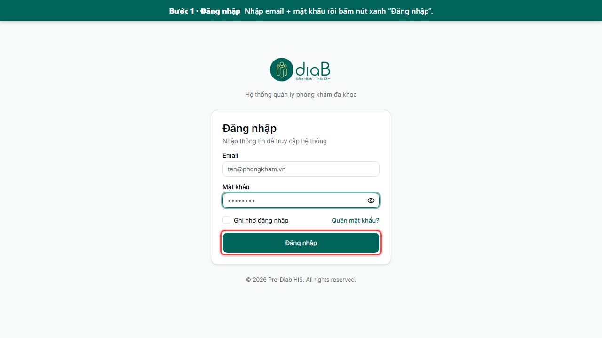

Sau khi đăng nhập, bạn thấy **màn hình Tổng quan** (doanh thu, lượt khám, biểu đồ). Đây là trang chủ.

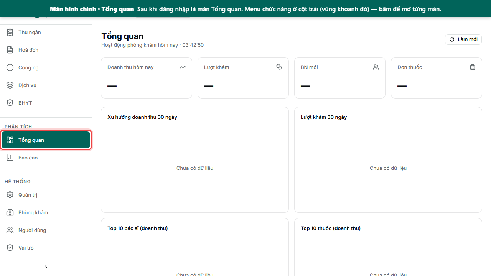

---

## Bước 2 — Tiếp đón bệnh nhân · *(Lễ tân)*

Bấm **“Tiếp đón”** ở menu trái. Làm theo **các vùng khoanh đỏ đánh số** trên hình:

1. **①** Ở ô **Bệnh nhân**, gõ tên / số điện thoại / CMND để **tìm** rồi chọn. (Nếu là người mới → bấm **“Thêm bệnh nhân (F2)”**, điền hồ sơ rồi quay lại.)
2. **②** Chọn **Phòng khám**.
3. **③** Nhập **Lý do khám**.
4. **④** Bấm nút xanh **“Tiếp đón (F4)”**. Bệnh nhân sẽ xuất hiện ở **Bảng hàng đợi** bên phải.

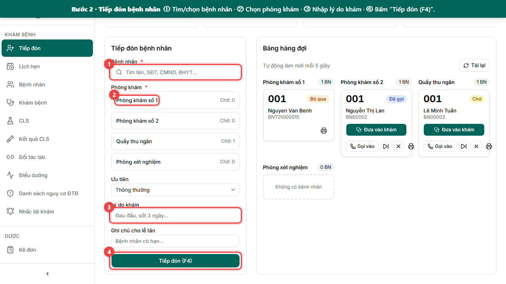

### Bước 2b — Đưa bệnh nhân vào khám ⭐

Trên thẻ bệnh nhân ở **Bảng hàng đợi**, bấm nút xanh **“Đưa vào khám”** (vùng khoanh đỏ).
Hệ thống **tự mở lượt khám** và chuyển bạn sang màn khám của bác sĩ.

> Các nút nhỏ khác trên thẻ: **Gọi vào** (gọi số), **⏭ Bỏ qua**, **✕ Huỷ**, **🖨 In phiếu**.

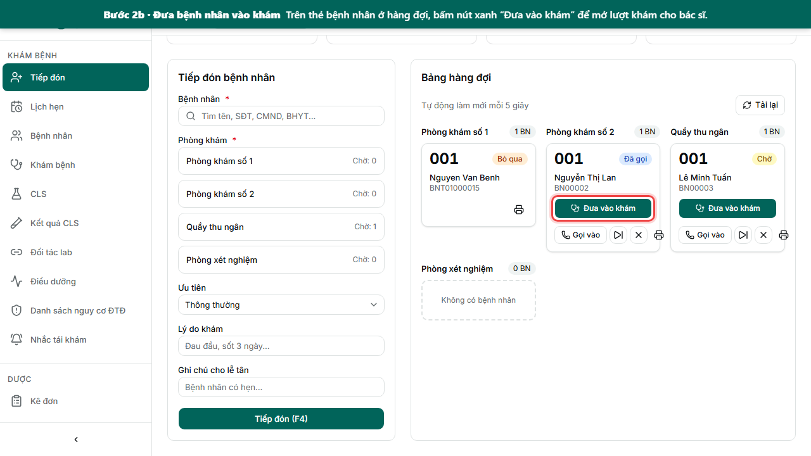

---

## Bước 3 — Đo sinh hiệu · *(Điều dưỡng)*

Bấm **“Điều dưỡng”** ở menu trái. Màn này hiện **bệnh nhân chờ khám hôm nay**.

1. Chọn bệnh nhân → bấm **“Nhập sinh hiệu”** (vùng khoanh đỏ).
2. Nhập: mạch, huyết áp, nhiệt độ, SpO2, cân nặng/chiều cao, đường huyết.
3. Bấm **Lưu**. (Nếu chỉ số bất thường, hệ thống sẽ cảnh báo.)

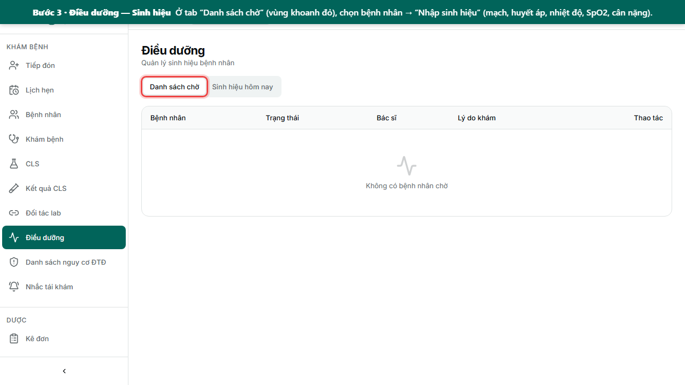

---

## Bước 4 — Bác sĩ mở lượt khám · *(Bác sĩ)*

> Nếu bạn đã bấm **“Đưa vào khám”** ở Bước 2b thì bỏ qua bước này — hệ thống đã mở sẵn lượt khám.

Bấm **“Khám bệnh”** ở menu trái.

- Bấm **“Đang khám hôm nay”** hoặc **“Chờ khám”** để chỉ xem bệnh nhân hôm nay.
- Bấm nút **“Tạo lượt khám”** (vùng khoanh đỏ) để mở ca khám mới.

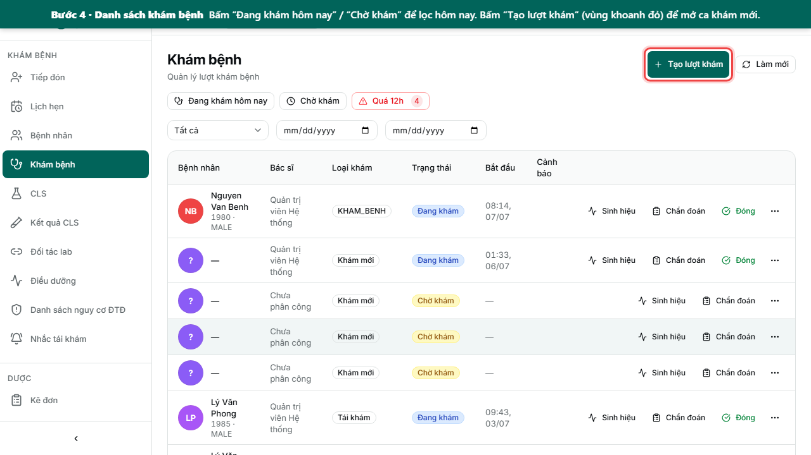

Làm theo các vùng khoanh đỏ đánh số: **①** chọn bệnh nhân · **②** chọn bác sĩ · **③** loại khám · **④** lý do khám · **⑤** bấm **“Tạo lượt khám”**.

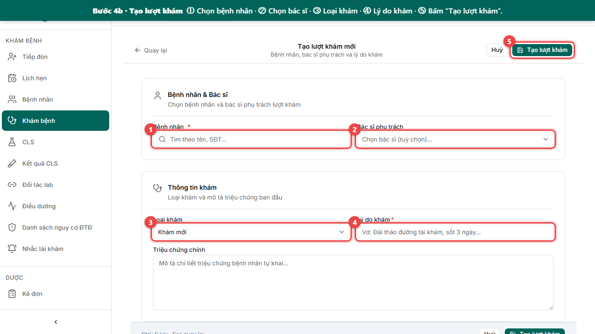

---

## Bước 5 — Khám bệnh · *(Bác sĩ)*

Đây là màn khám chính. Ở bên phải:

- Nếu lượt khám mới: bấm **“Bắt đầu khám”** để vào khám *(vé ở Tiếp đón tự chuyển sang “Đang khám”)*.
- Đang khám: bấm **“Ký số bệnh án”** rồi **“Đóng lượt khám”** khi xong (vùng khoanh đỏ).

Nhập thông tin theo các **tab ở giữa**: **Khám bệnh** (bệnh án), **Sinh hiệu**, **Chẩn đoán** (chọn mã ICD-10), **Đánh giá ĐTĐ**, **CLS** (chỉ định xét nghiệm), **Đơn thuốc**.

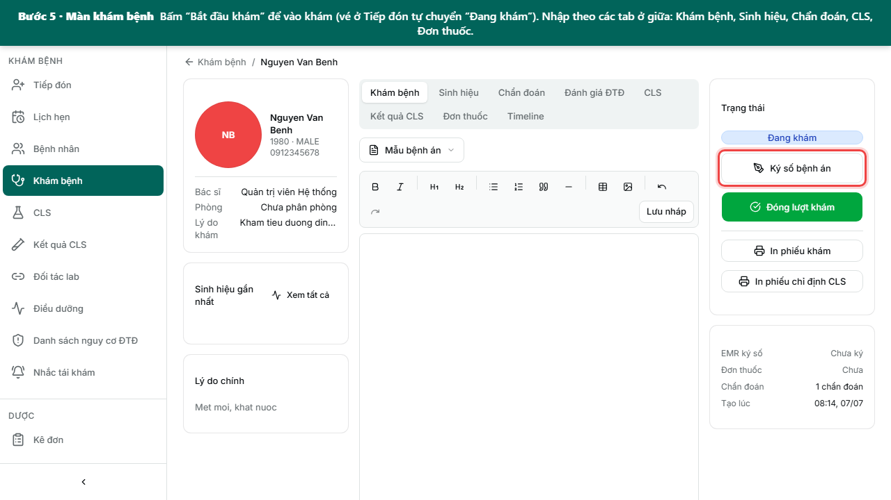

> Để **đóng lượt khám**, cần: có lý do khám, có ít nhất 1 chẩn đoán chính, và bệnh án đã ký số.

---

## Bước 6 — Xét nghiệm / Chẩn đoán hình ảnh (CLS) · *(Kỹ thuật viên)*

> Bác sĩ **đặt chỉ định** ở tab **CLS** trong màn khám (Bước 5). Kỹ thuật viên **nhập kết quả** ở màn này.

Bấm **“CLS”** hoặc **“Kết quả CLS”** ở menu trái.

1. Bấm **“+ Nhập kết quả”** (vùng khoanh đỏ), nhập giá trị.
2. Bấm **“Xác thực”** để hoàn tất. Có thể **In** kết quả.

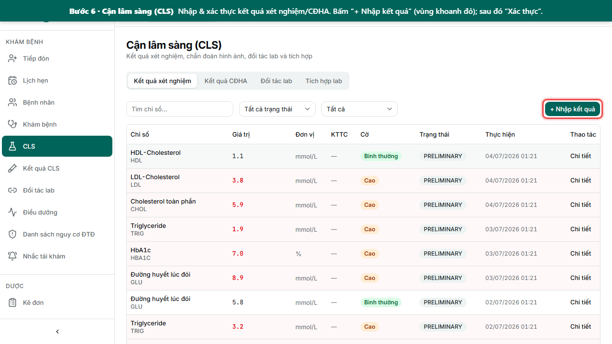

---

## Bước 7 — Kê đơn thuốc · *(Bác sĩ)*

Có thể kê ngay trong tab **Đơn thuốc** của màn khám, hoặc vào menu **“Kê đơn”**.

1. Bấm **“Tạo đơn mới”** (vùng khoanh đỏ).
2. Tìm và thêm thuốc. Nếu có **tương tác/chống chỉ định**, hệ thống **cảnh báo** (nút Ký sẽ bị khoá cho tới khi xác nhận lý do).
3. Bấm **“Ký số & gửi ĐTQG”** để hoàn tất (nhận mã đơn + QR).

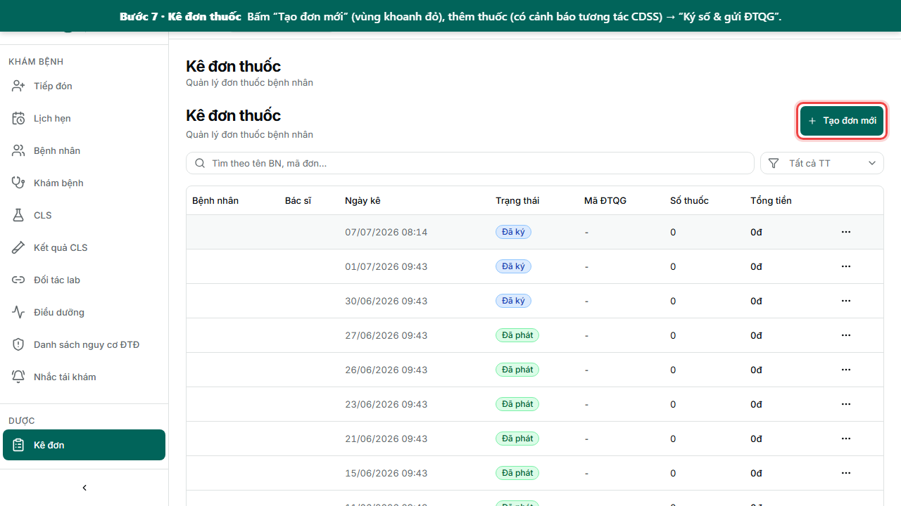

---

## Bước 8 — Thu ngân · *(Thu ngân)*

Bấm **“Thu ngân”** ở menu trái.

1. **①** Đầu ca bấm **“Mở ca”**.
2. **②** Vào tab **“Hoá đơn chờ thu”**, chọn hoá đơn → **“Thu tiền”** (tiền mặt / chuyển khoản / QR).
3. **In hoá đơn** hoặc **In phiếu thu**.
4. Cuối ca bấm **“Đóng ca”**.

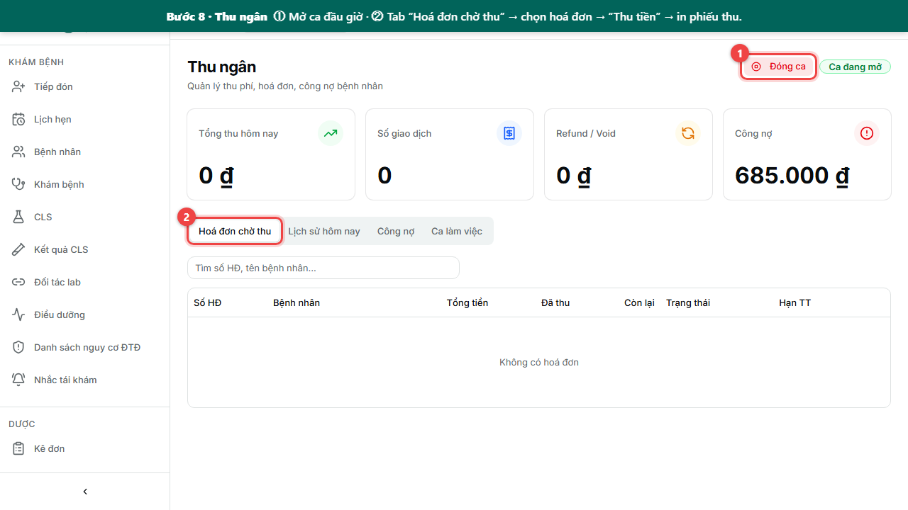

---

## Bước 9 — Cấp phát thuốc · *(Dược sĩ)*

Bấm **“Phát thuốc”** (trong menu Dược).

1. Ở tab **“Hàng chờ”** (vùng khoanh đỏ), tìm bệnh nhân.
2. Bấm **“Phát thuốc”**, chọn lô theo hạn dùng → xác nhận.

➡️ **Bệnh nhân nhận thuốc và ra về.**

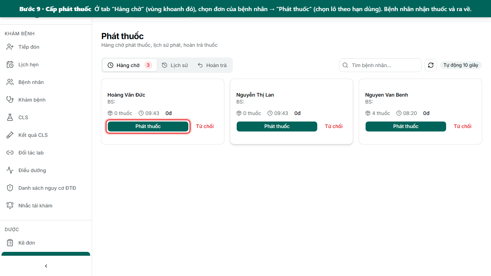

---

## Bước 10 — Hẹn tái khám & nhắc bệnh nhân

### Lịch hẹn
Bấm **“Lịch hẹn”**. Bấm **“Tạo lịch hẹn”** (vùng khoanh đỏ) để đặt lịch tái khám; **Xác nhận / Check-in** khi bệnh nhân đến.

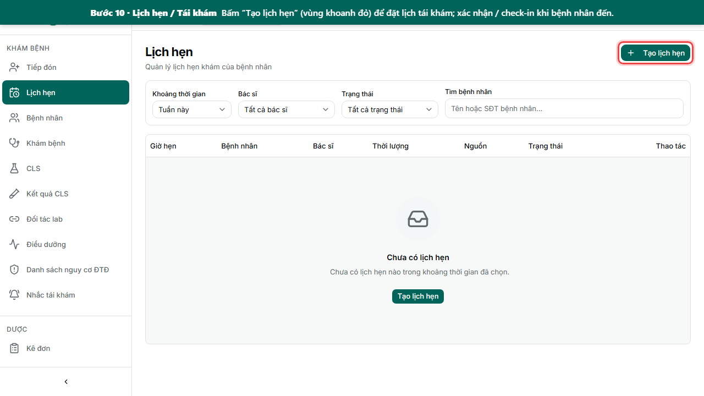

### Nhắc tái khám
Bấm **“Nhắc tái khám”** ở menu (vùng khoanh đỏ). Khi có bệnh nhân quá hạn (đo HbA1c / tái khám / khám mắt / khám chân), mỗi dòng có nút **“Đã gọi”** / **“Gửi SMS”** để nhắc. *(Danh sách trống nếu phòng khám chưa phát sinh dữ liệu.)*

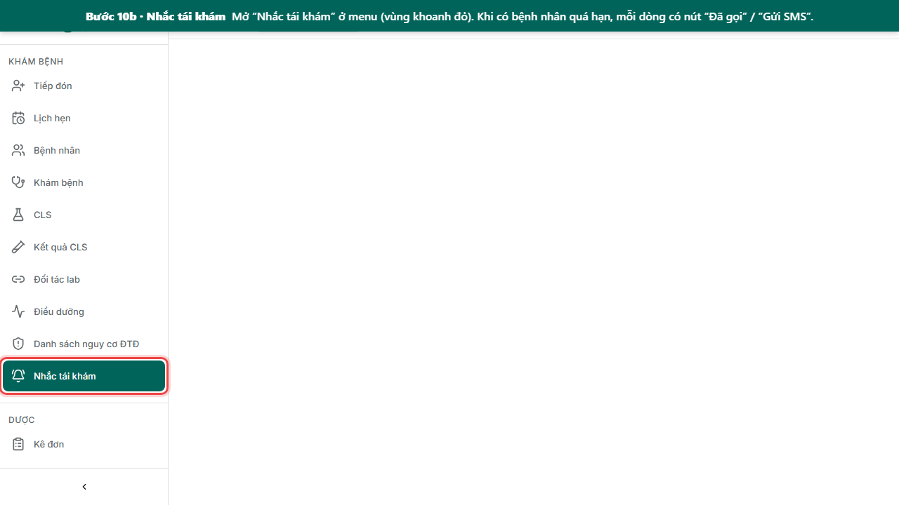

### Danh sách nguy cơ ĐTĐ
Bấm **“Danh sách nguy cơ ĐTĐ”** ở menu (vùng khoanh đỏ). Bệnh nhân xếp theo mức **Cao / Trung bình / Thấp**; bấm vào một dòng để xem **biểu đồ xu hướng** (HbA1c, huyết áp…). *(Danh sách được hệ thống tính hằng ngày, trống khi chưa có dữ liệu ĐTĐ.)*

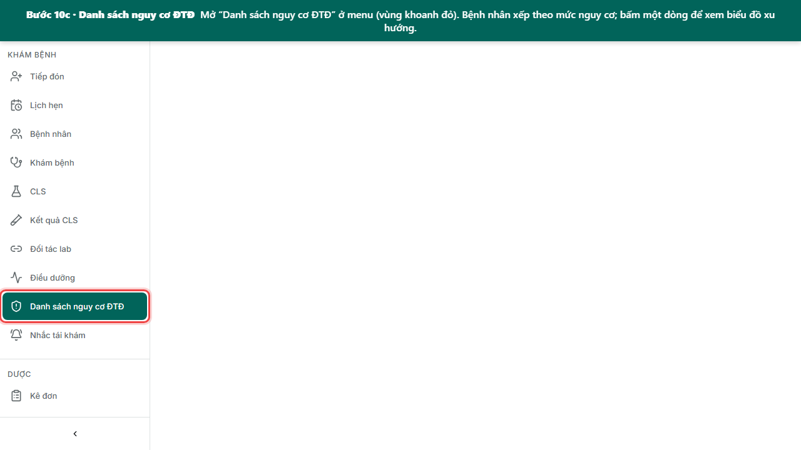

---

## Bước 11 — BHYT · *(Kế toán BHYT)*

Bấm **“BHYT”** ở menu trái.

1. Tab **“Kỳ xuất”**: bấm **“Tạo kỳ mới”** (vùng khoanh đỏ) để sinh **file XML** theo tháng.
2. Gửi kỳ lên cổng giám định.
3. Tab **“Đối soát”**: nạp kết quả giám định để đối chiếu.

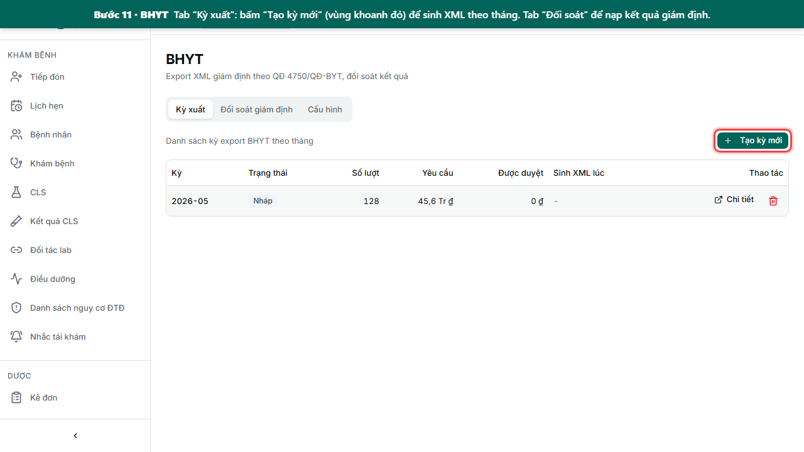

---

## Bước 12 — Báo cáo & Thống kê · *(Quản lý)*

Bấm **“Báo cáo”** ở menu trái.

1. Chọn **nhóm báo cáo** (Lâm sàng / Tài chính / Dược) và **báo cáo** cần xem.
2. Chọn **khoảng ngày** (tối đa 366 ngày).
3. Xem số liệu, rồi bấm **“In báo cáo”** để xuất **CSV / Excel / PDF**.

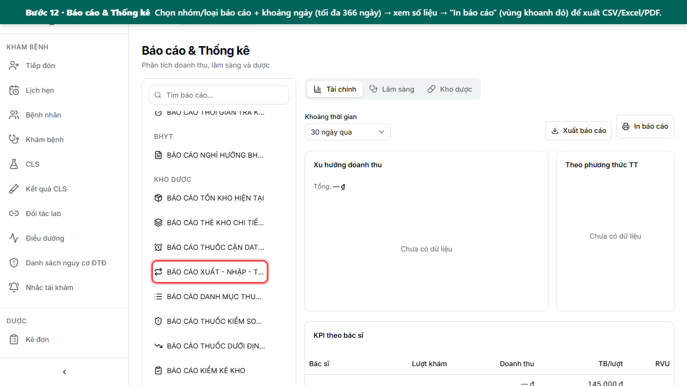

Trang **Tổng quan** (`/`) cũng có sẵn biểu đồ nhanh: doanh thu, lượt khám, top thuốc, phân bố HbA1c.

---

## Tra cứu nhanh — Ai làm ở màn nào

| Vai trò | Việc chính | Màn hình |
|---|---|---|
| **Lễ tân** | Tiếp đón, đưa vào khám, hẹn tái khám | Tiếp đón, Bệnh nhân, Lịch hẹn |
| **Điều dưỡng** | Đo sinh hiệu | Điều dưỡng |
| **Bác sĩ** | Khám, chẩn đoán, kê đơn | Khám bệnh, Kê đơn, Nguy cơ ĐTĐ |
| **Kỹ thuật viên** | Nhập kết quả xét nghiệm/CĐHA | CLS, Kết quả CLS |
| **Dược sĩ** | Phát thuốc, quản lý kho | Phát thuốc, Kho dược, Danh mục thuốc |
| **Thu ngân** | Thu tiền, hoá đơn, công nợ | Thu ngân, Hoá đơn, BHYT |
| **Quản lý** | Xem báo cáo, thống kê | Tổng quan, Báo cáo |

## Danh mục bệnh nhân *(tra cứu hồ sơ)*

Bấm **“Bệnh nhân”** để tìm/xem/sửa hồ sơ. Bấm **“Thêm bệnh nhân (F2)”** (vùng khoanh đỏ) để tạo mới.

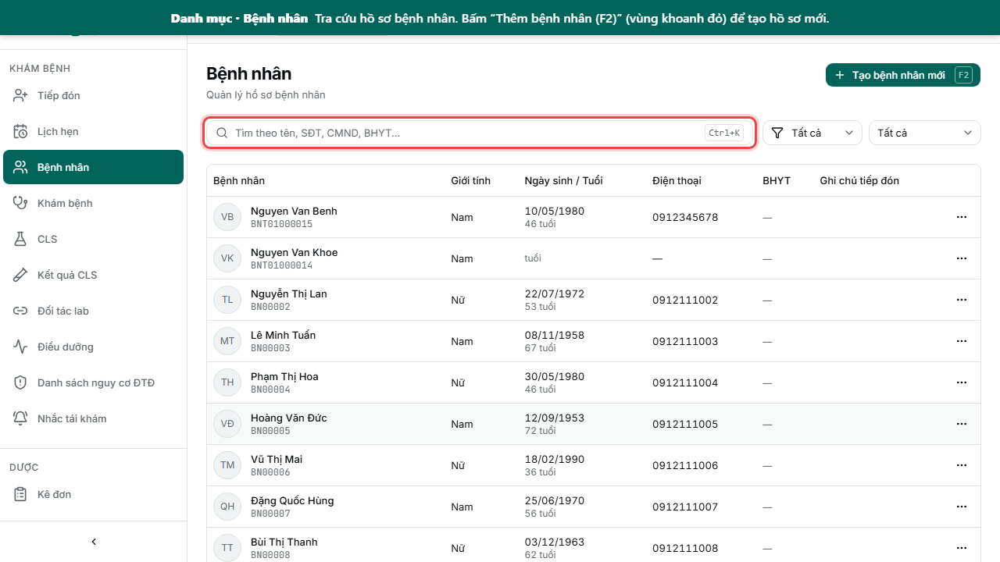

---

## Ý nghĩa các nhãn màu (trạng thái)

**Vé ở Tiếp đón:** `Chờ` (vàng) → `Đã gọi` (xanh dương) → **`Đang khám`** (xanh lá) → `Xong`.
**Lượt khám:** `Chờ khám` → `Đang khám` → `Hoàn thành`.
**Đơn thuốc:** `Nháp` → `Đã ký` → `Đã gửi ĐTQG` → `Đã phát`.

> **Mẹo:** Bảng hàng đợi và hàng chờ phát thuốc **tự cập nhật** — không cần bấm tải lại. **Bấm đúp** (double-click) vào một dòng trong danh sách để mở nhanh chi tiết.

---

*Hình ảnh chụp từ hệ thống thực tế. Khi giao diện thay đổi, chụp lại và cập nhật tài liệu.*
