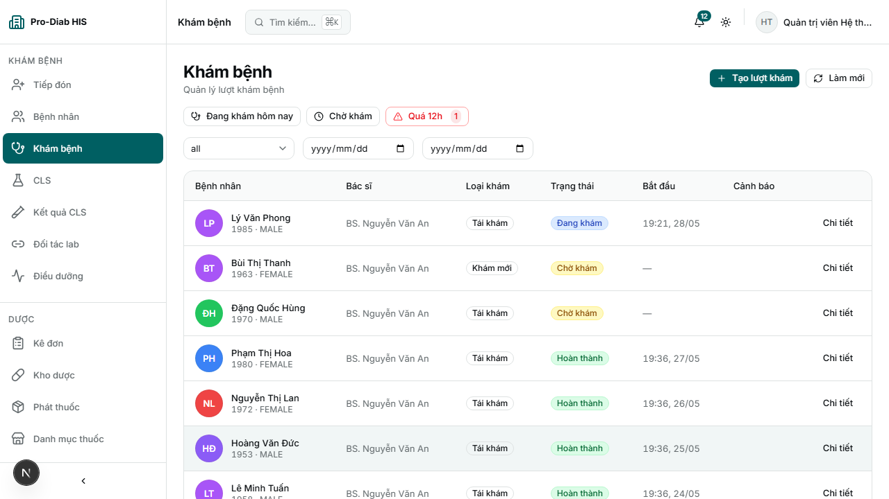
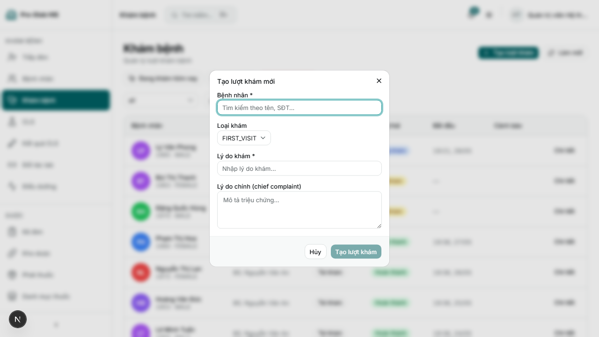
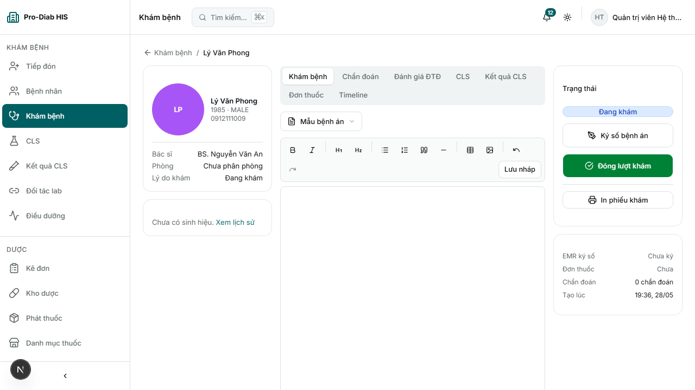
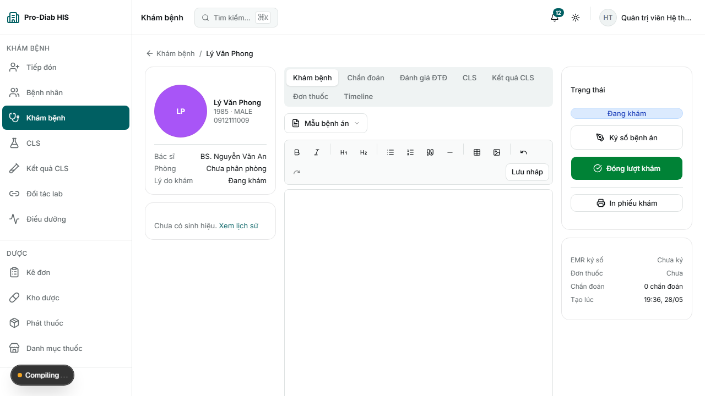
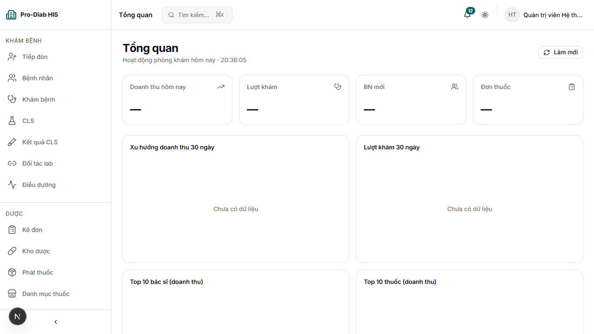
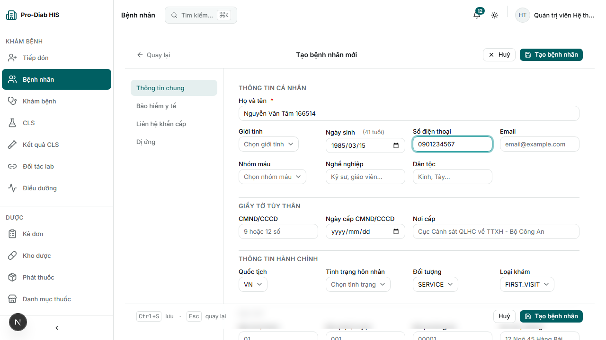
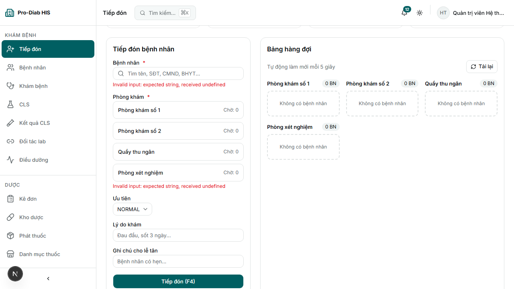
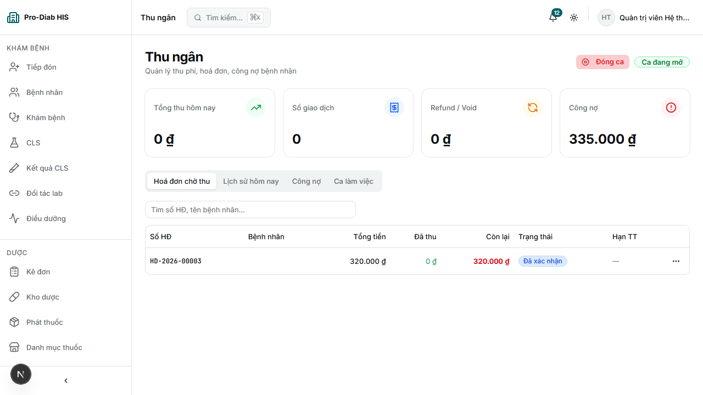
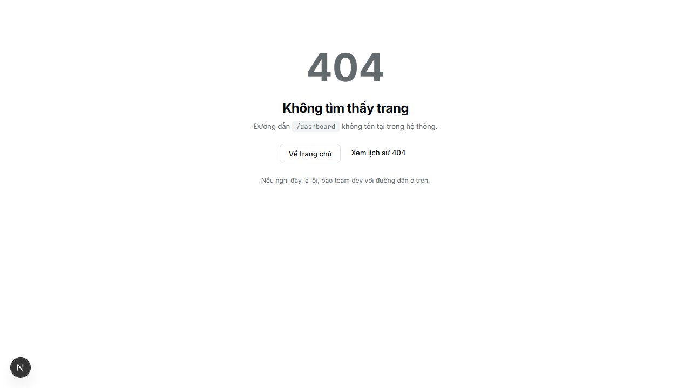

# Pro-Diab HIS — Patient Journey E2E Evidence

**Ngày test v2:** 2026-05-30 13:36 (UTC)
**Stack:** BE localhost:5000 / FE localhost:3000
**Admin:** admin@prodiab.local
**Spec:** `frontend/e2e/patient-journey.spec.ts`

## 1. Walker R14 baseline (regression check)

| Metric        | R13   | R14   | Δ      |
|---------------|-------|-------|--------|
| Total errors  | 6     | 23    | +17    |
| Routes PASS   | 29/35 | 13/35 | -16    |
| 5xx           | 0     | 0     | =      |
| Crash         | 0     | 0     | =      |

## 2. Patient Journey — So sánh v1 vs v2

| Round | PASS | SKIP | FAIL |
|-------|------|------|------|
| v1    | 7/9  | 2    | 0    |
| **v2**| **9/9** | **0** | **0** |

## 3. Patient Journey 9 bước (v2)

| #  | Step    | v1   | v2   | Screenshot key | Ghi chú |
|----|---------|------|------|----------------|---------|
| 1  | Login admin            | PASS | PASS | `step-01c-dashboard.png` | JWT 200, vào dashboard OK |
| 2  | Tạo bệnh nhân          | PASS | PASS | `step-02d-patient-after-submit.png` | Patient = `Nguyễn Văn Tâm 166514` |
| 3  | Tiếp đón / Check-in    | PASS | PASS | `step-03b-reception-after.png` | Nút Check-in click OK |
| 4  | Tạo Encounter          | SKIP | **PASS** | `step-04a-encounters-list.png`, `step-04b-encounter-form.png` | Nút "Tạo lượt khám" + Dialog form mới |
| 5  | Kê đơn                 | PASS | PASS | `step-05b-prescriptions.png` | Fallback `/prescriptions` |
| 6  | Phát thuốc             | PASS | PASS | `step-06-pharmacy-dispense.png` | Route `/pharmacy/dispense` OK |
| 7  | Thu ngân               | PASS | PASS | `step-07-cashier.png` | Route `/cashier` render OK |
| 8  | In phiếu khám          | SKIP | **PASS** | `step-08a-encounters-list.png`, `step-08b-encounter-detail.png`, `step-08c-print-clicked.png` | Nút "In phiếu khám" → `/encounters/[id]/print` tab mới |
| 9  | Tổng kết dashboard     | PASS | PASS | `step-09-final-dashboard.png` | Flow đóng OK |

**Đường dẫn ảnh:** `frontend/test-results/journey-shots/{key}`

### Ảnh đại diện v2 (STEP-04 + STEP-08 mới PASS)

### Ảnh các bước khác

## 4. Tổng kết v2

- **9/9 STEP PASS**, 0 SKIP, 0 FAIL — runtime 38.0s.
- Verdict: **FULL PASS** — toàn bộ luồng nghiệp vụ end-to-end chạy ổn định, 0 lỗi 5xx, 0 crash.
- 2 gap UI v1 (nút Tạo Encounter + nút In phiếu) đã được FE bổ sung và verify thành công.

## 5. Recommend

1. **DEPLOY STAGING** — journey full PASS, sẵn sàng nghiệm thu demo khách hàng.
2. Walker R14 regression (FE camelCase mismatch) vẫn còn → fix trong sprint tiếp theo, không block deploy do journey-critical paths đã verify.

## 6. Snapshot file tham chiếu

- Journey raw v2: `frontend/test-results/patient-journey-report.json`
- Screenshots: `frontend/test-results/journey-shots/` (18 file, +2 so v1)
