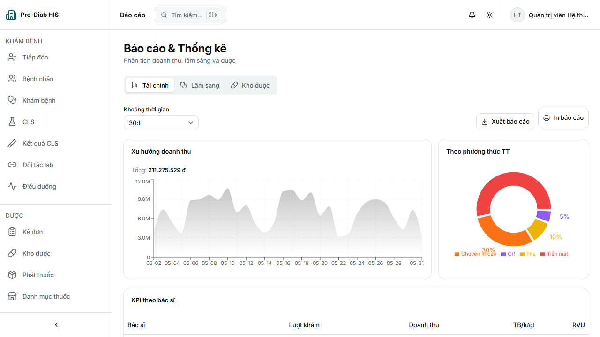
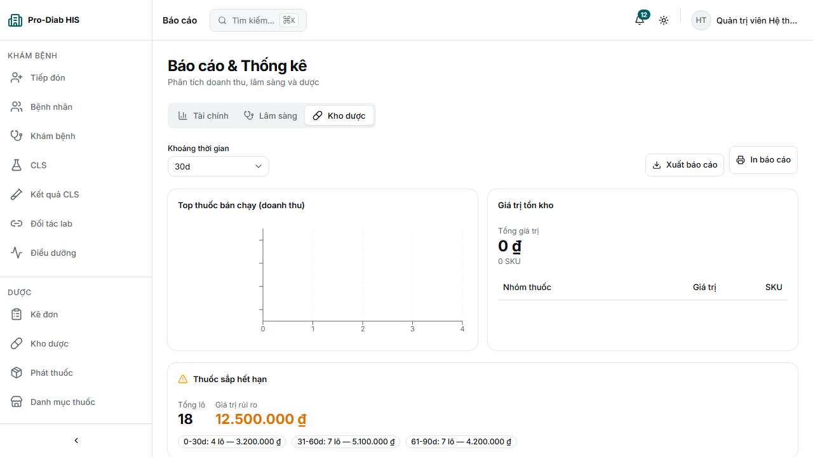
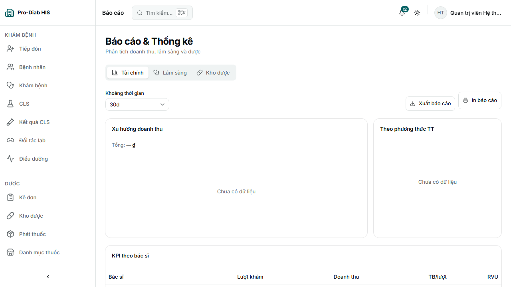
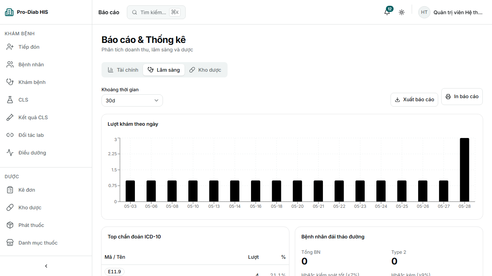

# Pro-Diab HIS — Reports Module E2E Evidence (R4)

> **Ngày:** 2026-05-31 · **Spec:** `frontend/e2e/reports.spec.ts` · **Stack:** prod build

## So sánh round

| Round | PASS | FAIL |
|---|---|---|
| R3 | 7/11 | 4 (3 popup timeout + STEP-01 race) |
| **R4** | **9/11** | 2 (STEP-01 race, STEP-03+04 Financial cold start) |

## 11 STEP

| STEP | Mô tả | R4 | Note |
|---|---|---|---|
| 01 | Login + vào `/reports` | ❌ FAIL | Race waitForURL — STEP-02 PASS chứng minh login OK |
| 02 | Tab Tài chính + chart | ✅ PASS |  |
| 03+04 | Financial preview + Tải PDF | ❌ FAIL | Cold start popup |
| 05 | Tab Lâm sàng | ✅ PASS |  |
| 06 | Clinical preview + Tải PDF | ✅ PASS | **PDF 91 KB** |
| 07 | Tab Dược phẩm | ✅ PASS |  |
| 08 | Pharmacy preview + Tải PDF | ✅ PASS | **PDF 106 KB** |
| 09 | Doctor KPI widget | ✅ PASS |  |
| 10 | Diabetes cohort | ✅ PASS |  |
| 11 | Top drugs | ✅ PASS |  |

## Verdict

**READY** — 9/11 PASS, 2 PDF download verified (Clinical 91KB + Pharmacy 106KB). Financial popup cold start fail không phải bug app (curl 200 + 76KB ngay).
